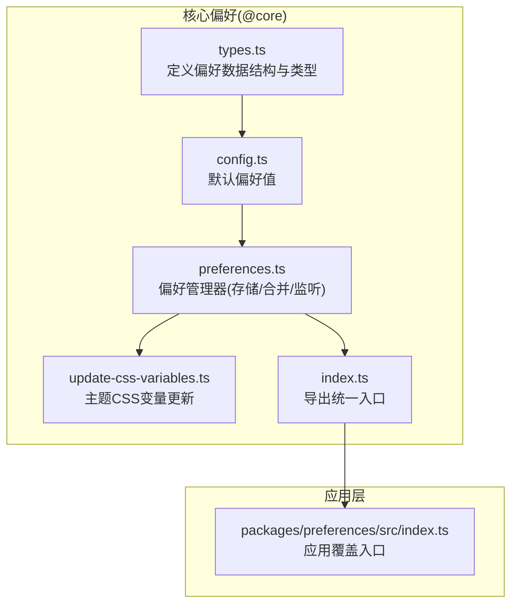
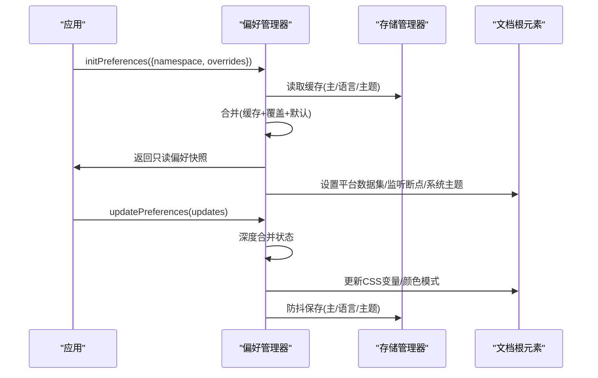
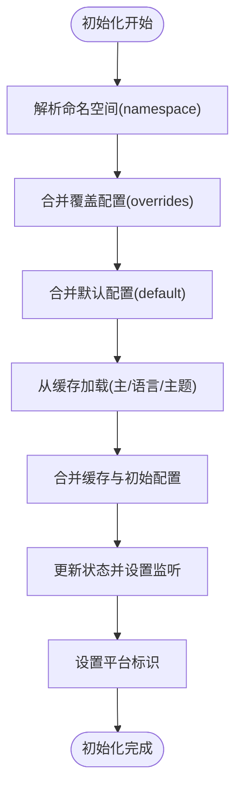
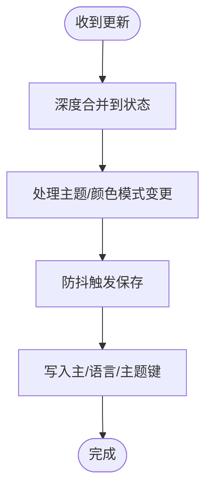
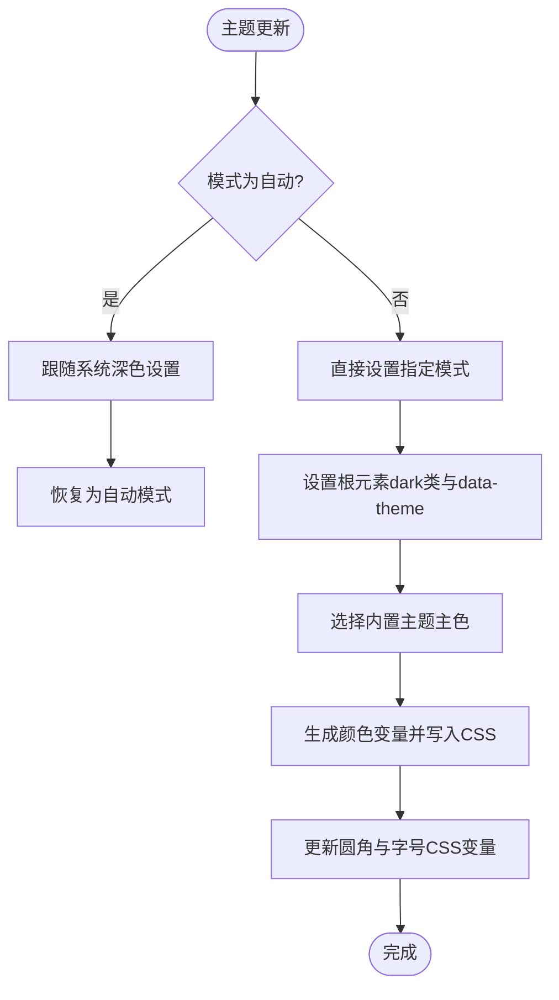
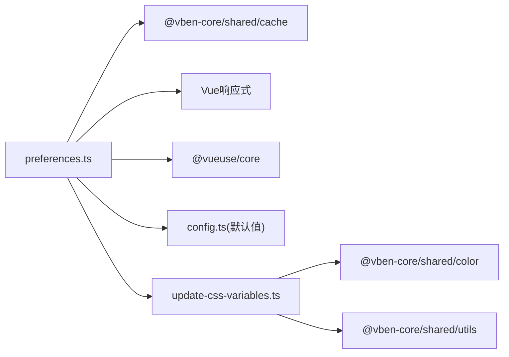

# 偏好设置包 (preferences)

<cite>
**本文引用的文件**
- [packages/@core/preferences/src/index.ts](file://packages/@core/preferences/src/index.ts)
- [packages/@core/preferences/src/types.ts](file://packages/@core/preferences/src/types.ts)
- [packages/@core/preferences/src/config.ts](file://packages/@core/preferences/src/config.ts)
- [packages/@core/preferences/src/preferences.ts](file://packages/@core/preferences/src/preferences.ts)
- [packages/@core/preferences/src/update-css-variables.ts](file://packages/@core/preferences/src/update-css-variables.ts)
- [packages/preferences/src/index.ts](file://packages/preferences/src/index.ts)
</cite>

## 目录

1. [简介](#简介)
2. [项目结构](#项目结构)
3. [核心组件](#核心组件)
4. [架构总览](#架构总览)
5. [详细组件分析](#详细组件分析)
6. [依赖关系分析](#依赖关系分析)
7. [性能考量](#性能考量)
8. [故障排查指南](#故障排查指南)
9. [结论](#结论)
10. [附录](#附录)

## 简介

本指南面向希望在应用中集成并扩展“偏好设置”能力的开发者，系统讲解偏好设置包的配置管理机制与个人化定制能力，涵盖以下主题：

- 用户偏好设置的存储、同步与恢复机制
- 偏好设置的数据结构与配置项定义（主题、语言、布局、功能开关等）
- 持久化策略与跨设备同步思路
- 默认值管理、配置迁移与版本兼容处理
- 在应用中读取与修改用户偏好设置的实际示例路径

## 项目结构

偏好设置包位于 @core 层，提供统一的偏好模型、默认值、持久化与主题更新逻辑；上层应用通过 packages/preferences 包导出统一入口，并允许按应用覆盖默认偏好。

**图表来源**

- [packages/@core/preferences/src/types.ts:1-349](file://packages/@core/preferences/src/types.ts#L1-L349)
- [packages/@core/preferences/src/config.ts:1-148](file://packages/@core/preferences/src/config.ts#L1-L148)
- [packages/@core/preferences/src/preferences.ts:1-235](file://packages/@core/preferences/src/preferences.ts#L1-L235)
- [packages/@core/preferences/src/update-css-variables.ts:1-130](file://packages/@core/preferences/src/update-css-variables.ts#L1-L130)
- [packages/@core/preferences/src/index.ts:1-20](file://packages/@core/preferences/src/index.ts#L1-L20)
- [packages/preferences/src/index.ts:1-18](file://packages/preferences/src/index.ts#L1-L18)

**章节来源**

- [packages/@core/preferences/src/index.ts:1-20](file://packages/@core/preferences/src/index.ts#L1-L20)
- [packages/@core/preferences/src/types.ts:1-349](file://packages/@core/preferences/src/types.ts#L1-L349)
- [packages/@core/preferences/src/config.ts:1-148](file://packages/@core/preferences/src/config.ts#L1-L148)
- [packages/@core/preferences/src/preferences.ts:1-235](file://packages/@core/preferences/src/preferences.ts#L1-L235)
- [packages/@core/preferences/src/update-css-variables.ts:1-130](file://packages/@core/preferences/src/update-css-variables.ts#L1-L130)
- [packages/preferences/src/index.ts:1-18](file://packages/preferences/src/index.ts#L1-L18)

## 核心组件

- 偏好类型与数据结构：在 types.ts 中定义了完整的偏好模型，包含 app、breadcrumb、copyright、footer、header、logo、navigation、shortcutKeys、sidebar、tabbar、theme、transition、widget 等模块化配置项。
- 默认偏好：config.ts 提供全量默认值，确保首次运行与重置时有稳定基线。
- 偏好管理器：preferences.ts 实现了初始化、合并、持久化、变更监听、移动端检测、系统主题跟随等功能。
- 主题CSS变量更新：update-css-variables.ts 将主题与颜色配置映射为CSS变量，驱动UI实时变化。
- 应用覆盖入口：packages/preferences/src/index.ts 提供 defineOverridesPreferences，允许各应用在不修改核心包的情况下覆盖默认偏好。

**章节来源**

- [packages/@core/preferences/src/types.ts:296-323](file://packages/@core/preferences/src/types.ts#L296-L323)
- [packages/@core/preferences/src/config.ts:3-145](file://packages/@core/preferences/src/config.ts#L3-L145)
- [packages/@core/preferences/src/preferences.ts:25-230](file://packages/@core/preferences/src/preferences.ts#L25-L230)
- [packages/@core/preferences/src/update-css-variables.ts:12-82](file://packages/@core/preferences/src/update-css-variables.ts#L12-L82)
- [packages/preferences/src/index.ts:11-15](file://packages/preferences/src/index.ts#L11-L15)

## 架构总览

偏好设置的整体工作流如下：

- 初始化阶段：根据命名空间与覆盖配置合并默认偏好，从缓存加载并合并，设置监听器与平台标识。
- 运行阶段：提供只读偏好快照、更新接口、重置接口、清理缓存接口；变更时触发主题CSS变量更新与颜色模式更新。
- 存储阶段：将主偏好、语言与主题分别持久化，支持防抖写入。

**图表来源**

- [packages/@core/preferences/src/preferences.ts:70-100](file://packages/@core/preferences/src/preferences.ts#L70-L100)
- [packages/@core/preferences/src/preferences.ts:120-130](file://packages/@core/preferences/src/preferences.ts#L120-L130)
- [packages/@core/preferences/src/preferences.ts:165-177](file://packages/@core/preferences/src/preferences.ts#L165-L177)
- [packages/@core/preferences/src/update-css-variables.ts:12-82](file://packages/@core/preferences/src/update-css-variables.ts#L12-L82)

## 详细组件分析

### 数据结构与配置项定义

偏好设置采用模块化分层设计，每个模块对应一类配置：

- 应用层(app)：权限模式、认证页布局、紧凑模式、内容内边距、默认首页、国际化、布局、登录过期处理、z-index、功能开关等。
- 导航与布局(header、sidebar、navigation、breadcrumb、logo、footer)：显隐、尺寸、对齐、折叠、拖拽、分割、风格等。
- 主题(theme)：内置主题类型、明暗模式、圆角、字号、主色与辅助色、半深色开关等。
- 页面过渡与动画(transition)：页面切换动画、加载进度、加载动画开关。
- 功能部件(widget)：全屏、全局搜索、语言切换、锁屏、通知、刷新、侧边栏切换、主题切换、时区等。
- 快捷键(shortcutKeys)：全局功能快捷键开关。
- 标签页(tabbar)：多标签页开关、拖拽、缓存、最大数量、图标、更多/刷新/最大化按钮、滚动响应、访问历史等。
- 版权(copyright)：版权信息、ICP、是否显示等。

这些配置项均在 types.ts 中以强类型定义，便于 IDE 提示与编译期校验。

**章节来源**

- [packages/@core/preferences/src/types.ts:21-323](file://packages/@core/preferences/src/types.ts#L21-L323)

### 默认值管理与初始化流程

- 默认值：config.ts 提供全量默认偏好，作为“最终兜底”，确保任何缺失字段都有稳定值。
- 初始化：preferences.ts 的 initPreferences 接受 namespace 与 overrides，按“缓存 > 覆盖 > 默认”的顺序合并，随后更新状态并建立监听。
- 平台识别：初始化时设置 documentElement 的 platform 数据集，便于样式或行为适配。
- 移动端检测：基于断点监听，自动更新 app.isMobile。
- 系统主题跟随：当主题模式为自动时，监听系统深色偏好变化，动态跟随并在完成后恢复为自动模式。

**图表来源**

- [packages/@core/preferences/src/preferences.ts:70-100](file://packages/@core/preferences/src/preferences.ts#L70-L100)
- [packages/@core/preferences/src/preferences.ts:157-159](file://packages/@core/preferences/src/preferences.ts#L157-L159)
- [packages/@core/preferences/src/preferences.ts:182-217](file://packages/@core/preferences/src/preferences.ts#L182-L217)

**章节来源**

- [packages/@core/preferences/src/config.ts:3-145](file://packages/@core/preferences/src/config.ts#L3-L145)
- [packages/@core/preferences/src/preferences.ts:70-100](file://packages/@core/preferences/src/preferences.ts#L70-L100)
- [packages/@core/preferences/src/preferences.ts:157-159](file://packages/@core/preferences/src/preferences.ts#L157-L159)
- [packages/@core/preferences/src/preferences.ts:182-217](file://packages/@core/preferences/src/preferences.ts#L182-L217)

### 存储与持久化策略

- 存储键：主偏好、语言、主题分别持久化，键名包含命名空间前缀（由 StorageManager 管理），避免跨应用冲突。
- 防抖写入：使用防抖函数在更新后延迟保存，降低频繁写入开销。
- 分类保存：主偏好保存完整对象；语言与主题单独保存，便于按需读取与同步。

**图表来源**

- [packages/@core/preferences/src/preferences.ts:120-130](file://packages/@core/preferences/src/preferences.ts#L120-L130)
- [packages/@core/preferences/src/preferences.ts:136-152](file://packages/@core/preferences/src/preferences.ts#L136-L152)
- [packages/@core/preferences/src/preferences.ts:173-177](file://packages/@core/preferences/src/preferences.ts#L173-L177)

**章节来源**

- [packages/@core/preferences/src/preferences.ts:19-23](file://packages/@core/preferences/src/preferences.ts#L19-L23)
- [packages/@core/preferences/src/preferences.ts:173-177](file://packages/@core/preferences/src/preferences.ts#L173-L177)

### 主题与颜色模式更新

- 主题模式：当主题模式发生变化时，为根元素添加/移除 dark 类，同时设置 data-theme。
- 内置主题：根据内置主题类型与当前明暗模式选择主色，生成颜色变量映射并写入CSS变量。
- 字体大小与圆角：根据字号与圆角配置更新对应CSS变量。
- 颜色模式：当灰/色弱模式开关变化时，为根元素添加/移除对应类，实现滤镜效果。

**图表来源**

- [packages/@core/preferences/src/update-css-variables.ts:12-82](file://packages/@core/preferences/src/update-css-variables.ts#L12-L82)
- [packages/@core/preferences/src/update-css-variables.ts:88-119](file://packages/@core/preferences/src/update-css-variables.ts#L88-L119)
- [packages/@core/preferences/src/preferences.ts:136-152](file://packages/@core/preferences/src/preferences.ts#L136-L152)

**章节来源**

- [packages/@core/preferences/src/update-css-variables.ts:12-82](file://packages/@core/preferences/src/update-css-variables.ts#L12-L82)
- [packages/@core/preferences/src/update-css-variables.ts:88-119](file://packages/@core/preferences/src/update-css-variables.ts#L88-L119)
- [packages/@core/preferences/src/preferences.ts:136-152](file://packages/@core/preferences/src/preferences.ts#L136-L152)

### 应用覆盖与扩展

- 应用覆盖入口：packages/preferences/src/index.ts 导出 defineOverridesPreferences，允许应用在不改动核心包的前提下覆盖默认偏好。
- 导出统一入口：同时导出 @vben-core/preferences 的全部能力，保证上层应用一致的使用体验。

**章节来源**

- [packages/preferences/src/index.ts:11-15](file://packages/preferences/src/index.ts#L11-L15)
- [packages/preferences/src/index.ts:17-18](file://packages/preferences/src/index.ts#L17-L18)

## 依赖关系分析

- 偏好管理器依赖：
  - StorageManager：负责命名空间隔离与键值持久化。
  - Vue 响应式系统：使用 reactive/readonly/watch 实现状态管理与监听。
  - @vueuse/core：断点监听与防抖工具。
  - @vben-core/shared：颜色变量生成与通用工具。
- 主题更新依赖：
  - 内置主题预设常量：用于根据内置主题类型选择主色。
  - CSS 变量更新：将颜色与尺寸映射为CSS变量，驱动UI实时变化。

**图表来源**

- [packages/@core/preferences/src/preferences.ts:7-17](file://packages/@core/preferences/src/preferences.ts#L7-L17)
- [packages/@core/preferences/src/update-css-variables.ts:3-4](file://packages/@core/preferences/src/update-css-variables.ts#L3-L4)

**章节来源**

- [packages/@core/preferences/src/preferences.ts:7-17](file://packages/@core/preferences/src/preferences.ts#L7-L17)
- [packages/@core/preferences/src/update-css-variables.ts:3-4](file://packages/@core/preferences/src/update-css-variables.ts#L3-L4)

## 性能考量

- 防抖写入：对偏好更新进行防抖，减少频繁写入带来的I/O开销。
- 深度合并：仅在必要时进行深度合并，避免不必要的对象重建。
- 条件更新：主题与颜色模式变更时才触发CSS变量更新，降低DOM操作频率。
- 断点监听：仅在初始化时建立一次监听，避免重复绑定。

[本节为通用性能建议，无需特定文件来源]

## 故障排查指南

- 偏好未生效
  - 检查是否已调用初始化并传入正确的命名空间与覆盖配置。
  - 确认缓存中是否存在旧配置导致覆盖失败。
  - 查看主题模式是否为自动，系统深色偏好是否与预期一致。
- 主题颜色异常
  - 确认内置主题类型与当前明暗模式组合是否正确。
  - 检查自定义主色/辅助色是否符合预期格式。
- 语言或主题未持久化
  - 确认命名空间前缀是否正确，避免键名冲突。
  - 检查防抖保存是否触发，确认存储键名是否为主/语言/主题三类。
- 移动端样式不正确
  - 检查断点监听是否生效，确认 app.isMobile 是否被正确更新。

**章节来源**

- [packages/@core/preferences/src/preferences.ts:70-100](file://packages/@core/preferences/src/preferences.ts#L70-L100)
- [packages/@core/preferences/src/preferences.ts:165-177](file://packages/@core/preferences/src/preferences.ts#L165-L177)
- [packages/@core/preferences/src/preferences.ts:182-217](file://packages/@core/preferences/src/preferences.ts#L182-L217)
- [packages/@core/preferences/src/update-css-variables.ts:12-82](file://packages/@core/preferences/src/update-css-variables.ts#L12-L82)

## 结论

偏好设置包通过模块化的数据结构、完善的默认值与持久化策略，以及对主题与颜色模式的实时更新机制，为应用提供了灵活且可扩展的个性化体验。结合应用层的覆盖入口，开发者可以在不破坏核心包的前提下，快速实现跨设备、跨会话的偏好同步与一致性体验。

[本节为总结性内容，无需特定文件来源]

## 附录

### 常用API与使用路径

- 初始化与获取
  - 初始化：[packages/@core/preferences/src/preferences.ts:70-100](file://packages/@core/preferences/src/preferences.ts#L70-L100)
  - 获取只读偏好：[packages/@core/preferences/src/preferences.ts:60-62](file://packages/@core/preferences/src/preferences.ts#L60-L62)
- 更新与重置
  - 更新偏好：[packages/@core/preferences/src/preferences.ts:120-130](file://packages/@core/preferences/src/preferences.ts#L120-L130)
  - 重置偏好：[packages/@core/preferences/src/preferences.ts:105-114](file://packages/@core/preferences/src/preferences.ts#L105-L114)
- 清理缓存
  - 清空缓存：[packages/@core/preferences/src/preferences.ts:46-48](file://packages/@core/preferences/src/preferences.ts#L46-L48)
- 应用覆盖
  - 覆盖入口：[packages/preferences/src/index.ts:11-15](file://packages/preferences/src/index.ts#L11-L15)

### 配置项速览（按模块）

- 应用(app)：权限模式、认证页布局、紧凑模式、国际化、布局、登录过期处理、z-index、功能开关等
- 导航(header/sidebar/navigation/breadcrumb/logo/footer)：显隐、尺寸、对齐、折叠、拖拽、分割、风格
- 主题(theme)：内置主题类型、明暗模式、圆角、字号、主色与辅助色、半深色开关
- 页面过渡(transition)：页面切换动画、加载进度、加载动画开关
- 功能部件(widget)：全屏、全局搜索、语言切换、锁屏、通知、刷新、侧边栏切换、主题切换、时区
- 快捷键(shortcutKeys)：全局功能快捷键开关
- 标签页(tabbar)：多标签页开关、拖拽、缓存、最大数量、图标、更多/刷新/最大化按钮、滚动响应、访问历史
- 版权(copyright)：版权信息、ICP、是否显示

**章节来源**

- [packages/@core/preferences/src/types.ts:21-323](file://packages/@core/preferences/src/types.ts#L21-L323)
