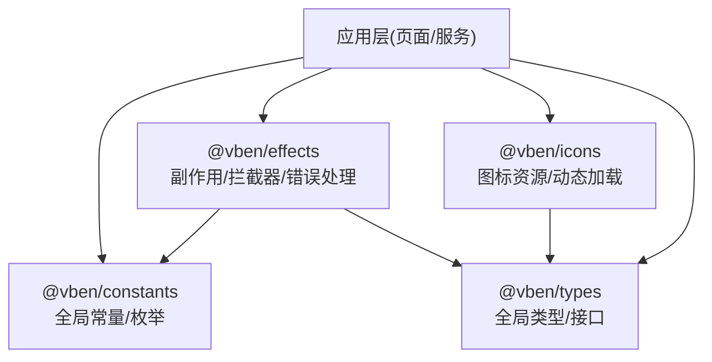
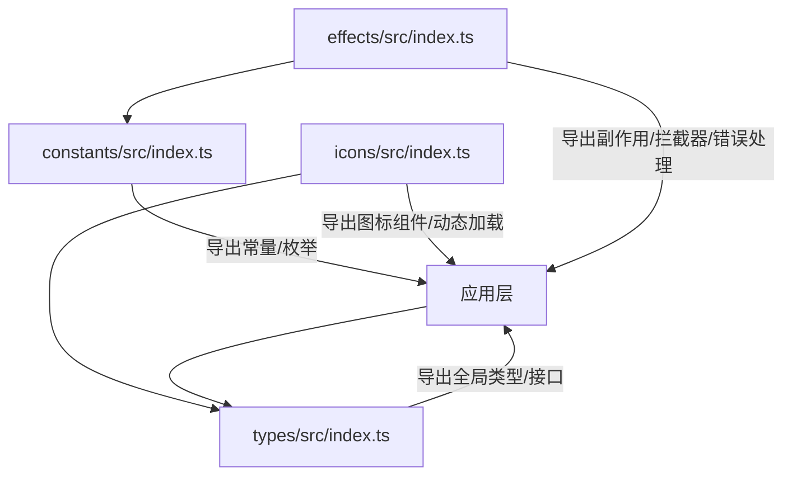

# 其他核心包

<cite>
**本文引用的文件**
- [packages/constants/package.json](file://packages/constants/package.json)
- [packages/constants/src/index.ts](file://packages/constants/src/index.ts)
- [packages/icons/package.json](file://packages/icons/package.json)
- [packages/icons/src/index.ts](file://packages/icons/src/index.ts)
- [packages/types/package.json](file://packages/types/package.json)
- [packages/types/src/index.ts](file://packages/types/src/index.ts)
- [packages/effects/package.json](file://packages/effects/package.json)
- [packages/effects/src/index.ts](file://packages/effects/src/index.ts)
</cite>

## 目录

1. [简介](#简介)
2. [项目结构](#项目结构)
3. [核心组件](#核心组件)
4. [架构总览](#架构总览)
5. [详细组件分析](#详细组件分析)
6. [依赖分析](#依赖分析)
7. [性能考虑](#性能考虑)
8. [故障排查指南](#故障排查指南)
9. [结论](#结论)
10. [附录](#附录)

## 简介

本指南聚焦于“其他核心包”的使用与集成，涵盖以下四个包：

- constants 常量包：提供全局常量与枚举值（如 API 端点、错误码、状态码、配置常量等），统一管理应用级常量来源。
- effects 副作用包：提供副作用函数与异步操作工具（如请求拦截器、响应处理器、错误处理机制等），用于封装网络层与业务侧的副作用逻辑。
- icons 图标包：集成图标资源与使用方法（SVG 图标、字体图标、动态图标加载），为 UI 组件提供一致的图标体系。
- types 类型包：定义全局类型声明与接口规范（通用类型、API 响应类型、组件 Props 类型等），提升类型安全与开发体验。

通过本指南，开发者可以快速理解各包的职责边界、导出能力与最佳实践，并正确在项目中进行集成与使用。

## 项目结构

这些核心包位于仓库根目录下的 packages 目录中，每个包均通过独立的 package.json 暴露入口与类型导出，遵循统一的模块化与命名空间策略。当前已知的入口文件与导出情况如下：

```mermaid
graph TB
subgraph "常量包(@vben/constants)"
C_PKG["packages/constants/package.json"]
C_IDX["packages/constants/src/index.ts"]
end
subgraph "图标包(@vben/icons)"
I_PKG["packages/icons/package.json"]
I_IDX["packages/icons/src/index.ts"]
end
subgraph "类型包(@vben/types)"
T_PKG["packages/types/package.json"]
T_IDX["packages/types/src/index.ts"]
end
subgraph "副作用包(@vben/effects)"
E_PKG["packages/effects/package.json"]
E_IDX["packages/effects/src/index.ts"]
end
C_PKG --> C_IDX
I_PKG --> I_IDX
T_PKG --> T_IDX
E_PKG --> E_IDX
```

图表来源

- [packages/constants/package.json:16-21](file://packages/constants/package.json#L16-L21)
- [packages/icons/package.json:13-18](file://packages/icons/package.json#L13-L18)
- [packages/types/package.json:13-21](file://packages/types/package.json#L13-L21)
- [packages/effects/package.json:1-27](file://packages/effects/package.json#L1-L27)

章节来源

- [packages/constants/package.json:16-21](file://packages/constants/package.json#L16-L21)
- [packages/icons/package.json:13-18](file://packages/icons/package.json#L13-L18)
- [packages/types/package.json:13-21](file://packages/types/package.json#L13-L21)
- [packages/effects/package.json:1-27](file://packages/effects/package.json#L1-L27)

## 核心组件

本节概述四大核心包的功能定位与典型用途，帮助快速建立整体认知。

- constants 常量包
  - 职责：集中管理全局常量与枚举值，避免散落式硬编码，便于维护与统一变更。
  - 典型内容：API 端点、错误码、状态码、配置常量等。
  - 使用建议：在业务层直接从该包导入常量，避免重复定义；更新时仅需修改一处。

- effects 副作用包
  - 职责：封装异步副作用与网络交互逻辑，提供可复用的拦截器、处理器与错误处理机制。
  - 典型内容：请求拦截器、响应处理器、错误处理工具、并发控制等。
  - 使用建议：将通用副作用逻辑收敛到此包，降低页面与服务层的样板代码。

- icons 图标包
  - 职责：统一图标资源与加载方式，支持 SVG、字体图标与动态加载。
  - 典型内容：图标组件导出、图标映射、动态图标注册等。
  - 使用建议：优先使用包内导出的图标组件，确保主题与尺寸一致性。

- types 类型包
  - 职责：提供全局类型声明与接口规范，覆盖通用类型、API 响应类型、组件 Props 类型等。
  - 典型内容：用户类型、分页类型、通用响应结构、组件属性类型等。
  - 使用建议：在跨模块共享的数据结构上统一使用此处类型，减少类型漂移。

章节来源

- [packages/constants/src/index.ts:1-3](file://packages/constants/src/index.ts#L1-L3)
- [packages/icons/src/index.ts:1-4](file://packages/icons/src/index.ts#L1-L4)
- [packages/types/src/index.ts:1-3](file://packages/types/src/index.ts#L1-L3)

## 架构总览

四大核心包在系统中的协作关系如下：应用层通过 effects 进行网络与副作用处理，通过 constants 获取统一的常量与枚举，通过 icons 渲染一致的图标，通过 types 获得强类型的约束与提示。

图表来源

- [packages/constants/src/index.ts:1-3](file://packages/constants/src/index.ts#L1-L3)
- [packages/icons/src/index.ts:1-4](file://packages/icons/src/index.ts#L1-L4)
- [packages/types/src/index.ts:1-3](file://packages/types/src/index.ts#L1-L3)
- [packages/effects/src/index.ts:1-27](file://packages/effects/src/index.ts#L1-L27)

## 详细组件分析

### constants 常量包

- 包定位与导出
  - 通过入口文件聚合导出，同时引入核心共享常量源，保证常量来源的一致性与可维护性。
- 常量与枚举的组织建议
  - 将 API 端点、错误码、状态码、配置项按模块拆分并在入口统一再导出，便于按需引入。
  - 对于枚举值，建议使用 TypeScript 的联合类型或枚举，配合工具函数实现安全访问。
- 集成示例（步骤）
  - 在业务模块中从常量包导入所需常量，避免硬编码。
  - 如需扩展新的常量，先在内部新增，再通过入口统一导出，保持对外接口稳定。
- 使用注意事项
  - 避免在多处重复定义同一常量，防止版本不一致导致的运行时问题。
  - 对于环境相关的常量，建议通过配置中心或构建期注入，便于多环境切换。

章节来源

- [packages/constants/src/index.ts:1-3](file://packages/constants/src/index.ts#L1-L3)
- [packages/constants/package.json:16-21](file://packages/constants/package.json#L16-L21)

### effects 副作用包

- 包定位与导出
  - 提供副作用函数与异步操作工具，作为网络层与业务层之间的桥梁。
- 典型能力
  - 请求拦截器：统一处理请求头、鉴权、重试、超时等。
  - 响应处理器：统一解析响应、转换数据格式、处理分页与列表结构。
  - 错误处理机制：统一捕获异常、映射错误码、触发全局提示或跳转。
- 集成示例（步骤）
  - 在应用启动阶段初始化拦截器与处理器，确保全局生效。
  - 在具体业务调用中，优先使用包内封装的副作用函数，减少重复实现。
- 使用注意事项
  - 拦截器链顺序重要，需明确前置与后置处理的职责边界。
  - 错误处理应区分业务错误与系统错误，避免过度提示或吞掉关键信息。

章节来源

- [packages/effects/package.json:1-27](file://packages/effects/package.json#L1-L27)
- [packages/effects/src/index.ts:1-27](file://packages/effects/src/index.ts#L1-L27)

### icons 图标包

- 包定位与导出
  - 提供图标资源与加载方式，包含 SVG 图标与动态图标加载能力。
- 图标资源与使用方法
  - 导出常用空态图标组件，便于占位与统一风格。
  - 支持 SVG 图标与字体图标的统一接入，满足不同场景需求。
  - 动态图标加载：按需注册图标，减少初始体积与首屏压力。
- 集成示例（步骤）
  - 在 UI 组件中直接引入包内图标组件，确保主题与尺寸一致。
  - 对于动态图标，按需注册并缓存，避免重复注册带来的性能损耗。
- 使用注意事项
  - 图标尺寸与主题色应与设计系统保持一致，必要时通过样式覆盖。
  - 动态加载时注意错误兜底，避免图标缺失影响用户体验。

章节来源

- [packages/icons/src/index.ts:1-4](file://packages/icons/src/index.ts#L1-L4)
- [packages/icons/package.json:13-18](file://packages/icons/package.json#L13-L18)

### types 类型包

- 包定位与导出
  - 定义全局类型声明与接口规范，覆盖通用类型、API 响应类型、组件 Props 类型等。
- 类型组织与复用
  - 用户类型、分页类型、通用响应结构等应集中管理，便于跨模块共享。
  - 组件 Props 类型建议与组件导出保持一致，减少类型不匹配问题。
- 集成示例（步骤）
  - 在页面与服务层统一使用包内的类型，避免重复定义。
  - 对于第三方接口，建议通过适配器转换为内部类型，保持类型一致性。
- 使用注意事项
  - 类型更新需谨慎评估影响范围，必要时提供迁移指引。
  - 对于可选字段与只读属性，应明确语义，避免误用导致的运行时问题。

章节来源

- [packages/types/src/index.ts:1-3](file://packages/types/src/index.ts#L1-L3)
- [packages/types/package.json:13-21](file://packages/types/package.json#L13-L21)

## 依赖分析

四大核心包之间存在松耦合的依赖关系，彼此通过统一的导出入口与类型系统协同工作。下图展示了包与入口文件之间的依赖关系：

图表来源

- [packages/constants/src/index.ts:1-3](file://packages/constants/src/index.ts#L1-L3)
- [packages/icons/src/index.ts:1-4](file://packages/icons/src/index.ts#L1-L4)
- [packages/types/src/index.ts:1-3](file://packages/types/src/index.ts#L1-L3)
- [packages/effects/src/index.ts:1-27](file://packages/effects/src/index.ts#L1-L27)

章节来源

- [packages/constants/src/index.ts:1-3](file://packages/constants/src/index.ts#L1-L3)
- [packages/icons/src/index.ts:1-4](file://packages/icons/src/index.ts#L1-L4)
- [packages/types/src/index.ts:1-3](file://packages/types/src/index.ts#L1-L3)
- [packages/effects/src/index.ts:1-27](file://packages/effects/src/index.ts#L1-L27)

## 性能考虑

- 常量包
  - 常量应尽量以编译期常量形式存在，避免运行时计算与分支判断。
  - 对于大型枚举，建议按需拆分模块，结合 Tree Shaking 减少打包体积。
- 副作用包
  - 拦截器与处理器应避免阻塞主线程，长耗时逻辑建议异步化。
  - 错误处理应快速失败并记录上下文，避免重复请求与资源浪费。
- 图标包
  - 动态图标加载应采用懒加载与缓存策略，减少重复注册与渲染开销。
  - SVG 图标建议压缩与去冗余，字体图标应按需引入子集。
- 类型包
  - 类型声明应尽量精确，避免宽泛的 any 或 unknown，提升编译效率与运行时安全性。

## 故障排查指南

- 常量包
  - 症状：业务中出现未定义的常量或枚举值。
  - 排查：确认是否从常量包正确导入；检查入口文件是否重新导出目标常量。
- 副作用包
  - 症状：请求未被拦截或响应未被正确处理。
  - 排查：检查拦截器链顺序与职责划分；确认错误处理回调是否被触发。
- 图标包
  - 症状：图标不显示或样式错乱。
  - 排查：确认图标组件是否正确引入；检查动态注册流程与主题配置。
- 类型包
  - 症状：类型不匹配或编译报错。
  - 排查：核对类型定义与实际数据结构；避免混用外部类型与内部类型。

## 结论

constants、effects、icons、types 四大核心包分别承担“常量与枚举”、“副作用与网络”、“图标资源与加载”、“全局类型与接口”的职责。通过统一的导出入口与类型约束，它们为应用提供了高内聚、低耦合的基础设施。建议在日常开发中遵循“从包中导入、在包中扩展、在包中复用”的原则，持续提升代码质量与开发效率。

## 附录

- 快速对照表
  - 常量包：统一常量与枚举，便于维护与复用。
  - 副作用包：统一拦截器、处理器与错误处理，降低样板代码。
  - 图标包：统一图标资源与动态加载，保证视觉一致性。
  - 类型包：统一全局类型与接口，提升类型安全与开发体验。
