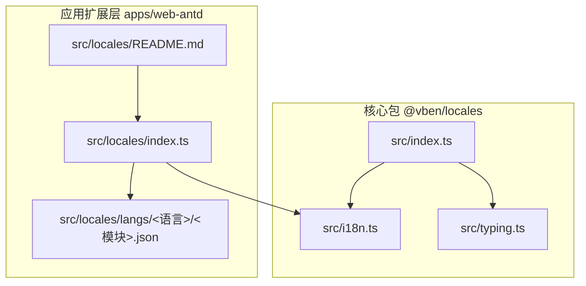
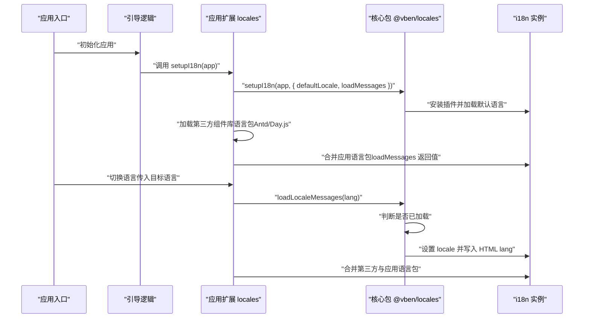
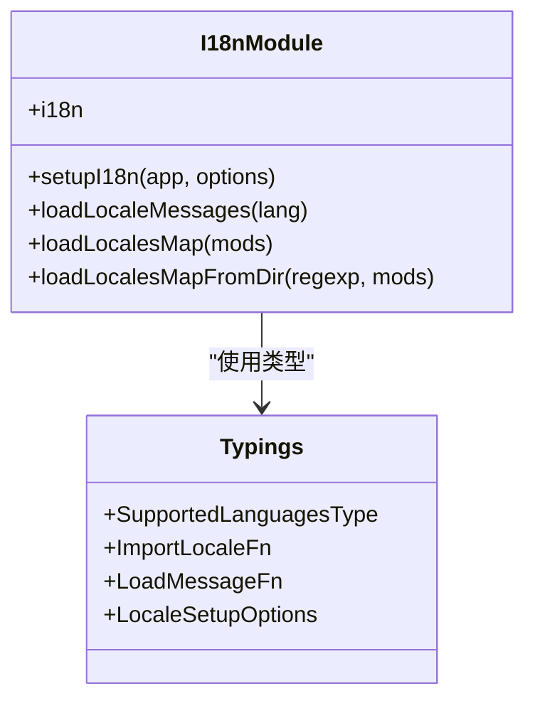
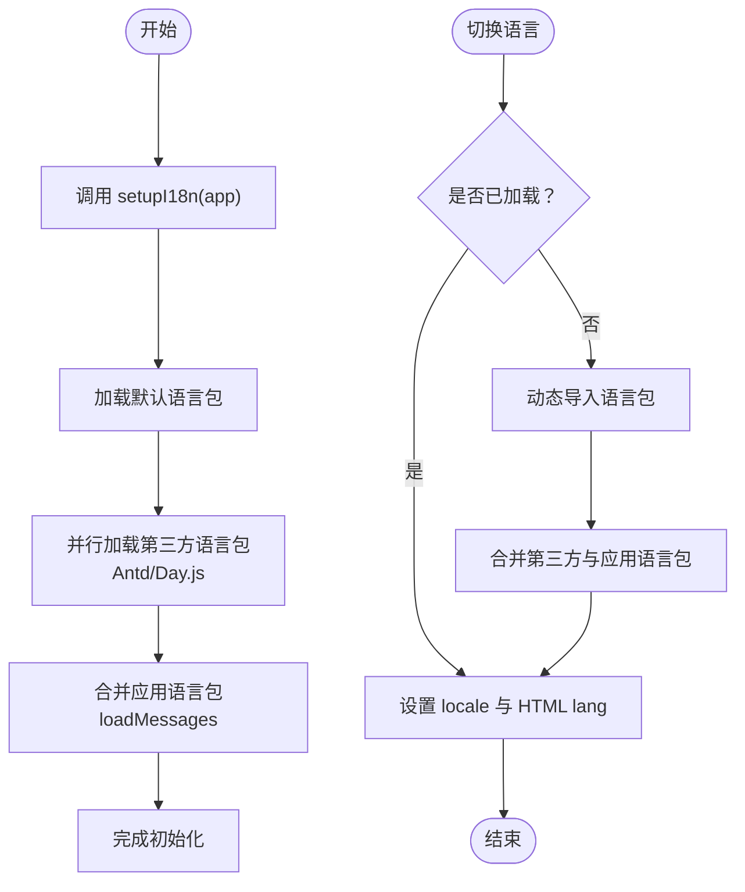
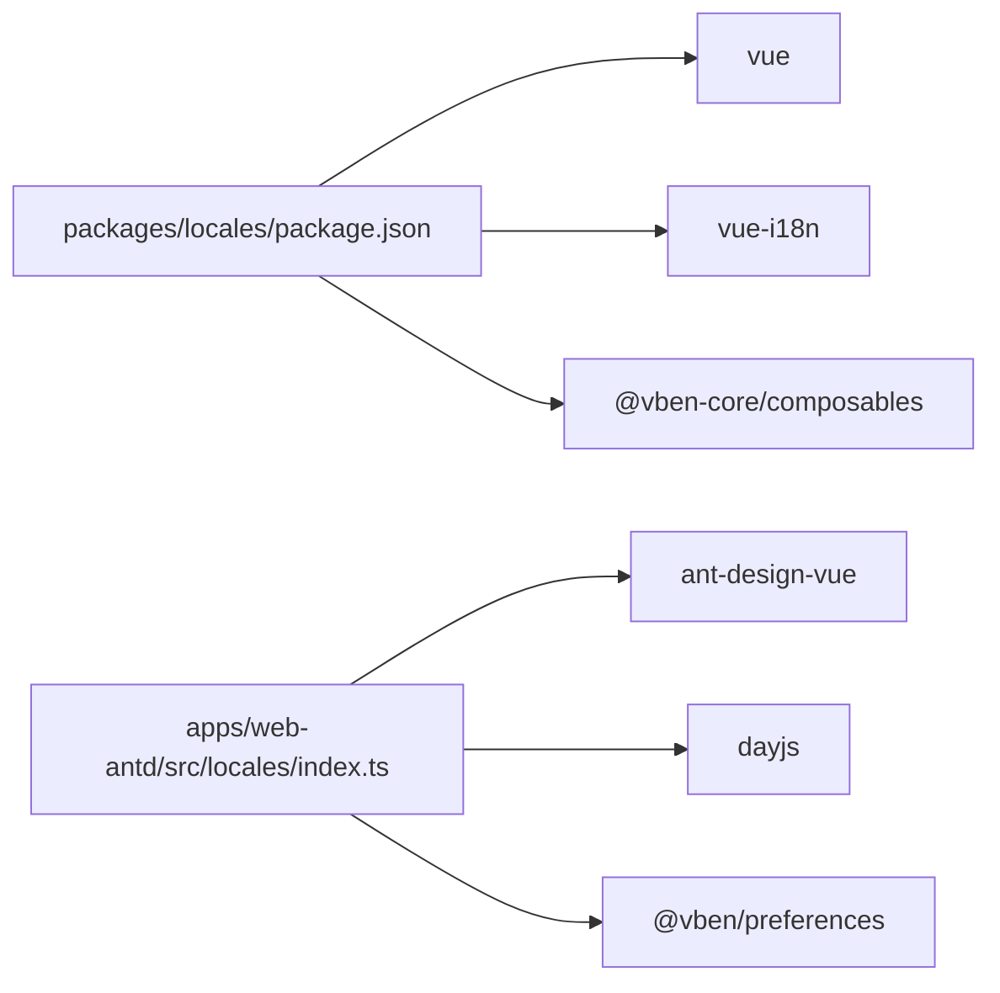

# 国际化包（locales）

<cite>
**本文引用的文件**
- [packages/locales/package.json](file://packages/locales/package.json)
- [packages/locales/src/index.ts](file://packages/locales/src/index.ts)
- [packages/locales/src/i18n.ts](file://packages/locales/src/i18n.ts)
- [packages/locales/src/typing.ts](file://packages/locales/src/typing.ts)
- [apps/web-antd/src/locales/index.ts](file://apps/web-antd/src/locales/index.ts)
- [apps/web-antd/src/locales/README.md](file://apps/web-antd/src/locales/README.md)
- [apps/web-antd/src/locales/langs/zh-CN/page.json](file://apps/web-antd/src/locales/langs/zh-CN/page.json)
- [apps/web-antd/src/locales/langs/en-US/page.json](file://apps/web-antd/src/locales/langs/en-US/page.json)
- [apps/web-antd/src/locales/langs/zh-CN/system.json](file://apps/web-antd/src/locales/langs/zh-CN/system.json)
- [apps/web-antd/src/locales/langs/en-US/system.json](file://apps/web-antd/src/locales/langs/en-US/system.json)
- [apps/web-antd/src/bootstrap.ts](file://apps/web-antd/src/bootstrap.ts)
- [apps/web-antd/src/main.ts](file://apps/web-antd/src/main.ts)
</cite>

## 目录
1. [简介](#简介)
2. [项目结构](#项目结构)
3. [核心组件](#核心组件)
4. [架构总览](#架构总览)
5. [详细组件分析](#详细组件分析)
6. [依赖关系分析](#依赖关系分析)
7. [性能考量](#性能考量)
8. [故障排查指南](#故障排查指南)
9. [结论](#结论)
10. [附录](#附录)

## 简介
本文件面向“国际化包（locales）”的使用者与维护者，系统性阐述其多语言支持架构与 i18n 集成方案。内容涵盖：
- 语言包结构与翻译键值管理
- 动态语言切换机制
- 新语言添加流程（翻译文件创建、键命名规范、上下文相关翻译）
- 语言包组织结构与加载策略（按需加载、懒加载）
- 组件中使用 $t、$te、useI18n 等 API 的实践
- 本地化最佳实践（日期格式化、数字格式化、货币显示、文本方向处理）

## 项目结构
国际化能力由两部分组成：
- 核心包：提供 i18n 初始化、语言包加载与动态切换能力
- 应用扩展层：在核心之上扩展第三方组件库（如 Ant Design Vue、Day.js）的本地化，并合并应用自身的语言包

图表来源
- [packages/locales/src/index.ts:1-31](file://packages/locales/src/index.ts#L1-L31)
- [packages/locales/src/i18n.ts:1-148](file://packages/locales/src/i18n.ts#L1-L148)
- [packages/locales/src/typing.ts:1-26](file://packages/locales/src/typing.ts#L1-L26)
- [apps/web-antd/src/locales/index.ts:1-103](file://apps/web-antd/src/locales/index.ts#L1-L103)
- [apps/web-antd/src/locales/README.md:1-4](file://apps/web-antd/src/locales/README.md#L1-L4)

章节来源
- [packages/locales/src/index.ts:1-31](file://packages/locales/src/index.ts#L1-L31)
- [packages/locales/src/i18n.ts:1-148](file://packages/locales/src/i18n.ts#L1-L148)
- [packages/locales/src/typing.ts:1-26](file://packages/locales/src/typing.ts#L1-L26)
- [apps/web-antd/src/locales/index.ts:1-103](file://apps/web-antd/src/locales/index.ts#L1-L103)
- [apps/web-antd/src/locales/README.md:1-4](file://apps/web-antd/src/locales/README.md#L1-L4)

## 核心组件
- i18n 实例与全局注入
  - 使用 vue-i18n 创建 i18n 实例，开启全局注入与组合式 API 模式，初始 locale 为空，消息体为空
  - 提供 $t、$te 快捷访问全局翻译函数
- 语言包映射与加载
  - 通过 import.meta.glob 收集语言包目录下的 JSON 文件，生成 localesMap
  - 提供 loadLocalesMap 与 loadLocalesMapFromDir 两种映射构建方式
  - 支持按需加载与懒加载：首次切换语言时才动态导入对应语言包
- 初始化与语言切换
  - setupI18n 负责安装 i18n 插件、加载默认语言、设置缺失键告警
  - loadLocaleMessages 负责切换语言、合并应用扩展语言包、设置 HTML lang 属性
- 类型与配置
  - SupportedLanguagesType 约束受支持语言集合
  - LocaleSetupOptions 提供默认语言、加载函数、缺失键告警等配置项

章节来源
- [packages/locales/src/i18n.ts:16-21](file://packages/locales/src/i18n.ts#L16-L21)
- [packages/locales/src/i18n.ts:23-30](file://packages/locales/src/i18n.ts#L23-L30)
- [packages/locales/src/i18n.ts:37-47](file://packages/locales/src/i18n.ts#L37-L47)
- [packages/locales/src/i18n.ts:55-90](file://packages/locales/src/i18n.ts#L55-L90)
- [packages/locales/src/i18n.ts:102-117](file://packages/locales/src/i18n.ts#L102-L117)
- [packages/locales/src/i18n.ts:123-139](file://packages/locales/src/i18n.ts#L123-L139)
- [packages/locales/src/index.ts:9-20](file://packages/locales/src/index.ts#L9-L20)
- [packages/locales/src/typing.ts:1-26](file://packages/locales/src/typing.ts#L1-L26)

## 架构总览
下图展示了从应用启动到语言切换的完整流程，以及核心包与应用扩展层的协作关系。

图表来源
- [apps/web-antd/src/bootstrap.ts:44-45](file://apps/web-antd/src/bootstrap.ts#L44-L45)
- [apps/web-antd/src/locales/index.ts:93-100](file://apps/web-antd/src/locales/index.ts#L93-L100)
- [packages/locales/src/i18n.ts:102-117](file://packages/locales/src/i18n.ts#L102-L117)
- [packages/locales/src/i18n.ts:123-139](file://packages/locales/src/i18n.ts#L123-L139)

## 详细组件分析

### 核心包（@vben/locales）
- 导出 API
  - $t、$te：全局翻译与存在性检查
  - i18n：i18n 实例
  - loadLocaleMessages、loadLocalesMap、loadLocalesMapFromDir：语言包加载与映射工具
  - setupI18n：应用级初始化
  - useI18n：vue-i18n 提供的组合式 API
- 关键实现要点
  - 通过 import.meta.glob 收集语言包，形成 localesMap
  - 切换语言时先设置 locale，再写入 HTML lang 属性，确保无障碍与 SEO 友好
  - 支持缺失键告警，便于开发阶段发现未翻译键
  - 通过合并应用扩展语言包，实现核心与应用层的解耦

图表来源
- [packages/locales/src/i18n.ts:1-148](file://packages/locales/src/i18n.ts#L1-L148)
- [packages/locales/src/typing.ts:1-26](file://packages/locales/src/typing.ts#L1-L26)

章节来源
- [packages/locales/src/index.ts:1-31](file://packages/locales/src/index.ts#L1-L31)
- [packages/locales/src/i18n.ts:16-21](file://packages/locales/src/i18n.ts#L16-L21)
- [packages/locales/src/i18n.ts:23-30](file://packages/locales/src/i18n.ts#L23-L30)
- [packages/locales/src/i18n.ts:37-47](file://packages/locales/src/i18n.ts#L37-L47)
- [packages/locales/src/i18n.ts:55-90](file://packages/locales/src/i18n.ts#L55-L90)
- [packages/locales/src/i18n.ts:102-117](file://packages/locales/src/i18n.ts#L102-L117)
- [packages/locales/src/i18n.ts:123-139](file://packages/locales/src/i18n.ts#L123-L139)
- [packages/locales/src/typing.ts:1-26](file://packages/locales/src/typing.ts#L1-L26)

### 应用扩展层（apps/web-antd）
- 扩展职责
  - 加载第三方组件库语言包（Ant Design Vue、Day.js）
  - 合并应用自身语言包（从 langs 目录按需加载）
  - 将应用偏好设置中的默认语言传递给核心包
- 初始化流程
  - 在引导阶段调用 setupI18n，传入 defaultLocale、loadMessages、missingWarn 等选项
  - loadMessages 中同时加载应用语言包与第三方语言包，Promise.all 并行提升性能
- 语言包组织
  - 采用“语言/模块”的二维结构，模块名即 JSON 文件名，键空间按功能域划分（如 page、system、flow、demos 等）

图表来源
- [apps/web-antd/src/locales/index.ts:93-100](file://apps/web-antd/src/locales/index.ts#L93-L100)
- [apps/web-antd/src/locales/index.ts:33-39](file://apps/web-antd/src/locales/index.ts#L33-L39)
- [apps/web-antd/src/locales/index.ts:45-47](file://apps/web-antd/src/locales/index.ts#L45-L47)
- [apps/web-antd/src/locales/index.ts:53-74](file://apps/web-antd/src/locales/index.ts#L53-L74)
- [apps/web-antd/src/locales/index.ts:80-91](file://apps/web-antd/src/locales/index.ts#L80-L91)
- [packages/locales/src/i18n.ts:123-139](file://packages/locales/src/i18n.ts#L123-L139)

章节来源
- [apps/web-antd/src/locales/index.ts:1-103](file://apps/web-antd/src/locales/index.ts#L1-L103)
- [apps/web-antd/src/locales/README.md:1-4](file://apps/web-antd/src/locales/README.md#L1-L4)
- [apps/web-antd/src/bootstrap.ts:44-45](file://apps/web-antd/src/bootstrap.ts#L44-L45)

### 语言包结构与键值管理
- 结构规范
  - 目录：apps/web-antd/src/locales/langs/<语言>/<模块>.json
  - 模块命名：按功能域拆分（如 page、system、flow、demos 等），避免键冲突
  - 键命名：采用层级式命名（如 auth.login、dashboard.title），清晰表达上下文
- 示例参考
  - 页面与认证模块：page.json、system.json
  - 多语言对照：zh-CN 与 en-US 对应模块保持相同键结构

章节来源
- [apps/web-antd/src/locales/langs/zh-CN/page.json:1-23](file://apps/web-antd/src/locales/langs/zh-CN/page.json#L1-L23)
- [apps/web-antd/src/locales/langs/en-US/page.json:1-19](file://apps/web-antd/src/locales/langs/en-US/page.json#L1-L19)
- [apps/web-antd/src/locales/langs/zh-CN/system.json:1-107](file://apps/web-antd/src/locales/langs/zh-CN/system.json#L1-L107)
- [apps/web-antd/src/locales/langs/en-US/system.json:1-107](file://apps/web-antd/src/locales/langs/en-US/system.json#L1-L107)

### 动态语言切换机制
- 触发时机
  - 用户在偏好设置或语言选择器中切换语言
  - 应用启动时根据偏好设置加载默认语言
- 切换流程
  - 若目标语言已加载则直接设置；否则动态导入对应语言包
  - 合并第三方与应用语言包，最后设置 HTML lang 属性
- 性能优化
  - import.meta.glob 预收集，运行时仅做映射与按需导入
  - 并行加载第三方与应用语言包，减少等待时间

章节来源
- [packages/locales/src/i18n.ts:123-139](file://packages/locales/src/i18n.ts#L123-L139)
- [apps/web-antd/src/locales/index.ts:33-39](file://apps/web-antd/src/locales/index.ts#L33-L39)
- [apps/web-antd/src/locales/index.ts:45-47](file://apps/web-antd/src/locales/index.ts#L45-L47)

### 在组件中使用国际化 API
- 全局翻译
  - 通过 $t 访问全局翻译函数，支持层级键与参数占位
  - 通过 $te 检查键是否存在
- 组合式 API
  - 使用 useI18n 获取当前作用域的 t、te、locale 等
- 实践示例（路径）
  - 在引导阶段使用 $t 动态设置页面标题
  - 在路由元信息中以国际化键作为标题来源

章节来源
- [packages/locales/src/index.ts:9-14](file://packages/locales/src/index.ts#L9-L14)
- [apps/web-antd/src/bootstrap.ts:72-79](file://apps/web-antd/src/bootstrap.ts#L72-L79)

### 添加新语言支持
- 步骤
  1) 在 apps/web-antd/src/locales/langs 下新增语言目录（如 fr-FR）
  2) 为每个现有模块复制一份对应 JSON 文件，并完成翻译
  3) 在应用扩展层的 loadMessages 中增加对新语言的第三方语言包加载（如 Day.js）
  4) 如需核心包层面支持，可在 SupportedLanguagesType 中扩展受支持语言集合
- 键命名与上下文
  - 坚持层级式命名，避免重复键
  - 对于同一语义在不同上下文（菜单、表单、弹窗）出现的翻译，建议使用不同键或在上层封装统一键空间

章节来源
- [packages/locales/src/typing.ts](file://packages/locales/src/typing.ts#L1)
- [apps/web-antd/src/locales/index.ts:53-74](file://apps/web-antd/src/locales/index.ts#L53-L74)

### 语言包组织与加载策略
- 组织结构
  - 语言/模块：按功能域拆分，便于维护与按需加载
  - 模块名即文件名，键空间清晰
- 加载策略
  - 按需加载：首次切换语言时动态导入
  - 懒加载：结合路由与页面级语言包，仅在进入页面时加载对应模块
  - 并行加载：第三方与应用语言包并行，缩短切换耗时

章节来源
- [packages/locales/src/i18n.ts:23-30](file://packages/locales/src/i18n.ts#L23-L30)
- [packages/locales/src/i18n.ts:55-90](file://packages/locales/src/i18n.ts#L55-L90)
- [apps/web-antd/src/locales/index.ts:22-27](file://apps/web-antd/src/locales/index.ts#L22-L27)
- [apps/web-antd/src/locales/index.ts:33-39](file://apps/web-antd/src/locales/index.ts#L33-L39)

### 本地化最佳实践
- 日期格式化
  - 使用 Day.js 的本地化模块，按语言切换 locale
  - 在应用扩展层中根据语言动态导入对应语言包
- 数字与货币
  - 使用 Intl.NumberFormat 或 Intl.RelativeTimeFormat 进行本地化格式化
  - 在组件中根据当前语言动态选择格式化策略
- 文本方向（RTL）
  - 通过设置 HTML lang 属性与 CSS 方向属性，配合第三方组件库的 RTL 支持
  - 在应用扩展层中根据语言动态调整布局与样式

章节来源
- [apps/web-antd/src/locales/index.ts:53-74](file://apps/web-antd/src/locales/index.ts#L53-L74)

## 依赖关系分析
- 核心包依赖
  - vue-i18n：提供 i18n 实例与 API
  - @vben-core/composables：提供简单语言设置能力
  - vue：响应式与组合式 API
- 应用扩展层依赖
  - ant-design-vue：提供组件库本地化语言包
  - dayjs：提供日期本地化语言包
  - @vben/preferences：提供默认语言偏好设置

图表来源
- [packages/locales/package.json:22-27](file://packages/locales/package.json#L22-L27)
- [apps/web-antd/src/locales/index.ts:16-18](file://apps/web-antd/src/locales/index.ts#L16-L18)

章节来源
- [packages/locales/package.json:1-29](file://packages/locales/package.json#L1-L29)
- [apps/web-antd/src/locales/index.ts:1-103](file://apps/web-antd/src/locales/index.ts#L1-L103)

## 性能考量
- 按需加载与懒加载
  - 仅在切换语言或进入页面时加载对应语言包，降低首屏体积
- 并行加载
  - 第三方与应用语言包并行加载，缩短切换时间
- 缓存与去重
  - 已加载语言不再重复导入，避免重复网络请求
- 建议
  - 将大模块拆分为更细粒度的模块，结合路由懒加载进一步优化
  - 对高频使用的模块可考虑预加载策略

## 故障排查指南
- 未找到翻译键
  - 开启 missingWarn 后，会在控制台输出缺失键告警，便于定位
- 语言切换无效
  - 检查目标语言是否已在 langs 目录下存在对应模块
  - 确认 loadMessages 返回值正确合并了应用语言包
- 第三方组件库未本地化
  - 确认在 loadThirdPartyMessage 中已正确加载对应语言包
  - 检查语言码是否与第三方库支持的语言码一致

章节来源
- [packages/locales/src/i18n.ts:110-116](file://packages/locales/src/i18n.ts#L110-L116)
- [apps/web-antd/src/locales/index.ts:33-39](file://apps/web-antd/src/locales/index.ts#L33-L39)
- [apps/web-antd/src/locales/index.ts:45-47](file://apps/web-antd/src/locales/index.ts#L45-L47)

## 结论
本国际化包通过“核心包 + 应用扩展层”的分层设计，实现了灵活、可扩展且高性能的多语言支持。核心包负责 i18n 初始化与语言包加载，应用扩展层负责第三方组件库与应用语言包的整合。遵循本文档的结构规范、加载策略与最佳实践，可快速添加新语言并保证良好的用户体验。

## 附录
- 初始化入口
  - 应用入口会先初始化偏好设置，再调用引导逻辑完成国际化初始化
- 使用示例（路径）
  - 在引导阶段使用 $t 动态设置页面标题
  - 在路由元信息中以国际化键作为标题来源

章节来源
- [apps/web-antd/src/main.ts:16-25](file://apps/web-antd/src/main.ts#L16-L25)
- [apps/web-antd/src/bootstrap.ts:72-79](file://apps/web-antd/src/bootstrap.ts#L72-L79)