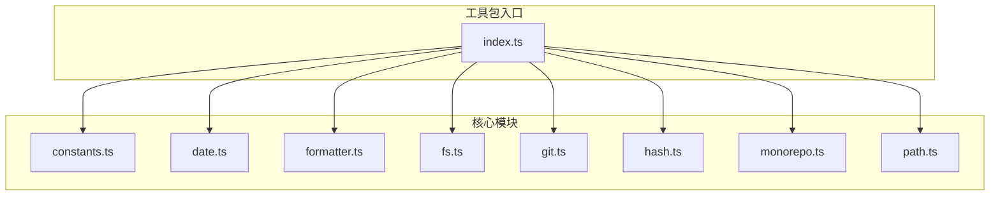
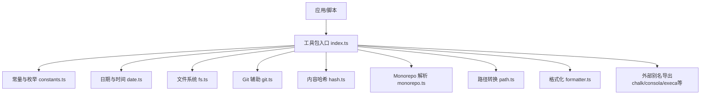
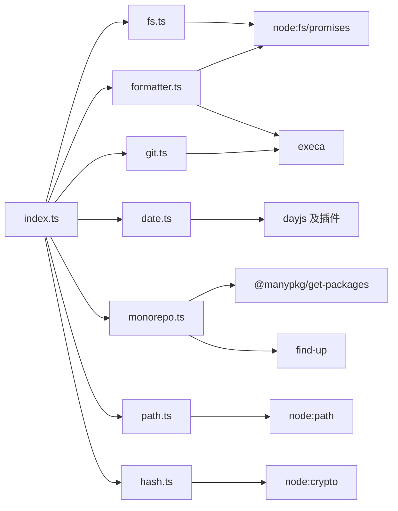

# 工具包 (utils)

<cite>
**本文引用的文件**
- [internal/node-utils/src/index.ts](file://internal/node-utils/src/index.ts)
- [internal/node-utils/src/constants.ts](file://internal/node-utils/src/constants.ts)
- [internal/node-utils/src/date.ts](file://internal/node-utils/src/date.ts)
- [internal/node-utils/src/formatter.ts](file://internal/node-utils/src/formatter.ts)
- [internal/node-utils/src/fs.ts](file://internal/node-utils/src/fs.ts)
- [internal/node-utils/src/git.ts](file://internal/node-utils/src/git.ts)
- [internal/node-utils/src/hash.ts](file://internal/node-utils/src/hash.ts)
- [internal/node-utils/src/monorepo.ts](file://internal/node-utils/src/monorepo.ts)
- [internal/node-utils/src/path.ts](file://internal/node-utils/src/path.ts)
</cite>

## 目录

1. [简介](#简介)
2. [项目结构](#项目结构)
3. [核心组件](#核心组件)
4. [架构总览](#架构总览)
5. [详细组件分析](#详细组件分析)
6. [依赖分析](#依赖分析)
7. [性能考虑](#性能考虑)
8. [故障排查指南](#故障排查指南)
9. [结论](#结论)
10. [附录](#附录)

## 简介

本指南面向开发者，系统性介绍内部工具包（internal/node-utils）的功能与用法。该工具包聚焦于 Node 环境下的通用工具能力，涵盖常量与枚举、日期与时区、文件系统操作、Git 辅助、内容哈希、多包仓库（Monorepo）解析、路径转换以及格式化流程等模块。通过统一导出入口，开发者可以按需引入所需能力，提升脚手架与构建流程的开发效率。

## 项目结构

工具包位于 internal/node-utils，采用按功能分层的源码组织方式：每个能力域对应一个独立文件，入口文件集中导出对外 API。整体结构清晰、职责单一，便于维护与扩展。

图表来源

- [internal/node-utils/src/index.ts:1-20](file://internal/node-utils/src/index.ts#L1-L20)
- [internal/node-utils/src/constants.ts:1-7](file://internal/node-utils/src/constants.ts#L1-L7)
- [internal/node-utils/src/date.ts:1-13](file://internal/node-utils/src/date.ts#L1-L13)
- [internal/node-utils/src/formatter.ts:1-14](file://internal/node-utils/src/formatter.ts#L1-L14)
- [internal/node-utils/src/fs.ts:1-40](file://internal/node-utils/src/fs.ts#L1-L40)
- [internal/node-utils/src/git.ts:1-35](file://internal/node-utils/src/git.ts#L1-L35)
- [internal/node-utils/src/hash.ts:1-19](file://internal/node-utils/src/hash.ts#L1-L19)
- [internal/node-utils/src/monorepo.ts:1-47](file://internal/node-utils/src/monorepo.ts#L1-L47)
- [internal/node-utils/src/path.ts:1-12](file://internal/node-utils/src/path.ts#L1-L12)

章节来源

- [internal/node-utils/src/index.ts:1-20](file://internal/node-utils/src/index.ts#L1-L20)

## 核心组件

- 常量与枚举
  - UNICODE 枚举：提供统一的 Unicode 符号常量，用于日志或提示信息的可视化标记。
- 日期与时区
  - dateUtil：基于 dayjs 的本地化时间工具，预设默认时区，便于跨环境一致的时间处理。
- 文件系统
  - outputJSON：确保目录存在后写入 JSON 文件，支持缩进控制。
  - ensureFile：确保文件存在（若不存在则创建空文件），并自动创建父级目录。
  - readJSON：读取并解析 JSON 文件，提供错误捕获与抛出。
- Git 辅助
  - getStagedFiles：获取暂存区变更文件列表，进行去重与路径规范化。
- 内容哈希
  - generatorContentHash：对输入内容生成 MD5 哈希，支持截断长度。
- 多包仓库（Monorepo）
  - findMonorepoRoot：根据 pnpm 锁文件定位仓库根目录。
  - getPackages / getPackagesSync：同步/异步获取所有包信息。
  - getPackage：按名称查找指定包。
- 路径转换
  - toPosixPath：将 Windows 风格路径转换为 POSIX 风格。
- 格式化与输出
  - formatFile：调用外部格式化器对单个文件执行格式化，并返回格式化后的文本内容。
- 外部依赖别名
  - colors（chalk）、consola、execa、fs/promises、pkg-types、rimraf 等通过入口统一导出，便于在工具链中直接使用。

章节来源

- [internal/node-utils/src/constants.ts:1-7](file://internal/node-utils/src/constants.ts#L1-L7)
- [internal/node-utils/src/date.ts:1-13](file://internal/node-utils/src/date.ts#L1-L13)
- [internal/node-utils/src/fs.ts:1-40](file://internal/node-utils/src/fs.ts#L1-L40)
- [internal/node-utils/src/git.ts:1-35](file://internal/node-utils/src/git.ts#L1-L35)
- [internal/node-utils/src/hash.ts:1-19](file://internal/node-utils/src/hash.ts#L1-L19)
- [internal/node-utils/src/monorepo.ts:1-47](file://internal/node-utils/src/monorepo.ts#L1-L47)
- [internal/node-utils/src/path.ts:1-12](file://internal/node-utils/src/path.ts#L1-L12)
- [internal/node-utils/src/formatter.ts:1-14](file://internal/node-utils/src/formatter.ts#L1-L14)
- [internal/node-utils/src/index.ts:1-20](file://internal/node-utils/src/index.ts#L1-L20)

## 架构总览

工具包以“模块化 + 统一导出”的方式组织，入口文件负责聚合导出，各模块内部保持高内聚、低耦合。对外暴露的 API 具备明确的职责边界，便于在脚手架、CI/CD、构建与发布流程中复用。

图表来源

- [internal/node-utils/src/index.ts:1-20](file://internal/node-utils/src/index.ts#L1-L20)
- [internal/node-utils/src/constants.ts:1-7](file://internal/node-utils/src/constants.ts#L1-L7)
- [internal/node-utils/src/date.ts:1-13](file://internal/node-utils/src/date.ts#L1-L13)
- [internal/node-utils/src/fs.ts:1-40](file://internal/node-utils/src/fs.ts#L1-L40)
- [internal/node-utils/src/git.ts:1-35](file://internal/node-utils/src/git.ts#L1-L35)
- [internal/node-utils/src/hash.ts:1-19](file://internal/node-utils/src/hash.ts#L1-L19)
- [internal/node-utils/src/monorepo.ts:1-47](file://internal/node-utils/src/monorepo.ts#L1-L47)
- [internal/node-utils/src/path.ts:1-12](file://internal/node-utils/src/path.ts#L1-L12)
- [internal/node-utils/src/formatter.ts:1-14](file://internal/node-utils/src/formatter.ts#L1-L14)

## 详细组件分析

### 常量与枚举（UNICODE）

- 功能概述
  - 提供统一的符号常量，便于在命令行或日志中显示一致的勾选/叉号标记。
- 使用场景
  - 在 CLI 输出、构建日志、状态提示中统一视觉符号。
- 注意事项
  - 仅作为展示用途，不涉及业务逻辑。

章节来源

- [internal/node-utils/src/constants.ts:1-7](file://internal/node-utils/src/constants.ts#L1-L7)

### 日期与时间（dateUtil）

- 功能概述
  - 基于 dayjs 扩展 UTC 与时区插件，默认设置亚洲/上海时区，提供统一的时间工具实例。
- 使用场景
  - 日志时间戳、构建产物命名、版本发布时间等需要统一时区的场景。
- 性能与注意
  - 仅初始化一次，避免重复扩展插件带来的开销。

章节来源

- [internal/node-utils/src/date.ts:1-13](file://internal/node-utils/src/date.ts#L1-L13)

### 文件系统（fs 模块）

- 功能概述
  - outputJSON：确保目录存在后写入 JSON，支持缩进；异常时记录错误并抛出。
  - ensureFile：确保文件存在，自动创建父级目录；异常时记录错误并抛出。
  - readJSON：读取并解析 JSON，异常时记录错误并抛出。
- 参数与返回
  - outputJSON(filePath, data, spaces?)
    - 参数：文件路径、数据对象、缩进空格数（可选）
    - 返回：无（异步）
  - ensureFile(filePath)
    - 参数：文件路径
    - 返回：无（异步）
  - readJSON(filePath)
    - 参数：文件路径
    - 返回：解析后的对象（异步）
- 使用示例（路径参考）
  - 写入配置：[internal/node-utils/src/fs.ts:4-18](file://internal/node-utils/src/fs.ts#L4-L18)
  - 确保文件存在：[internal/node-utils/src/fs.ts:20-29](file://internal/node-utils/src/fs.ts#L20-L29)
  - 读取配置：[internal/node-utils/src/fs.ts:31-39](file://internal/node-utils/src/fs.ts#L31-L39)

章节来源

- [internal/node-utils/src/fs.ts:1-40](file://internal/node-utils/src/fs.ts#L1-L40)

### Git 辅助（getStagedFiles）

- 功能概述
  - 通过 git 命令获取暂存区变更文件列表，过滤子模块，去除空项并去重，最后返回绝对路径数组。
- 参数与返回
  - getStagedFiles()
    - 参数：无
    - 返回：字符串数组（文件绝对路径）
- 使用示例（路径参考）
  - 获取暂存文件：[internal/node-utils/src/git.ts:10-32](file://internal/node-utils/src/git.ts#L10-L32)

章节来源

- [internal/node-utils/src/git.ts:1-35](file://internal/node-utils/src/git.ts#L1-L35)

### 内容哈希（generatorContentHash）

- 功能概述
  - 对输入内容计算 MD5 哈希，支持截断长度，便于生成短标识符或缓存键。
- 参数与返回
  - generatorContentHash(content, hashLSize?)
    - 参数：内容字符串、可选截断长度
    - 返回：十六进制哈希字符串
- 使用示例（路径参考）
  - 计算内容哈希：[internal/node-utils/src/hash.ts:8-16](file://internal/node-utils/src/hash.ts#L8-L16)

章节来源

- [internal/node-utils/src/hash.ts:1-19](file://internal/node-utils/src/hash.ts#L1-L19)

### Monorepo 解析（findMonorepoRoot / getPackages / getPackage）

- 功能概述
  - findMonorepoRoot：通过向上查找 pnpm-lock.yaml 定位仓库根目录。
  - getPackages / getPackagesSync：获取所有包信息（同步/异步）。
  - getPackage：按名称查找指定包。
- 参数与返回
  - findMonorepoRoot(cwd?)
    - 参数：当前工作目录（可选）
    - 返回：仓库根目录路径
  - getPackages()
    - 参数：无
    - 返回：包集合（异步）
  - getPackagesSync()
    - 参数：无
    - 返回：包集合（同步）
  - getPackage(pkgName)
    - 参数：包名
    - 返回：匹配包对象（异步）
- 使用示例（路径参考）
  - 定位根目录：[internal/node-utils/src/monorepo.ts:13-18](file://internal/node-utils/src/monorepo.ts#L13-L18)
  - 获取包列表（异步）：[internal/node-utils/src/monorepo.ts:32-35](file://internal/node-utils/src/monorepo.ts#L32-L35)
  - 获取包列表（同步）：[internal/node-utils/src/monorepo.ts:24-26](file://internal/node-utils/src/monorepo.ts#L24-L26)
  - 按名称查找包：[internal/node-utils/src/monorepo.ts:41-43](file://internal/node-utils/src/monorepo.ts#L41-L43)

章节来源

- [internal/node-utils/src/monorepo.ts:1-47](file://internal/node-utils/src/monorepo.ts#L1-L47)

### 路径转换（toPosixPath）

- 功能概述
  - 将 Windows 风格路径转换为 POSIX 风格，便于在不同平台间统一路径表示。
- 参数与返回
  - toPosixPath(pathname)
    - 参数：原始路径字符串
    - 返回：POSIX 风格路径字符串
- 使用示例（路径参考）
  - 路径转换：[internal/node-utils/src/path.ts:7-8](file://internal/node-utils/src/path.ts#L7-L8)

章节来源

- [internal/node-utils/src/path.ts:1-12](file://internal/node-utils/src/path.ts#L1-L12)

### 格式化流程（formatFile）

- 功能概述
  - 调用外部格式化器对单个文件执行格式化，并返回格式化后的文本内容。
- 参数与返回
  - formatFile(filepath)
    - 参数：文件路径
    - 返回：格式化后的文本内容（异步）
- 使用示例（路径参考）
  - 格式化文件：[internal/node-utils/src/formatter.ts:5-11](file://internal/node-utils/src/formatter.ts#L5-L11)

章节来源

- [internal/node-utils/src/formatter.ts:1-14](file://internal/node-utils/src/formatter.ts#L1-L14)

### 外部依赖别名（colors / consola / execa / fs/promises / pkg-types / rimraf）

- 功能概述
  - 通过入口统一导出常用第三方库，减少重复导入与版本管理成本。
- 使用场景
  - CLI 输出（chalk）、日志（consola）、子进程执行（execa）、文件系统（fs/promises）、包元数据（pkg-types）、清理目录（rimraf）。
- 注意事项
  - 使用前请确认项目已安装相应依赖。

章节来源

- [internal/node-utils/src/index.ts:1-20](file://internal/node-utils/src/index.ts#L1-L20)

## 依赖分析

工具包内部模块之间无直接循环依赖，主要依赖关系如下：

图表来源

- [internal/node-utils/src/fs.ts:1-2](file://internal/node-utils/src/fs.ts#L1-L2)
- [internal/node-utils/src/formatter.ts:1-3](file://internal/node-utils/src/formatter.ts#L1-L3)
- [internal/node-utils/src/git.ts:1-5](file://internal/node-utils/src/git.ts#L1-L5)
- [internal/node-utils/src/date.ts:1-6](file://internal/node-utils/src/date.ts#L1-L6)
- [internal/node-utils/src/monorepo.ts:1-7](file://internal/node-utils/src/monorepo.ts#L1-L7)
- [internal/node-utils/src/path.ts:1-1](file://internal/node-utils/src/path.ts#L1-L1)
- [internal/node-utils/src/hash.ts:1-1](file://internal/node-utils/src/hash.ts#L1-L1)
- [internal/node-utils/src/index.ts:1-20](file://internal/node-utils/src/index.ts#L1-L20)

章节来源

- [internal/node-utils/src/index.ts:1-20](file://internal/node-utils/src/index.ts#L1-L20)

## 性能考虑

- I/O 与并发
  - 文件读写与格式化建议批量处理时合并调用，避免频繁 I/O。
  - 对于大量文件的格式化，优先考虑并行策略与错误聚合，减少总耗时。
- 时间处理
  - 日期工具仅初始化一次，避免重复扩展插件导致的额外开销。
- 哈希计算
  - generatorContentHash 使用 MD5，计算成本较低；如需更长唯一性可适当增加截断长度。
- Git 操作
  - getStagedFiles 会触发子进程调用 git，建议在 CI 或脚本中合理缓存结果，避免重复执行。
- Monorepo 解析
  - findMonorepoRoot 依赖锁文件定位，确保仓库根目录正确；避免在非仓库环境中误用。

## 故障排查指南

- 文件系统相关
  - 写入失败：检查目标目录权限与磁盘空间；确认传入的数据可被 JSON 序列化。
  - 读取失败：确认文件存在且可读，编码为 UTF-8。
- Git 操作失败
  - getStagedFiles 返回空数组：确认当前目录为 Git 仓库，且存在暂存文件；检查 git 命令可用性与权限。
- 格式化失败
  - formatFile 抛错：确认外部格式化器已安装并可执行；检查文件路径是否有效。
- Monorepo 解析失败
  - findMonorepoRoot 返回空：确认 pnpm-lock.yaml 存在且可访问；检查工作目录是否正确。
- 路径问题
  - 平台路径不一致：使用 toPosixPath 进行统一转换，避免硬编码分隔符。

章节来源

- [internal/node-utils/src/fs.ts:14-17](file://internal/node-utils/src/fs.ts#L14-L17)
- [internal/node-utils/src/fs.ts:35-37](file://internal/node-utils/src/fs.ts#L35-L37)
- [internal/node-utils/src/git.ts:28-30](file://internal/node-utils/src/git.ts#L28-L30)
- [internal/node-utils/src/formatter.ts:6-8](file://internal/node-utils/src/formatter.ts#L6-L8)
- [internal/node-utils/src/monorepo.ts:13-18](file://internal/node-utils/src/monorepo.ts#L13-L18)

## 结论

internal/node-utils 提供了覆盖 Node 工具链常见需求的一组轻量级工具函数与常量。通过统一入口导出，开发者可以在脚手架、构建与发布流程中快速复用这些能力，降低重复造轮子的成本。建议结合具体场景选择合适模块，并关注 I/O、子进程与路径差异等性能与兼容性要点。

## 附录

- 快速索引
  - 常量与枚举：UNICODE
  - 日期与时间：dateUtil
  - 文件系统：outputJSON、ensureFile、readJSON
  - Git 辅助：getStagedFiles
  - 内容哈希：generatorContentHash
  - Monorepo：findMonorepoRoot、getPackages、getPackage
  - 路径转换：toPosixPath
  - 格式化：formatFile
  - 外部别名：colors、consola、execa、fs/promises、pkg-types、rimraf
