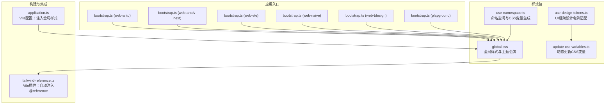
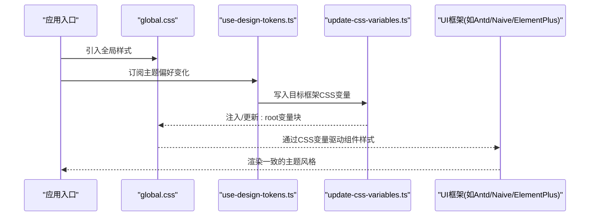
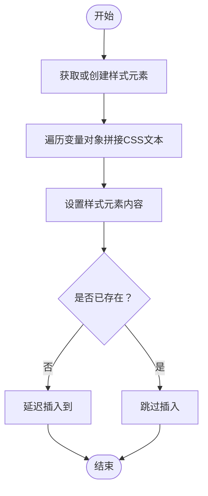
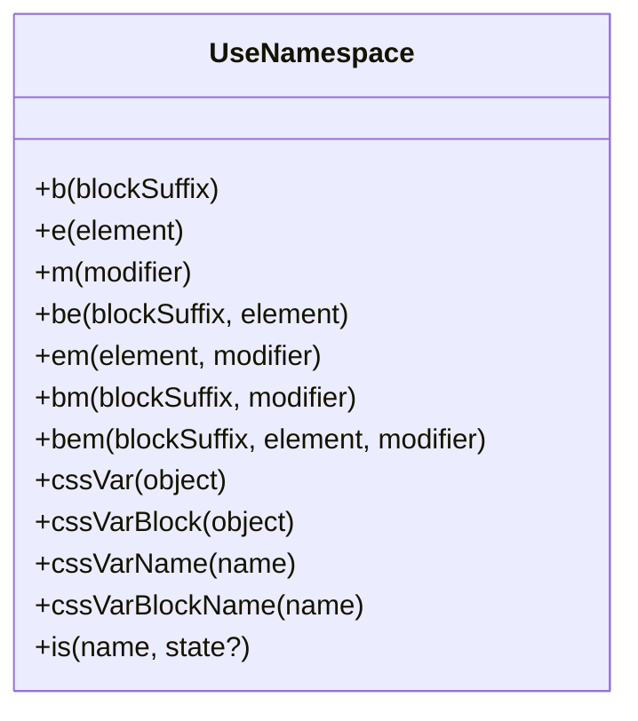
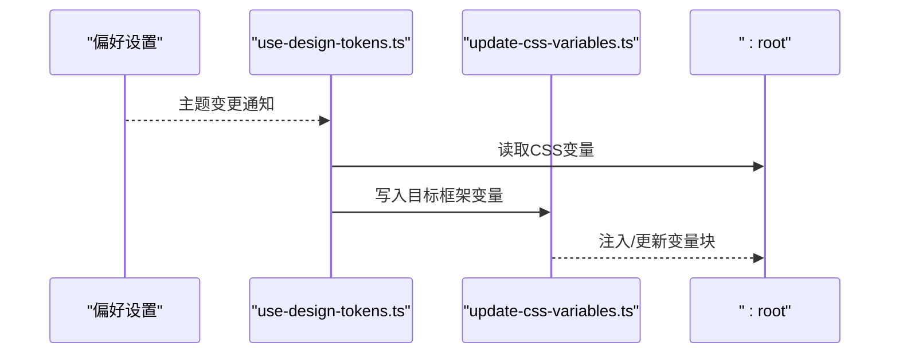
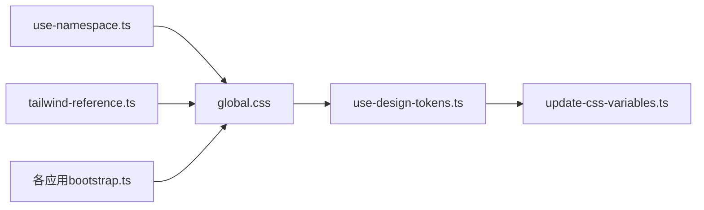

# 样式包（styles）

<cite>
**本文引用的文件**
- [global.css](file://packages/@core/base/design/src/css/global.css)
- [update-css-variables.ts](file://packages/@core/base/shared/src/utils/update-css-variables.ts)
- [use-namespace.ts](file://packages/@core/composables/src/use-namespace.ts)
- [use-design-tokens.ts](file://packages/effects/hooks/src/use-design-tokens.ts)
- [tailwindcss.md](file://docs/src/guide/project/tailwindcss.md)
- [tailwind-reference.ts](file://internal/vite-config/src/plugins/tailwind-reference.ts)
- [application.ts](file://internal/vite-config/src/config/application.ts)
- [bootstrap.ts（web-antd）](file://apps/web-antd/src/bootstrap.ts)
- [bootstrap.ts（web-antdv-next）](file://apps/web-antdv-next/src/bootstrap.ts)
- [bootstrap.ts（web-ele）](file://apps/web-ele/src/bootstrap.ts)
- [bootstrap.ts（web-naive）](file://apps/web-naive/src/bootstrap.ts)
- [bootstrap.ts（web-tdesign）](file://apps/web-tdesign/src/bootstrap.ts)
- [bootstrap.ts（playground）](file://playground/src/bootstrap.ts)
</cite>

## 目录

1. [简介](#简介)
2. [项目结构](#项目结构)
3. [核心组件](#核心组件)
4. [架构总览](#架构总览)
5. [详细组件分析](#详细组件分析)
6. [依赖关系分析](#依赖关系分析)
7. [性能考量](#性能考量)
8. [故障排查指南](#故障排查指南)
9. [结论](#结论)
10. [附录](#附录)

## 简介

本指南面向希望在项目中正确引入、使用并定制样式包（styles）的开发者。样式包基于 Tailwind CSS v4，采用 CSS 变量驱动的主题系统，提供语义化颜色、半径、阴影、动画等设计令牌，并通过命名空间工具与动态 CSS 变量更新能力，实现跨 UI 框架（Ant Design、Element Plus、Naive UI、TDesign 等）的一致风格与灵活主题切换。

## 项目结构

样式包的核心由以下部分组成：

- 全局样式入口：定义 Tailwind v4 指令、扫描源、暗色变体、主题令牌与基础样式层。
- 动态样式工具：运行时更新 CSS 变量，支持主题切换与实时生效。
- 命名空间工具：生成 BEM 风格类名与 CSS 变量键名，统一命名规范。
- 设计令牌适配器：将 CSS 变量映射为各 UI 框架所需的令牌，确保组件样式一致性。
- Tailwind 集成：通过 Vite 插件与全局 CSS 统一扫描范围与主题入口，简化包级 Tailwind 使用。

图表来源

- [global.css:1-570](file://packages/@core/base/design/src/css/global.css#L1-L570)
- [update-css-variables.ts:1-36](file://packages/@core/base/shared/src/utils/update-css-variables.ts#L1-L36)
- [use-namespace.ts:1-107](file://packages/@core/composables/src/use-namespace.ts#L1-L107)
- [use-design-tokens.ts:1-322](file://packages/effects/hooks/src/use-design-tokens.ts#L1-L322)
- [tailwind-reference.ts](file://internal/vite-config/src/plugins/tailwind-reference.ts)
- [application.ts:110-110](file://internal/vite-config/src/config/application.ts#L110-L110)
- [bootstrap.ts（web-antd）:6-7](file://apps/web-antd/src/bootstrap.ts#L6-L7)
- [bootstrap.ts（web-antdv-next）:6-7](file://apps/web-antdv-next/src/bootstrap.ts#L6-L7)
- [bootstrap.ts（web-ele）:6-7](file://apps/web-ele/src/bootstrap.ts#L6-L7)
- [bootstrap.ts（web-naive）:6-7](file://apps/web-naive/src/bootstrap.ts#L6-L7)
- [bootstrap.ts（web-tdesign）:6-7](file://apps/web-tdesign/src/bootstrap.ts#L6-L7)
- [bootstrap.ts（playground）:6-6](file://playground/src/bootstrap.ts#L6-L6)

章节来源

- [global.css:1-570](file://packages/@core/base/design/src/css/global.css#L1-L570)
- [tailwindcss.md:1-39](file://docs/src/guide/project/tailwindcss.md#L1-L39)

## 核心组件

- 全局样式与主题令牌（global.css）
  - 定义 Tailwind v4 指令与扫描源，统一主题入口。
  - 提供语义化颜色、半径、阴影、动画等主题令牌。
  - 定义基础层样式与自定义工具类。
- 动态样式更新（update-css-variables.ts）
  - 在运行时向文档根节点注入或更新 CSS 变量块，支持主题切换即时生效。
- 命名空间与 CSS 变量生成（use-namespace.ts）
  - 生成 BEM 风格类名与 CSS 变量键名，避免冲突并提升可维护性。
- 设计令牌适配（use-design-tokens.ts）
  - 将 CSS 变量映射为 Antd、Naive、Element Plus 等框架所需令牌，保证组件风格一致。
- Tailwind 集成（tailwind-reference.ts、application.ts）
  - 自动处理 Vue SFC 中的 @apply，注入对应 @reference；Vite 应用注入全局样式作为主题入口。

章节来源

- [global.css:1-570](file://packages/@core/base/design/src/css/global.css#L1-L570)
- [update-css-variables.ts:1-36](file://packages/@core/base/shared/src/utils/update-css-variables.ts#L1-L36)
- [use-namespace.ts:1-107](file://packages/@core/composables/src/use-namespace.ts#L1-L107)
- [use-design-tokens.ts:1-322](file://packages/effects/hooks/src/use-design-tokens.ts#L1-L322)
- [tailwind-reference.ts](file://internal/vite-config/src/plugins/tailwind-reference.ts)
- [application.ts:110-110](file://internal/vite-config/src/config/application.ts#L110-L110)

## 架构总览

样式包采用“CSS 变量驱动 + Tailwind v4 + 运行时适配”的架构：

- 编译期：Tailwind v4 指令与扫描源在全局 CSS 中集中管理，Vite 插件自动处理 @apply 与 @reference。
- 运行期：通过偏好设置与设计令牌适配器，将主题变量映射到各 UI 框架，同时支持动态更新 CSS 变量以实现主题切换。

图表来源

- [global.css:1-570](file://packages/@core/base/design/src/css/global.css#L1-L570)
- [use-design-tokens.ts:316-321](file://packages/effects/hooks/src/use-design-tokens.ts#L316-L321)
- [update-css-variables.ts:5-33](file://packages/@core/base/shared/src/utils/update-css-variables.ts#L5-L33)

## 详细组件分析

### 全局样式与主题令牌（global.css）

- Tailwind v4 指令与扫描
  - 使用 @source 指定扫描范围，确保工具类与组件样式被正确提取。
  - 使用 @custom-variant 定义暗色变体选择器，替代系统 prefers-color-scheme。
- 主题令牌（@theme / @theme inline）
  - 定义字体族、圆角半径、阴影、动画等基础令牌。
  - 定义语义化颜色系统：背景、前景、卡片、弹出层、强调、输入、边框、环形光晕等。
  - 定义主色、破坏性、成功、警告等调色板及其多级色阶与交互态。
- 基础层与自定义工具类
  - @layer base 定义全局重置与基础排版。
  - @utility 定义常用布局工具类（如居中）。
  - 自定义组件样式类（如卡片、链接、轮廓框等）。

章节来源

- [global.css:1-570](file://packages/@core/base/design/src/css/global.css#L1-L570)

### 动态样式更新（update-css-variables.ts）

- 功能概述
  - 在运行时批量更新 :root 中的 CSS 变量，支持按需注入与延迟插入，避免重复 DOM 操作。
- 关键流程
  - 查找或创建内联样式元素，拼接变量块文本，写入 head。
  - 默认 ID 为固定标识，便于后续替换与去重。

图表来源

- [update-css-variables.ts:5-33](file://packages/@core/base/shared/src/utils/update-css-variables.ts#L5-L33)

章节来源

- [update-css-variables.ts:1-36](file://packages/@core/base/shared/src/utils/update-css-variables.ts#L1-L36)

### 命名空间与 CSS 变量生成（use-namespace.ts）

- 功能概述
  - 生成 BEM 风格类名，避免命名冲突。
  - 生成 CSS 变量键名（全局与带 block 前缀），统一变量命名规范。
- 关键点
  - 支持 block、element、modifier 的组合生成。
  - 提供 cssVar 与 cssVarBlock 方法，直接输出符合命名规范的变量映射。

图表来源

- [use-namespace.ts:38-101](file://packages/@core/composables/src/use-namespace.ts#L38-L101)

章节来源

- [use-namespace.ts:1-107](file://packages/@core/composables/src/use-namespace.ts#L1-L107)

### 设计令牌适配（use-design-tokens.ts）

- 功能概述
  - 订阅主题偏好变化，读取 CSS 变量并映射为各 UI 框架所需的令牌。
  - 通过 updateCSSVariables 将目标框架的变量注入到页面，实现主题切换。
- 适配范围
  - Antd、Naive、Element Plus：分别提供独立的令牌映射函数。
- 关键流程
  - 从 :root 读取主题变量（颜色、半径等）。
  - 将变量转换为目标框架期望格式（如 RGB 字符串）。
  - 写入专用样式块，驱动组件渲染。

图表来源

- [use-design-tokens.ts:36-70](file://packages/effects/hooks/src/use-design-tokens.ts#L36-L70)
- [use-design-tokens.ts:115-157](file://packages/effects/hooks/src/use-design-tokens.ts#L115-L157)
- [use-design-tokens.ts:176-320](file://packages/effects/hooks/src/use-design-tokens.ts#L176-L320)
- [update-css-variables.ts:5-33](file://packages/@core/base/shared/src/utils/update-css-variables.ts#L5-L33)

章节来源

- [use-design-tokens.ts:1-322](file://packages/effects/hooks/src/use-design-tokens.ts#L1-L322)

### Tailwind 集成与应用注入

- 文档说明
  - 当前项目使用 Tailwind CSS v4，主题入口与扫描范围集中在全局 CSS。
  - 包使用方式不依赖传统 tailwind.config.\* 文件，统一由 Vite 配置接入 @tailwindcss/vite。
- Vue SFC 中的 @apply
  - Vite 插件自动注入 @reference，无需手动补充。
- 应用注入
  - Vite 应用配置会在构建时注入全局样式作为主题入口。

章节来源

- [tailwindcss.md:1-39](file://docs/src/guide/project/tailwindcss.md#L1-L39)
- [tailwind-reference.ts](file://internal/vite-config/src/plugins/tailwind-reference.ts)
- [application.ts:110-110](file://internal/vite-config/src/config/application.ts#L110-L110)

### 在项目中引入与使用

- 应用入口引入
  - 各应用入口均引入 @vben/styles 与对应 UI 框架的样式入口（如 antd、naive 等）。
- 全局样式生效
  - 通过 Vite 注入全局样式，使 Tailwind 工具类与主题令牌在全站生效。
- 组件样式
  - 推荐优先使用 Tailwind 工具类与语义化颜色变量，必要时使用自定义组件样式类。

章节来源

- [bootstrap.ts（web-antd）:6-7](file://apps/web-antd/src/bootstrap.ts#L6-L7)
- [bootstrap.ts（web-antdv-next）:6-7](file://apps/web-antdv-next/src/bootstrap.ts#L6-L7)
- [bootstrap.ts（web-ele）:6-7](file://apps/web-ele/src/bootstrap.ts#L6-L7)
- [bootstrap.ts（web-naive）:6-7](file://apps/web-naive/src/bootstrap.ts#L6-L7)
- [bootstrap.ts（web-tdesign）:6-7](file://apps/web-tdesign/src/bootstrap.ts#L6-L7)
- [bootstrap.ts（playground）:6-6](file://playground/src/bootstrap.ts#L6-L6)
- [application.ts:110-110](file://internal/vite-config/src/config/application.ts#L110-L110)

## 依赖关系分析

- 组件耦合
  - global.css 为样式核心，被各应用入口引入。
  - use-design-tokens.ts 依赖 preferences 与 update-css-variables.ts，形成“主题偏好 → CSS 变量 → UI 框架令牌”的链路。
  - use-namespace.ts 为通用工具，服务于命名与变量生成。
- 外部依赖
  - Tailwind CSS v4 与相关插件（typography、Iconify）在全局 CSS 中声明。
  - Vite 插件负责处理 @apply 与 @reference，简化工程配置。

图表来源

- [global.css:1-570](file://packages/@core/base/design/src/css/global.css#L1-L570)
- [use-design-tokens.ts:1-322](file://packages/effects/hooks/src/use-design-tokens.ts#L1-L322)
- [update-css-variables.ts:1-36](file://packages/@core/base/shared/src/utils/update-css-variables.ts#L1-L36)
- [use-namespace.ts:1-107](file://packages/@core/composables/src/use-namespace.ts#L1-L107)
- [tailwind-reference.ts](file://internal/vite-config/src/plugins/tailwind-reference.ts)
- [bootstrap.ts（web-antd）:6-7](file://apps/web-antd/src/bootstrap.ts#L6-L7)

## 性能考量

- Tailwind 扫描范围控制
  - 通过 @source 精确指定扫描路径，避免不必要的样式提取，减少构建体积。
- CSS 变量更新策略
  - updateCSS-variables 仅在主题变更时更新相关变量块，避免频繁 DOM 操作。
- 组件样式与工具类优先
  - 使用 Tailwind 工具类与语义化变量，减少自定义样式的冗余与重复计算。
- 暗色模式选择器
  - 明确使用 .dark 类选择器，避免系统 prefers-color-scheme 导致的不可控重绘。

章节来源

- [global.css:7-14](file://packages/@core/base/design/src/css/global.css#L7-L14)
- [update-css-variables.ts:5-33](file://packages/@core/base/shared/src/utils/update-css-variables.ts#L5-L33)

## 故障排查指南

- Tailwind 工具类无效
  - 检查全局样式是否被正确引入与注入。
  - 确认 @source 扫描路径包含目标组件所在目录。
- @apply 未生效
  - 确认 Vite 插件已启用，自动注入 @reference。
- 主题切换无效果
  - 检查偏好设置是否触发设计令牌适配器更新。
  - 确认 updateCSSVariables 是否成功注入目标框架变量块。
- 自定义样式覆盖冲突
  - 优先使用语义化变量与 Tailwind 工具类；若必须覆盖，注意 !important 的使用与作用域层级。

章节来源

- [tailwindcss.md:32-39](file://docs/src/guide/project/tailwindcss.md#L32-L39)
- [tailwind-reference.ts](file://internal/vite-config/src/plugins/tailwind-reference.ts)
- [use-design-tokens.ts:316-321](file://packages/effects/hooks/src/use-design-tokens.ts#L316-L321)
- [update-css-variables.ts:5-33](file://packages/@core/base/shared/src/utils/update-css-variables.ts#L5-L33)

## 结论

样式包通过“CSS 变量 + Tailwind v4 + 运行时适配”的方案，实现了跨 UI 框架的一致主题系统与灵活的主题切换能力。开发者应优先使用全局样式与语义化变量，结合命名空间工具与设计令牌适配器，在保证性能与可维护性的前提下，快速构建一致且美观的用户界面。

## 附录

### 主题定制步骤（颜色/字体/间距/断点）

- 颜色系统
  - 在全局 CSS 中调整语义化颜色与调色板变量，如 --primary、--destructive、--success、--warning 等。
  - 若需新增语义色，建议在 @theme inline 中统一声明，并保持命名一致性。
- 字体系统
  - 修改 --font-sans 或具体字体族变量，确保与全局排版一致。
- 间距系统
  - 调整 --spacing 与相关工具类映射，避免破坏现有布局体系。
- 断点系统
  - Tailwind v4 通过指令与工具类实现响应式，建议在业务组件中直接使用工具类，而非修改底层断点变量。

章节来源

- [global.css:16-234](file://packages/@core/base/design/src/css/global.css#L16-L234)

### 响应式设计最佳实践

- 使用 Tailwind 工具类进行响应式控制，避免手写媒体查询。
- 在组件中优先组合工具类，减少自定义样式。
- 对复杂交互使用 CSS 变量与动画令牌，保持一致的过渡节奏。

章节来源

- [global.css:16-234](file://packages/@core/base/design/src/css/global.css#L16-L234)

### 样式覆盖策略

- 优先使用语义化变量与 Tailwind 工具类。
- 自定义样式时，遵循命名空间规范，避免与全局样式冲突。
- 对第三方组件样式覆盖，建议通过 CSS 变量或设计令牌适配器统一管理。

章节来源

- [use-namespace.ts:60-84](file://packages/@core/composables/src/use-namespace.ts#L60-L84)
- [use-design-tokens.ts:316-321](file://packages/effects/hooks/src/use-design-tokens.ts#L316-L321)
