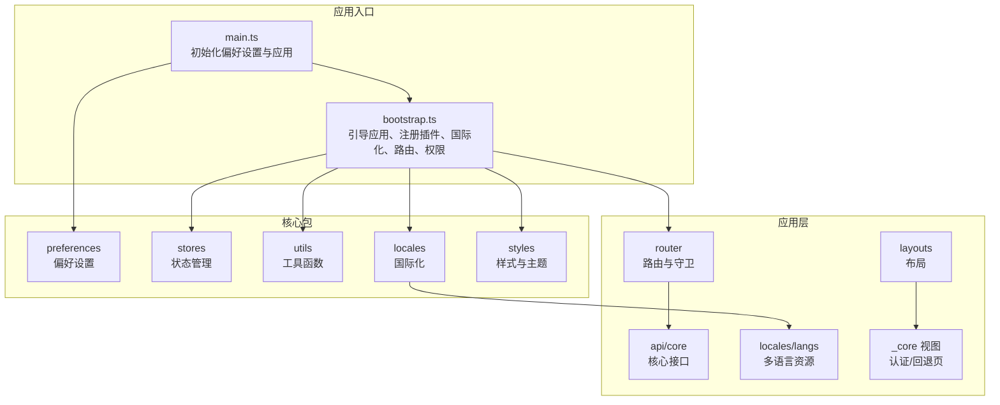
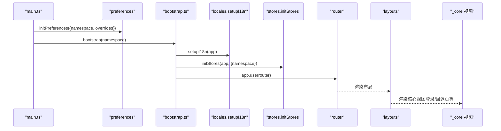
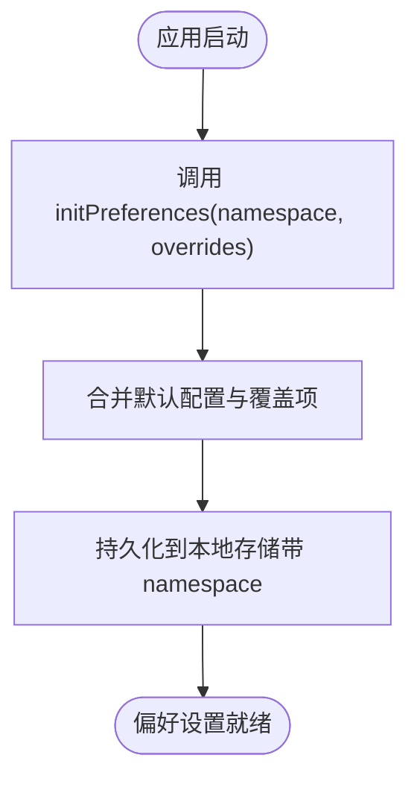
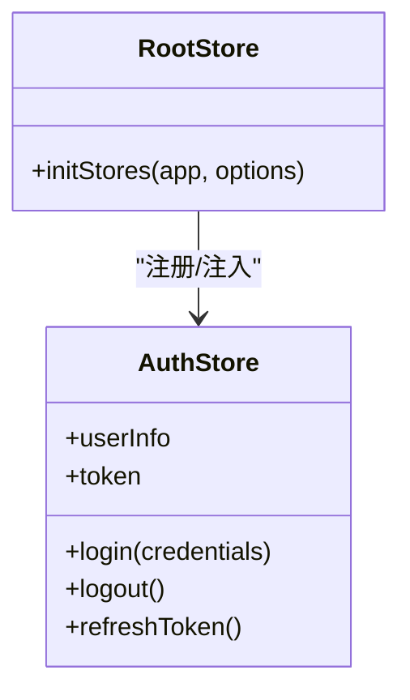
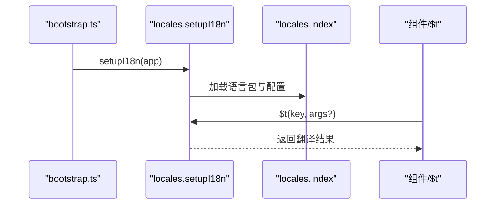
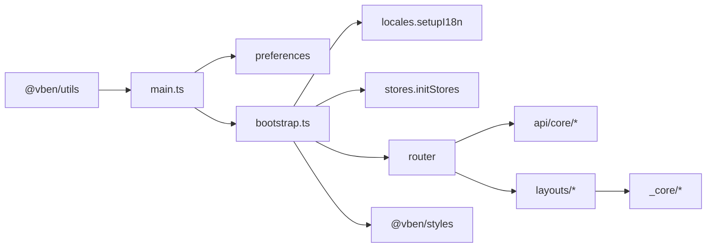

# 核心包使用

<cite>
**本文引用的文件**
- [playground/src/main.ts](file://playground/src/main.ts)
- [playground/src/bootstrap.ts](file://playground/src/bootstrap.ts)
- [playground/src/preferences.ts](file://playground/src/preferences.ts)
- [playground/src/locales/index.ts](file://playground/src/locales/index.ts)
- [playground/src/locales/README.md](file://playground/src/locales/README.md)
- [playground/src/store/index.ts](file://playground/src/store/index.ts)
- [playground/src/store/auth.ts](file://playground/src/store/auth.ts)
- [playground/src/router/index.ts](file://playground/src/router/index.ts)
- [playground/src/router/guard.ts](file://playground/src/router/guard.ts)
- [playground/src/router/access.ts](file://playground/src/router/access.ts)
- [playground/src/layouts/basic.vue](file://playground/src/layouts/basic.vue)
- [playground/src/layouts/auth.vue](file://playground/src/layouts/auth.vue)
- [playground/src/views/_core/README.md](file://playground/src/views/_core/README.md)
- [playground/src/views/_core/authentication/login.vue](file://playground/src/views/_core/authentication/login.vue)
- [playground/src/views/_core/fallback/not-found.vue](file://playground/src/views/_core/fallback/not-found.vue)
- [playground/src/views/_core/fallback/forbidden.vue](file://playground/src/views/_core/fallback/forbidden.vue)
- [playground/src/api/core/auth.ts](file://playground/src/api/core/auth.ts)
- [playground/src/api/core/menu.ts](file://playground/src/api/core/menu.ts)
- [playground/src/api/core/user.ts](file://playground/src/api/core/user.ts)
- [playground/src/api/request.ts](file://playground/src/api/request.ts)
- [playground/src/vite.config.ts](file://playground/src/vite.config.ts)
</cite>

## 目录

1. [简介](#简介)
2. [项目结构](#项目结构)
3. [核心组件](#核心组件)
4. [架构总览](#架构总览)
5. [详细组件分析](#详细组件分析)
6. [依赖关系分析](#依赖关系分析)
7. [性能考虑](#性能考虑)
8. [故障排查指南](#故障排查指南)
9. [结论](#结论)
10. [附录](#附录)

## 简介

本指南聚焦于 Vben Admin 的“核心包”使用与最佳实践，涵盖以下方面：

- 偏好设置包（preferences）：应用配置管理与个性化定制
- 状态包（stores）：Pinia Store 模块设计与使用模式
- 工具包（utils）：常用工具函数与通用能力
- 国际化包（locales）：多语言支持与本地化实践
- 样式包（styles）：主题系统与样式定制方法
- UI Kit 与 Composables：通用 UI 能力与组合式工具
- 设计系统（Design System）：统一的设计规范与组件体系

通过 Playground 应用的实现，展示各包在真实项目中的集成方式、调用流程与扩展点。

## 项目结构

Playground 应用作为核心包的落地示例，采用“应用层 + 核心包”的分层组织：

- 应用入口与引导：main.ts、bootstrap.ts
- 偏好设置：preferences.ts
- 国际化：locales 目录
- 状态管理：store 目录
- 路由与权限：router 目录
- 布局与核心视图：layouts 与 views/\_core
- API 层：api/core 与 request 封装
- 构建配置：vite.config.ts

图表来源

- [playground/src/main.ts:1-32](file://playground/src/main.ts#L1-L32)
- [playground/src/bootstrap.ts:1-85](file://playground/src/bootstrap.ts#L1-L85)
- [playground/src/preferences.ts:1-14](file://playground/src/preferences.ts#L1-L14)
- [playground/src/locales/index.ts](file://playground/src/locales/index.ts)
- [playground/src/store/index.ts](file://playground/src/store/index.ts)
- [playground/src/router/index.ts](file://playground/src/router/index.ts)
- [playground/src/api/core/auth.ts](file://playground/src/api/core/auth.ts)
- [playground/src/layouts/basic.vue](file://playground/src/layouts/basic.vue)
- [playground/src/views/\_core/README.md](file://playground/src/views/_core/README.md)

章节来源

- [playground/src/main.ts:1-32](file://playground/src/main.ts#L1-L32)
- [playground/src/bootstrap.ts:1-85](file://playground/src/bootstrap.ts#L1-L85)

## 核心组件

本节从“应用视角”梳理核心包的职责边界与典型用法：

- 偏好设置（preferences）
  - 负责应用级配置（如应用名、动态标题、主题模式等）与命名空间隔离
  - 通过 initPreferences 初始化，结合 overridesPreferences 进行覆盖
- 状态管理（stores）
  - 以 Pinia 为核心，提供认证状态、全局共享状态等
  - 通过 initStores(app, { namespace }) 统一注入
- 工具包（utils）
  - 提供通用工具函数与通用 UI 能力（如全局 loading 销毁）
- 国际化（locales）
  - 提供 $t 与 setupI18n，按需加载多语言资源
- 样式包（styles）
  - 引入基础样式与特定 UI 框架样式（如 Ant Design）

章节来源

- [playground/src/main.ts:16-25](file://playground/src/main.ts#L16-L25)
- [playground/src/bootstrap.ts:44-48](file://playground/src/bootstrap.ts#L44-L48)
- [playground/src/preferences.ts:8-13](file://playground/src/preferences.ts#L8-L13)

## 架构总览

下图展示了应用启动到页面渲染的关键流程，体现核心包之间的协作关系：

图表来源

- [playground/src/main.ts:16-25](file://playground/src/main.ts#L16-L25)
- [playground/src/bootstrap.ts:44-61](file://playground/src/bootstrap.ts#L44-L61)
- [playground/src/layouts/basic.vue](file://playground/src/layouts/basic.vue)
- [playground/src/views/\_core/authentication/login.vue](file://playground/src/views/_core/authentication/login.vue)

## 详细组件分析

### 偏好设置包（preferences）

- 初始化时机
  - 在应用启动早期调用 initPreferences，传入 namespace 与 overrides
  - namespace 用于区分不同项目或环境，确保本地存储键值隔离
- 覆盖配置
  - 使用 defineOverridesPreferences 覆盖部分配置项，未覆盖项沿用默认值
- 典型用途
  - 应用名称、动态标题、主题模式、语言偏好、导航风格等

图表来源

- [playground/src/main.ts:16-20](file://playground/src/main.ts#L16-L20)
- [playground/src/preferences.ts:8-13](file://playground/src/preferences.ts#L8-L13)

章节来源

- [playground/src/main.ts:16-25](file://playground/src/main.ts#L16-L25)
- [playground/src/preferences.ts:1-14](file://playground/src/preferences.ts#L1-L14)

### 状态包（stores）

- Store 设计
  - 以模块化组织（如认证模块），通过 Pinia 提供响应式状态与派生逻辑
  - 通过 initStores(app, { namespace }) 注入，确保命名空间隔离
- 使用模式
  - 在组件中通过 storeToRefs/useStore 访问状态
  - 在路由守卫与权限控制中读取用户状态
- 典型模块
  - 认证状态：登录、登出、令牌刷新、用户信息
  - 全局共享状态：菜单、面包屑、布局参数等

图表来源

- [playground/src/store/auth.ts](file://playground/src/store/auth.ts)
- [playground/src/store/index.ts](file://playground/src/store/index.ts)

章节来源

- [playground/src/store/auth.ts](file://playground/src/store/auth.ts)
- [playground/src/store/index.ts](file://playground/src/store/index.ts)
- [playground/src/bootstrap.ts:47-48](file://playground/src/bootstrap.ts#L47-L48)

### 工具包（utils）

- 作用
  - 提供通用工具函数与通用 UI 能力（如全局 loading 销毁）
- 典型用法
  - 在应用初始化完成后移除全局 loading，保证首屏体验
- 扩展建议
  - 将常用工具函数抽象为独立模块，避免重复封装

章节来源

- [playground/src/main.ts:27-28](file://playground/src/main.ts#L27-L28)

### 国际化包（locales）

- 初始化
  - 通过 setupI18n(app) 完成 i18n 插件安装与配置
- 多语言资源
  - 语言包按目录组织（langs/en-US、langs/zh-CN），便于扩展与维护
- 使用方式
  - 在组件中通过 $t 访问翻译文本；路由 meta.title 支持国际化
- 最佳实践
  - 保持语言包层级清晰，避免命名冲突
  - 对动态文案与占位符进行参数化处理

图表来源

- [playground/src/bootstrap.ts:44-45](file://playground/src/bootstrap.ts#L44-L45)
- [playground/src/locales/index.ts](file://playground/src/locales/index.ts)
- [playground/src/locales/README.md](file://playground/src/locales/README.md)

章节来源

- [playground/src/bootstrap.ts:44-45](file://playground/src/bootstrap.ts#L44-L45)
- [playground/src/locales/index.ts](file://playground/src/locales/index.ts)
- [playground/src/locales/README.md](file://playground/src/locales/README.md)

### 样式包（styles）

- 主题系统
  - 通过引入 @vben/styles 与具体 UI 框架样式（如 @vben/styles/antd）实现主题切换与样式统一
- 定制方法
  - 在构建阶段通过变量与 CSS 自定义属性进行主题定制
  - 结合偏好设置中的主题模式开关，动态切换样式
- 注意事项
  - 避免样式覆盖冲突，优先使用变量与主题规范

章节来源

- [playground/src/bootstrap.ts:7-8](file://playground/src/bootstrap.ts#L7-L8)

### UI Kit 与 Composables

- UI Kit
  - 通过组件适配器与通用 UI 组件库（如 Element Plus、Ant Design）集成
  - 在引导阶段初始化组件适配器与表单适配器
- Composables
  - 使用 @vueuse/core 等组合式工具，如动态标题、设备检测、状态监听等
- 最佳实践
  - 将 UI 能力抽象为可复用的组合式函数与组件，降低耦合度

章节来源

- [playground/src/bootstrap.ts:15-17](file://playground/src/bootstrap.ts#L15-L17)
- [playground/src/bootstrap.ts:72-79](file://playground/src/bootstrap.ts#L72-L79)

### 设计系统（Design System）

- 统一规范
  - 通过设计系统约束颜色、字体、间距、阴影等视觉元素
- 组件体系
  - 基于 UI 框架的组件库，结合业务场景进行二次封装
- 扩展建议
  - 以“原子化设计”思想拆分组件，提升复用性与一致性

（本节为概念性说明，无需源码引用）

## 依赖关系分析

核心包与应用层的依赖关系如下：

图表来源

- [playground/src/main.ts:1-32](file://playground/src/main.ts#L1-L32)
- [playground/src/bootstrap.ts:1-85](file://playground/src/bootstrap.ts#L1-L85)
- [playground/src/router/index.ts](file://playground/src/router/index.ts)
- [playground/src/api/core/auth.ts](file://playground/src/api/core/auth.ts)
- [playground/src/layouts/basic.vue](file://playground/src/layouts/basic.vue)
- [playground/src/views/\_core/README.md](file://playground/src/views/_core/README.md)

章节来源

- [playground/src/main.ts:1-32](file://playground/src/main.ts#L1-L32)
- [playground/src/bootstrap.ts:1-85](file://playground/src/bootstrap.ts#L1-L85)

## 性能考虑

- 延迟初始化
  - 将非关键模块（如 tippy、motion 插件）按需加载，减少首屏负担
- 资源懒加载
  - 国际化资源与语言包按需加载，避免一次性加载全部语言
- 状态隔离
  - 通过 namespace 隔离不同项目或环境的状态，避免内存泄漏与冲突
- 样式优化
  - 仅引入必要的 UI 框架样式，避免全量引入导致体积膨胀

章节来源

- [playground/src/bootstrap.ts:56-69](file://playground/src/bootstrap.ts#L56-L69)
- [playground/src/bootstrap.ts:44-45](file://playground/src/bootstrap.ts#L44-L45)

## 故障排查指南

- 国际化不生效
  - 检查 locales.setupI18n 是否在 bootstrap 中调用
  - 确认语言包路径与命名是否正确
- 偏好设置未生效
  - 确认 initPreferences 已在 main.ts 中调用且 namespace 正确
  - 清理浏览器缓存后重试
- 路由守卫异常
  - 检查 router.guard 与 access 权限配置
  - 确保认证状态已通过 stores 初始化
- 样式主题不一致
  - 确认 @vben/styles 与 UI 框架样式已正确引入
  - 检查主题变量与 CSS 自定义属性是否被覆盖

章节来源

- [playground/src/bootstrap.ts:44-48](file://playground/src/bootstrap.ts#L44-L48)
- [playground/src/router/guard.ts](file://playground/src/router/guard.ts)
- [playground/src/router/access.ts](file://playground/src/router/access.ts)

## 结论

通过 Playground 应用的实现，可以看到核心包在实际项目中的标准用法：

- 偏好设置负责应用级配置与隔离
- 状态包提供模块化的状态管理
- 工具包承载通用能力
- 国际化与样式包分别解决多语言与主题问题
- UI Kit 与 Composables 提升开发效率与一致性

建议在新项目中遵循上述模式，结合业务场景进行扩展与定制。

## 附录

- 快速开始
  - 在 main.ts 中初始化偏好设置
  - 在 bootstrap.ts 中引导国际化、状态、路由与权限
  - 在 layouts 与 views/\_core 中组织基础视图与认证流程
- API 参考（示例）
  - 偏好设置：initPreferences、defineOverridesPreferences
  - 国际化：setupI18n、$t
  - 状态：initStores、useStore
  - 工具：unmountGlobalLoading
  - 样式：@vben/styles、@vben/styles/antd

章节来源

- [playground/src/main.ts:16-25](file://playground/src/main.ts#L16-L25)
- [playground/src/bootstrap.ts:44-48](file://playground/src/bootstrap.ts#L44-L48)
- [playground/src/preferences.ts:8-13](file://playground/src/preferences.ts#L8-L13)
- [playground/src/locales/index.ts](file://playground/src/locales/index.ts)
- [playground/src/store/index.ts](file://playground/src/store/index.ts)
- [playground/src/utils/index.ts](file://playground/src/utils/index.ts)
