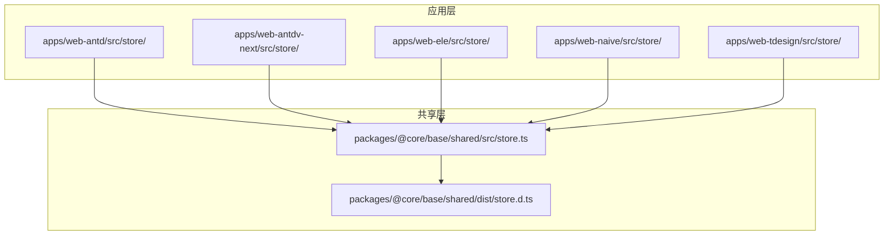
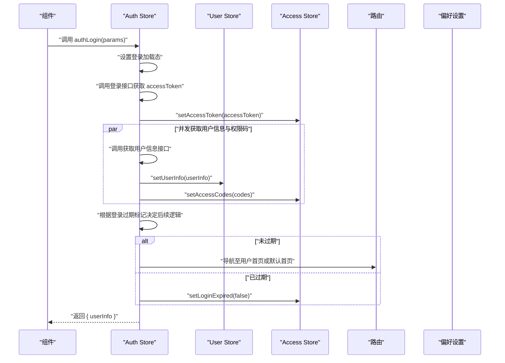
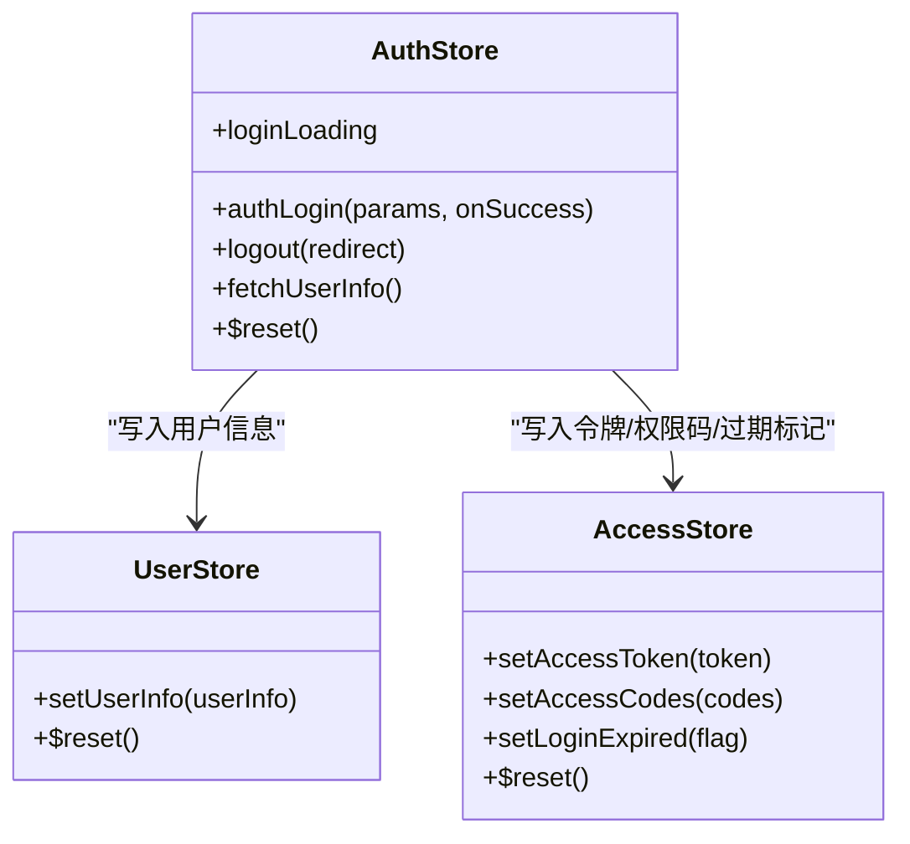
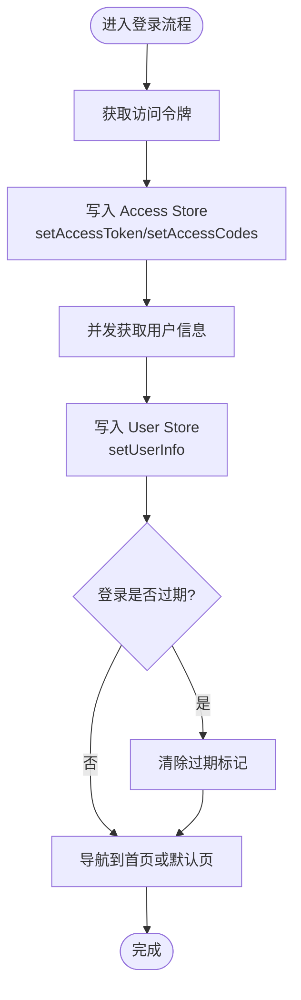
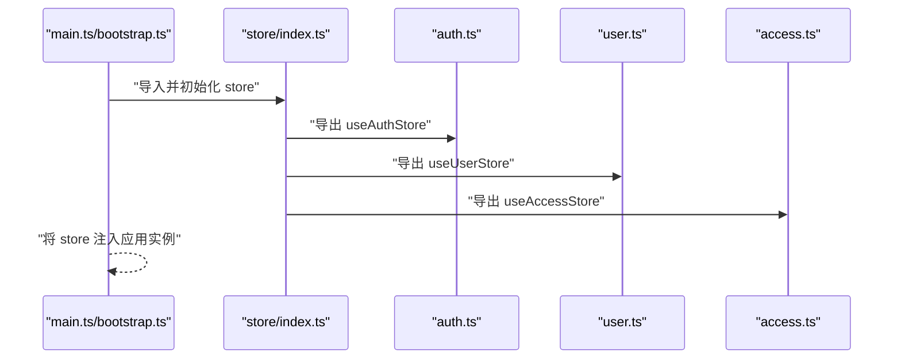
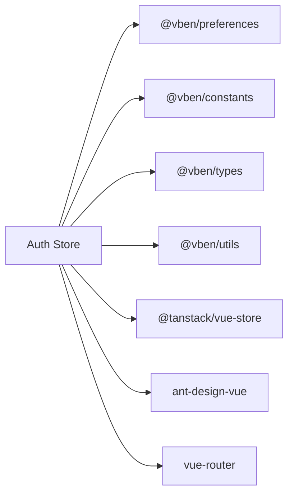

# 状态包 (stores)

<cite>
**本文引用的文件**
- [apps/web-antd/src/store/index.ts](file://apps/web-antd/src/store/index.ts)
- [apps/web-antd/src/store/auth.ts](file://apps/web-antd/src/store/auth.ts)
- [apps/web-antdv-next/src/store/index.ts](file://apps/web-antdv-next/src/store/index.ts)
- [apps/web-antdv-next/src/store/auth.ts](file://apps/web-antdv-next/src/store/auth.ts)
- [apps/web-ele/src/store/index.ts](file://apps/web-ele/src/store/index.ts)
- [apps/web-ele/src/store/auth.ts](file://apps/web-ele/src/store/auth.ts)
- [apps/web-naive/src/store/index.ts](file://apps/web-naive/src/store/index.ts)
- [apps/web-naive/src/store/auth.ts](file://apps/web-naive/src/store/auth.ts)
- [apps/web-tdesign/src/store/index.ts](file://apps/web-tdesign/src/store/index.ts)
- [apps/web-tdesign/src/store/auth.ts](file://apps/web-tdesign/src/store/auth.ts)
- [packages/@core/base/shared/src/store.ts](file://packages/@core/base/shared/src/store.ts)
- [packages/@core/base/shared/dist/store.d.ts](file://packages/@core/base/shared/dist/store.d.ts)
- [packages/preferences/src/index.ts](file://packages/preferences/src/index.ts)
- [packages/constants/src/index.ts](file://packages/constants/src/index.ts)
- [packages/types/src/index.ts](file://packages/types/src/index.ts)
- [packages/utils/src/index.ts](file://packages/utils/src/index.ts)
- [apps/web-antd/src/main.ts](file://apps/web-antd/src/main.ts)
- [apps/web-antd/src/bootstrap.ts](file://apps/web-antd/src/bootstrap.ts)
</cite>

## 目录
1. [简介](#简介)
2. [项目结构](#项目结构)
3. [核心组件](#核心组件)
4. [架构总览](#架构总览)
5. [详细组件分析](#详细组件分析)
6. [依赖分析](#依赖分析)
7. [性能考虑](#性能考虑)
8. [故障排除指南](#故障排除指南)
9. [结论](#结论)
10. [附录](#附录)

## 简介
本文件面向“状态包（stores）”的使用与维护，系统阐述基于 Pinia 的状态管理设计理念与模块化组织方式。重点覆盖以下方面：
- Store 模块的职责划分：认证态、用户态、访问控制态等
- Store 的创建与注册流程、模块间依赖与通信机制
- 状态订阅、状态更新与副作用处理
- 在组件中读取状态、更新状态与处理异步操作的实践
- 高级主题：状态持久化、状态重置与调试技巧

本仓库采用多应用工程（monorepo），各 Web 应用（Ant Design、Element Plus、Naive UI、TDesign）均提供一致的 store 组织与能力封装，便于跨框架复用。

## 项目结构
stores 包在本仓库中并非以独立包形式存在，而是通过“共享层 + 各应用层”的方式实现：
- 共享层：在 @core/base/shared 下导出统一的 store 导出入口，内部再转出 @tanstack/vue-store，确保 Pinia 能力在各应用中一致可用
- 应用层：每个 Web 应用在各自 src/store 下提供模块化的 Store 实现，并通过 index.ts 汇总导出

图表来源
- [packages/@core/base/shared/src/store.ts:1-2](file://packages/@core/base/shared/src/store.ts#L1-L2)
- [packages/@core/base/shared/dist/store.d.ts:1-2](file://packages/@core/base/shared/dist/store.d.ts#L1-L2)
- [apps/web-antd/src/store/index.ts:1-2](file://apps/web-antd/src/store/index.ts#L1-L2)
- [apps/web-antdv-next/src/store/index.ts:1-2](file://apps/web-antdv-next/src/store/index.ts#L1-L2)
- [apps/web-ele/src/store/index.ts:1-2](file://apps/web-ele/src/store/index.ts#L1-L2)
- [apps/web-naive/src/store/index.ts:1-2](file://apps/web-naive/src/store/index.ts#L1-L2)
- [apps/web-tdesign/src/store/index.ts:1-2](file://apps/web-tdesign/src/store/index.ts#L1-L2)

章节来源
- [packages/@core/base/shared/src/store.ts:1-2](file://packages/@core/base/shared/src/store.ts#L1-L2)
- [packages/@core/base/shared/dist/store.d.ts:1-2](file://packages/@core/base/shared/dist/store.d.ts#L1-L2)
- [apps/web-antd/src/store/index.ts:1-2](file://apps/web-antd/src/store/index.ts#L1-L2)
- [apps/web-antdv-next/src/store/index.ts:1-2](file://apps/web-antdv-next/src/store/index.ts#L1-L2)
- [apps/web-ele/src/store/index.ts:1-2](file://apps/web-ele/src/store/index.ts#L1-L2)
- [apps/web-naive/src/store/index.ts:1-2](file://apps/web-naive/src/store/index.ts#L1-L2)
- [apps/web-tdesign/src/store/index.ts:1-2](file://apps/web-tdesign/src/store/index.ts#L1-L2)

## 核心组件
本节聚焦于认证态（Auth）与用户态（User）、访问控制态（Access）等关键 Store 模块，说明其职责边界与协作关系。

- 认证态（Auth）
  - 职责：登录、登出、获取用户信息、令牌管理、登录状态标记、登录加载态
  - 关键方法：authLogin、logout、fetchUserInfo、$reset
  - 依赖：Access Store（令牌、过期标记）、User Store（用户信息）、路由（导航）、偏好设置（默认首页）

- 用户态（User）
  - 职责：保存与更新当前用户信息（头像、昵称、角色等）
  - 关键方法：setUserInfo、$reset

- 访问控制态（Access）
  - 职责：访问令牌管理、权限码集合、登录过期标记
  - 关键方法：setAccessToken、setAccessCodes、setLoginExpired、$reset

- 偏好设置（Preferences）
  - 职责：应用默认行为（如默认首页路径）
  - 关键属性：app.defaultHomePath

- 常量（Constants）
  - 职责：全局常量（如登录页路径）
  - 关键常量：LOGIN_PATH

- 类型与工具（Types/Utils）
  - 职责：类型定义与通用工具（如 Recordable、UserInfo）

章节来源
- [apps/web-antd/src/store/auth.ts:1-118](file://apps/web-antd/src/store/auth.ts#L1-L118)
- [apps/web-antdv-next/src/store/auth.ts:1-118](file://apps/web-antdv-next/src/store/auth.ts#L1-L118)
- [apps/web-ele/src/store/auth.ts:1-118](file://apps/web-ele/src/store/auth.ts#L1-L118)
- [apps/web-naive/src/store/auth.ts:1-118](file://apps/web-naive/src/store/auth.ts#L1-L118)
- [apps/web-tdesign/src/store/auth.ts:1-118](file://apps/web-tdesign/src/store/auth.ts#L1-L118)
- [packages/preferences/src/index.ts](file://packages/preferences/src/index.ts)
- [packages/constants/src/index.ts](file://packages/constants/src/index.ts)
- [packages/types/src/index.ts](file://packages/types/src/index.ts)
- [packages/utils/src/index.ts](file://packages/utils/src/index.ts)

## 架构总览
下图展示了认证流程中各 Store 的交互与数据流：

图表来源
- [apps/web-antd/src/store/auth.ts:28-78](file://apps/web-antd/src/store/auth.ts#L28-L78)
- [apps/web-antd/src/store/auth.ts:43-51](file://apps/web-antd/src/store/auth.ts#L43-L51)
- [apps/web-antd/src/store/auth.ts:58-61](file://apps/web-antd/src/store/auth.ts#L58-L61)
- [packages/preferences/src/index.ts](file://packages/preferences/src/index.ts)
- [packages/constants/src/index.ts](file://packages/constants/src/index.ts)

## 详细组件分析

### 认证态（Auth）分析
- 设计要点
  - 使用组合式 API（ref、defineStore）管理本地状态与副作用
  - 并发请求用户信息与权限码，提升登录速度
  - 登录成功后同步更新 Access Store 与 User Store，并根据登录过期标记决定跳转策略
  - 登出时调用 resetAllStores，清理所有 Store 状态并重定向到登录页

- 方法与职责映射
  - authLogin：登录主流程，处理令牌、用户信息与权限码的写入与导航
  - logout：登出流程，调用后端登出接口、重置所有 Store、清除登录过期标记并回退登录页
  - fetchUserInfo：刷新用户信息，写入 User Store
  - $reset：重置登录加载态

- 依赖关系
  - 依赖 Access Store（令牌、权限码、登录过期标记）
  - 依赖 User Store（用户信息）
  - 依赖路由（导航）
  - 依赖偏好设置（默认首页路径）
  - 依赖常量（登录页路径）

图表来源
- [apps/web-antd/src/store/auth.ts:16-118](file://apps/web-antd/src/store/auth.ts#L16-L118)
- [apps/web-antdv-next/src/store/auth.ts:16-118](file://apps/web-antdv-next/src/store/auth.ts#L16-L118)
- [apps/web-ele/src/store/auth.ts:16-118](file://apps/web-ele/src/store/auth.ts#L16-L118)
- [apps/web-naive/src/store/auth.ts:16-118](file://apps/web-naive/src/store/auth.ts#L16-L118)
- [apps/web-tdesign/src/store/auth.ts:16-118](file://apps/web-tdesign/src/store/auth.ts#L16-L118)

章节来源
- [apps/web-antd/src/store/auth.ts:1-118](file://apps/web-antd/src/store/auth.ts#L1-L118)
- [apps/web-antdv-next/src/store/auth.ts:1-118](file://apps/web-antdv-next/src/store/auth.ts#L1-L118)
- [apps/web-ele/src/store/auth.ts:1-118](file://apps/web-ele/src/store/auth.ts#L1-L118)
- [apps/web-naive/src/store/auth.ts:1-118](file://apps/web-naive/src/store/auth.ts#L1-L118)
- [apps/web-tdesign/src/store/auth.ts:1-118](file://apps/web-tdesign/src/store/auth.ts#L1-L118)

### 用户态（User）与访问控制态（Access）分析
- 用户态（User）
  - 职责：保存当前用户信息，支持重置
  - 典型字段：用户 ID、昵称、头像、角色等（由 UserInfo 类型约束）
  - 方法：setUserInfo、$reset

- 访问控制态（Access）
  - 职责：保存访问令牌、权限码集合、登录过期标记
  - 方法：setAccessToken、setAccessCodes、setLoginExpired、$reset

- 通信机制
  - Auth Store 在登录成功后同时写入 User Store 与 Access Store
  - 登出时通过 resetAllStores 清空两者状态

图表来源
- [apps/web-antd/src/store/auth.ts:34-78](file://apps/web-antd/src/store/auth.ts#L34-L78)
- [apps/web-antd/src/store/auth.ts:43-51](file://apps/web-antd/src/store/auth.ts#L43-L51)
- [apps/web-antd/src/store/auth.ts:58-61](file://apps/web-antd/src/store/auth.ts#L58-L61)

章节来源
- [apps/web-antd/src/store/auth.ts:1-118](file://apps/web-antd/src/store/auth.ts#L1-L118)

### Store 创建与注册流程
- 入口导出
  - 各应用的 src/store/index.ts 统一导出各模块 Store，便于组件按需引入
- Pinia 集成
  - 通过 @core/base/shared/src/store.ts 将 @tanstack/vue-store 作为统一入口，确保各应用使用一致的 Pinia 能力

图表来源
- [apps/web-antd/src/store/index.ts:1-2](file://apps/web-antd/src/store/index.ts#L1-L2)
- [apps/web-antd/src/store/auth.ts:1-118](file://apps/web-antd/src/store/auth.ts#L1-L118)
- [apps/web-antd/src/main.ts](file://apps/web-antd/src/main.ts)
- [apps/web-antd/src/bootstrap.ts](file://apps/web-antd/src/bootstrap.ts)
- [packages/@core/base/shared/src/store.ts:1-2](file://packages/@core/base/shared/src/store.ts#L1-L2)

章节来源
- [apps/web-antd/src/store/index.ts:1-2](file://apps/web-antd/src/store/index.ts#L1-L2)
- [apps/web-antd/src/store/auth.ts:1-118](file://apps/web-antd/src/store/auth.ts#L1-L118)
- [apps/web-antd/src/main.ts](file://apps/web-antd/src/main.ts)
- [apps/web-antd/src/bootstrap.ts](file://apps/web-antd/src/bootstrap.ts)
- [packages/@core/base/shared/src/store.ts:1-2](file://packages/@core/base/shared/src/store.ts#L1-L2)

## 依赖分析
- 内部依赖
  - @vben/preferences：提供应用默认行为（如默认首页路径）
  - @vben/constants：提供全局常量（如登录页路径）
  - @vben/types：提供类型定义（如 UserInfo、Recordable）
  - @vben/utils：提供通用工具函数
- 外部依赖
  - @tanstack/vue-store：统一 Pinia 能力导出
  - ant-design-vue：通知组件用于登录成功提示
  - vue-router：路由导航与参数传递

图表来源
- [apps/web-antd/src/store/auth.ts:7-14](file://apps/web-antd/src/store/auth.ts#L7-L14)
- [packages/preferences/src/index.ts](file://packages/preferences/src/index.ts)
- [packages/constants/src/index.ts](file://packages/constants/src/index.ts)
- [packages/types/src/index.ts](file://packages/types/src/index.ts)
- [packages/utils/src/index.ts](file://packages/utils/src/index.ts)
- [packages/@core/base/shared/src/store.ts:1-2](file://packages/@core/base/shared/src/store.ts#L1-L2)

章节来源
- [apps/web-antd/src/store/auth.ts:1-118](file://apps/web-antd/src/store/auth.ts#L1-L118)
- [packages/preferences/src/index.ts](file://packages/preferences/src/index.ts)
- [packages/constants/src/index.ts](file://packages/constants/src/index.ts)
- [packages/types/src/index.ts](file://packages/types/src/index.ts)
- [packages/utils/src/index.ts](file://packages/utils/src/index.ts)
- [packages/@core/base/shared/src/store.ts:1-2](file://packages/@core/base/shared/src/store.ts#L1-L2)

## 性能考虑
- 并发请求
  - 登录成功后并发获取用户信息与权限码，减少总等待时间
- 状态粒度
  - 将用户信息与访问令牌拆分到不同 Store，避免不必要的重渲染
- 加载态
  - 使用 ref 管理登录加载态，避免重复提交
- 导航优化
  - 登录成功后根据用户首页或默认首页进行跳转，减少二次请求

## 故障排除指南
- 登录后未跳转
  - 检查用户首页路径与默认首页路径是否正确
  - 确认 Access Store 的登录过期标记是否被正确清除
- 登出后状态未清空
  - 确认是否调用了 resetAllStores
  - 检查各 Store 的 $reset 是否被正确实现
- 权限异常
  - 检查权限码集合是否正确写入 Access Store
  - 确认路由守卫与权限校验逻辑

章节来源
- [apps/web-antd/src/store/auth.ts:53-98](file://apps/web-antd/src/store/auth.ts#L53-L98)

## 结论
本仓库通过“共享层 + 应用层”的方式实现了可复用、可扩展的状态管理方案。认证态、用户态与访问控制态职责清晰，配合并发请求与统一的 Pinia 能力，既保证了开发效率，也兼顾了运行时性能。建议在新增 Store 时遵循“单一职责、最小耦合、明确依赖”的原则，并在组件中通过组合式 API 以最小代价读取与更新状态。

## 附录
- 在组件中使用 Store 的最佳实践
  - 仅在需要时引入对应 Store，避免全局导入造成包体膨胀
  - 使用组合式 API（如 computed、watch）监听状态变化，触发副作用
  - 对异步操作使用 try/catch 包裹，并在 finally 中清理加载态
  - 登录与登出场景优先使用 Auth Store 提供的方法，确保状态一致性
- 状态持久化与重置
  - 可结合浏览器存储实现令牌与用户信息的持久化
  - 登出或切换账号时调用 resetAllStores，确保状态完全清空
- 调试技巧
  - 利用浏览器 Vue DevTools 观察 Store 状态变化
  - 在关键节点打印日志，定位并发请求的执行顺序与结果