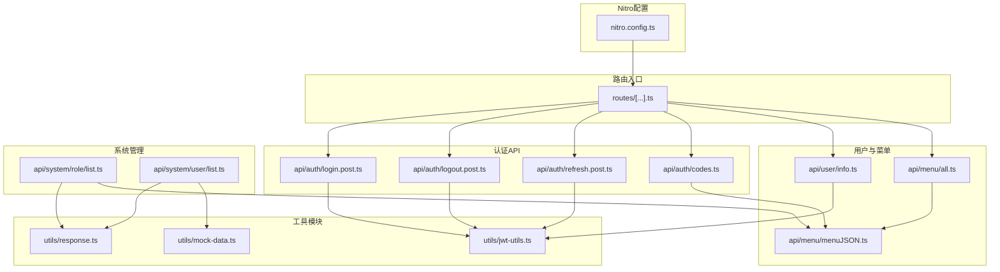
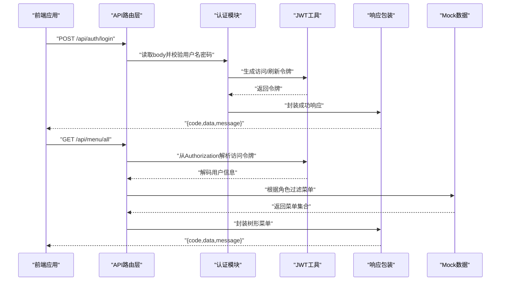
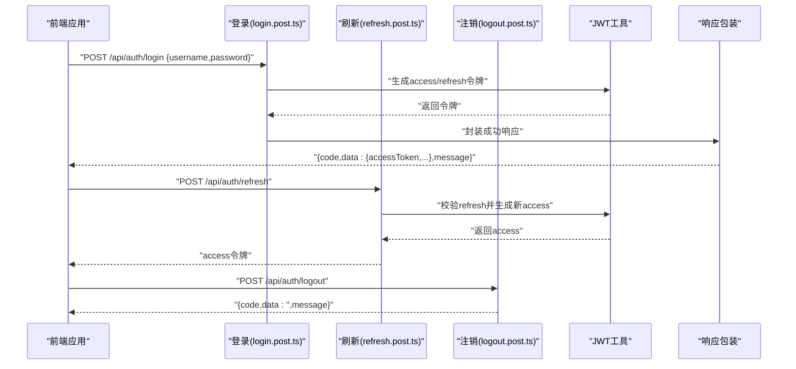
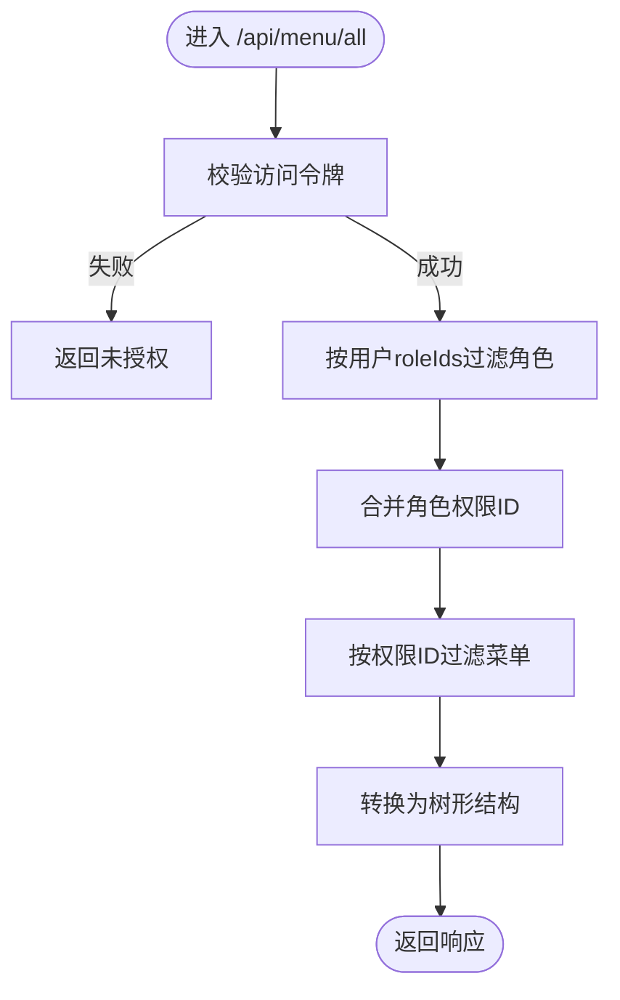
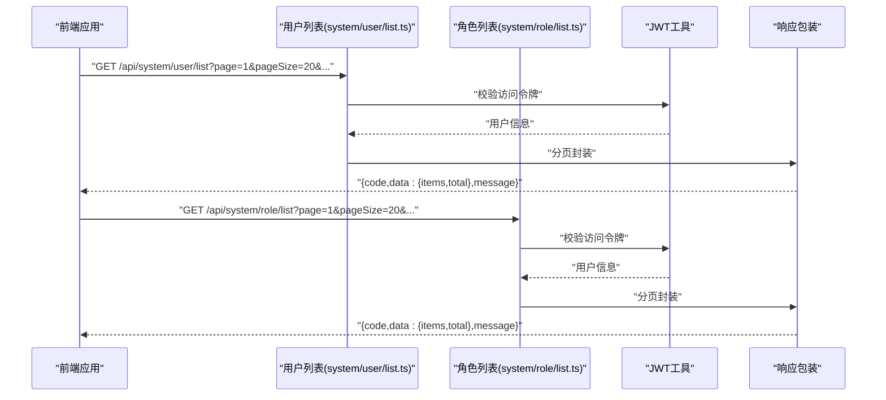
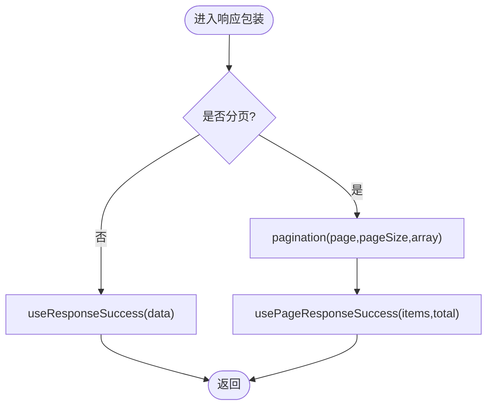
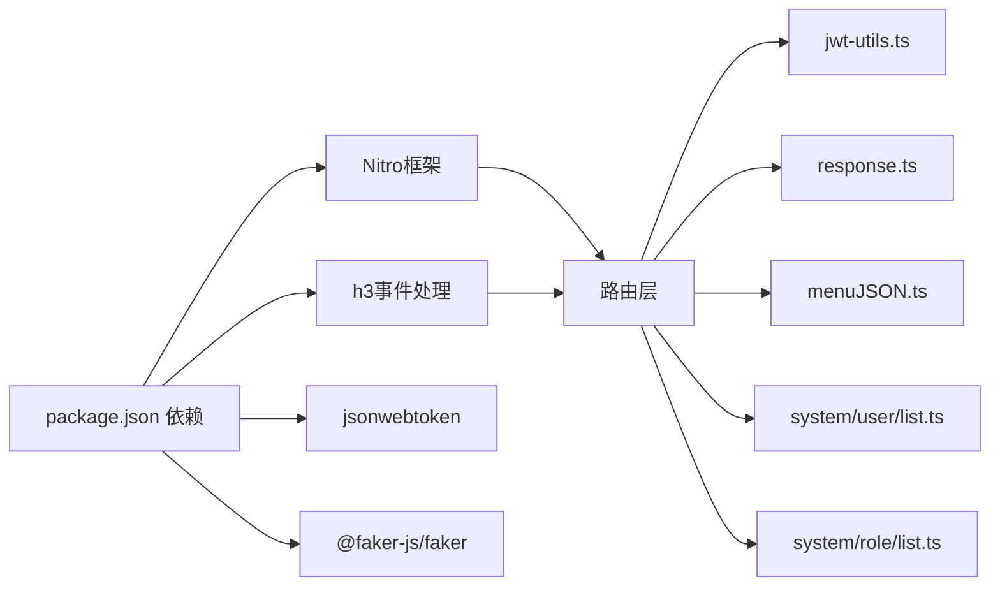

# Mock数据系统

<cite>
**本文引用的文件**
- [nitro.config.ts](file://apps/backend-mock/nitro.config.ts)
- [package.json](file://apps/backend-mock/package.json)
- [routes/[...].ts](file://apps/backend-mock/routes/[...].ts)
- [utils/response.ts](file://apps/backend-mock/utils/response.ts)
- [utils/mock-data.ts](file://apps/backend-mock/utils/mock-data.ts)
- [utils/jwt-utils.ts](file://apps/backend-mock/utils/jwt-utils.ts)
- [api/auth/login.post.ts](file://apps/backend-mock/api/auth/login.post.ts)
- [api/auth/logout.post.ts](file://apps/backend-mock/api/auth/logout.post.ts)
- [api/auth/refresh.post.ts](file://apps/backend-mock/api/auth/refresh.post.ts)
- [api/auth/codes.ts](file://apps/backend-mock/api/auth/codes.ts)
- [api/user/info.ts](file://apps/backend-mock/api/user/info.ts)
- [api/menu/all.ts](file://apps/backend-mock/api/menu/all.ts)
- [api/menu/menuJSON.ts](file://apps/backend-mock/api/menu/menuJSON.ts)
- [api/system/user/list.ts](file://apps/backend-mock/api/system/user/list.ts)
- [api/system/role/list.ts](file://apps/backend-mock/api/system/role/list.ts)
</cite>

## 目录
1. [简介](#简介)
2. [项目结构](#项目结构)
3. [核心组件](#核心组件)
4. [架构总览](#架构总览)
5. [详细组件分析](#详细组件分析)
6. [依赖关系分析](#依赖关系分析)
7. [性能考虑](#性能考虑)
8. [故障排查指南](#故障排查指南)
9. [结论](#结论)
10. [附录](#附录)

## 简介
本文件系统性阐述 Vben Admin 的后端 Mock 数据服务，基于 Nitro 框架构建，提供统一的 API 路由与响应规范。Mock 服务覆盖用户认证、菜单权限、角色与用户列表、上传、时区等常用接口，并通过统一的响应包装器与分页工具实现一致的数据结构与错误处理。文档同时给出部署与集成建议，帮助开发者在前端联调阶段快速获得稳定的数据支持。

## 项目结构
Mock 服务位于 apps/backend-mock 目录，采用 Nitro 的文件系统路由约定，按功能域划分 API 文件，公共工具集中在 utils 目录，Nitro 配置集中于 nitro.config.ts。

图表来源
- [nitro.config.ts:1-21](file://apps/backend-mock/nitro.config.ts#L1-L21)
- [routes/[...].ts:1-16](file://apps/backend-mock/routes/[...].ts#L1-L16)
- [utils/response.ts:1-71](file://apps/backend-mock/utils/response.ts#L1-L71)
- [utils/jwt-utils.ts:1-115](file://apps/backend-mock/utils/jwt-utils.ts#L1-L115)
- [api/auth/login.post.ts:1-43](file://apps/backend-mock/api/auth/login.post.ts#L1-L43)
- [api/auth/logout.post.ts:1-18](file://apps/backend-mock/api/auth/logout.post.ts#L1-L18)
- [api/auth/refresh.post.ts:1-36](file://apps/backend-mock/api/auth/refresh.post.ts#L1-L36)
- [api/auth/codes.ts:1-29](file://apps/backend-mock/api/auth/codes.ts#L1-L29)
- [api/user/info.ts:1-12](file://apps/backend-mock/api/user/info.ts#L1-L12)
- [api/menu/all.ts:1-31](file://apps/backend-mock/api/menu/all.ts#L1-L31)
- [api/menu/menuJSON.ts:1-426](file://apps/backend-mock/api/menu/menuJSON.ts#L1-L426)
- [api/system/role/list.ts:1-118](file://apps/backend-mock/api/system/role/list.ts#L1-L118)
- [api/system/user/list.ts:1-120](file://apps/backend-mock/api/system/user/list.ts#L1-L120)

章节来源
- [nitro.config.ts:1-21](file://apps/backend-mock/nitro.config.ts#L1-L21)
- [routes/[...].ts:1-16](file://apps/backend-mock/routes/[...].ts#L1-L16)
- [package.json:1-22](file://apps/backend-mock/package.json#L1-L22)

## 核心组件
- Nitro 配置与CORS策略：集中于 nitro.config.ts，启用跨域并设置通用请求头，保障前端跨域访问。
- 统一响应包装：utils/response.ts 提供成功/分页/错误响应模板与状态码设置，以及分页工具函数。
- 认证与令牌：utils/jwt-utils.ts 提供生成与校验访问令牌、刷新令牌及版本比较工具；配合 Cookie 工具进行刷新令牌持久化。
- Mock 数据源：utils/mock-data.ts 定义时区选项；api/system/user/list.ts 与 api/system/role/list.ts 提供静态用户与角色数据，用于认证与权限计算。
- 菜单与权限：api/menu/menuJSON.ts 定义完整菜单结构与树形转换逻辑；api/menu/all.ts 与 api/auth/codes.ts 基于角色与菜单计算用户可见菜单与权限码。
- 路由入口：routes/[...].ts 提供根路径的友好引导页面，列出常用 API。

章节来源
- [nitro.config.ts:1-21](file://apps/backend-mock/nitro.config.ts#L1-L21)
- [utils/response.ts:1-71](file://apps/backend-mock/utils/response.ts#L1-L71)
- [utils/jwt-utils.ts:1-115](file://apps/backend-mock/utils/jwt-utils.ts#L1-L115)
- [utils/mock-data.ts:1-31](file://apps/backend-mock/utils/mock-data.ts#L1-L31)
- [api/system/user/list.ts:1-120](file://apps/backend-mock/api/system/user/list.ts#L1-L120)
- [api/system/role/list.ts:1-118](file://apps/backend-mock/api/system/role/list.ts#L1-L118)
- [api/menu/menuJSON.ts:1-426](file://apps/backend-mock/api/menu/menuJSON.ts#L1-L426)
- [routes/[...].ts:1-16](file://apps/backend-mock/routes/[...].ts#L1-L16)

## 架构总览
Mock 服务采用“文件系统路由 + 中间件/拦截”的模式，API 路由直接对应文件路径，统一通过 h3 事件处理器处理请求。认证流程围绕 Bearer Token 与 Cookie 刷新令牌展开，权限数据来源于静态角色与菜单映射。

图表来源
- [api/auth/login.post.ts:1-43](file://apps/backend-mock/api/auth/login.post.ts#L1-L43)
- [api/menu/all.ts:1-31](file://apps/backend-mock/api/menu/all.ts#L1-L31)
- [utils/jwt-utils.ts:1-115](file://apps/backend-mock/utils/jwt-utils.ts#L1-L115)
- [utils/response.ts:1-71](file://apps/backend-mock/utils/response.ts#L1-L71)
- [api/menu/menuJSON.ts:1-426](file://apps/backend-mock/api/menu/menuJSON.ts#L1-L426)

## 详细组件分析

### 认证与会话
- 登录：接收用户名与密码，校验必填；匹配 mock 用户库，生成访问与刷新令牌并通过 Cookie 返回刷新令牌，返回包含访问令牌的用户信息。
- 刷新：从 Cookie 读取刷新令牌，验证后重新签发访问令牌，保持会话连续性。
- 注销：读取并清除刷新令牌 Cookie，返回空字符串表示注销成功。
- 权限码：基于当前用户的角色集合，合并菜单权限ID，再从菜单表过滤出对应的权限码集合。

图表来源
- [api/auth/login.post.ts:1-43](file://apps/backend-mock/api/auth/login.post.ts#L1-L43)
- [api/auth/refresh.post.ts:1-36](file://apps/backend-mock/api/auth/refresh.post.ts#L1-L36)
- [api/auth/logout.post.ts:1-18](file://apps/backend-mock/api/auth/logout.post.ts#L1-L18)
- [utils/jwt-utils.ts:1-115](file://apps/backend-mock/utils/jwt-utils.ts#L1-L115)
- [utils/response.ts:1-71](file://apps/backend-mock/utils/response.ts#L1-L71)

章节来源
- [api/auth/login.post.ts:1-43](file://apps/backend-mock/api/auth/login.post.ts#L1-L43)
- [api/auth/logout.post.ts:1-18](file://apps/backend-mock/api/auth/logout.post.ts#L1-L18)
- [api/auth/refresh.post.ts:1-36](file://apps/backend-mock/api/auth/refresh.post.ts#L1-L36)
- [api/auth/codes.ts:1-29](file://apps/backend-mock/api/auth/codes.ts#L1-L29)
- [utils/jwt-utils.ts:1-115](file://apps/backend-mock/utils/jwt-utils.ts#L1-L115)

### 菜单与权限
- 菜单树：将扁平菜单数组转换为树形结构，支持过滤禁用项与按钮类型控制。
- 用户菜单：根据用户角色集合过滤可访问菜单，支持“被禁用仍显示”标记。
- 权限码：依据角色权限ID集合，从菜单表提取对应权限码并去重。

图表来源
- [api/menu/all.ts:1-31](file://apps/backend-mock/api/menu/all.ts#L1-L31)
- [api/menu/menuJSON.ts:1-426](file://apps/backend-mock/api/menu/menuJSON.ts#L1-L426)
- [api/system/role/list.ts:1-118](file://apps/backend-mock/api/system/role/list.ts#L1-L118)

章节来源
- [api/menu/all.ts:1-31](file://apps/backend-mock/api/menu/all.ts#L1-L31)
- [api/menu/menuJSON.ts:1-426](file://apps/backend-mock/api/menu/menuJSON.ts#L1-L426)
- [api/system/role/list.ts:1-118](file://apps/backend-mock/api/system/role/list.ts#L1-L118)

### 用户与角色列表
- 用户列表：支持分页与多字段筛选（用户名、真实名、状态），返回分页包装后的数据。
- 角色列表：支持分页与多字段筛选（名称、ID、备注、时间范围、状态），返回分页包装后的数据。

图表来源
- [api/system/user/list.ts:1-120](file://apps/backend-mock/api/system/user/list.ts#L1-L120)
- [api/system/role/list.ts:1-118](file://apps/backend-mock/api/system/role/list.ts#L1-L118)
- [utils/response.ts:1-71](file://apps/backend-mock/utils/response.ts#L1-L71)
- [utils/jwt-utils.ts:1-115](file://apps/backend-mock/utils/jwt-utils.ts#L1-L115)

章节来源
- [api/system/user/list.ts:1-120](file://apps/backend-mock/api/system/user/list.ts#L1-L120)
- [api/system/role/list.ts:1-118](file://apps/backend-mock/api/system/role/list.ts#L1-L118)

### 统一响应与分页
- 成功响应：固定 {code,data,error,message} 结构，code=0 表示成功。
- 分页响应：对列表数据进行分页切片，返回 items 与 total。
- 错误响应：统一 {code=-1,data=null,error,message} 结构，结合 setResponseStatus 设置 HTTP 状态码。
- 分页工具：根据页码与每页大小计算偏移并切片。

图表来源
- [utils/response.ts:1-71](file://apps/backend-mock/utils/response.ts#L1-L71)

章节来源
- [utils/response.ts:1-71](file://apps/backend-mock/utils/response.ts#L1-L71)

### 时区与辅助数据
- 时区选项：提供多时区偏移与标识，用于前端时区选择与展示。
- Mock 数据：用户与角色等静态数据，配合 Faker 生成随机属性，便于演示与测试。

章节来源
- [utils/mock-data.ts:1-31](file://apps/backend-mock/utils/mock-data.ts#L1-L31)
- [api/system/user/list.ts:1-120](file://apps/backend-mock/api/system/user/list.ts#L1-L120)
- [api/system/role/list.ts:1-118](file://apps/backend-mock/api/system/role/list.ts#L1-L118)

## 依赖关系分析
- 外部依赖：Nitro 框架、h3 事件处理、jsonwebtoken 令牌、@faker-js/faker 数据生成。
- 内部耦合：API 层依赖 JWT 工具与响应包装；菜单与权限计算依赖角色与菜单数据；用户列表依赖部门数据与分页工具。
- CORS 与错误处理：Nitro 配置集中处理跨域与错误页，路由层无需重复配置。

图表来源
- [package.json:1-22](file://apps/backend-mock/package.json#L1-L22)
- [nitro.config.ts:1-21](file://apps/backend-mock/nitro.config.ts#L1-L21)

章节来源
- [package.json:1-22](file://apps/backend-mock/package.json#L1-L22)
- [nitro.config.ts:1-21](file://apps/backend-mock/nitro.config.ts#L1-L21)

## 性能考虑
- 内存数据：Mock 数据驻留内存，查询与过滤为数组操作，适合小中型数据规模。
- 分页策略：优先使用分页响应，避免一次性返回大量数据。
- 令牌开销：JWT 解析与校验为轻量操作，建议在高并发场景下注意令牌签名算法与密钥强度。
- CORS 与中间件：Nitro 配置集中处理跨域，减少路由层重复逻辑。

## 故障排查指南
- 未授权访问
  - 现象：返回未授权错误或空用户信息。
  - 排查：确认 Authorization 头是否为 Bearer 令牌；检查令牌是否过期；核对用户是否存在。
- 登录失败
  - 现象：用户名或密码错误提示。
  - 排查：确认请求体包含 username 与 password；核对 mock 用户库中的凭据。
- 刷新令牌异常
  - 现象：刷新失败或未设置 Cookie。
  - 排查：确认客户端已携带刷新 Cookie；核对刷新令牌有效性与用户存在性。
- 菜单为空或不正确
  - 现象：菜单树为空或缺少按钮。
  - 排查：确认用户角色权限ID集合；检查菜单过滤逻辑与按钮类型开关。
- 响应结构异常
  - 现象：返回字段缺失或格式不符。
  - 排查：确认使用了统一响应包装；检查分页参数与列表数据。

章节来源
- [utils/response.ts:1-71](file://apps/backend-mock/utils/response.ts#L1-L71)
- [utils/jwt-utils.ts:1-115](file://apps/backend-mock/utils/jwt-utils.ts#L1-L115)
- [api/auth/login.post.ts:1-43](file://apps/backend-mock/api/auth/login.post.ts#L1-L43)
- [api/auth/refresh.post.ts:1-36](file://apps/backend-mock/api/auth/refresh.post.ts#L1-L36)
- [api/menu/all.ts:1-31](file://apps/backend-mock/api/menu/all.ts#L1-L31)

## 结论
该 Mock 数据系统以 Nitro 为核心，通过文件系统路由与统一响应包装，实现了认证、菜单权限、用户与角色列表等关键业务的快速 Mock。配合静态数据与分页工具，满足前端联调与演示场景。建议在生产环境中替换为真实后端服务，并在 Mock 环境中完善错误边界与日志记录。

## 附录

### API 端点一览（Mock）
- 认证
  - POST /api/auth/login：登录获取访问与刷新令牌
  - POST /api/auth/logout：注销并清除刷新令牌
  - POST /api/auth/refresh：刷新访问令牌
  - GET /api/auth/codes：获取当前用户权限码
- 用户与菜单
  - GET /api/user/info：获取当前用户信息
  - GET /api/menu/all：获取用户可见菜单树
- 系统管理
  - GET /api/system/user/list：用户列表（分页+筛选）
  - GET /api/system/role/list：角色列表（分页+筛选）

章节来源
- [api/auth/login.post.ts:1-43](file://apps/backend-mock/api/auth/login.post.ts#L1-L43)
- [api/auth/logout.post.ts:1-18](file://apps/backend-mock/api/auth/logout.post.ts#L1-L18)
- [api/auth/refresh.post.ts:1-36](file://apps/backend-mock/api/auth/refresh.post.ts#L1-L36)
- [api/auth/codes.ts:1-29](file://apps/backend-mock/api/auth/codes.ts#L1-L29)
- [api/user/info.ts:1-12](file://apps/backend-mock/api/user/info.ts#L1-L12)
- [api/menu/all.ts:1-31](file://apps/backend-mock/api/menu/all.ts#L1-L31)
- [api/system/user/list.ts:1-120](file://apps/backend-mock/api/system/user/list.ts#L1-L120)
- [api/system/role/list.ts:1-118](file://apps/backend-mock/api/system/role/list.ts#L1-L118)

### 部署与集成
- 启动与构建
  - 开发：执行启动脚本进入 Nitro 开发服务器
  - 构建：打包为 Nitro 可运行产物
- 集成
  - 前端通过代理指向 /api/**，Nitro 配置已开启 CORS
  - 前端在登录后携带 Bearer 令牌访问受保护接口
  - 前端在需要时携带刷新 Cookie 以续期会话

章节来源
- [package.json:1-22](file://apps/backend-mock/package.json#L1-L22)
- [nitro.config.ts:1-21](file://apps/backend-mock/nitro.config.ts#L1-L21)
- [routes/[...].ts:1-16](file://apps/backend-mock/routes/[...].ts#L1-L16)