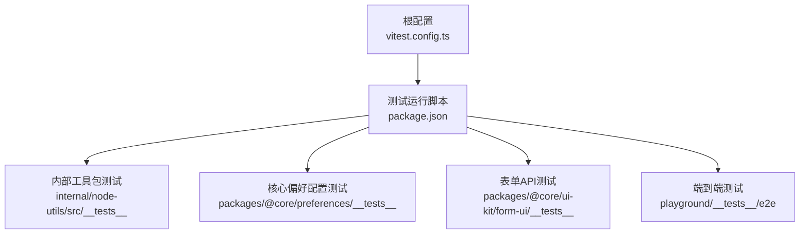
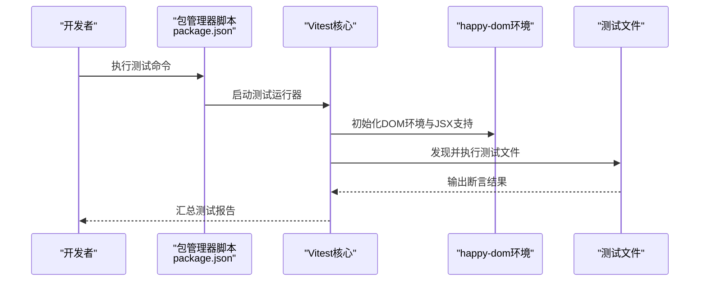
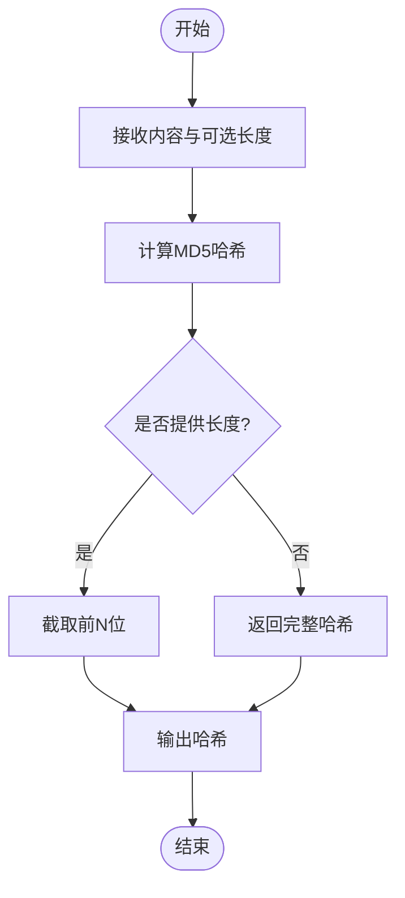
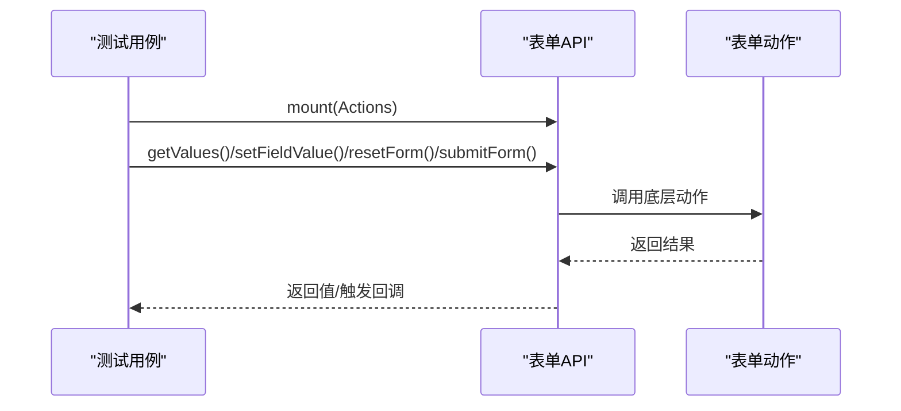
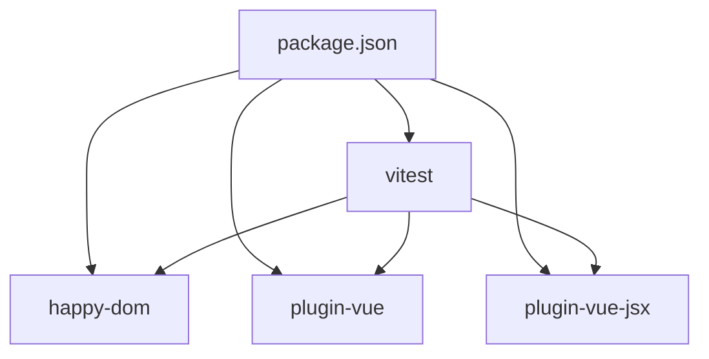

# 单元测试

<cite>
**本文引用的文件**
- [vitest.config.ts](file://vitest.config.ts)
- [package.json](file://package.json)
- [hash.test.ts](file://internal/node-utils/src/__tests__/hash.test.ts)
- [hash.ts](file://internal/node-utils/src/hash.ts)
- [config.test.ts](file://packages/@core/preferences/__tests__/config.test.ts)
- [config.ts](file://packages/@core/preferences/src/config.ts)
- [form-api.test.ts](file://packages/@core/ui-kit/form-ui/__tests__/form-api.test.ts)
- [auth-login.spec.ts](file://playground/__tests__/e2e/auth-login.spec.ts)
</cite>

## 目录

1. [简介](#简介)
2. [项目结构](#项目结构)
3. [核心组件](#核心组件)
4. [架构总览](#架构总览)
5. [详细组件分析](#详细组件分析)
6. [依赖分析](#依赖分析)
7. [性能考虑](#性能考虑)
8. [故障排查指南](#故障排查指南)
9. [结论](#结论)
10. [附录](#附录)

## 简介

本指南面向Vben Admin的单元测试与测试相关实践，重点覆盖以下方面：

- Vitest测试框架的配置与使用，包括happy-dom环境与JSX支持
- Vue组件与普通函数的单元测试方法（渲染、事件、props）
- 测试文件组织结构与命名规范
- 断言与匹配器的使用
- 实际测试用例示例：登录认证与偏好配置等核心功能
- 测试覆盖率配置与报告生成
- 异步操作测试的最佳实践

## 项目结构

在该仓库中，测试相关的关键位置如下：

- 单元测试配置：根目录的 Vitest 配置文件
- 单元测试脚本：根目录 package.json 中的测试命令
- 具体测试用例：
  - 内部工具包的单元测试位于 internal/\* 下的 **tests** 目录
  - 核心UI能力的单元测试位于 packages/\* 下的 **tests** 目录
- 端到端测试：playground/**tests**/e2e 下的 spec 文件

图表来源

- [vitest.config.ts:1-29](file://vitest.config.ts#L1-L29)
- [package.json:61-62](file://package.json#L61-L62)

章节来源

- [vitest.config.ts:1-29](file://vitest.config.ts#L1-L29)
- [package.json:61-62](file://package.json#L61-L62)

## 核心组件

- Vitest配置与环境
  - 使用 happy-dom 作为浏览器模拟环境，并开启 JSX 支持
  - 排除 e2e、构建产物、临时目录等路径，避免误执行
- 测试脚本
  - 提供统一的单元测试运行命令，便于在CI或本地执行
- 测试用例示例
  - 工具函数测试：内容哈希生成与长度截取
  - 配置对象快照测试：保证默认配置不可变性
  - 表单API测试：对表单动作进行挂载与断言
  - 端到端测试：Playwright场景用于真实浏览器行为验证

章节来源

- [vitest.config.ts:1-29](file://vitest.config.ts#L1-L29)
- [package.json:61-62](file://package.json#L61-L62)
- [hash.test.ts:1-53](file://internal/node-utils/src/__tests__/hash.test.ts#L1-L53)
- [config.test.ts:1-11](file://packages/@core/preferences/__tests__/config.test.ts#L1-L11)
- [form-api.test.ts:55-109](file://packages/@core/ui-kit/form-ui/__tests__/form-api.test.ts#L55-L109)
- [auth-login.spec.ts:1-21](file://playground/__tests__/e2e/auth-login.spec.ts#L1-L21)

## 架构总览

下图展示了从命令行到具体测试执行的整体流程，以及不同测试类型之间的关系。

图表来源

- [package.json:61-62](file://package.json#L61-L62)
- [vitest.config.ts:1-29](file://vitest.config.ts#L1-L29)

## 详细组件分析

### Vitest配置与环境设置

- 插件启用
  - Vue 插件：支持 .vue 单文件组件的编译与热更新
  - VueJsx 插件：启用 JSX/TSX 支持
- 运行环境
  - environment: happy-dom
  - environmentOptions.happyDOM.settings.handleDisabledFileLoadingAsSuccess: true（兼容安全策略变更）
- 排除规则
  - 自动排除 e2e、dist、node_modules、IDE缓存、构建输出、部分配置文件等

章节来源

- [vitest.config.ts:1-29](file://vitest.config.ts#L1-L29)

### 测试脚本与运行方式

- 命令
  - 单元测试：通过 package.json 的 test:unit 脚本调用 Vitest 运行
- 运行参数
  - --dom：与 Vitest 配置中的 happy-dom 环境相呼应

章节来源

- [package.json:61-62](file://package.json#L61-L62)

### 工具函数单元测试（内容哈希）

- 目标函数
  - generatorContentHash：根据输入内容生成MD5哈希，支持指定长度截取
- 测试要点
  - 正常内容生成完整哈希
  - 指定长度时返回对应长度的前缀
  - 不传长度时返回完整哈希
  - 对空字符串的处理
- 断言与匹配器
  - 使用 toBe、toHaveLength、toMatchSnapshot 等匹配器进行断言

图表来源

- [hash.ts:8-16](file://internal/node-utils/src/hash.ts#L8-L16)

章节来源

- [hash.test.ts:1-53](file://internal/node-utils/src/__tests__/hash.test.ts#L1-L53)
- [hash.ts:1-19](file://internal/node-utils/src/hash.ts#L1-L19)

### 配置对象快照测试（默认偏好配置）

- 目标对象
  - defaultPreferences：核心偏好配置的默认值
- 测试要点
  - 通过快照测试确保默认配置对象不被意外修改
- 断言与匹配器
  - 使用 toMatchSnapshot 对默认配置进行快照比对

章节来源

- [config.test.ts:1-11](file://packages/@core/preferences/__tests__/config.test.ts#L1-L11)
- [config.ts:1-148](file://packages/@core/preferences/src/config.ts#L1-L148)

### 表单API单元测试（挂载与交互）

- 测试目标
  - 对表单API进行挂载，断言其读取/设置字段值、重置表单、提交表单等行为
- 关键断言
  - getValues 返回期望值
  - setFieldValue 调用底层动作并传入正确参数
  - resetForm 调用底层动作
  - submitForm 触发状态回调并返回当前值
- 异步与副作用
  - 使用 mount 完成挂载后执行后续操作
  - 通过 vi.fn/mockResolvedValue 控制动作行为

图表来源

- [form-api.test.ts:55-109](file://packages/@core/ui-kit/form-ui/__tests__/form-api.test.ts#L55-L109)

章节来源

- [form-api.test.ts:55-109](file://packages/@core/ui-kit/form-ui/__tests__/form-api.test.ts#L55-L109)

### 登录认证端到端测试（Playwright）

- 测试目标
  - 验证登录页标题与页面元素存在性
  - 使用通用登录辅助方法完成有效凭据登录
- 关键步骤
  - beforeEach 导航至首页
  - 断言页面标题包含“Vben Admin”
  - 调用 authLogin 完成登录流程

章节来源

- [auth-login.spec.ts:1-21](file://playground/__tests__/e2e/auth-login.spec.ts#L1-L21)

## 依赖分析

- 测试运行依赖
  - Vitest：测试运行器与断言库
  - happy-dom：DOM环境模拟
  - @vitejs/plugin-vue / @vitejs/plugin-vue-jsx：Vue与JSX支持
- 测试脚本依赖
  - package.json 中的 test:unit 脚本统一调度 Vitest

图表来源

- [package.json:61-62](file://package.json#L61-L62)
- [vitest.config.ts:1-29](file://vitest.config.ts#L1-L29)

章节来源

- [package.json:61-62](file://package.json#L61-L62)
- [vitest.config.ts:1-29](file://vitest.config.ts#L1-L29)

## 性能考虑

- 快照测试
  - 对大型配置对象使用快照测试，减少重复断言逻辑，提升维护效率
- 挂载与清理
  - 在表单API测试中，先 mount 再执行动作，最后清理副作用，避免跨用例污染
- 环境配置
  - happy-dom 默认禁用脚本加载的行为可通过配置项调整，以适配现有测试行为

## 故障排查指南

- 测试无法启动或找不到测试文件
  - 检查 Vitest 配置中的 exclude 是否排除了目标目录
  - 确认测试文件命名符合约定（例如以 .test.ts 结尾）
- DOM相关错误
  - 确保使用 happy-dom 环境；如需JSX，请确认已启用 @vitejs/plugin-vue-jsx
- 断言失败
  - 对于复杂对象，优先使用快照断言 toMatchSnapshot 并配合更新快照
  - 对于数值或字符串，使用 toBe、toHaveLength 等精确匹配器
- 异步测试
  - 对需要等待的操作使用 await；对 Promise 返回值使用 expect(...).resolves 或 rejects
- 端到端测试
  - Playwright 场景应独立于单元测试，避免与 happy-dom 环境冲突

## 结论

本指南系统梳理了Vben Admin的测试体系：从Vitest配置、环境设置、测试脚本，到具体用例设计与断言实践，并结合工具函数、配置对象与表单API的实际案例，给出了可复用的测试模式。建议在新增功能时遵循相同的组织结构与断言风格，以保持测试的一致性与可维护性。

## 附录

### 测试文件组织结构与命名规范

- 组织结构
  - 内部工具包测试：internal/<pkg>/src/**tests**/
  - 核心能力测试：packages/@core/<pkg>/**tests**/
  - 端到端测试：playground/**tests**/e2e/
- 命名规范
  - 测试文件以 .test.ts 结尾
  - 用例描述清晰表达意图（如“should generate...”、“should reset...”）

### 断言与匹配器使用要点

- 基础匹配器
  - toBe：严格相等
  - toEqual：深度相等
  - toHaveLength：集合长度
  - toContain：包含子串
  - toMatchSnapshot：快照比对
- 异步匹配器
  - expect(...).resolves / expect(...).rejects：Promise断言
- Mock与回调
  - 使用 vi.fn() 捕获调用与参数
  - 使用 mockResolvedValue / mockRejectedValue 控制异步返回

### 实际测试用例示例（路径指引）

- 工具函数哈希测试
  - [hash.test.ts:1-53](file://internal/node-utils/src/__tests__/hash.test.ts#L1-L53)
  - [hash.ts:1-19](file://internal/node-utils/src/hash.ts#L1-L19)
- 配置对象快照测试
  - [config.test.ts:1-11](file://packages/@core/preferences/__tests__/config.test.ts#L1-L11)
  - [config.ts:1-148](file://packages/@core/preferences/src/config.ts#L1-L148)
- 表单API挂载与交互测试
  - [form-api.test.ts:55-109](file://packages/@core/ui-kit/form-ui/__tests__/form-api.test.ts#L55-L109)
- 登录认证端到端测试
  - [auth-login.spec.ts:1-21](file://playground/__tests__/e2e/auth-login.spec.ts#L1-L21)

### 测试覆盖率配置与报告生成

- 当前仓库未提供覆盖率配置文件
- 建议在根目录添加覆盖率配置（如 vitest.config.ts 中的 coverage 字段），并结合 CI 生成报告
- 可参考 Vitest 官方文档进行扩展
