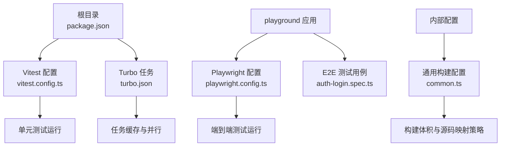
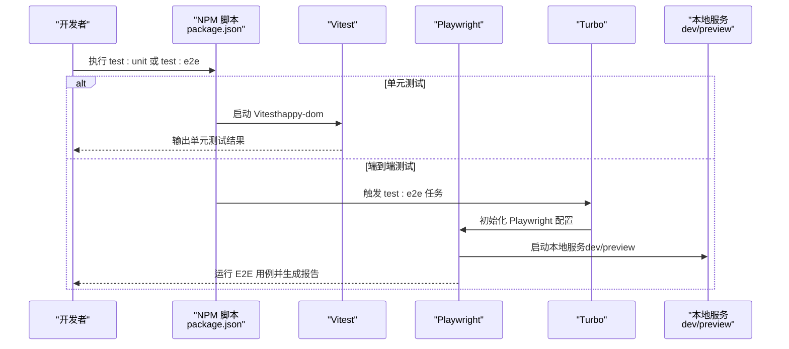
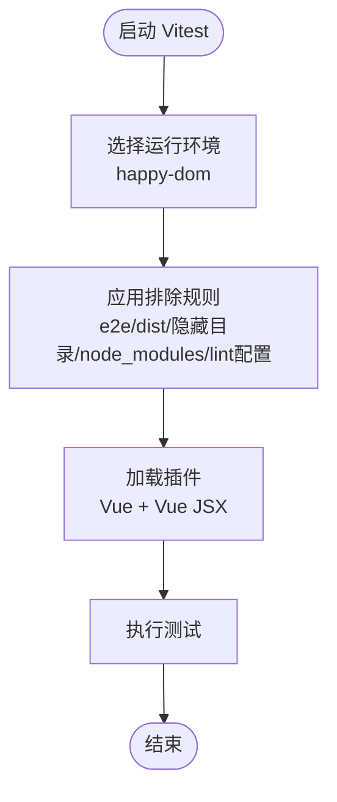
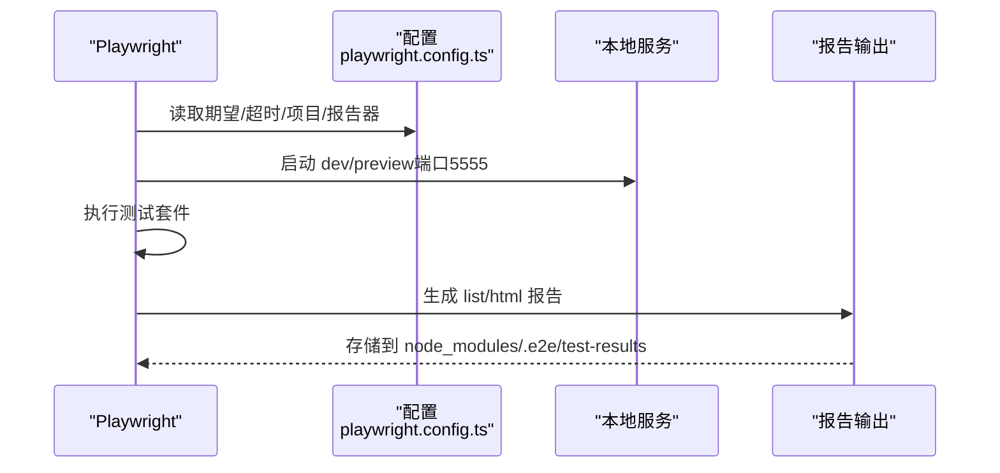
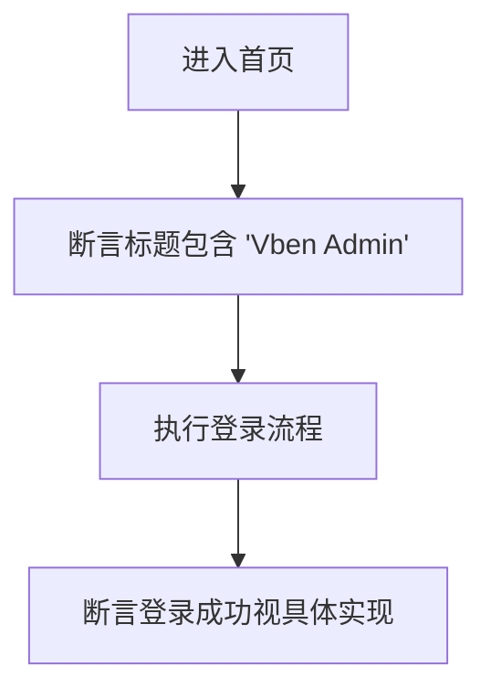
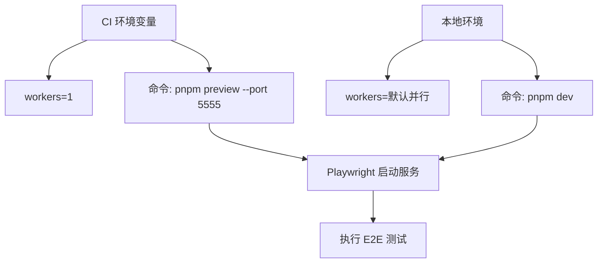
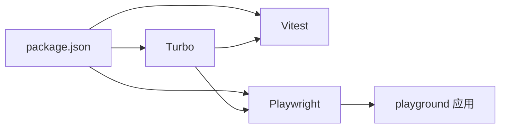

# 测试环境配置

<cite>
**本文引用的文件**
- [vitest.config.ts](file://vitest.config.ts)
- [playwright.config.ts](file://playground/playwright.config.ts)
- [package.json](file://package.json)
- [turbo.json](file://turbo.json)
- [auth-login.spec.ts](file://playground/__tests__/e2e/auth-login.spec.ts)
- [common.ts](file://internal/vite-config/src/config/common.ts)
</cite>

## 目录

1. [简介](#简介)
2. [项目结构](#项目结构)
3. [核心组件](#核心组件)
4. [架构总览](#架构总览)
5. [详细组件分析](#详细组件分析)
6. [依赖分析](#依赖分析)
7. [性能考虑](#性能考虑)
8. [故障排除指南](#故障排除指南)
9. [结论](#结论)
10. [附录](#附录)

## 简介

本指南面向Vben Admin开发与测试团队，系统性阐述测试环境的配置与实践，覆盖以下主题：

- Vitest单元测试与Happy DOM运行时配置
- Playwright端到端测试的环境变量、浏览器项目、服务启动与并行策略
- 测试数据库隔离与清理（基于Nitro Mock后端）
- CI/CD流水线中测试任务的触发与并行控制
- 测试覆盖率收集与报告生成（含覆盖率阈值建议）
- 测试环境搭建步骤、执行顺序与并行处理
- 常见问题排查与性能优化建议

## 项目结构

测试相关的关键位置与职责如下：

- 单元测试：Vitest配置位于仓库根目录，使用Happy DOM作为DOM环境，排除e2e与构建产物目录
- 端到端测试：Playwright配置位于playground应用，定义浏览器项目、测试目录、本地服务启动命令与报告输出
- 脚本与任务编排：根package.json提供test:unit与test:e2e脚本；turbo.json定义全局依赖与任务缓存策略
- 构建与通用配置：内部vite-config提供通用构建参数，便于统一打包与体积警告阈值

图表来源

- [package.json:27-66](file://package.json#L27-L66)
- [vitest.config.ts:5-28](file://vitest.config.ts#L5-L28)
- [turbo.json:15-48](file://turbo.json#L15-L48)
- [playwright.config.ts:14-109](file://playground/playwright.config.ts#L14-L109)
- [auth-login.spec.ts:1-21](file://playground/__tests__/e2e/auth-login.spec.ts#L1-L21)
- [common.ts:3-11](file://internal/vite-config/src/config/common.ts#L3-L11)

章节来源

- [package.json:27-66](file://package.json#L27-L66)
- [vitest.config.ts:5-28](file://vitest.config.ts#L5-L28)
- [turbo.json:15-48](file://turbo.json#L15-L48)
- [playwright.config.ts:14-109](file://playground/playwright.config.ts#L14-L109)
- [auth-login.spec.ts:1-21](file://playground/__tests__/e2e/auth-login.spec.ts#L1-L21)
- [common.ts:3-11](file://internal/vite-config/src/config/common.ts#L3-L11)

## 核心组件

- Vitest单元测试
  - 运行环境：happy-dom
  - 排除规则：显式排除e2e、dist、隐藏目录与配置文件
  - 插件：Vue与Vue JSX插件
- Playwright端到端测试
  - 期望超时：5秒
  - 忽略仅测试：CI环境强制禁用test.only
  - 输出目录：node_modules/.e2e/test-results
  - 浏览器项目：chromium（可扩展至其他设备/浏览器通道）
  - 报告器：list与html
  - 重试策略：CI环境重试2次，本地0次
  - 超时：单个测试30秒
  - 使用设置：无动作超时限制、baseURL为本地开发服务器、CI下headless、失败保留trace
  - 本地服务：dev或preview（CI）端口5555，复用现有服务
  - 并行：CI串行（1 worker），本地按默认
- 脚本与任务
  - test:unit：调用vitest run --dom
  - test:e2e：通过turbo执行
  - turbo.json：定义全局依赖、任务缓存与持久化
- 内部构建配置
  - 通用构建参数：chunkSizeWarningLimit、压缩包大小报告、sourcemap开关

章节来源

- [vitest.config.ts:5-28](file://vitest.config.ts#L5-L28)
- [playwright.config.ts:14-109](file://playground/playwright.config.ts#L14-L109)
- [package.json:27-66](file://package.json#L27-L66)
- [turbo.json:15-48](file://turbo.json#L15-L48)
- [common.ts:3-11](file://internal/vite-config/src/config/common.ts#L3-L11)

## 架构总览

下图展示测试体系在本地与CI中的整体交互流程。

图表来源

- [package.json:27-66](file://package.json#L27-L66)
- [vitest.config.ts:5-28](file://vitest.config.ts#L5-L28)
- [playwright.config.ts:98-105](file://playground/playwright.config.ts#L98-L105)
- [turbo.json:37](file://turbo.json#L37)

## 详细组件分析

### Vitest 单元测试配置

- 运行环境与脚本加载行为
  - 使用happy-dom作为DOM环境，对被禁用脚本加载的行为进行兼容处理，确保测试稳定性
- 排除策略
  - 显式排除e2e、dist、隐藏目录、node_modules以及lint配置文件，避免误测与噪音
- 插件支持
  - 同时启用Vue与Vue JSX插件，满足组件与JSX场景的测试需求

图表来源

- [vitest.config.ts:5-28](file://vitest.config.ts#L5-L28)

章节来源

- [vitest.config.ts:5-28](file://vitest.config.ts#L5-L28)

### Playwright 端到端测试配置

- 期望与超时
  - expect超时5秒，单个测试超时30秒，平衡稳定性与效率
- CI行为
  - CI环境禁用only测试，失败保留trace，重试2次
- 浏览器项目
  - 默认启用chromium，注释部分展示了可扩展的Firefox、Safari、Edge与移动端设备
- 报告与输出
  - list与html报告器，输出到node_modules/.e2e/test-results
- 本地服务
  - dev用于本地调试，preview用于CI预览模式；端口固定为5555，支持复用现有服务
- 并行策略
  - CI串行（1 worker），本地默认并行

图表来源

- [playwright.config.ts:14-109](file://playground/playwright.config.ts#L14-L109)

章节来源

- [playwright.config.ts:14-109](file://playground/playwright.config.ts#L14-L109)

### E2E 示例用例

- 页面导航与断言
  - 访问首页并断言标题包含“Vben Admin”
- 登录流程
  - 调用公共认证函数完成登录流程，验证用户态切换

图表来源

- [auth-login.spec.ts:5-20](file://playground/__tests__/e2e/auth-login.spec.ts#L5-L20)

章节来源

- [auth-login.spec.ts:1-21](file://playground/__tests__/e2e/auth-login.spec.ts#L1-L21)

### 测试数据库隔离与清理

- 隔离策略
  - 使用Nitro Mock后端作为测试数据源，避免与生产数据库耦合
  - 通过独立的Nitro配置与路由组织，确保测试请求不污染真实数据
- 清理建议
  - 在测试前后通过Mock API或中间件重置状态
  - 对于需要持久化数据的场景，可在测试结束后调用清理接口或重置Mock数据集
- 数据一致性
  - 将测试数据封装在Mock层，避免跨用例共享状态导致的竞态

章节来源

- [playwright.config.ts:98-105](file://playground/playwright.config.ts#L98-L105)

### CI/CD 流水线中的测试集成

- 触发方式
  - 通过NPM脚本调用turbo执行test:e2e任务
- 并行与串行
  - CI环境设置workers为1，保证稳定性
  - 本地开发默认并行，提升反馈速度
- 本地服务复用
  - CI使用preview，本地使用dev；通过reuseExistingServer避免重复启动

图表来源

- [playwright.config.ts:98-105](file://playground/playwright.config.ts#L98-L105)
- [package.json:62](file://package.json#L62)

章节来源

- [package.json:62](file://package.json#L62)
- [turbo.json:37](file://turbo.json#L37)
- [playwright.config.ts:98-105](file://playground/playwright.config.ts#L98-L105)

### 测试覆盖率收集与报告生成

- 收集方式
  - 在Vitest配置中启用覆盖率收集（如需），并指定报告格式（如html、lcov等）
- 报告生成
  - 结合CI工具生成覆盖率报告，并上传至覆盖率平台
- 阈值设置建议
  - 行覆盖率：≥80%
  - 分支覆盖率：≥70%
  - 指令覆盖率：≥80%
  - 实体覆盖率：≥75%
  - 注：以上阈值为通用建议，可根据业务复杂度调整

章节来源

- [vitest.config.ts:5-28](file://vitest.config.ts#L5-L28)

### 测试环境搭建步骤

- 安装依赖
  - 使用pnpm安装工作区依赖
- 启动本地服务
  - 开发阶段使用dev；CI阶段使用preview
- 运行测试
  - 单元测试：执行test:unit
  - 端到端测试：执行test:e2e
- 验证报告
  - 查看node_modules/.e2e/test-results中的报告文件

章节来源

- [package.json:27-66](file://package.json#L27-L66)
- [playwright.config.ts:98-105](file://playground/playwright.config.ts#L98-L105)

### 不同测试类型的执行顺序与并行处理

- 执行顺序
  - 先运行单元测试，再运行端到端测试
  - 端到端测试内部按项目（浏览器）分组执行
- 并行策略
  - 单元测试：默认并行，可通过Vitest配置调整
  - 端到端测试：CI串行，本地默认并行
- 任务缓存
  - turbo.json定义了全局依赖与任务缓存策略，减少重复执行时间

章节来源

- [package.json:61-62](file://package.json#L61-L62)
- [turbo.json:14-14](file://turbo.json#L14-L14)
- [turbo.json:37](file://turbo.json#L37)

## 依赖分析

- 组件耦合
  - package.json脚本驱动Vitest与Playwright
  - turbo.json为任务编排提供缓存与依赖管理
  - playwright.config.ts与playground应用强耦合，负责本地服务与浏览器配置
- 外部依赖
  - Vitest与happy-dom用于单元测试
  - Playwright用于端到端测试
  - Turbo用于任务并行与缓存

图表来源

- [package.json:27-66](file://package.json#L27-L66)
- [turbo.json:15-48](file://turbo.json#L15-L48)
- [playwright.config.ts:14-109](file://playground/playwright.config.ts#L14-L109)

章节来源

- [package.json:27-66](file://package.json#L27-L66)
- [turbo.json:15-48](file://turbo.json#L15-L48)
- [playwright.config.ts:14-109](file://playground/playwright.config.ts#L14-L109)

## 性能考虑

- 构建体积与警告阈值
  - 通过通用构建配置提高chunkSizeWarningLimit，降低体积警告干扰
- 源码映射与压缩包报告
  - 关闭sourcemap与压缩包报告，减少构建开销
- 测试并行与串行
  - 本地默认并行，CI串行，平衡速度与稳定性
- 本地服务复用
  - 复用现有服务避免重复启动成本

章节来源

- [common.ts:3-11](file://internal/vite-config/src/config/common.ts#L3-L11)
- [playwright.config.ts:104-105](file://playground/playwright.config.ts#L104-L105)

## 故障排除指南

- 单元测试无法识别DOM
  - 确认已使用happy-dom环境与相关设置
- 端到端测试超时
  - 检查expect超时与单个测试超时配置，适当放宽或定位慢操作
- CI中测试不稳定
  - 使用重试机制与trace保留，结合报告定位问题
- 本地服务冲突
  - 确认端口5555未被占用，或关闭reuseExistingServer以强制重启
- 测试报告缺失
  - 检查报告器配置与输出目录权限

章节来源

- [vitest.config.ts:5-28](file://vitest.config.ts#L5-L28)
- [playwright.config.ts:15-21](file://playground/playwright.config.ts#L15-L21)
- [playwright.config.ts:80-84](file://playground/playwright.config.ts#L80-L84)
- [playwright.config.ts:98-105](file://playground/playwright.config.ts#L98-L105)
- [playwright.config.ts:76-79](file://playground/playwright.config.ts#L76-L79)

## 结论

本指南提供了Vben Admin测试环境从配置到执行的全链路实践，涵盖单元测试、端到端测试、数据库隔离、CI集成与覆盖率管理。通过合理设置环境变量、并行策略与报告输出，可在保证质量的同时提升开发效率与CI稳定性。

## 附录

- 关键配置路径参考
  - Vitest：[vitest.config.ts:5-28](file://vitest.config.ts#L5-L28)
  - Playwright：[playwright.config.ts:14-109](file://playground/playwright.config.ts#L14-L109)
  - 脚本与任务：[package.json:27-66](file://package.json#L27-L66)，[turbo.json:15-48](file://turbo.json#L15-L48)
  - 示例用例：[auth-login.spec.ts:1-21](file://playground/__tests__/e2e/auth-login.spec.ts#L1-L21)
  - 构建配置：[common.ts:3-11](file://internal/vite-config/src/config/common.ts#L3-L11)
