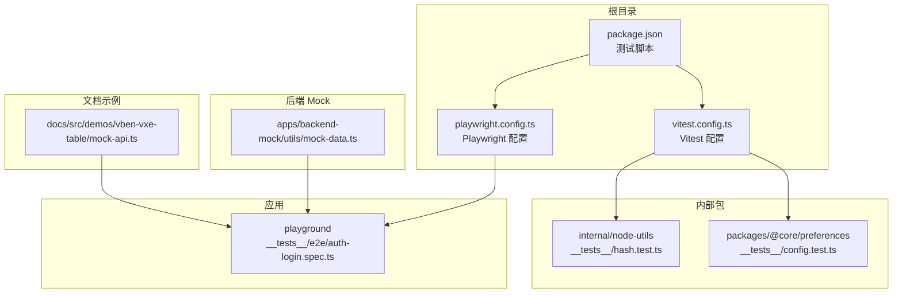
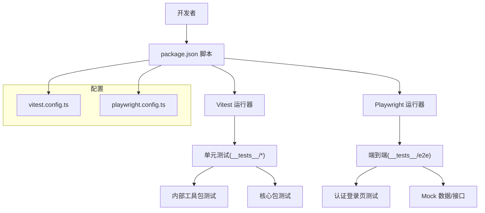
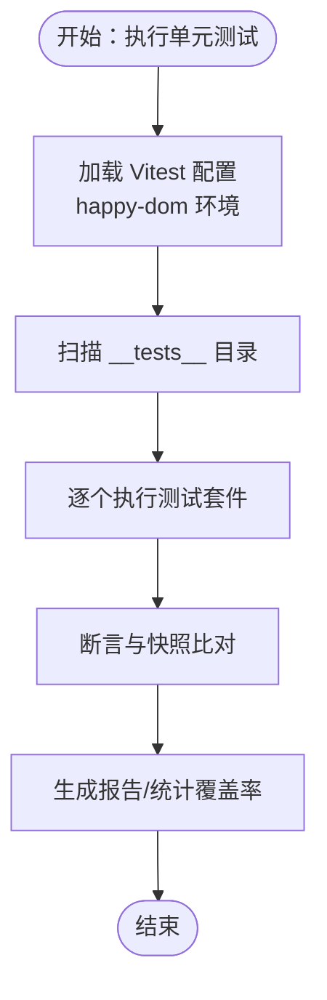
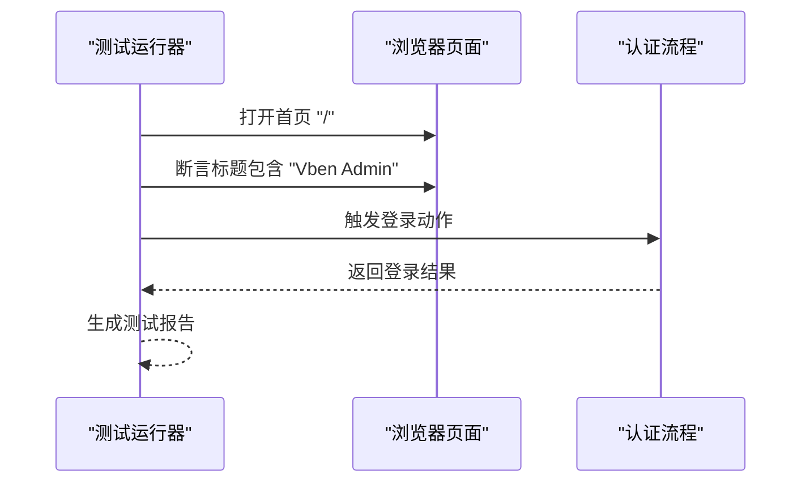
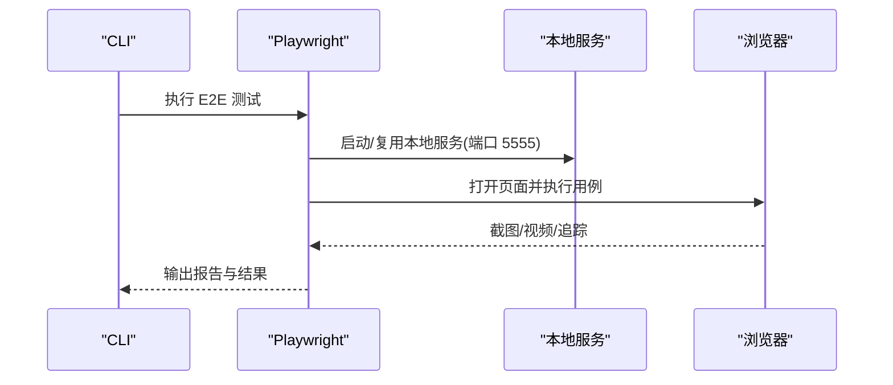
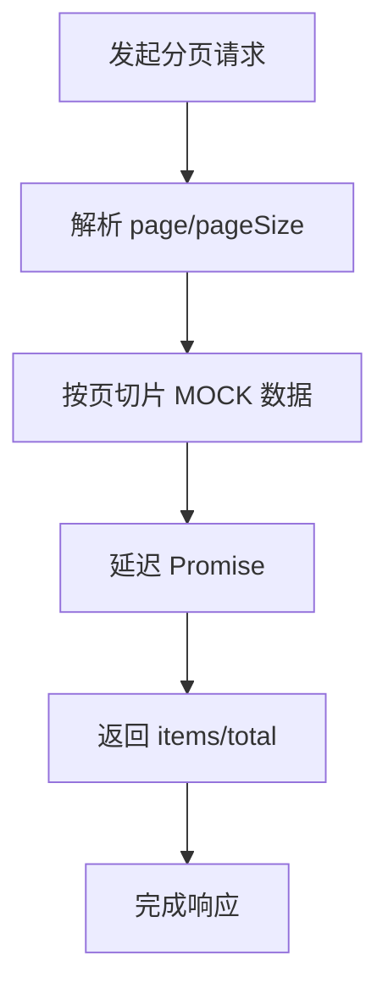
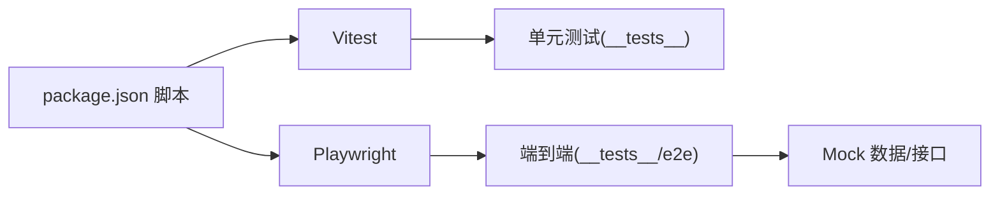

# 测试策略

<cite>
**本文引用的文件**
- [vitest.config.ts](file://vitest.config.ts)
- [package.json](file://package.json)
- [playwright.config.ts](file://playground/playwright.config.ts)
- [auth-login.spec.ts](file://playground/__tests__/e2e/auth-login.spec.ts)
- [hash.test.ts](file://internal/node-utils/src/__tests__/hash.test.ts)
- [config.test.ts](file://packages/@core/preferences/__tests__/config.test.ts)
- [mock-data.ts](file://apps/backend-mock/utils/mock-data.ts)
- [mock-api.ts](file://docs/src/demos/vben-vxe-table/mock-api.ts)
</cite>

## 目录

1. [引言](#引言)
2. [项目结构](#项目结构)
3. [核心组件](#核心组件)
4. [架构总览](#架构总览)
5. [详细组件分析](#详细组件分析)
6. [依赖分析](#依赖分析)
7. [性能考虑](#性能考虑)
8. [故障排查指南](#故障排查指南)
9. [结论](#结论)
10. [附录](#附录)

## 引言

本指南面向 Vben Admin 的测试策略与实践，覆盖单元测试、组件测试（含快照与交互）、端到端测试（E2E）以及 Mock 数据系统支持，并结合仓库中已有的 Vitest 与 Playwright 配置，给出可操作的测试实施路径、覆盖率分析建议、测试环境搭建与 CI/CD 集成要点，以及 TDD 实践建议。

## 项目结构

本仓库采用 Monorepo 结构，测试分布在多个包与应用中：

- 单元测试：位于各包内部的 **tests** 目录，如 internal、packages 等。
- 端到端测试：位于 playground 应用的 **tests**/e2e 目录。
- 测试工具链：通过根目录脚本与 Vitest/Playwright 配置统一管理。

**图表来源**

- [package.json:61-62](file://package.json#L61-L62)
- [vitest.config.ts:1-29](file://vitest.config.ts#L1-L29)
- [playground/playwright.config.ts:1-109](file://playground/playwright.config.ts#L1-L109)
- [internal/node-utils/src/**tests**/hash.test.ts:1-53](file://internal/node-utils/src/__tests__/hash.test.ts#L1-L53)
- [packages/@core/preferences/**tests**/config.test.ts:1-11](file://packages/@core/preferences/__tests__/config.test.ts#L1-L11)
- [playground/**tests**/e2e/auth-login.spec.ts:1-21](file://playground/__tests__/e2e/auth-login.spec.ts#L1-L21)
- [apps/backend-mock/utils/mock-data.ts:1-31](file://apps/backend-mock/utils/mock-data.ts#L1-L31)
- [docs/src/demos/vben-vxe-table/mock-api.ts:1-37](file://docs/src/demos/vben-vxe-table/mock-api.ts#L1-L37)

**章节来源**

- [package.json:27-66](file://package.json#L27-L66)
- [vitest.config.ts:5-28](file://vitest.config.ts#L5-L28)
- [playground/playwright.config.ts:14-106](file://playground/playwright.config.ts#L14-L106)

## 核心组件

- 单元测试与 Vitest
  - 使用 happy-dom 作为 DOM 环境，禁用脚本加载安全策略以兼容现有行为。
  - 排除 dist、node_modules、IDE 缓存及部分配置文件夹，避免误测。
  - 提供运行命令“test:unit”。
- 端到端测试与 Playwright
  - 默认项目为 Chromium，输出 HTML 报告与测试结果目录。
  - CI 下启用重试、无头模式、保留失败追踪。
  - 自动启动本地开发服务器或预览服务，端口 5555。
- Mock 数据系统
  - 后端 Mock 工具：提供时区选项等常量数据。
  - 文档示例 Mock：演示带延迟的分页接口模拟。
- 快照与交互测试
  - 偏好设置默认值快照测试，保证配置对象不可变性。
  - E2E 登录页基础校验与登录流程自动化。

**章节来源**

- [vitest.config.ts:7-26](file://vitest.config.ts#L7-L26)
- [package.json:61](file://package.json#L61)
- [playground/playwright.config.ts:14-106](file://playground/playwright.config.ts#L14-L106)
- [packages/@core/preferences/**tests**/config.test.ts:5-10](file://packages/@core/preferences/__tests__/config.test.ts#L5-L10)
- [playground/**tests**/e2e/auth-login.spec.ts:9-20](file://playground/__tests__/e2e/auth-login.spec.ts#L9-L20)
- [apps/backend-mock/utils/mock-data.ts:9-30](file://apps/backend-mock/utils/mock-data.ts#L9-L30)
- [docs/src/demos/vben-vxe-table/mock-api.ts:11-36](file://docs/src/demos/vben-vxe-table/mock-api.ts#L11-L36)

## 架构总览

下图展示测试栈在项目中的位置与调用关系：

**图表来源**

- [package.json:61-62](file://package.json#L61-L62)
- [vitest.config.ts:5-28](file://vitest.config.ts#L5-L28)
- [playground/playwright.config.ts:14-106](file://playground/playwright.config.ts#L14-L106)
- [playground/**tests**/e2e/auth-login.spec.ts:1-21](file://playground/__tests__/e2e/auth-login.spec.ts#L1-L21)

## 详细组件分析

### 单元测试：Vitest 配置与实践

- 配置要点
  - 环境：happy-dom；为兼容脚本加载安全策略，允许将禁用文件加载视为成功。
  - 排除规则：排除 e2e、dist、IDE 缓存、node_modules、部分配置文件。
- 最佳实践
  - 将测试文件置于对应包的 **tests** 目录，命名与被测模块一致。
  - 使用 describe/it/expect 组织用例，优先断言边界条件与错误分支。
  - 对纯函数进行参数化与边界值测试；对有副作用的函数进行最小化隔离。
- 示例参考
  - 内部工具包哈希函数测试，覆盖空内容、长度截取等场景。
  - 偏好设置默认值快照测试，确保对象不可变性。

**图表来源**

- [vitest.config.ts:7-26](file://vitest.config.ts#L7-L26)
- [internal/node-utils/src/**tests**/hash.test.ts:7-52](file://internal/node-utils/src/__tests__/hash.test.ts#L7-L52)
- [packages/@core/preferences/**tests**/config.test.ts:5-10](file://packages/@core/preferences/__tests__/config.test.ts#L5-L10)

**章节来源**

- [vitest.config.ts:7-26](file://vitest.config.ts#L7-L26)
- [internal/node-utils/src/**tests**/hash.test.ts:1-53](file://internal/node-utils/src/__tests__/hash.test.ts#L1-L53)
- [packages/@core/preferences/**tests**/config.test.ts:1-11](file://packages/@core/preferences/__tests__/config.test.ts#L1-L11)

### 组件测试：快照与交互

- 快照测试
  - 通过快照捕获默认配置对象结构，防止意外修改。
  - 建议在变更前更新快照，提交时同步审查差异。
- 交互测试（基于现有 E2E）
  - 在 E2E 中验证页面元素存在与标题包含特定文本。
  - 可扩展为表单填写、按钮点击、路由跳转等交互序列。
- 建议
  - 对于复杂组件，拆分交互步骤，使用明确的选择器与超时控制。
  - 对异步渲染与网络请求，使用等待条件与断言组合。

**图表来源**

- [playground/**tests**/e2e/auth-login.spec.ts:10-19](file://playground/__tests__/e2e/auth-login.spec.ts#L10-L19)

**章节来源**

- [packages/@core/preferences/**tests**/config.test.ts:5-10](file://packages/@core/preferences/__tests__/config.test.ts#L5-L10)
- [playground/**tests**/e2e/auth-login.spec.ts:9-20](file://playground/__tests__/e2e/auth-login.spec.ts#L9-L20)

### 端到端测试：Playwright 配置与页面自动化

- 配置要点
  - 期望超时、报告器（list/html）、CI 重试、并行策略、追踪保留。
  - 本地开发服务器命令与端口、复用已有服务。
- 页面自动化
  - 访问首页、断言标题、执行登录流程。
  - 可扩展：用户菜单、权限路由、弹窗交互、上传下载等。
- 建议
  - 为关键页面建立 Page Object 模式，封装选择器与操作。
  - 使用 fixtures 管理登录态与测试数据准备。

**图表来源**

- [playground/playwright.config.ts:98-102](file://playground/playwright.config.ts#L98-L102)
- [playground/playwright.config.ts:76-95](file://playground/playwright.config.ts#L76-L95)
- [playground/**tests**/e2e/auth-login.spec.ts:5-7](file://playground/__tests__/e2e/auth-login.spec.ts#L5-L7)

**章节来源**

- [playground/playwright.config.ts:14-106](file://playground/playwright.config.ts#L14-L106)
- [playground/**tests**/e2e/auth-login.spec.ts:1-21](file://playground/__tests__/e2e/auth-login.spec.ts#L1-L21)

### Mock 数据系统：API Mock 与数据模拟

- 后端 Mock 常量
  - 提供时区选项数组，便于测试时间处理与国际化场景。
- 文档示例 Mock
  - 模拟分页接口，带延迟 Promise，返回 items 与 total。
  - 可用于表格组件的远程分页与加载状态测试。
- 建议
  - 将 Mock 数据与真实 API 接口保持结构一致，便于替换。
  - 对网络异常、超时、鉴权失败等边界场景补充测试。

**图表来源**

- [docs/src/demos/vben-vxe-table/mock-api.ts:22-34](file://docs/src/demos/vben-vxe-table/mock-api.ts#L22-L34)

**章节来源**

- [apps/backend-mock/utils/mock-data.ts:9-30](file://apps/backend-mock/utils/mock-data.ts#L9-L30)
- [docs/src/demos/vben-vxe-table/mock-api.ts:11-36](file://docs/src/demos/vben-vxe-table/mock-api.ts#L11-L36)

## 依赖分析

- 测试工具链
  - Vitest：单元测试运行器与 DOM 环境。
  - Playwright：跨浏览器端到端测试与报告。
  - 脚本：通过 package.json 的 test:unit 与 test:e2e 统一入口。
- 项目耦合
  - E2E 依赖本地开发服务器；Mock 数据为测试提供稳定输入。
  - 单元测试与组件测试独立于前端应用构建，聚焦逻辑与接口。

**图表来源**

- [package.json:61-62](file://package.json#L61-L62)
- [vitest.config.ts:5-28](file://vitest.config.ts#L5-L28)
- [playground/playwright.config.ts:14-106](file://playground/playwright.config.ts#L14-L106)

**章节来源**

- [package.json:61-62](file://package.json#L61-L62)

## 性能考虑

- 单元测试
  - 使用 happy-dom 减少浏览器实例开销；避免不必要的外部依赖。
  - 对异步逻辑使用可控延迟（如示例中的 sleep），减少随机性。
- 端到端测试
  - CI 下启用重试与无头模式；合理设置超时与追踪策略。
  - 复用本地服务，缩短冷启动时间。
- 覆盖率
  - 建议在 Vitest 中开启覆盖率统计，关注关键路径与分支。
  - 对 Mock 数据与 API 层进行重点覆盖，确保边界条件被验证。

## 故障排查指南

- Vitest 环境问题
  - 若出现脚本加载失败或动态导入异常，检查 happy-dom 的禁用文件加载策略配置。
  - 确认测试文件未被排除列表误删。
- Playwright 环境问题
  - 端口冲突或服务未启动：确认本地服务命令与端口配置；CI 下使用预览命令。
  - 截图/视频过大：调整输出目录与报告器配置。
- 常见错误定位
  - 用例失败：查看 HTML 报告与追踪信息；在本地复现并缩小范围。
  - 依赖缺失：确认依赖安装与版本匹配。

**章节来源**

- [vitest.config.ts:10-16](file://vitest.config.ts#L10-L16)
- [playground/playwright.config.ts:98-102](file://playground/playwright.config.ts#L98-L102)
- [playground/playwright.config.ts:76-79](file://playground/playwright.config.ts#L76-L79)

## 结论

本仓库已具备完善的测试基础设施：Vitest 单元测试、Playwright 端到端测试与 Mock 数据支持。建议在现有基础上完善覆盖率统计、细化组件交互测试、引入 Page Object 模式与更多边界场景，持续在 CI 中执行测试并产出报告，形成稳定的测试闭环。

## 附录

- 测试命令
  - 单元测试：通过脚本“test:unit”运行。
  - 端到端测试：通过脚本“test:e2e”运行。
- 配置文件
  - Vitest：[vitest.config.ts](file://vitest.config.ts)
  - Playwright：[playground/playwright.config.ts](file://playground/playwright.config.ts)
- 示例文件
  - 单元测试：[internal/node-utils/src/**tests**/hash.test.ts](file://internal/node-utils/src/__tests__/hash.test.ts)
  - 快照测试：[packages/@core/preferences/**tests**/config.test.ts](file://packages/@core/preferences/__tests__/config.test.ts)
  - E2E 登录页：[playground/**tests**/e2e/auth-login.spec.ts](file://playground/__tests__/e2e/auth-login.spec.ts)
  - Mock 数据：[apps/backend-mock/utils/mock-data.ts](file://apps/backend-mock/utils/mock-data.ts)
  - 文档示例 Mock：[docs/src/demos/vben-vxe-table/mock-api.ts](file://docs/src/demos/vben-vxe-table/mock-api.ts)
