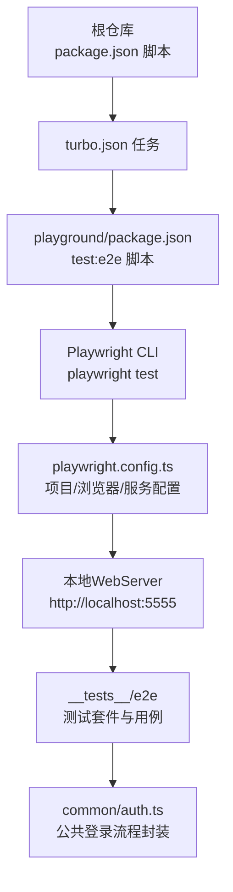
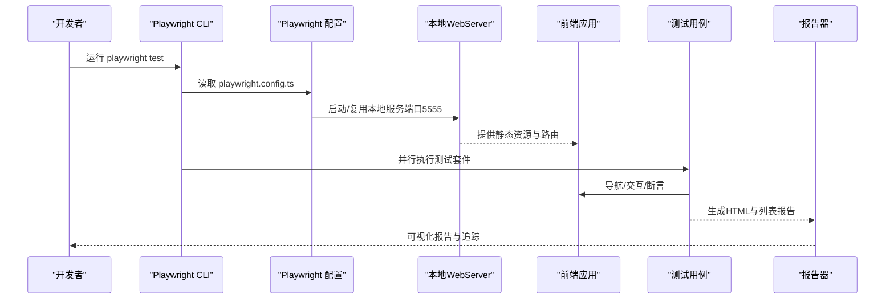
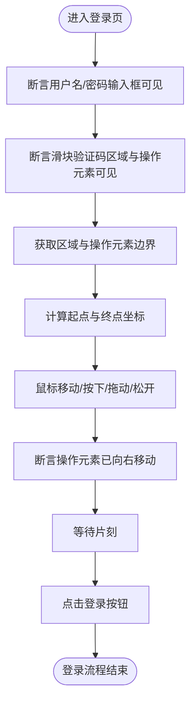
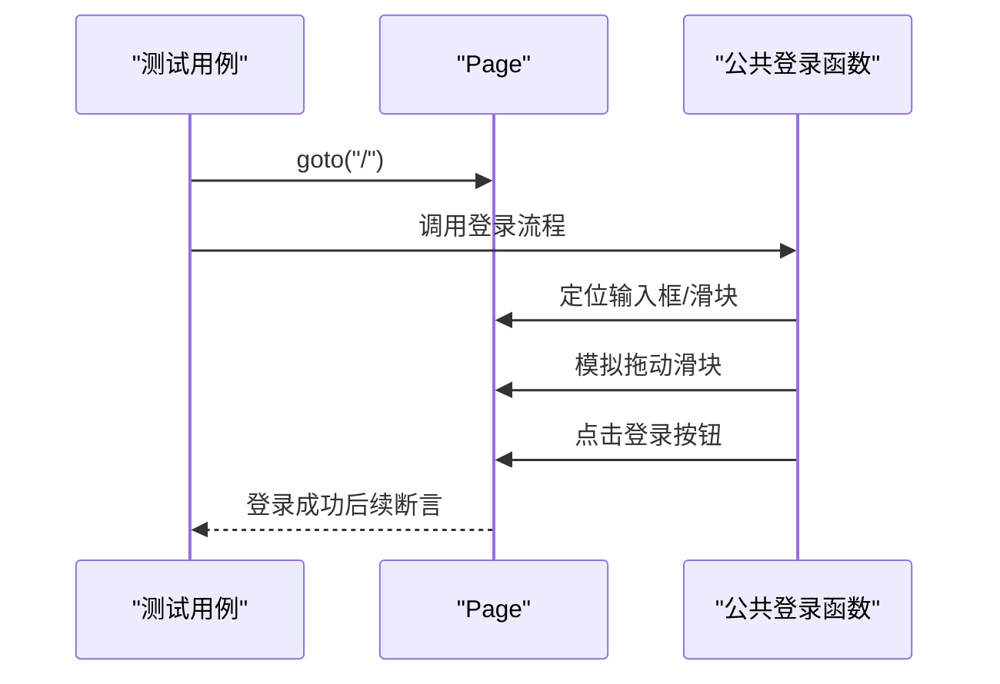
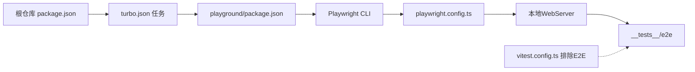

# 端到端测试

<cite>
**本文引用的文件**
- [playwright.config.ts](file://playground/playwright.config.ts)
- [auth-login.spec.ts](file://playground/__tests__/e2e/auth-login.spec.ts)
- [auth.ts](file://playground/__tests__/e2e/common/auth.ts)
- [package.json（根）](file://package.json)
- [package.json（playground）](file://playground/package.json)
- [turbo.json](file://turbo.json)
- [vitest.config.ts](file://vitest.config.ts)
</cite>

## 目录

1. [简介](#简介)
2. [项目结构](#项目结构)
3. [核心组件](#核心组件)
4. [架构总览](#架构总览)
5. [详细组件分析](#详细组件分析)
6. [依赖关系分析](#依赖关系分析)
7. [性能考量](#性能考量)
8. [故障排查指南](#故障排查指南)
9. [结论](#结论)
10. [附录](#附录)

## 简介

本指南面向Vben Admin的端到端测试（E2E），基于Playwright框架，覆盖从环境搭建、浏览器与设备配置、测试目标与项目结构、页面自动化（导航、交互、表单）、测试设计原则、数据准备与清理、登录流程与路由跳转验证、报告生成与分析，以及跨浏览器测试的最佳实践。文档以仓库中现有的playground工程为落点，结合根仓库的脚本与工作流，帮助你快速上手并稳定运行E2E测试。

## 项目结构

- E2E测试位于playground工程内，采用Playwright标准配置与测试组织方式：
  - 配置文件：playwright.config.ts
  - 测试入口目录：**tests**/e2e
  - 公共辅助模块：**tests**/e2e/common
- 根仓库通过turbo任务统一调度E2E执行；playground工程提供独立的Playwright命令与本地开发服务器启动。

图表来源

- [playwright.config.ts:98-102](file://playground/playwright.config.ts#L98-L102)
- [package.json（playground）:18-26](file://playground/package.json#L18-L26)
- [turbo.json:37-46](file://turbo.json#L37-L46)

章节来源

- [playwright.config.ts:82-106](file://playground/playwright.config.ts#L82-L106)
- [package.json（playground）:18-26](file://playground/package.json#L18-L26)
- [turbo.json:37-46](file://turbo.json#L37-L46)

## 核心组件

- Playwright配置（playwright.config.ts）
  - 期望超时、失败策略、输出目录、报告器、重试次数、超时、并行与追踪等全局设置
  - 项目级浏览器配置（当前启用chromium，其他浏览器可按需开启）
  - WebServer自动启动（开发或预览模式），端口固定为5555
- 测试套件与用例（**tests**/e2e）
  - 登录页基础校验与登录流程用例
  - 公共登录流程封装（common/auth.ts）
- 执行入口与任务编排
  - playground工程提供playwright命令
  - 根仓库通过turbo统一触发E2E任务

章节来源

- [playwright.config.ts:14-106](file://playground/playwright.config.ts#L14-L106)
- [auth-login.spec.ts:1-21](file://playground/__tests__/e2e/auth-login.spec.ts#L1-L21)
- [auth.ts:1-47](file://playground/__tests__/e2e/common/auth.ts#L1-L47)
- [package.json（playground）:24-26](file://playground/package.json#L24-L26)
- [turbo.json:37-46](file://turbo.json#L37-L46)

## 架构总览

下图展示了从命令到浏览器、再到被测应用与测试报告的完整链路。

图表来源

- [playwright.config.ts:98-102](file://playground/playwright.config.ts#L98-L102)
- [playwright.config.ts:75-79](file://playground/playwright.config.ts#L75-L79)
- [auth-login.spec.ts:5-19](file://playground/__tests__/e2e/auth-login.spec.ts#L5-L19)

## 详细组件分析

### Playwright配置与浏览器环境

- 关键配置要点
  - 期望断言超时、测试超时、重试策略、并行度、追踪保留策略
  - 报告器：控制台列表与HTML报告（输出至统一结果目录）
  - 项目：当前启用chromium，可扩展至Firefox/Safari/Edge等
  - WebServer：根据CI/本地选择启动命令，端口5555，支持复用
- 最佳实践
  - 在CI中启用headless与有限重试，提升稳定性
  - 使用统一的outputDir与HTML报告，便于归档与回溯
  - 将baseURL固定为本地服务地址，减少网络波动影响

章节来源

- [playwright.config.ts:14-106](file://playground/playwright.config.ts#L14-L106)

### 页面自动化：导航、交互与表单

- 页面导航
  - beforeEach中统一goto根路径，确保每次用例从干净状态开始
- 元素交互
  - 使用定位器（如按name属性定位输入框）与可见性断言
  - 验证滑动验证码区域与操作元素存在，并计算边界坐标
  - 模拟鼠标移动、按下、拖动与松开，完成滑块验证
- 表单提交
  - 等待短暂时间后点击登录按钮，触发登录流程

图表来源

- [auth.ts:5-46](file://playground/__tests__/e2e/common/auth.ts#L5-L46)
- [auth-login.spec.ts:17-19](file://playground/__tests__/e2e/auth-login.spec.ts#L17-L19)

章节来源

- [auth.ts:1-47](file://playground/__tests__/e2e/common/auth.ts#L1-L47)
- [auth-login.spec.ts:5-19](file://playground/__tests__/e2e/auth-login.spec.ts#L5-L19)

### 测试用例设计原则

- 用户场景模拟
  - 以真实用户视角编写用例，如“访问登录页、校验标题与元素、完成滑动验证码并通过登录”
- 业务流程测试
  - 将登录流程拆分为多个步骤断言，确保每个环节正确
- 可维护性
  - 将公共逻辑抽取为工具函数（如authLogin），避免重复代码
- 环境一致性
  - 固定baseURL与本地服务端口，保证跨平台一致

章节来源

- [auth-login.spec.ts:9-19](file://playground/__tests__/e2e/auth-login.spec.ts#L9-L19)
- [auth.ts:5-46](file://playground/__tests__/e2e/common/auth.ts#L5-L46)

### 测试数据准备与清理

- 数据准备
  - 本项目通过mock后端与本地开发服务器提供测试数据，无需额外数据库初始化
- 用户状态管理
  - 通过登录流程前置条件（beforeEach）确保每次用例从登录页开始
- 清理
  - 用例间不共享状态，通过独立的页面实例与本地服务避免污染

章节来源

- [playwright.config.ts:98-102](file://playground/playwright.config.ts#L98-L102)
- [auth-login.spec.ts:5-7](file://playground/__tests__/e2e/auth-login.spec.ts#L5-L7)

### 实际E2E示例：登录流程、路由跳转与功能验证

- 登录流程
  - 断言页面标题包含“Vben Admin”
  - 调用公共登录函数完成滑块验证与登录
- 路由跳转与功能验证
  - 登录成功后，可在后续用例中验证目标路由与页面元素（建议在新用例中补充）

图表来源

- [auth-login.spec.ts:10-19](file://playground/__tests__/e2e/auth-login.spec.ts#L10-L19)
- [auth.ts:5-46](file://playground/__tests__/e2e/common/auth.ts#L5-L46)

章节来源

- [auth-login.spec.ts:10-19](file://playground/__tests__/e2e/auth-login.spec.ts#L10-L19)
- [auth.ts:5-46](file://playground/__tests__/e2e/common/auth.ts#L5-L46)

### 测试报告生成与分析

- 报告器
  - 控制台列表与HTML报告同时启用，输出目录统一
- 分析建议
  - 在CI中保留HTML报告以便回溯失败用例的截图与视频
  - 结合trace在失败时查看交互轨迹

章节来源

- [playwright.config.ts:75-79](file://playground/playwright.config.ts#L75-L79)
- [playwright.config.ts:94-94](file://playground/playwright.config.ts#L94-L94)

### 跨浏览器测试配置与最佳实践

- 当前配置
  - 已启用chromium，其他浏览器（Firefox/Safari/Edge）注释可按需启用
- 最佳实践
  - 优先在chromium上运行主流程，再在关键浏览器上抽样验证
  - 在CI中限制workers数量，避免并发导致不稳定
  - 为移动端设备添加项目配置，分场景执行

章节来源

- [playwright.config.ts:27-74](file://playground/playwright.config.ts#L27-L74)
- [playwright.config.ts:104-106](file://playground/playwright.config.ts#L104-L106)

## 依赖关系分析

- 执行链路
  - 根仓库脚本 -> turbo任务 -> playground Playwright命令 -> Playwright配置 -> 本地WebServer -> 测试用例
- 排除策略
  - Vitest配置排除了e2e目录，避免单元测试与E2E测试互相干扰

图表来源

- [package.json（根）:62-62](file://package.json#L62-L62)
- [turbo.json:37-46](file://turbo.json#L37-L46)
- [package.json（playground）:24-26](file://playground/package.json#L24-L26)
- [playwright.config.ts:98-102](file://playground/playwright.config.ts#L98-L102)
- [vitest.config.ts:18-26](file://vitest.config.ts#L18-L26)

章节来源

- [package.json（根）:62-62](file://package.json#L62-L62)
- [turbo.json:37-46](file://turbo.json#L37-L46)
- [package.json（playground）:24-26](file://playground/package.json#L24-L26)
- [vitest.config.ts:18-26](file://vitest.config.ts#L18-L26)

## 性能考量

- 启动与复用
  - 复用现有本地服务可显著降低冷启动成本
- 并发与重试
  - CI中限制workers数量，适度重试提升稳定性
- 超时与断言
  - 合理设置expect与action超时，避免过长等待
- 报告与追踪
  - 仅在失败时保留trace，平衡存储与诊断价值

章节来源

- [playwright.config.ts:80-95](file://playground/playwright.config.ts#L80-L95)
- [playwright.config.ts:104-106](file://playground/playwright.config.ts#L104-L106)

## 故障排查指南

- 本地无法访问
  - 确认本地WebServer已在5555端口可用（开发或预览模式）
- 浏览器不可用
  - 检查已启用的浏览器项目；必要时启用Firefox/Safari/Edge
- 截图与视频
  - 查看HTML报告与trace文件，定位失败原因
- 单元测试冲突
  - 确认Vitest已排除e2e目录，避免DOM环境冲突

章节来源

- [playwright.config.ts:98-102](file://playground/playwright.config.ts#L98-L102)
- [playwright.config.ts:27-74](file://playground/playwright.config.ts#L27-L74)
- [vitest.config.ts:18-26](file://vitest.config.ts#L18-L26)

## 结论

本指南基于playground工程的现有配置，给出了Vben Admin端到端测试的完整落地路径：从环境与配置、到页面自动化与用例设计、再到数据准备与清理、报告生成与跨浏览器实践。建议在现有基础上逐步扩展更多业务场景用例，并引入移动端与多浏览器项目，持续提升测试覆盖面与稳定性。

## 附录

- 常用命令
  - 在playground目录运行：playwright test、playwright test --ui、playwright codegen
- 任务编排
  - 根仓库通过turbo统一触发E2E任务，确保多包协作下的测试一致性

章节来源

- [package.json（playground）:24-26](file://playground/package.json#L24-L26)
- [turbo.json:37-46](file://turbo.json#L37-L46)
