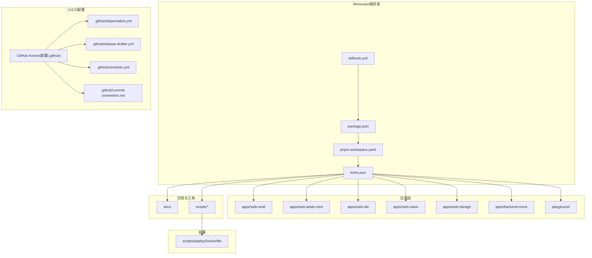
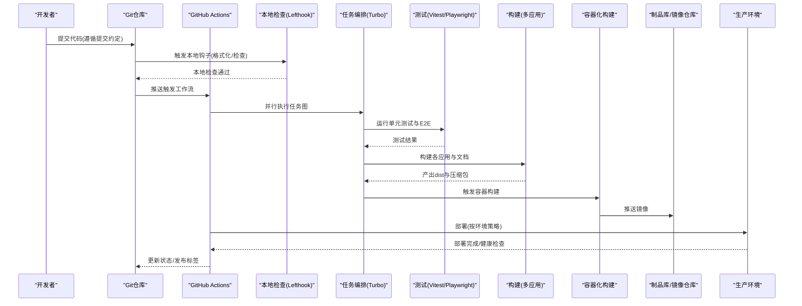
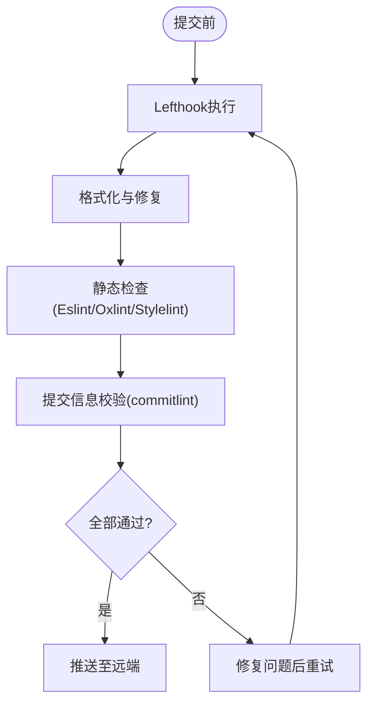
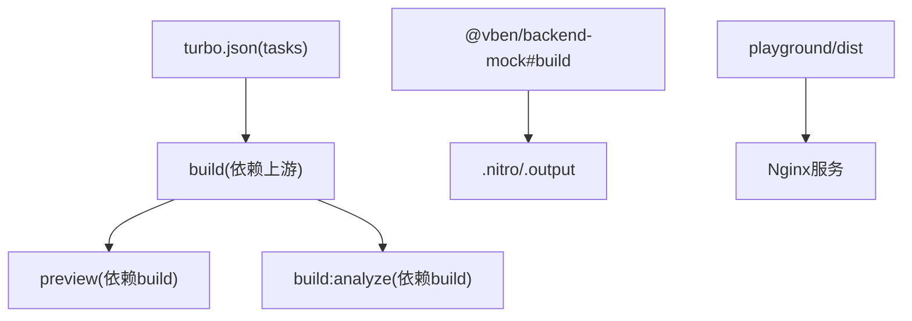
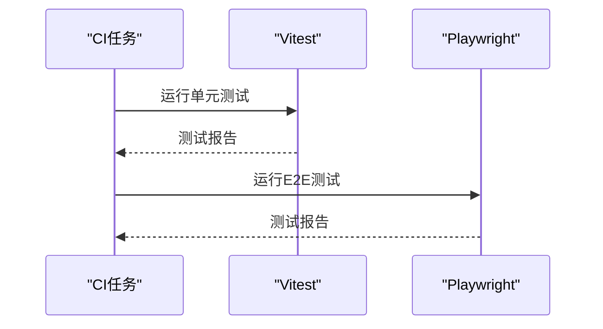
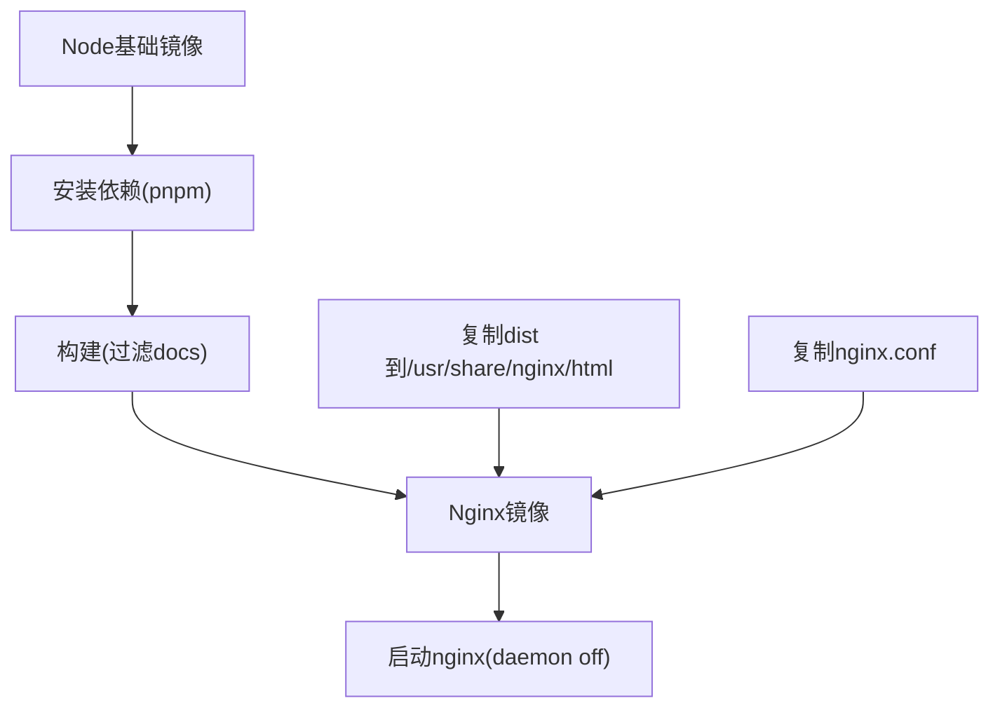
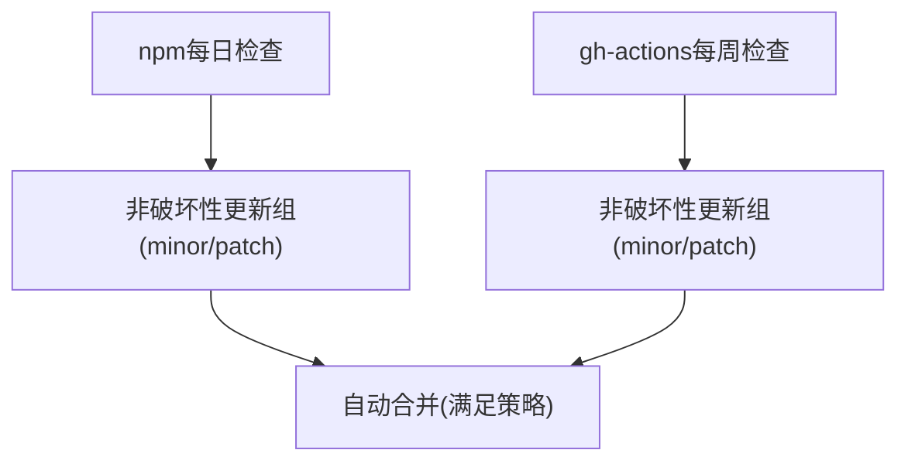
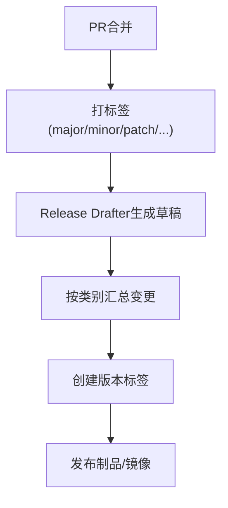
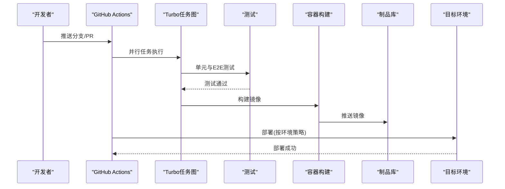
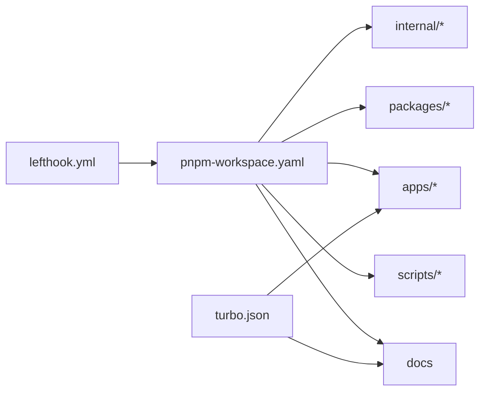

# CI/CD流水线

<cite>
**本文档引用的文件**
- [.github/dependabot.yml](file://.github/dependabot.yml)
- [.github/release-drafter.yml](file://.github/release-drafter.yml)
- [.github/semantic.yml](file://.github/semantic.yml)
- [.github/commit-convention.md](file://.github/commit-convention.md)
- [turbo.json](file://turbo.json)
- [pnpm-workspace.yaml](file://pnpm-workspace.yaml)
- [scripts/deploy/Dockerfile](file://scripts/deploy/Dockerfile)
- [lefthook.yml](file://lefthook.yml)
- [package.json](file://package.json)
- [vitest.config.ts](file://vitest.config.ts)
- [playground/playwright.config.ts](file://playground/playwright.config.ts)
</cite>

## 目录
1. [简介](#简介)
2. [项目结构](#项目结构)
3. [核心组件](#核心组件)
4. [架构总览](#架构总览)
5. [详细组件分析](#详细组件分析)
6. [依赖分析](#依赖分析)
7. [性能考虑](#性能考虑)
8. [故障排除指南](#故障排除指南)
9. [结论](#结论)
10. [附录](#附录)

## 简介
本指南面向Vben Admin项目的CI/CD流水线配置，围绕以下目标展开：  
- GitHub Actions工作流配置（代码检查、单元测试、集成测试与构建部署）  
- 依赖自动更新（Dependabot规则与安全更新策略）  
- 多环境部署（开发、测试、生产）  
- 构建产物管理与版本控制（语义化版本与发布标签）  
- 完整流程示例（从代码提交到生产部署）  
- 失败回滚与紧急修复的应急流程  

本仓库已具备完善的依赖管理、任务编排与容器化部署基础，结合仓库内现有配置即可快速落地自动化流水线。

## 项目结构
本项目采用Monorepo结构，使用pnpm进行包管理与工作区组织；Turbo负责任务编排与缓存；Lefthook在本地执行预提交检查；Dockerfile定义了容器化构建与Nginx部署镜像。

图表来源
- [pnpm-workspace.yaml:1-193](file://pnpm-workspace.yaml#L1-L193)
- [turbo.json:1-49](file://turbo.json#L1-L49)
- [scripts/deploy/Dockerfile:1-38](file://scripts/deploy/Dockerfile#L1-L38)

章节来源
- [pnpm-workspace.yaml:1-193](file://pnpm-workspace.yaml#L1-L193)
- [turbo.json:1-49](file://turbo.json#L1-L49)

## 核心组件
- 任务编排与缓存：Turbo通过任务图与输出缓存加速构建，支持跨包依赖与增量构建。  
- 依赖管理：pnpm工作区统一管理所有包，集中锁定与版本约束。  
- 本地质量门禁：Lefthook在本地执行格式化、静态检查与提交信息校验。  
- 容器化部署：Dockerfile分阶段构建，前端产物由Nginx提供服务。  
- 自动发布与版本：Release Drafter根据PR标签生成变更日志，配合语义化提交规范与依赖自动更新策略。

章节来源
- [turbo.json:15-47](file://turbo.json#L15-L47)
- [pnpm-workspace.yaml:1-14](file://pnpm-workspace.yaml#L1-L14)
- [lefthook.yml:44-77](file://lefthook.yml#L44-L77)
- [scripts/deploy/Dockerfile:1-38](file://scripts/deploy/Dockerfile#L1-L38)

## 架构总览
下图展示了从代码提交到生产部署的端到端流水线视图，涵盖质量门禁、任务编排、测试与构建、制品管理与部署等环节。

图表来源
- [lefthook.yml:44-77](file://lefthook.yml#L44-L77)
- [turbo.json:15-47](file://turbo.json#L15-L47)
- [scripts/deploy/Dockerfile:1-38](file://scripts/deploy/Dockerfile#L1-L38)

## 详细组件分析

### 1) 代码质量与提交约定
- 提交消息约定：基于语义化类型与Angular风格，要求包含类型、作用域与简要描述，并支持BREAKING CHANGE说明。  
- 本地检查：Lefthook在pre-commit阶段执行格式化、静态检查与提交信息校验，确保进入远端前的质量门槛。  
- 质量门禁建议：在CI中复用相同规则，避免重复检查成本。

图表来源
- [lefthook.yml:44-77](file://lefthook.yml#L44-L77)
- [.github/commit-convention.md:1-90](file://.github/commit-convention.md#L1-L90)

章节来源
- [.github/commit-convention.md:1-90](file://.github/commit-convention.md#L1-L90)
- [lefthook.yml:44-77](file://lefthook.yml#L44-L77)

### 2) 任务编排与构建缓存（Turbo）
- 任务图：通过dependsOn声明跨包依赖，实现增量构建与并行执行。  
- 输出缓存：定义build/preview/build:analyze等任务的输出目录，提升重复运行效率。  
- 应用构建：playground与各web应用均纳入构建范围，backend-mock单独处理。  
- 开发模式：dev任务不缓存且持久化，适合本地热更新。

图表来源
- [turbo.json:15-47](file://turbo.json#L15-L47)

章节来源
- [turbo.json:15-47](file://turbo.json#L15-L47)

### 3) 测试策略（单元与集成）
- 单元测试：Vitest配置位于根目录，可直接在CI中调用。  
- 集成测试：Playwright配置位于playground，可用于端到端验证。  
- 建议：在CI中分别运行单元与E2E，失败即中断，保证质量。

图表来源
- [vitest.config.ts](file://vitest.config.ts)
- [playground/playwright.config.ts](file://playground/playwright.config.ts)

章节来源
- [vitest.config.ts](file://vitest.config.ts)
- [playground/playwright.config.ts](file://playground/playwright.config.ts)

### 4) 容器化构建与部署
- 分阶段构建：Node基础镜像安装依赖并构建，Nginx镜像提供静态服务。  
- 产物复制：将playground/dist复制到Nginx默认站点目录。  
- 配置注入：复制自定义Nginx配置以支持现代JS扩展名与静态资源。  
- 环境变量：设置时区与Node内存参数，提升稳定性。

图表来源
- [scripts/deploy/Dockerfile:1-38](file://scripts/deploy/Dockerfile#L1-L38)

章节来源
- [scripts/deploy/Dockerfile:1-38](file://scripts/deploy/Dockerfile#L1-L38)

### 5) 依赖自动更新（Dependabot）
- npm依赖：每日检查非破坏性更新（minor/patch），合并为组以减少PR数量。  
- GitHub Actions：每周检查非破坏性更新，保持工作流与工具链稳定。  
- 安全更新：建议在仓库安全告警触发时手动审查并合并高优先级更新。

图表来源
- [.github/dependabot.yml:1-18](file://.github/dependabot.yml#L1-L18)

章节来源
- [.github/dependabot.yml:1-18](file://.github/dependabot.yml#L1-L18)

### 6) 版本与发布（语义化与发布草稿）
- 语义化提交：支持feat/fix/docs/refactor/perf/test/ci/chore等类型，配合BREAKING CHANGE标记。  
- 变更日志：Release Drafter依据PR标签自动分类生成“特性/缺陷/性能/文档/维护/测试/破坏性”等章节。  
- 版本解析：major/minor/patch由标签驱动，避免手动版本号冲突。  
- 发布标签：自动生成tag与版本号模板，便于下游发布与回溯。

图表来源
- [.github/semantic.yml:1-14](file://.github/semantic.yml#L1-L14)
- [.github/release-drafter.yml:12-62](file://.github/release-drafter.yml#L12-L62)

章节来源
- [.github/semantic.yml:1-14](file://.github/semantic.yml#L1-14)
- [.github/release-drafter.yml:12-62](file://.github/release-drafter.yml#L12-L62)

### 7) 多环境部署设计
- 开发环境：本地Turbo快速构建与预览，或通过Dev分支触发轻量级CI进行快速验证。  
- 测试环境：对主干分支启用完整测试与构建，产出镜像推送到测试仓库，部署到测试集群。  
- 生产环境：仅允许来自正式tag或受控分支的部署，部署前进行健康检查与灰度验证。  
- 回滚策略：镜像版本化管理，支持一键回滚至上一稳定版本。

[本节为概念性说明，无需文件引用]

### 8) 构建产物管理与版本控制
- 产物目录：playground/dist、各应用dist、文档dist与压缩包均纳入缓存与产物清单。  
- 版本标签：基于Release Drafter生成的tag与版本号，确保发布一致性。  
- 语义化版本：通过PR标签驱动版本升级，避免人为错误。

章节来源
- [turbo.json:18-23](file://turbo.json#L18-L23)
- [.github/release-drafter.yml:1-62](file://.github/release-drafter.yml#L1-L62)

### 9) 完整CI/CD流程示例
- 触发条件：push到主分支或创建PR。  
- 本地检查：Lefthook在本地执行格式化与静态检查。  
- CI执行：  
  - 安装依赖与缓存恢复  
  - 运行单元测试与E2E测试  
  - 执行Turbo任务图并缓存输出  
  - 构建容器镜像并推送到制品库  
  - 按环境部署并健康检查  
- 发布：根据PR标签生成变更日志并创建版本标签。

图表来源
- [turbo.json:15-47](file://turbo.json#L15-L47)
- [scripts/deploy/Dockerfile:1-38](file://scripts/deploy/Dockerfile#L1-L38)

## 依赖分析
- Monorepo组织：pnpm工作区将internal、packages、apps、scripts、docs等纳入统一管理。  
- 依赖锁定：pnpm-lock.yaml与工作区配置共同保证依赖一致性。  
- 任务耦合：Turbo任务图明确上下游关系，降低重复计算与缓存失效概率。  
- 工具链：Lefthook与语义化提交、Release Drafter形成闭环，保障质量与可追溯性。

图表来源
- [pnpm-workspace.yaml:1-14](file://pnpm-workspace.yaml#L1-L14)
- [turbo.json:15-47](file://turbo.json#L15-L47)
- [lefthook.yml:44-77](file://lefthook.yml#L44-L77)

章节来源
- [pnpm-workspace.yaml:1-14](file://pnpm-workspace.yaml#L1-L14)
- [turbo.json:15-47](file://turbo.json#L15-L47)
- [lefthook.yml:44-77](file://lefthook.yml#L44-L77)

## 性能考虑
- 任务并行：Turbo利用任务图与输出缓存，最大化并行度与缓存命中率。  
- 依赖安装：使用pnpm与缓存mount，减少网络与I/O开销。  
- 构建优化：分阶段Docker镜像减少最终镜像体积，Nginx配置优化静态资源加载。  
- 本地体验：Lefthook在本地执行检查，避免CI资源浪费。

[本节为通用指导，无需文件引用]

## 故障排除指南
- 提交被拒绝：检查提交信息是否符合约定，确保类型、作用域与简要描述规范。  
- 本地检查失败：格式化/静态检查报错需先在本地修复，再重试提交。  
- CI测试失败：定位失败用例，补充或修正测试；必要时临时跳过但需记录issue。  
- 构建镜像失败：检查Dockerfile依赖安装与构建命令，确认playground产物路径正确。  
- 依赖更新冲突：关注Dependabot PR，优先解决破坏性更新；安全更新应尽快合并。  
- 回滚操作：拉取上一稳定镜像版本，更新部署配置并进行健康检查。

章节来源
- [.github/commit-convention.md:45-90](file://.github/commit-convention.md#L45-L90)
- [lefthook.yml:44-77](file://lefthook.yml#L44-L77)
- [scripts/deploy/Dockerfile:1-38](file://scripts/deploy/Dockerfile#L1-L38)
- [.github/dependabot.yml:1-18](file://.github/dependabot.yml#L1-L18)

## 结论
本指南基于仓库现有配置，给出了Vben Admin的CI/CD落地方案：以Lefthook与语义化提交作为质量门禁，以Turbo与pnpm实现高效构建与依赖管理，以Dependabot与Release Drafter保障依赖与发布质量，以容器化构建与多环境策略实现稳定交付。按此方案实施，可显著提升交付效率与系统可靠性。

[本节为总结性内容，无需文件引用]

## 附录
- 关键配置文件索引  
  - 提交约定与语义化类型：[commit-convention.md](file://.github/commit-convention.md)，[semantic.yml](file://.github/semantic.yml)  
  - 依赖自动更新：[dependabot.yml](file://.github/dependabot.yml)  
  - 发布草稿与版本解析：[release-drafter.yml](file://.github/release-drafter.yml)  
  - 任务编排与缓存：[turbo.json](file://turbo.json)  
  - 依赖管理与工作区：[pnpm-workspace.yaml](file://pnpm-workspace.yaml)  
  - 本地检查：[lefthook.yml](file://lefthook.yml)  
  - 容器化构建：[Dockerfile](file://scripts/deploy/Dockerfile)  
  - 测试配置：[vitest.config.ts](file://vitest.config.ts)，[playwright.config.ts](file://playground/playwright.config.ts)

[本节为参考索引，无需文件引用]