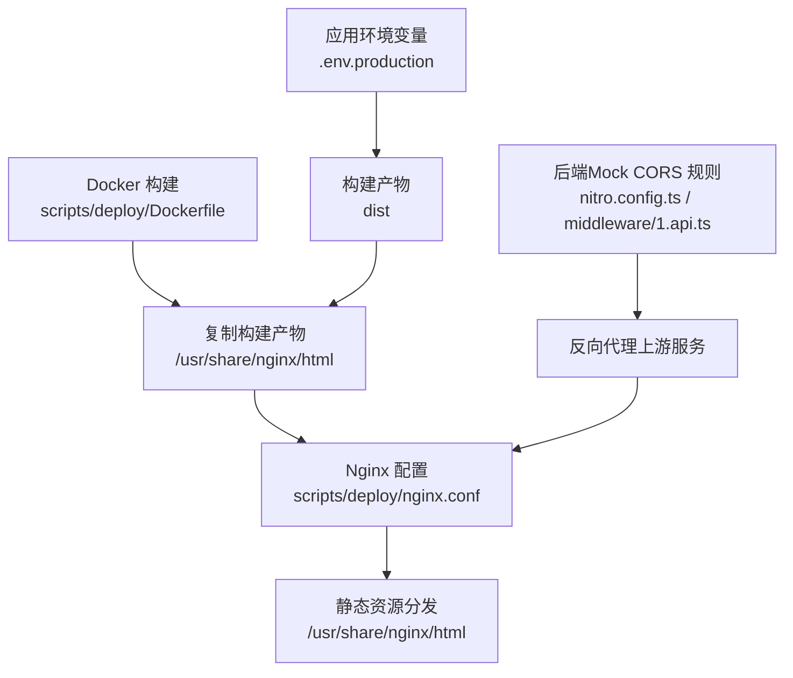
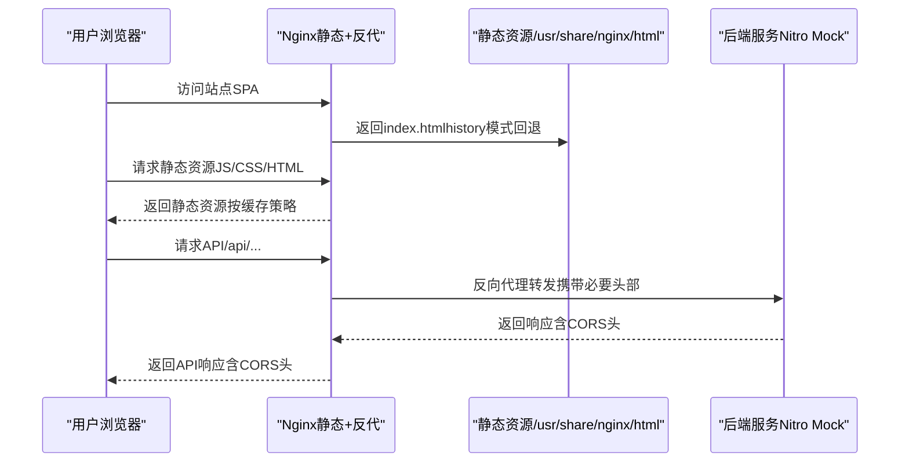
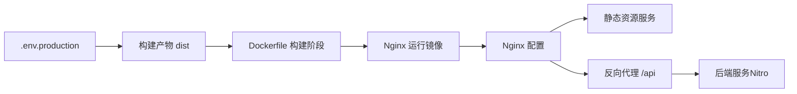

# Web服务器配置

<cite>
**本文引用的文件**
- [nginx.conf](file://scripts/deploy/nginx.conf)
- [Dockerfile](file://scripts/deploy/Dockerfile)
- [build-local-docker-image.sh](file://scripts/deploy/build-local-docker-image.sh)
- [.env.production（web-antd）](file://apps/web-antd/.env.production)
- [nitro.config.ts（backend-mock）](file://apps/backend-mock/nitro.config.ts)
- [1.api.ts（backend-mock 中间件）](file://apps/backend-mock/middleware/1.api.ts)
- [build.md（英文文档）](file://docs/src/en/guide/essentials/build.md)
- [FAQ（nginx 部署问题）](file://docs/src/guide/other/faq.md)
</cite>

## 目录

1. [简介](#简介)
2. [项目结构](#项目结构)
3. [核心组件](#核心组件)
4. [架构总览](#架构总览)
5. [详细组件分析](#详细组件分析)
6. [依赖关系分析](#依赖关系分析)
7. [性能考量](#性能考量)
8. [故障排查指南](#故障排查指南)
9. [结论](#结论)
10. [附录](#附录)

## 简介

本指南面向Vben Admin的Web服务器配置，聚焦于Nginx在生产环境中的最佳实践，涵盖静态资源服务、Gzip压缩与缓存策略、反向代理与跨域处理、HTTPS与证书管理建议、安全头配置以及不同部署场景（单机与容器化）的配置示例，并提供性能调优与监控建议。

## 项目结构

与Web服务器配置直接相关的文件主要位于scripts/deploy目录，以及应用层的环境变量与文档说明：

- Nginx配置：scripts/deploy/nginx.conf
- 容器镜像构建：scripts/deploy/Dockerfile
- 本地镜像构建脚本：scripts/deploy/build-local-docker-image.sh
- 应用环境变量（含路由与压缩开关）：apps/web-antd/.env.production
- 后端Mock服务的CORS与路由规则：apps/backend-mock/nitro.config.ts、apps/backend-mock/middleware/1.api.ts
- 文档与FAQ：docs/src/en/guide/essentials/build.md、docs/src/guide/other/faq.md

图表来源

- [nginx.conf:49-74](file://scripts/deploy/nginx.conf#L49-L74)
- [Dockerfile:22-37](file://scripts/deploy/Dockerfile#L22-L37)
- [.env.production（web-antd）:1-20](file://apps/web-antd/.env.production#L1-L20)
- [nitro.config.ts（backend-mock）:7-19](file://apps/backend-mock/nitro.config.ts#L7-L19)
- [1.api.ts（backend-mock 中间件）:14-30](file://apps/backend-mock/middleware/1.api.ts#L14-L30)

章节来源

- [nginx.conf:1-76](file://scripts/deploy/nginx.conf#L1-L76)
- [Dockerfile:1-38](file://scripts/deploy/Dockerfile#L1-L38)
- [.env.production（web-antd）:1-20](file://apps/web-antd/.env.production#L1-L20)
- [nitro.config.ts（backend-mock）:1-20](file://apps/backend-mock/nitro.config.ts#L1-L20)
- [1.api.ts（backend-mock 中间件）:1-30](file://apps/backend-mock/middleware/1.api.ts#L1-L30)
- [build.md（英文文档）:1-244](file://docs/src/en/guide/essentials/build.md#L1-L244)
- [FAQ（nginx 部署问题）:136-160](file://docs/src/guide/other/faq.md#L136-L160)

## 核心组件

- Nginx静态资源服务与路由回退：通过try_files将SPA路由回退至index.html，支持history模式；同时对HTML不缓存以避免更新后缓存污染。
- 反向代理与跨域：location块代理/api前缀到后端服务，并添加CORS响应头；Nitro后端也提供CORS路由规则与中间件处理。
- 压缩与缓存：文档提供了gzip与brotli启用方法及Nginx侧配置要点；缓存策略对HTML禁用缓存，对静态资源可按需配置。
- 容器化部署：Dockerfile分阶段构建，第一阶段安装依赖并打包，第二阶段基于nginx:stable-alpine运行，复制构建产物与Nginx配置。

章节来源

- [nginx.conf:53-67](file://scripts/deploy/nginx.conf#L53-L67)
- [build.md（英文文档）:136-148](file://docs/src/en/guide/essentials/build.md#L136-L148)
- [nitro.config.ts（backend-mock）:7-19](file://apps/backend-mock/nitro.config.ts#L7-L19)
- [1.api.ts（backend-mock 中间件）:14-30](file://apps/backend-mock/middleware/1.api.ts#L14-L30)
- [Dockerfile:22-37](file://scripts/deploy/Dockerfile#L22-L37)

## 架构总览

下图展示了从浏览器到Nginx再到后端服务的整体请求链路，以及静态资源与API请求的分流与处理。

图表来源

- [nginx.conf:49-74](file://scripts/deploy/nginx.conf#L49-L74)
- [nitro.config.ts（backend-mock）:7-19](file://apps/backend-mock/nitro.config.ts#L7-L19)
- [1.api.ts（backend-mock 中间件）:14-30](file://apps/backend-mock/middleware/1.api.ts#L14-L30)

## 详细组件分析

### 静态资源服务与路由回退

- 作用：确保history模式下刷新或直连路径能正确返回index.html，实现单页应用的正常运行。
- 关键点：location /内使用try_files回退至/index.html；对HTML文件不缓存，避免版本更新后仍命中旧缓存。
- 参考路径：[nginx.conf:53-67](file://scripts/deploy/nginx.conf#L53-L67)、[build.md（英文文档）:176-188](file://docs/src/en/guide/essentials/build.md#L176-L188)

章节来源

- [nginx.conf:53-67](file://scripts/deploy/nginx.conf#L53-L67)
- [build.md（英文文档）:172-188](file://docs/src/en/guide/essentials/build.md#L172-L188)

### Gzip压缩与缓存策略

- 压缩：文档提供了在构建阶段启用gzip/brotli的方法，并给出了Nginx侧gzip与brotli的配置要点（需安装相应模块）。
- 缓存：对HTML不缓存，对静态资源可按需配置长缓存；可结合版本号或子目录策略实现强缓存。
- 参考路径：[build.md（英文文档）:53-116](file://docs/src/en/guide/essentials/build.md#L53-L116)、[build.md（英文文档）:136-148](file://docs/src/en/guide/essentials/build.md#L136-L148)

章节来源

- [build.md（英文文档）:53-116](file://docs/src/en/guide/essentials/build.md#L53-L116)
- [build.md（英文文档）:136-148](file://docs/src/en/guide/essentials/build.md#L136-L148)

### 反向代理与跨域处理

- Nginx反代：location /api块代理到后端服务，设置Host、X-Real-IP、X-Forwarded-For等头部，并添加CORS响应头。
- 后端CORS：Nitro通过routeRules为/api/\*\*开启CORS并设置允许的方法、头与暴露头；中间件对OPTIONS预检快速返回。
- 参考路径：[nginx.conf:57-66](file://scripts/deploy/nginx.conf#L57-L66)、[build.md（英文文档）:225-243](file://docs/src/en/guide/essentials/build.md#L225-L243)、[nitro.config.ts（backend-mock）:7-19](file://apps/backend-mock/nitro.config.ts#L7-L19)、[1.api.ts（backend-mock 中间件）:14-30](file://apps/backend-mock/middleware/1.api.ts#L14-L30)

章节来源

- [nginx.conf:57-66](file://scripts/deploy/nginx.conf#L57-L66)
- [build.md（英文文档）:225-243](file://docs/src/en/guide/essentials/build.md#L225-L243)
- [nitro.config.ts（backend-mock）:7-19](file://apps/backend-mock/nitro.config.ts#L7-L19)
- [1.api.ts（backend-mock 中间件）:14-30](file://apps/backend-mock/middleware/1.api.ts#L14-L30)

### HTTPS与证书管理（建议）

- Let’s Encrypt：推荐使用acme.sh或certbot自动化申请与续期证书；在Nginx中配置ssl_certificate与ssl_certificate_key。
- 强制HTTPS：重定向HTTP至HTTPS，设置HSTS（Strict-Transport-Security）。
- 参考路径：[build.md（英文文档）:225-243](file://docs/src/en/guide/essentials/build.md#L225-L243)

章节来源

- [build.md（英文文档）:225-243](file://docs/src/en/guide/essentials/build.md#L225-L243)

### 安全头配置（建议）

- HSTS：提升传输安全性，建议设置合适的max-age与includeSubDomains。
- X-Frame-Options：防点击劫持，建议设为DENY或SAMEORIGIN。
- Content-Security-Policy：限制资源加载来源，最小权限原则。
- 参考路径：[build.md（英文文档）:225-243](file://docs/src/en/guide/essentials/build.md#L225-L243)

章节来源

- [build.md（英文文档）:225-243](file://docs/src/en/guide/essentials/build.md#L225-L243)

### 不同部署场景下的Nginx配置示例

- 单机部署：直接将dist目录内容放置于Nginx根目录，按文档示例配置location与try_files。
- 容器化部署：Dockerfile分阶段构建，第二阶段复制Nginx配置与构建产物，暴露8080端口。
- 参考路径：[Dockerfile:22-37](file://scripts/deploy/Dockerfile#L22-L37)、[build.md（英文文档）:130-148](file://docs/src/en/guide/essentials/build.md#L130-L148)

章节来源

- [Dockerfile:22-37](file://scripts/deploy/Dockerfile#L22-L37)
- [build.md（英文文档）:130-148](file://docs/src/en/guide/essentials/build.md#L130-L148)

## 依赖关系分析

- Nginx配置依赖于构建产物（dist）与后端服务可达性。
- Dockerfile将构建产物与Nginx配置复制到运行镜像，形成“构建-运行”解耦。
- 应用环境变量影响构建产物与运行时行为（如路由模式、压缩策略）。

图表来源

- [.env.production（web-antd）:1-20](file://apps/web-antd/.env.production#L1-L20)
- [Dockerfile:17-37](file://scripts/deploy/Dockerfile#L17-L37)
- [nginx.conf:49-74](file://scripts/deploy/nginx.conf#L49-L74)
- [nitro.config.ts（backend-mock）:7-19](file://apps/backend-mock/nitro.config.ts#L7-L19)

章节来源

- [.env.production（web-antd）:1-20](file://apps/web-antd/.env.production#L1-L20)
- [Dockerfile:1-38](file://scripts/deploy/Dockerfile#L1-L38)
- [nginx.conf:1-76](file://scripts/deploy/nginx.conf#L1-L76)
- [nitro.config.ts（backend-mock）:1-20](file://apps/backend-mock/nitro.config.ts#L1-L20)

## 性能考量

- 压缩：在构建阶段启用gzip/brotli，并在Nginx侧按文档配置；注意多级代理场景需设置gzip_http_version。
- 缓存：对HTML不缓存，对静态资源采用长缓存并结合版本号策略；合理设置Cache-Control与ETag。
- 并发与连接：根据业务流量调整worker_processes与worker_connections；启用sendfile与tcp_nopush。
- 参考路径：[build.md（英文文档）:53-116](file://docs/src/en/guide/essentials/build.md#L53-L116)

章节来源

- [build.md（英文文档）:53-116](file://docs/src/en/guide/essentials/build.md#L53-L116)

## 故障排查指南

- MIME类型错误（mjs模块脚本MIME类型）：可通过自定义types或修改mime.types解决。
- HTML缓存导致更新无效：确保对htm/html不缓存或采用版本号策略。
- 参考路径：[FAQ（nginx 部署问题）:136-160](file://docs/src/guide/other/faq.md#L136-L160)、[build.md（英文文档）:136-148](file://docs/src/en/guide/essentials/build.md#L136-L148)

章节来源

- [FAQ（nginx 部署问题）:136-160](file://docs/src/guide/other/faq.md#L136-L160)
- [build.md（英文文档）:136-148](file://docs/src/en/guide/essentials/build.md#L136-L148)

## 结论

本文基于仓库现有配置与文档，系统梳理了Vben Admin在Nginx上的静态资源服务、反向代理与跨域、压缩与缓存策略，并结合容器化部署流程给出实践建议。对于HTTPS与安全头配置，建议参考文档中的示例并在生产环境中按需细化。若需进一步的负载均衡、健康检查与故障转移，可在Nginx upstream与server块中扩展相应指令，并结合外部监控与日志体系完善运维能力。

## 附录

- 本地镜像构建命令与端口映射参考：[build-local-docker-image.sh:37-40](file://scripts/deploy/build-local-docker-image.sh#L37-L40)
- 应用环境变量（路由模式、压缩开关等）参考：[.env.production（web-antd）:1-20](file://apps/web-antd/.env.production#L1-L20)

章节来源

- [build-local-docker-image.sh:37-40](file://scripts/deploy/build-local-docker-image.sh#L37-L40)
- [.env.production（web-antd）:1-20](file://apps/web-antd/.env.production#L1-L20)
