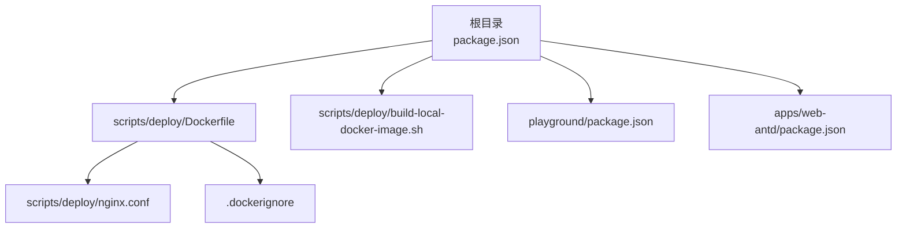
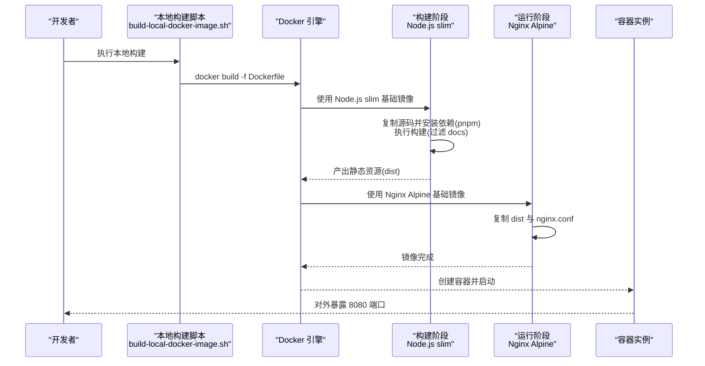
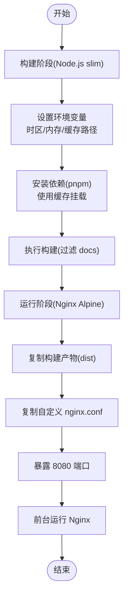
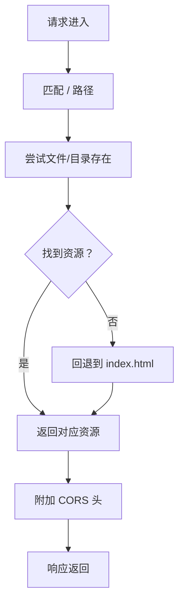
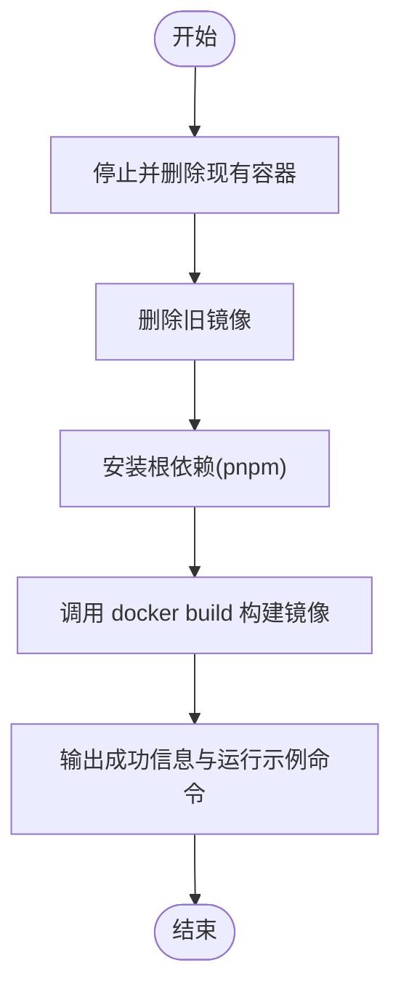
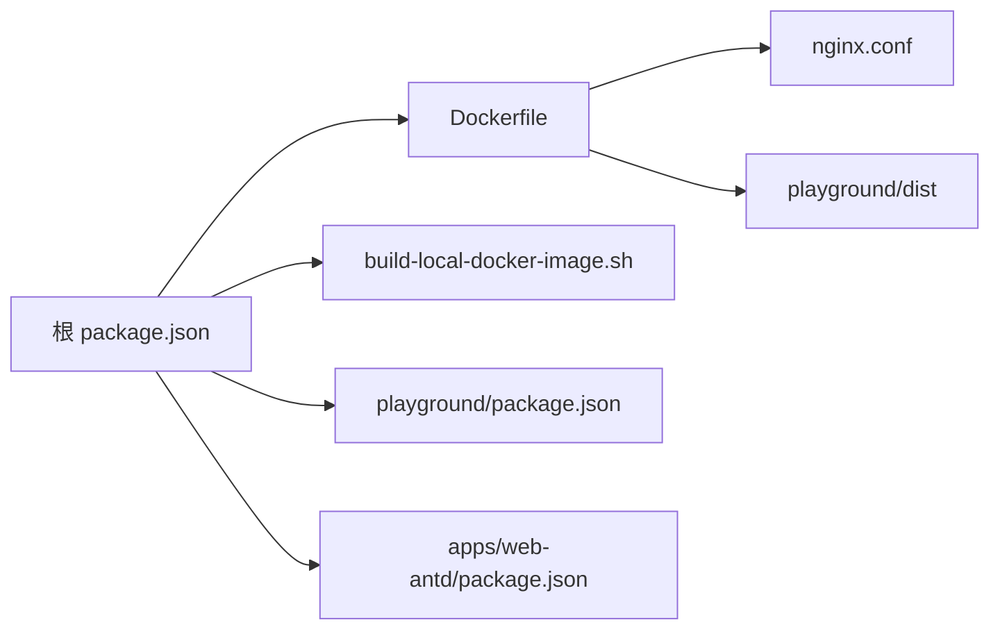

# 容器化部署

<cite>
**本文引用的文件**
- [Dockerfile](file://scripts/deploy/Dockerfile)
- [nginx.conf](file://scripts/deploy/nginx.conf)
- [build-local-docker-image.sh](file://scripts/deploy/build-local-docker-image.sh)
- [.dockerignore](file://.dockerignore)
- [package.json（根）](file://package.json)
- [package.json（playground 应用）](file://playground/package.json)
- [package.json（web-antd 应用）](file://apps/web-antd/package.json)
</cite>

## 目录
1. [简介](#简介)
2. [项目结构](#项目结构)
3. [核心组件](#核心组件)
4. [架构总览](#架构总览)
5. [详细组件分析](#详细组件分析)
6. [依赖关系分析](#依赖关系分析)
7. [性能考量](#性能考量)
8. [故障排查指南](#故障排查指南)
9. [结论](#结论)
10. [附录](#附录)

## 简介
本指南面向 Vben Admin 的容器化部署，围绕多阶段 Docker 构建与 Nginx 运行、Dockerfile 的分层策略、依赖安装与构建流程、镜像优化、以及本地开发与生产环境的镜像构建与运行示例进行系统性说明。同时提供容器环境变量配置、时区设置、内存限制、网络端口映射等最佳实践，并给出日志与监控建议。

## 项目结构
与容器化直接相关的核心文件位于 scripts/deploy 目录，配合根目录与各应用包的构建脚本共同完成前端产物的生成与打包。

图表来源
- [Dockerfile:1-38](file://scripts/deploy/Dockerfile#L1-L38)
- [nginx.conf:1-76](file://scripts/deploy/nginx.conf#L1-L76)
- [build-local-docker-image.sh:1-56](file://scripts/deploy/build-local-docker-image.sh#L1-L56)
- [.dockerignore:1-8](file://.dockerignore#L1-L8)
- [package.json（根）:1-109](file://package.json#L1-L109)
- [package.json（playground 应用）:1-62](file://playground/package.json#L1-L62)
- [package.json（web-antd 应用）:1-67](file://apps/web-antd/package.json#L1-L67)

章节来源
- [Dockerfile:1-38](file://scripts/deploy/Dockerfile#L1-L38)
- [build-local-docker-image.sh:1-56](file://scripts/deploy/build-local-docker-image.sh#L1-L56)
- [.dockerignore:1-8](file://.dockerignore#L1-L8)
- [package.json（根）:1-109](file://package.json#L1-L109)

## 核心组件
- 多阶段 Dockerfile：以 Node.js slim 基础镜像作为构建阶段，使用 pnpm 缓存加速依赖安装；以 Nginx Alpine 作为运行阶段，复制构建产物与自定义 Nginx 配置，暴露 8080 端口。
- 自定义 Nginx 配置：启用 mjs 类型支持、CORS 头、SPA 回退到 index.html、错误页映射等。
- 本地构建脚本：封装停止/删除容器、删除旧镜像、安装依赖、构建镜像、输出运行示例命令与日志记录。
- .dockerignore：排除不必要的文件与目录，减少构建上下文体积，提升构建效率。
- 构建入口脚本：根 package.json 提供统一的构建入口，playground 与各 UI 框架应用分别提供独立构建脚本。

章节来源
- [Dockerfile:1-38](file://scripts/deploy/Dockerfile#L1-L38)
- [nginx.conf:1-76](file://scripts/deploy/nginx.conf#L1-L76)
- [build-local-docker-image.sh:1-56](file://scripts/deploy/build-local-docker-image.sh#L1-L56)
- [.dockerignore:1-8](file://.dockerignore#L1-L8)
- [package.json（根）:27-36](file://package.json#L27-L36)
- [package.json（playground 应用）:18-27](file://playground/package.json#L18-L27)
- [package.json（web-antd 应用）:18-24](file://apps/web-antd/package.json#L18-L24)

## 架构总览
下图展示从源码到最终运行容器的关键步骤与组件交互：

图表来源
- [Dockerfile:1-38](file://scripts/deploy/Dockerfile#L1-L38)
- [build-local-docker-image.sh:25-28](file://scripts/deploy/build-local-docker-image.sh#L25-L28)
- [nginx.conf:49-74](file://scripts/deploy/nginx.conf#L49-L74)

## 详细组件分析

### 组件一：多阶段 Dockerfile 分析
- 构建阶段（Node.js slim）
  - 设置 pnpm 缓存路径与全局缓存挂载，加速依赖安装。
  - 设置 Node.js 内存上限参数，避免大项目构建 OOM。
  - 设置时区环境变量，确保容器内时间与期望一致。
  - 复制源码后执行 pnpm 安装与构建，过滤掉文档子包。
- 运行阶段（Nginx Alpine）
  - 新增 mjs MIME 类型支持，修正现代前端产物类型识别。
  - 删除默认 Nginx 配置，使用自定义配置文件。
  - 将构建产物复制至 Nginx Web 根目录。
  - 暴露 8080 端口，前台运行 Nginx。
- 关键优化点
  - 使用 pnpm 缓存与只读锁文件，缩短构建时间。
  - 多阶段分离，运行镜像仅包含 Nginx 与产物，减小体积。
  - .dockerignore 排除 node_modules、dist、.turbo 等，降低上下文大小。

图表来源
- [Dockerfile:1-38](file://scripts/deploy/Dockerfile#L1-L38)
- [.dockerignore:1-8](file://.dockerignore#L1-L8)

章节来源
- [Dockerfile:1-38](file://scripts/deploy/Dockerfile#L1-L38)
- [.dockerignore:1-8](file://.dockerignore#L1-L8)

### 组件二：Nginx 配置分析
- MIME 类型扩展：新增对 mjs 的类型支持，避免动态导入 JS 文件被错误解析。
- CORS 支持：在根路径下添加通用 CORS 头，便于跨域访问。
- SPA 回退：try_files 将未命中路由回退到 index.html，适配前端路由。
- 错误页映射：将常见错误映射到静态页面，提升用户体验。
- 端口与监听：监听 8080 端口，server_name 为 localhost。

图表来源
- [nginx.conf:49-74](file://scripts/deploy/nginx.conf#L49-L74)

章节来源
- [nginx.conf:1-76](file://scripts/deploy/nginx.conf#L1-L76)

### 组件三：本地构建脚本分析
- 停止并移除同名容器与旧镜像，保证构建一致性。
- 安装根依赖（pnpm install），确保后续构建可用。
- 调用 docker build 指令，基于根目录的 Dockerfile 构建镜像。
- 成功后输出示例运行命令（端口映射 8010:8080），并写入日志文件。

图表来源
- [build-local-docker-image.sh:1-56](file://scripts/deploy/build-local-docker-image.sh#L1-L56)

章节来源
- [build-local-docker-image.sh:1-56](file://scripts/deploy/build-local-docker-image.sh#L1-L56)

### 组件四：构建入口与应用脚本
- 根 package.json 提供统一构建入口，其中包含针对不同 UI 框架的构建脚本与 Docker 本地构建脚本。
- playground 与各 UI 框架应用各自提供独立的构建脚本，用于生产模式构建与预览。

章节来源
- [package.json（根）:27-36](file://package.json#L27-L36)
- [package.json（playground 应用）:18-27](file://playground/package.json#L18-L27)
- [package.json（web-antd 应用）:18-24](file://apps/web-antd/package.json#L18-L24)

## 依赖关系分析
- Dockerfile 依赖于 scripts/deploy 下的 nginx.conf 与构建产物目录。
- 本地构建脚本依赖 Docker 引擎与 pnpm 工具链。
- 构建产物来自各应用的构建脚本，最终由 Nginx 阶段提供静态服务。

图表来源
- [Dockerfile:1-38](file://scripts/deploy/Dockerfile#L1-L38)
- [build-local-docker-image.sh:1-56](file://scripts/deploy/build-local-docker-image.sh#L1-L56)
- [nginx.conf:1-76](file://scripts/deploy/nginx.conf#L1-L76)
- [package.json（根）:1-109](file://package.json#L1-L109)
- [package.json（playground 应用）:1-62](file://playground/package.json#L1-L62)
- [package.json（web-antd 应用）:1-67](file://apps/web-antd/package.json#L1-L67)

章节来源
- [Dockerfile:1-38](file://scripts/deploy/Dockerfile#L1-L38)
- [build-local-docker-image.sh:1-56](file://scripts/deploy/build-local-docker-image.sh#L1-L56)
- [nginx.conf:1-76](file://scripts/deploy/nginx.conf#L1-L76)
- [package.json（根）:1-109](file://package.json#L1-L109)

## 性能考量
- 构建阶段
  - 使用 pnpm 缓存挂载，显著减少重复安装时间。
  - 使用只读锁文件，确保依赖一致性与可复现性。
  - 在 Node.js 环境中设置内存上限，避免大项目构建时 OOM。
- 运行阶段
  - 仅包含 Nginx 与构建产物，镜像体积小，启动快。
  - 自定义 MIME 类型与 SPA 回退，减少客户端路由失败导致的 404。
- 上下文优化
  - .dockerignore 排除 node_modules、dist、.turbo 等，缩小构建上下文，提升构建速度与安全性。

章节来源
- [Dockerfile:1-38](file://scripts/deploy/Dockerfile#L1-L38)
- [.dockerignore:1-8](file://.dockerignore#L1-L8)

## 故障排查指南
- 构建失败
  - 检查本地是否已安装 pnpm 并具备网络访问能力。
  - 查看本地构建脚本日志文件，定位具体失败步骤。
  - 确认 Docker 引擎可用且有足够磁盘空间。
- 运行异常
  - 确认容器端口映射正确（示例命令为 8010:8080）。
  - 检查 Nginx 配置中的 CORS 与 MIME 类型是否满足需求。
  - 如需查看容器日志，可通过 Docker 日志命令进行采集。
- 内存问题
  - 若构建阶段出现内存不足，适当提高宿主机内存或调整 Node.js 内存上限参数。
- 时区问题
  - 若容器内时间不正确，确认时区环境变量已生效，必要时在运行时覆盖。

章节来源
- [build-local-docker-image.sh:1-56](file://scripts/deploy/build-local-docker-image.sh#L1-L56)
- [Dockerfile:6-7](file://scripts/deploy/Dockerfile#L6-L7)
- [nginx.conf:57-66](file://scripts/deploy/nginx.conf#L57-L66)

## 结论
通过多阶段 Dockerfile 与 Nginx 运行阶段的组合，Vben Admin 实现了高效的前端产物打包与稳定的服务发布。结合 pnpm 缓存、最小化运行镜像与合理的 CORS/MIME 配置，能够在本地与生产环境中快速获得一致的部署体验。建议在生产环境中进一步完善镜像签名、安全扫描与健康检查策略，并结合容器编排平台实现弹性扩缩容与滚动更新。

## 附录
- 本地开发与生产环境示例
  - 本地开发：使用根脚本触发构建，随后通过本地构建脚本生成镜像并运行容器。
  - 生产环境：在 CI/CD 中执行相同构建流程，产出镜像并推送到镜像仓库，再通过编排平台部署。
- 环境变量与配置
  - 时区：通过环境变量设置容器时区。
  - 内存限制：在构建阶段设置 Node.js 内存上限，避免 OOM。
  - 网络配置：容器对外暴露 8080 端口，按需映射到宿主端口。
- 镜像推送与版本管理
  - 建议在 CI/CD 中根据分支/标签打上版本标签，推送至镜像仓库，实现可追溯的版本管理。
- 容器监控与日志收集
  - 建议开启 Nginx 访问日志与错误日志，并通过集中式日志系统收集。
  - 结合容器平台的指标采集（CPU、内存、请求数、错误率）进行监控告警。