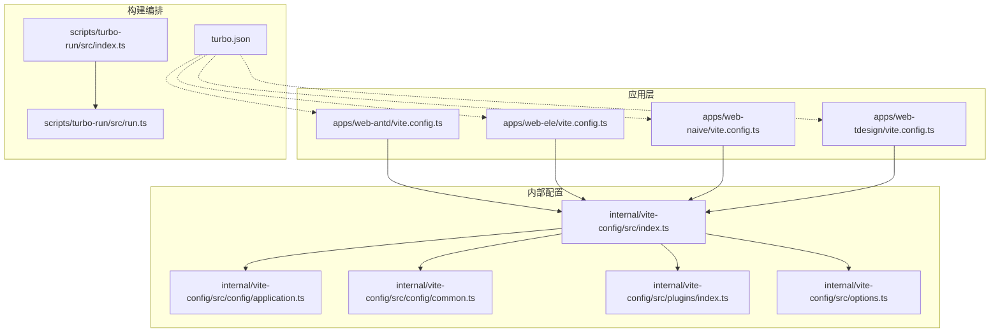
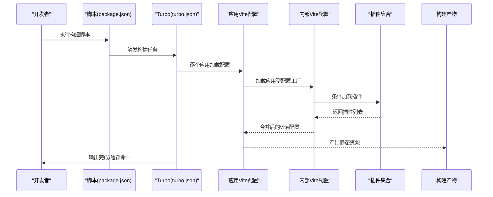
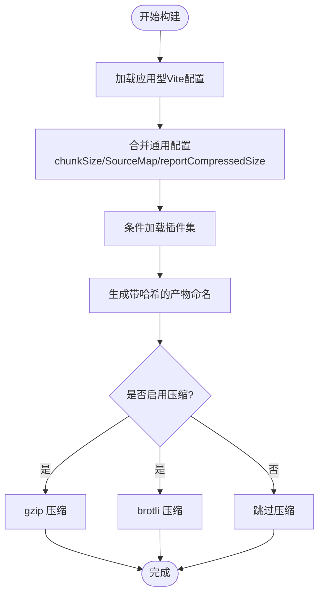
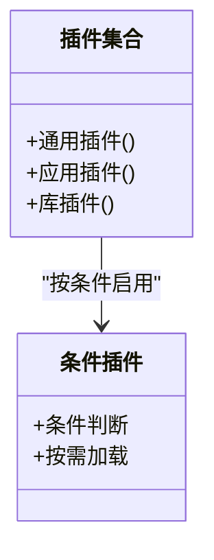
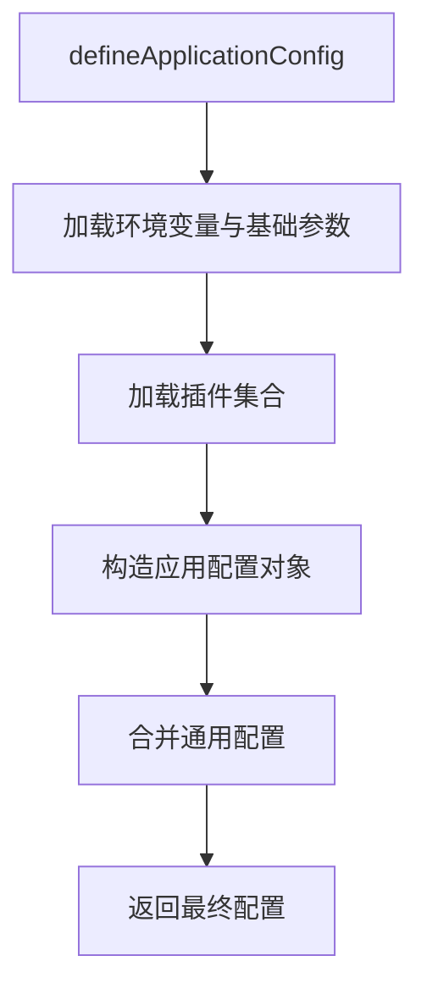
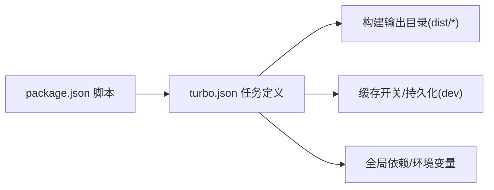

# 构建优化

<cite>
**本文引用的文件**
- [turbo.json](file://turbo.json)
- [package.json](file://package.json)
- [apps/web-antd/vite.config.ts](file://apps/web-antd/vite.config.ts)
- [internal/vite-config/src/index.ts](file://internal/vite-config/src/index.ts)
- [internal/vite-config/src/config/application.ts](file://internal/vite-config/src/config/application.ts)
- [internal/vite-config/src/config/common.ts](file://internal/vite-config/src/config/common.ts)
- [internal/vite-config/src/plugins/index.ts](file://internal/vite-config/src/plugins/index.ts)
- [internal/vite-config/src/options.ts](file://internal/vite-config/src/options.ts)
- [scripts/turbo-run/src/index.ts](file://scripts/turbo-run/src/index.ts)
- [scripts/turbo-run/src/run.ts](file://scripts/turbo-run/src/run.ts)
- [docs/src/en/guide/essentials/build.md](file://docs/src/en/guide/essentials/build.md)
- [docs/src/en/guide/project/vite.md](file://docs/src/en/guide/project/vite.md)
- [internal/vite-config/src/plugins/license.ts](file://internal/vite-config/src/plugins/license.ts)
</cite>

## 目录

1. [简介](#简介)
2. [项目结构](#项目结构)
3. [核心组件](#核心组件)
4. [架构总览](#架构总览)
5. [详细组件分析](#详细组件分析)
6. [依赖分析](#依赖分析)
7. [性能考量](#性能考量)
8. [故障排查指南](#故障排查指南)
9. [结论](#结论)
10. [附录](#附录)

## 简介

本指南面向使用 Vben Admin 的开发者，系统讲解生产级构建优化策略，涵盖以下主题：

- Vite 构建配置优化：代码分割、Tree Shaking、资源压缩、缓存策略
- Turbo 构建系统：任务并行化、缓存机制、依赖拓扑
- 生产环境构建流程：依赖预打包、产物优化、性能监控
- 实战建议：配置示例路径、最佳实践、构建时间分析与优化效果对比方法

## 项目结构

Vben Admin 采用 Monorepo 结构，核心构建能力由内部封装的 Vite 配置与 Turbo 并行构建组成。关键位置如下：

- 应用层 Vite 配置：各前端应用（如 web-antd）通过统一入口加载内部配置
- 内部配置与插件：集中于 internal/vite-config，提供应用型/库型配置、插件集合与默认选项
- 构建编排：Turbo 负责跨包任务并行与缓存；脚本层提供交互式运行器

图表来源

- [apps/web-antd/vite.config.ts:1-21](file://apps/web-antd/vite.config.ts#L1-L21)
- [internal/vite-config/src/index.ts:1-6](file://internal/vite-config/src/index.ts#L1-L6)
- [internal/vite-config/src/config/application.ts:1-124](file://internal/vite-config/src/config/application.ts#L1-L124)
- [internal/vite-config/src/config/common.ts:1-14](file://internal/vite-config/src/config/common.ts#L1-L14)
- [internal/vite-config/src/plugins/index.ts:1-254](file://internal/vite-config/src/plugins/index.ts#L1-L254)
- [internal/vite-config/src/options.ts:1-46](file://internal/vite-config/src/options.ts#L1-L46)
- [turbo.json:1-49](file://turbo.json#L1-L49)
- [scripts/turbo-run/src/index.ts:1-24](file://scripts/turbo-run/src/index.ts#L1-L24)
- [scripts/turbo-run/src/run.ts:1-68](file://scripts/turbo-run/src/run.ts#L1-L68)

章节来源

- [turbo.json:1-49](file://turbo.json#L1-L49)
- [package.json:27-66](file://package.json#L27-L66)
- [apps/web-antd/vite.config.ts:1-21](file://apps/web-antd/vite.config.ts#L1-L21)
- [internal/vite-config/src/index.ts:1-6](file://internal/vite-config/src/index.ts#L1-L6)
- [internal/vite-config/src/config/application.ts:1-124](file://internal/vite-config/src/config/application.ts#L1-L124)
- [internal/vite-config/src/config/common.ts:1-14](file://internal/vite-config/src/config/common.ts#L1-L14)
- [internal/vite-config/src/plugins/index.ts:1-254](file://internal/vite-config/src/plugins/index.ts#L1-L254)
- [internal/vite-config/src/options.ts:1-46](file://internal/vite-config/src/options.ts#L1-L46)
- [scripts/turbo-run/src/index.ts:1-24](file://scripts/turbo-run/src/index.ts#L1-L24)
- [scripts/turbo-run/src/run.ts:1-68](file://scripts/turbo-run/src/run.ts#L1-L68)

## 核心组件

- 应用型 Vite 配置工厂：负责合并通用配置、加载插件、设置构建输出命名规则、开发服务器与预热等
- 插件体系：按条件启用的插件集合，覆盖 Vue/JSX、PWA、压缩、HTML 压缩、ImportMap、Nitro Mock、版权注入等
- 通用构建配置：统一的 chunkSize 报警阈值、是否生成 SourceMap、是否报告压缩大小等
- Turbo 编排：定义任务依赖、输出目录、缓存开关、持久化任务等
- 交互式运行器：在多应用场景下选择并执行指定命令

章节来源

- [internal/vite-config/src/config/application.ts:17-99](file://internal/vite-config/src/config/application.ts#L17-L99)
- [internal/vite-config/src/plugins/index.ts:94-223](file://internal/vite-config/src/plugins/index.ts#L94-L223)
- [internal/vite-config/src/config/common.ts:3-11](file://internal/vite-config/src/config/common.ts#L3-L11)
- [turbo.json:15-47](file://turbo.json#L15-L47)
- [scripts/turbo-run/src/index.ts:7-23](file://scripts/turbo-run/src/index.ts#L7-L23)
- [scripts/turbo-run/src/run.ts:9-52](file://scripts/turbo-run/src/run.ts#L9-L52)

## 架构总览

下图展示从命令到构建产物的关键路径，以及 Turbo 如何协调多应用并行构建。

图表来源

- [package.json:27-66](file://package.json#L27-L66)
- [turbo.json:15-24](file://turbo.json#L15-L24)
- [apps/web-antd/vite.config.ts:3-20](file://apps/web-antd/vite.config.ts#L3-L20)
- [internal/vite-config/src/config/application.ts:17-99](file://internal/vite-config/src/config/application.ts#L17-L99)
- [internal/vite-config/src/plugins/index.ts:94-223](file://internal/vite-config/src/plugins/index.ts#L94-L223)

## 详细组件分析

### Vite 构建配置优化

- 代码分割与命名
  - 入口、分块、静态资源文件名采用带哈希的命名策略，便于浏览器缓存与失效控制
  - 目标环境设定为较新的 ES 版本，有利于现代浏览器的原生特性利用
- Tree Shaking
  - 通过库侧的 ESM 导出与 Rollup/Terser 配合实现副作用最小化
  - 插件条件加载减少非必要处理，间接提升摇树效率
- 资源压缩
  - 支持按需启用 gzip/brotli 压缩，产物可直接被服务端或 CDN 使用
  - HTML 与 JS/CSS 均可压缩，结合 PWA Manifest 与 Workbox 可选策略
- 缓存策略
  - 文件名含哈希，结合服务端缓存头可实现强缓存
  - 开发阶段预热关键文件，缩短首次启动时间

图表来源

- [internal/vite-config/src/config/application.ts:60-76](file://internal/vite-config/src/config/application.ts#L60-L76)
- [internal/vite-config/src/config/common.ts:4-10](file://internal/vite-config/src/config/common.ts#L4-L10)
- [internal/vite-config/src/plugins/index.ts:184-199](file://internal/vite-config/src/plugins/index.ts#L184-L199)

章节来源

- [internal/vite-config/src/config/application.ts:58-98](file://internal/vite-config/src/config/application.ts#L58-L98)
- [internal/vite-config/src/config/common.ts:3-11](file://internal/vite-config/src/config/common.ts#L3-L11)
- [internal/vite-config/src/plugins/index.ts:94-223](file://internal/vite-config/src/plugins/index.ts#L94-L223)

### 插件体系与条件加载

- 通用插件：Vue、JSX、TailwindCSS、元数据注入等
- 应用特有：PWA、压缩、HTML 压缩、ImportMap、Nitro Mock、版权注入、可视化分析等
- 条件策略：仅在构建时启用压缩、仅在开发时启用 DevTools、仅在构建时启用可视化分析等

图表来源

- [internal/vite-config/src/plugins/index.ts:36-89](file://internal/vite-config/src/plugins/index.ts#L36-L89)
- [internal/vite-config/src/plugins/index.ts:94-223](file://internal/vite-config/src/plugins/index.ts#L94-L223)

章节来源

- [internal/vite-config/src/plugins/index.ts:36-89](file://internal/vite-config/src/plugins/index.ts#L36-L89)
- [internal/vite-config/src/plugins/index.ts:94-223](file://internal/vite-config/src/plugins/index.ts#L94-L223)

### 应用型配置工厂

- 统一加载环境变量与基础配置
- 合并通用配置与用户自定义配置
- 设置开发服务器、预热、PWA、ImportMap 等

图表来源

- [internal/vite-config/src/config/application.ts:17-99](file://internal/vite-config/src/config/application.ts#L17-L99)

章节来源

- [internal/vite-config/src/config/application.ts:17-99](file://internal/vite-config/src/config/application.ts#L17-L99)

### 通用构建配置

- 统一的 chunkSize 报警阈值，避免过大分块
- 默认关闭 SourceMap 以加速构建，可在需要时开启
- 关闭压缩大小报告，降低构建开销

章节来源

- [internal/vite-config/src/config/common.ts:3-11](file://internal/vite-config/src/config/common.ts#L3-L11)

### PWA 与 ImportMap 选项

- PWA 默认注入 Manifest 与 Workbox 配置，可按需扩展
- ImportMap 默认提供常用依赖的 CDN 提供商配置，当前未默认启用

章节来源

- [internal/vite-config/src/options.ts:7-46](file://internal/vite-config/src/options.ts#L7-L46)

### 版权注入插件

- 在构建产物的入口 chunk 中注入版权信息，便于合规与溯源

章节来源

- [internal/vite-config/src/plugins/license.ts:17-63](file://internal/vite-config/src/plugins/license.ts#L17-L63)

### 应用 Vite 配置示例

- 各应用通过统一入口加载内部配置，并可叠加本地 server 代理等个性化设置

章节来源

- [apps/web-antd/vite.config.ts:3-20](file://apps/web-antd/vite.config.ts#L3-L20)

### 文档中的压缩与部署建议

- 文档提供了在生产环境启用 gzip 与 brotli 的配置方式与 Nginx 示例，便于服务端生效

章节来源

- [docs/src/en/guide/essentials/build.md:71-116](file://docs/src/en/guide/essentials/build.md#L71-L116)

## 依赖分析

- 任务依赖与输出
  - 构建任务依赖上游包的构建结果，确保产物一致性
  - 定义了 dist、dist.zip、文档产物等输出目录，Turbo 可据此进行缓存
- 缓存与持久化
  - 开发任务禁用缓存并持久化，保证实时性
  - 全局依赖与环境变量纳入缓存判定范围

图表来源

- [package.json:27-66](file://package.json#L27-L66)
- [turbo.json:15-47](file://turbo.json#L15-L47)

章节来源

- [turbo.json:1-49](file://turbo.json#L1-L49)
- [package.json:27-66](file://package.json#L27-L66)

## 性能考量

- 构建速度
  - 使用 Turbo 并行构建多应用，显著缩短整体构建时间
  - 开发阶段启用预热与 DevTools，提升迭代效率
- 产物体积
  - 通过代码分割与 Tree Shaking 控制体积
  - 启用压缩与合理命名策略，配合 CDN/服务端缓存
- 可观测性
  - 构建后可生成可视化报告，定位大体积模块
  - 通过日志与打印插件记录构建信息

## 故障排查指南

- 构建失败或缓存异常
  - 检查 turbo.json 中的 globalDependencies 与 tasks 的 outputs 是否正确
  - 清理缓存后重试，确认锁文件与环境变量一致
- 插件冲突或功能未生效
  - 确认插件条件是否满足（如仅构建时启用压缩）
  - 检查插件顺序与作用域（如 DevTools 仅开发有效）
- 产物体积过大
  - 使用可视化分析定位大模块，检查第三方依赖与导入路径
  - 调整 ImportMap 与 PWA 策略，避免重复打包

章节来源

- [turbo.json:1-49](file://turbo.json#L1-L49)
- [internal/vite-config/src/plugins/index.ts:94-223](file://internal/vite-config/src/plugins/index.ts#L94-L223)

## 结论

通过统一的内部 Vite 配置与 Turbo 并行构建，Vben Admin 在多应用场景下实现了高效的构建流水线。结合代码分割、Tree Shaking、压缩与缓存策略，可在保证开发体验的同时获得更优的生产性能。建议在团队内固化配置模板与最佳实践，并持续利用可视化工具与缓存策略进行优化迭代。

## 附录

- 实战建议
  - 在生产环境启用 gzip/brotli 压缩，并在服务端正确配置
  - 使用 ImportMap 与 PWA 策略平衡首屏与更新体验
  - 将构建时间与产物体积纳入 CI 报告，建立基线与回归测试
- 配置示例路径
  - 应用型配置工厂：[internal/vite-config/src/config/application.ts:17-99](file://internal/vite-config/src/config/application.ts#L17-L99)
  - 插件集合与条件加载：[internal/vite-config/src/plugins/index.ts:94-223](file://internal/vite-config/src/plugins/index.ts#L94-L223)
  - 通用构建配置：[internal/vite-config/src/config/common.ts:3-11](file://internal/vite-config/src/config/common.ts#L3-L11)
  - Turbo 任务与缓存：[turbo.json:15-47](file://turbo.json#L15-L47)
  - 交互式运行器：[scripts/turbo-run/src/index.ts:7-23](file://scripts/turbo-run/src/index.ts#L7-L23)、[scripts/turbo-run/src/run.ts:9-52](file://scripts/turbo-run/src/run.ts#L9-L52)
  - 文档中的压缩与部署建议：[docs/src/en/guide/essentials/build.md:71-116](file://docs/src/en/guide/essentials/build.md#L71-L116)
  - Vite 配置使用说明：[docs/src/en/guide/project/vite.md:1-34](file://docs/src/en/guide/project/vite.md#L1-L34)
