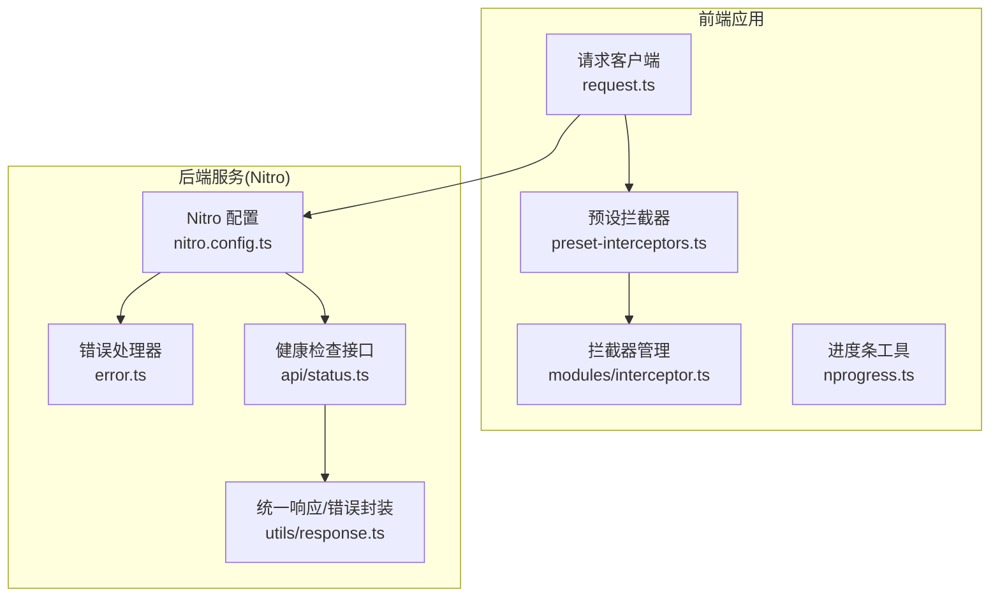
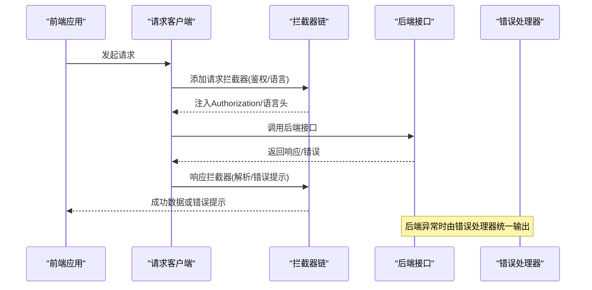
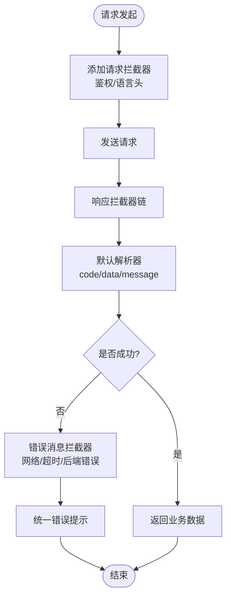
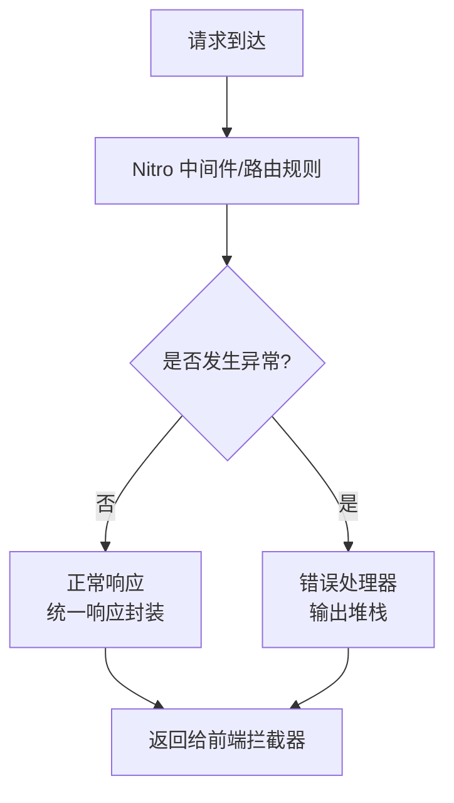
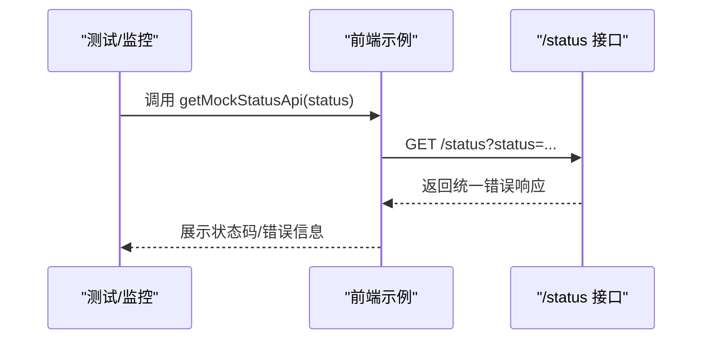
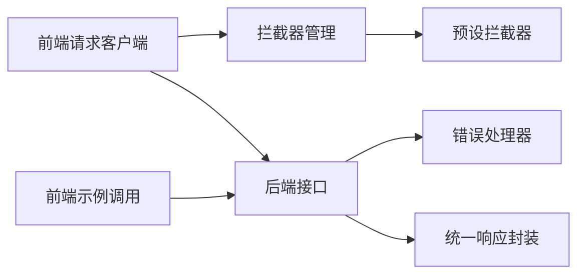

# 监控与日志

<cite>
**本文引用的文件**
- [nitro.config.ts](file://apps/backend-mock/nitro.config.ts)
- [error.ts](file://apps/backend-mock/error.ts)
- [response.ts](file://apps/backend-mock/utils/response.ts)
- [request.ts（Ant Design 版本）](file://apps/web-antd/src/api/request.ts)
- [request.ts（Element 版本）](file://apps/web-ele/src/api/request.ts)
- [request.ts（Naive 版本）](file://apps/web-naive/src/api/request.ts)
- [request.ts（Ant Design Vue Next 版本）](file://apps/web-antdv-next/src/api/request.ts)
- [preset-interceptors.ts](file://packages/effects/request/src/request-client/preset-interceptors.ts)
- [interceptor.ts](file://packages/effects/request/src/request-client/modules/interceptor.ts)
- [status.ts（后端状态接口）](file://apps/backend-mock/api/status.ts)
- [status.ts（前端示例调用）](file://playground/src/api/examples/status.ts)
- [vite.config.ts（Web Antd）](file://apps/web-antd/vite.config.ts)
- [nprogress.ts](file://packages/@core/base/shared/src/utils/nprogress.ts)
</cite>

## 目录

1. [简介](#简介)
2. [项目结构](#项目结构)
3. [核心组件](#核心组件)
4. [架构总览](#架构总览)
5. [详细组件分析](#详细组件分析)
6. [依赖关系分析](#依赖关系分析)
7. [性能考量](#性能考量)
8. [故障排查指南](#故障排查指南)
9. [结论](#结论)
10. [附录：多环境配置示例](#附录多环境配置示例)

## 简介

本指南面向 Vben Admin 的监控与日志体系，聚焦以下目标：

- 应用性能监控：关键指标采集与告警配置思路
- 错误追踪与日志记录：前端错误捕获与后端异常处理
- 日志聚合与分析：ELK Stack 或类似方案的对接要点
- 健康检查端点：实现与监控集成
- 多环境配置：开发、测试、生产差异化设置
- 性能基准与容量规划：指导原则与实践建议

当前仓库已具备基础的请求拦截、统一响应、错误处理与健康检查端点，可作为构建完整监控与日志体系的起点。

## 项目结构

围绕监控与日志的关键目录与文件如下：

- 后端 Mock 服务（Nitro）：统一错误处理器、CORS 配置、路由规则
- 前端请求层：拦截器链路、统一错误提示、进度条
- 统一响应与错误封装：前后端一致的响应结构
- 健康检查端点：用于外部监控系统探测

图表来源

- [nitro.config.ts:1-21](file://apps/backend-mock/nitro.config.ts#L1-L21)
- [error.ts:1-8](file://apps/backend-mock/error.ts#L1-L8)
- [response.ts:1-71](file://apps/backend-mock/utils/response.ts#L1-L71)
- [status.ts（后端状态接口）:1-8](file://apps/backend-mock/api/status.ts#L1-L8)
- [preset-interceptors.ts:1-134](file://packages/effects/request/src/request-client/preset-interceptors.ts#L1-L134)
- [interceptor.ts:1-40](file://packages/effects/request/src/request-client/modules/interceptor.ts#L1-L40)
- [nprogress.ts:1-34](file://packages/@core/base/shared/src/utils/nprogress.ts#L1-L34)

章节来源

- [nitro.config.ts:1-21](file://apps/backend-mock/nitro.config.ts#L1-L21)
- [vite.config.ts（Web Antd）:1-21](file://apps/web-antd/vite.config.ts#L1-L21)

## 核心组件

- 前端请求与拦截
  - 请求客户端在各 Web 包中以统一方式初始化，添加请求/响应拦截器，完成鉴权头注入、统一响应解析、错误提示与 Token 刷新等。
  - 预设拦截器提供默认响应解析、错误消息提取与网络超时/断网兜底提示。
  - 拦截器管理模块负责注册与扩展拦截器链。
- 后端错误处理与统一响应
  - Nitro 错误处理器统一输出错误堆栈；CORS 与路由规则便于跨域与代理。
  - 统一响应封装提供成功/分页/错误/未授权/禁止等标准结构，便于前端统一消费。
- 健康检查端点
  - 提供可配置状态码的健康检查接口，便于外部监控系统探测可用性。

章节来源

- [request.ts（Ant Design 版本）:93-112](file://apps/web-antd/src/api/request.ts#L93-L112)
- [request.ts（Element 版本）:94-113](file://apps/web-ele/src/api/request.ts#L94-L113)
- [request.ts（Naive 版本）:93-112](file://apps/web-naive/src/api/request.ts#L93-L112)
- [request.ts（Ant Design Vue Next 版本）:59-113](file://apps/web-antdv-next/src/api/request.ts#L59-L113)
- [preset-interceptors.ts:1-134](file://packages/effects/request/src/request-client/preset-interceptors.ts#L1-L134)
- [interceptor.ts:1-40](file://packages/effects/request/src/request-client/modules/interceptor.ts#L1-L40)
- [nitro.config.ts:1-21](file://apps/backend-mock/nitro.config.ts#L1-L21)
- [error.ts:1-8](file://apps/backend-mock/error.ts#L1-L8)
- [response.ts:1-71](file://apps/backend-mock/utils/response.ts#L1-L71)
- [status.ts（后端状态接口）:1-8](file://apps/backend-mock/api/status.ts#L1-L8)

## 架构总览

下图展示从前端到后端的请求流与错误处理路径，以及健康检查端点的接入位置。

图表来源

- [request.ts（Ant Design Vue Next 版本）:59-113](file://apps/web-antdv-next/src/api/request.ts#L59-L113)
- [preset-interceptors.ts:1-134](file://packages/effects/request/src/request-client/preset-interceptors.ts#L1-L134)
- [nitro.config.ts:1-21](file://apps/backend-mock/nitro.config.ts#L1-L21)
- [error.ts:1-8](file://apps/backend-mock/error.ts#L1-L8)

## 详细组件分析

### 前端请求与拦截器链

- 请求拦截器：注入 Authorization 与语言头，支持刷新 Token 的队列机制。
- 响应拦截器：默认解析器按约定字段判断成功/失败；错误消息拦截器统一处理网络错误、超时与后端错误体。
- 拦截器管理：提供注册请求/响应拦截器的统一入口，便于扩展。

图表来源

- [preset-interceptors.ts:1-134](file://packages/effects/request/src/request-client/preset-interceptors.ts#L1-L134)
- [interceptor.ts:1-40](file://packages/effects/request/src/request-client/modules/interceptor.ts#L1-L40)
- [request.ts（Ant Design Vue Next 版本）:59-113](file://apps/web-antdv-next/src/api/request.ts#L59-L113)

章节来源

- [preset-interceptors.ts:1-134](file://packages/effects/request/src/request-client/preset-interceptors.ts#L1-L134)
- [interceptor.ts:1-40](file://packages/effects/request/src/request-client/modules/interceptor.ts#L1-L40)
- [request.ts（Ant Design 版本）:93-112](file://apps/web-antd/src/api/request.ts#L93-L112)
- [request.ts（Element 版本）:94-113](file://apps/web-ele/src/api/request.ts#L94-L113)
- [request.ts（Naive 版本）:93-112](file://apps/web-naive/src/api/request.ts#L93-L112)
- [request.ts（Ant Design Vue Next 版本）:59-113](file://apps/web-antdv-next/src/api/request.ts#L59-L113)

### 后端错误处理与统一响应

- Nitro 错误处理器：在开发与生产环境分别通过 devErrorHandler 与 errorHandler 输出错误堆栈，便于定位问题。
- 统一响应封装：提供成功、分页、错误、未授权、禁止等结构，前端可据此统一处理。
- CORS 与路由规则：对 /api/\*\* 开启跨域与常用方法/头，便于前端代理与跨域调试。

图表来源

- [nitro.config.ts:1-21](file://apps/backend-mock/nitro.config.ts#L1-L21)
- [error.ts:1-8](file://apps/backend-mock/error.ts#L1-L8)
- [response.ts:1-71](file://apps/backend-mock/utils/response.ts#L1-L71)

章节来源

- [nitro.config.ts:1-21](file://apps/backend-mock/nitro.config.ts#L1-L21)
- [error.ts:1-8](file://apps/backend-mock/error.ts#L1-L8)
- [response.ts:1-71](file://apps/backend-mock/utils/response.ts#L1-L71)

### 健康检查端点

- 后端提供 /status 接口，可通过查询参数设置状态码并返回统一错误结构，便于外部监控系统探测。
- 前端示例调用：通过 requestClient 调用 /status，可用于自测或集成到探活脚本。

图表来源

- [status.ts（后端状态接口）:1-8](file://apps/backend-mock/api/status.ts#L1-L8)
- [status.ts（前端示例调用）:1-10](file://playground/src/api/examples/status.ts#L1-L10)

章节来源

- [status.ts（后端状态接口）:1-8](file://apps/backend-mock/api/status.ts#L1-L8)
- [status.ts（前端示例调用）:1-10](file://playground/src/api/examples/status.ts#L1-L10)

### 前端进度条与用户体验

- 进度条工具提供 startProgress/stopProgress/loadNprogress 等能力，可在请求开始与结束时控制进度显示，提升用户感知与反馈。

章节来源

- [nprogress.ts:1-34](file://packages/@core/base/shared/src/utils/nprogress.ts#L1-L34)

## 依赖关系分析

- 前端请求客户端依赖拦截器管理与预设拦截器，后者提供默认的成功/失败解析与错误消息处理。
- 后端 Nitro 配置依赖错误处理器与统一响应工具，保证异常与响应的一致性。
- 健康检查端点作为独立接口，被前端示例调用，形成外部监控的探测入口。

图表来源

- [interceptor.ts:1-40](file://packages/effects/request/src/request-client/modules/interceptor.ts#L1-L40)
- [preset-interceptors.ts:1-134](file://packages/effects/request/src/request-client/preset-interceptors.ts#L1-L134)
- [nitro.config.ts:1-21](file://apps/backend-mock/nitro.config.ts#L1-L21)
- [error.ts:1-8](file://apps/backend-mock/error.ts#L1-L8)
- [response.ts:1-71](file://apps/backend-mock/utils/response.ts#L1-L71)
- [status.ts（前端示例调用）:1-10](file://playground/src/api/examples/status.ts#L1-L10)

章节来源

- [interceptor.ts:1-40](file://packages/effects/request/src/request-client/modules/interceptor.ts#L1-L40)
- [preset-interceptors.ts:1-134](file://packages/effects/request/src/request-client/preset-interceptors.ts#L1-L134)
- [nitro.config.ts:1-21](file://apps/backend-mock/nitro.config.ts#L1-L21)
- [error.ts:1-8](file://apps/backend-mock/error.ts#L1-L8)
- [response.ts:1-71](file://apps/backend-mock/utils/response.ts#L1-L71)
- [status.ts（前端示例调用）:1-10](file://playground/src/api/examples/status.ts#L1-L10)

## 性能考量

- 请求与响应开销
  - 建议在拦截器中仅做必要处理（鉴权头、语言、统一解析），避免在请求链路中执行重计算。
  - 对大列表分页接口，优先使用后端分页与懒加载策略，减少一次性传输量。
- 超时与重试
  - 在拦截器中合理设置超时阈值，并区分网络错误与业务错误，避免对网络错误进行无意义重试。
- 进度条与渲染
  - 使用进度条提升感知，但避免频繁短时闪烁；对幂等且快速的请求可关闭进度条。
- 健康检查
  - 将 /status 作为轻量探针，避免在探针中执行复杂逻辑；状态码与响应体保持最小化。

[本节为通用指导，不直接分析具体文件]

## 故障排查指南

- 前端错误提示
  - 若出现网络错误或超时，拦截器会统一提示；请检查网络连通性与代理配置。
  - 若后端返回错误体，前端将读取 error 或 message 字段进行提示；请核对后端响应结构。
- 后端异常
  - Nitro 错误处理器会输出堆栈；请结合日志与堆栈定位问题。
  - 如遇跨域问题，请确认 Nitro 的 CORS 与路由规则配置。
- 健康检查
  - 使用 /status 接口验证后端可用性；若失败，检查后端进程与端口监听情况。

章节来源

- [preset-interceptors.ts:112-134](file://packages/effects/request/src/request-client/preset-interceptors.ts#L112-L134)
- [nitro.config.ts:1-21](file://apps/backend-mock/nitro.config.ts#L1-L21)
- [error.ts:1-8](file://apps/backend-mock/error.ts#L1-L8)
- [status.ts（后端状态接口）:1-8](file://apps/backend-mock/api/status.ts#L1-L8)

## 结论

本仓库已具备前端请求拦截、统一响应与后端错误处理的基础能力，可作为监控与日志体系的起点。建议在此基础上补充：

- 前端埋点与性能指标采集（如首屏时间、接口耗时、错误率）
- 后端指标导出（如 QPS、P95/P99、内存/CPU）
- 日志标准化与集中化（ELK/类似方案）
- 健康检查与告警策略（阈值、收敛、通知）

[本节为总结性内容，不直接分析具体文件]

## 附录：多环境配置示例

说明：以下为配置思路与要点，便于在不同环境落地。请结合实际部署与监控平台进行调整。

- 开发环境
  - 前端代理：将 /api 代理至本地后端服务，便于联调与热更新。
  - 后端：启用 devErrorHandler，便于开发时快速定位错误。
  - 健康检查：使用 /status 接口进行本地探活。

  章节来源
  - [vite.config.ts（Web Antd）:1-21](file://apps/web-antd/vite.config.ts#L1-L21)
  - [nitro.config.ts:1-21](file://apps/backend-mock/nitro.config.ts#L1-L21)
  - [status.ts（后端状态接口）:1-8](file://apps/backend-mock/api/status.ts#L1-L8)

- 测试环境
  - 前端：代理至测试后端，开启必要的跨域头与方法。
  - 后端：启用 errorHandler，保留统一错误输出以便问题复现。
  - 健康检查：对外暴露 /status，供测试监控系统轮询。

  章节来源
  - [nitro.config.ts:1-21](file://apps/backend-mock/nitro.config.ts#L1-L21)
  - [status.ts（后端状态接口）:1-8](file://apps/backend-mock/api/status.ts#L1-L8)

- 生产环境
  - 前端：代理指向生产后端域名，确保 HTTPS 与安全头。
  - 后端：启用 errorHandler 并接入日志系统，限制错误堆栈输出敏感信息。
  - 健康检查：仅暴露稳定端点，避免泄露内部细节。

  章节来源
  - [nitro.config.ts:1-21](file://apps/backend-mock/nitro.config.ts#L1-L21)
  - [error.ts:1-8](file://apps/backend-mock/error.ts#L1-L8)

- 日志聚合与分析（ELK/类似方案）
  - 前端：将错误事件与关键操作写入日志队列，定时上报；可选采样与脱敏。
  - 后端：将请求日志、错误日志与业务日志输出到 stdout/stderr，由容器/日志代理收集。
  - 分析：在 ELK 中建立索引模板、仪表盘与告警规则，覆盖错误率、响应时间、吞吐量等。

[本节为通用指导，不直接分析具体文件]

- 性能基准与容量规划
  - 基准测试：针对核心接口进行并发与延迟压测，记录 P50/P90/P95/P99。
  - 容量规划：结合峰值 QPS、平均响应时间与资源占用，预留 20%-30% 缓冲。
  - 监控告警：设定错误率、响应时间、超时比例与资源使用率阈值，配合收敛与通知。

[本节为通用指导，不直接分析具体文件]
