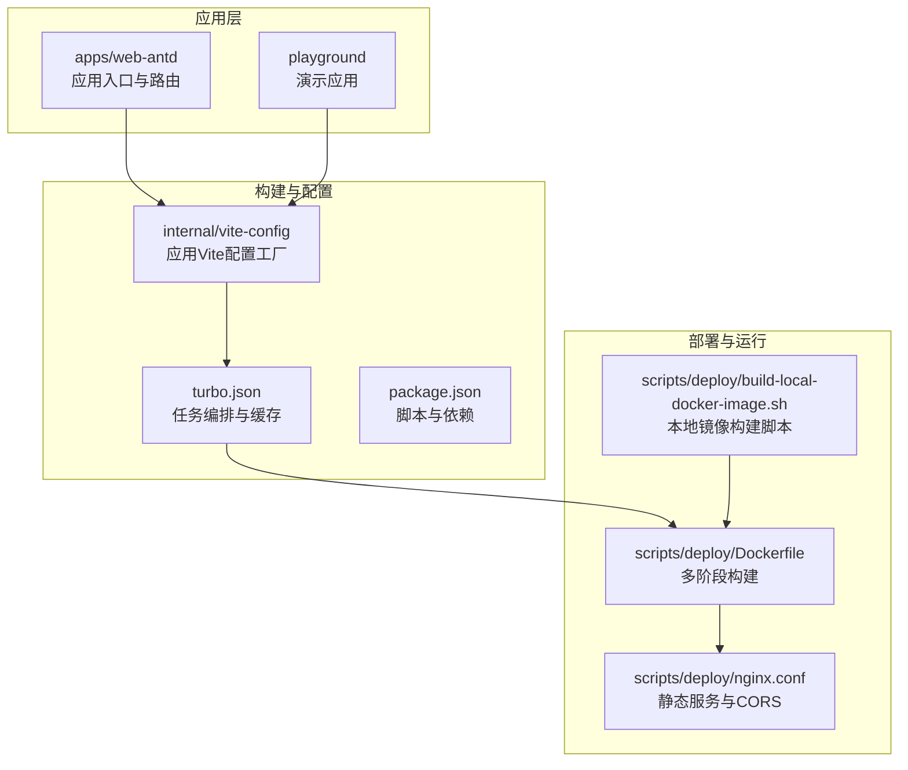
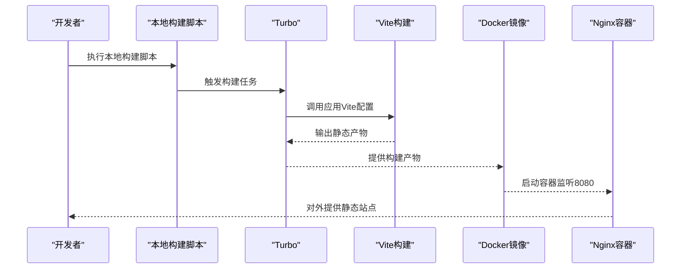
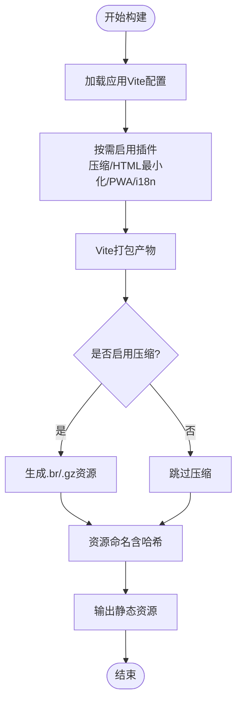
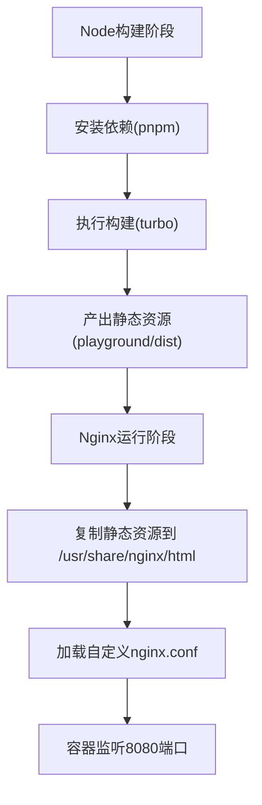
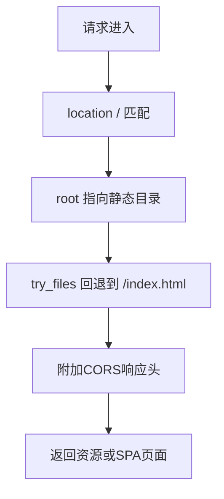
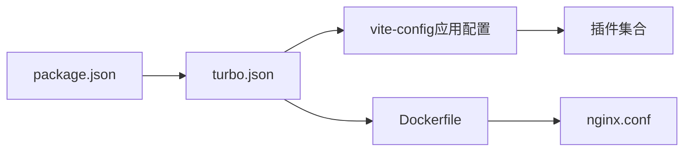

# 部署运维

<cite>
**本文引用的文件**
- [Dockerfile](file://scripts/deploy/Dockerfile)
- [nginx.conf](file://scripts/deploy/nginx.conf)
- [build-local-docker-image.sh](file://scripts/deploy/build-local-docker-image.sh)
- [package.json](file://package.json)
- [turbo.json](file://turbo.json)
- [vite.config.ts（web-antd）](file://apps/web-antd/vite.config.ts)
- [vite.config.ts（playground）](file://playground/vite.config.ts)
- [application.ts（vite-config）](file://internal/vite-config/src/config/application.ts)
- [plugins/index.ts（vite-config）](file://internal/vite-config/src/plugins/index.ts)
- [options.ts（vite-config）](file://internal/vite-config/src/options.ts)
- [.browserslistrc](file://.browserslistrc)
</cite>

## 目录

1. [简介](#简介)
2. [项目结构](#项目结构)
3. [核心组件](#核心组件)
4. [架构总览](#架构总览)
5. [详细组件分析](#详细组件分析)
6. [依赖关系分析](#依赖关系分析)
7. [性能考量](#性能考量)
8. [故障排查指南](#故障排查指南)
9. [结论](#结论)
10. [附录](#附录)

## 简介

本指南面向Vben Admin在生产环境的部署与运维，覆盖构建配置优化、资源压缩与缓存策略、Docker容器化、Nginx配置最佳实践、CI/CD流水线建议、多环境配置差异、监控与日志管理、域名与HTTPS配置，以及可操作的部署示例与运维最佳实践。内容基于仓库内现有脚本与配置文件进行系统化梳理与落地建议。

## 项目结构

Vben Admin采用Monorepo组织方式，前端应用位于apps目录下（如web-antd、playground），构建与打包由Turbo驱动，Vite配置由内部vite-config提供统一能力；部署侧通过scripts/deploy目录提供Dockerfile与Nginx配置，配合本地一键构建脚本完成镜像生成与运行。

**图表来源**

- [Dockerfile:1-38](file://scripts/deploy/Dockerfile#L1-L38)
- [nginx.conf:1-76](file://scripts/deploy/nginx.conf#L1-L76)
- [build-local-docker-image.sh:1-56](file://scripts/deploy/build-local-docker-image.sh#L1-L56)
- [turbo.json:1-49](file://turbo.json#L1-L49)
- [application.ts（vite-config）:17-99](file://internal/vite-config/src/config/application.ts#L17-L99)
- [package.json:27-66](file://package.json#L27-L66)

**章节来源**

- [package.json:27-66](file://package.json#L27-L66)
- [turbo.json:1-49](file://turbo.json#L1-L49)

## 核心组件

- 构建与打包
  - 使用Turbo进行任务编排与缓存，支持按需构建与增量输出。
  - Vite应用配置由内部vite-config提供，内置压缩、HTML最小化、PWA、i18n等插件开关。
- 容器化
  - 多阶段Dockerfile：Node构建产物，Nginx提供静态服务，暴露8080端口。
  - Nginx配置启用CORS头，支持SPA回退到index.html。
- 本地构建脚本
  - 自动清理旧容器/镜像、安装依赖、构建镜像并输出运行命令。

**章节来源**

- [application.ts（vite-config）:58-99](file://internal/vite-config/src/config/application.ts#L58-L99)
- [plugins/index.ts（vite-config）:184-203](file://internal/vite-config/src/plugins/index.ts#L184-L203)
- [Dockerfile:1-38](file://scripts/deploy/Dockerfile#L1-L38)
- [nginx.conf:49-74](file://scripts/deploy/nginx.conf#L49-L74)
- [build-local-docker-image.sh:1-56](file://scripts/deploy/build-local-docker-image.sh#L1-L56)

## 架构总览

从代码到生产的典型路径：开发者在本地执行构建脚本，Turbo驱动Vite打包生成静态资源；Dockerfile将产物复制至Nginx镜像；最终以容器形式对外提供静态站点服务。

**图表来源**

- [build-local-docker-image.sh:25-28](file://scripts/deploy/build-local-docker-image.sh#L25-L28)
- [turbo.json:15-24](file://turbo.json#L15-L24)
- [application.ts（vite-config）:58-99](file://internal/vite-config/src/config/application.ts#L58-L99)
- [Dockerfile:17-37](file://scripts/deploy/Dockerfile#L17-L37)
- [nginx.conf:49-74](file://scripts/deploy/nginx.conf#L49-L74)

## 详细组件分析

### 构建配置与优化

- 压缩与资源优化
  - 在构建模式下启用压缩插件（Brotli/Gzip），并移除调试语句，减少体积。
  - HTML最小化与资源命名哈希策略，便于浏览器缓存与失效控制。
- 缓存策略
  - 资源文件名包含哈希，结合Nginx缓存头可实现长期缓存。
  - 浏览器兼容范围由.browserslistrc定义，确保目标平台可用性。
- PWA与国际化
  - 内置PWA选项与i18n插件开关，按需启用以降低非必要包体。

**图表来源**

- [plugins/index.ts（vite-config）:184-203](file://internal/vite-config/src/plugins/index.ts#L184-L203)
- [application.ts（vite-config）:60-76](file://internal/vite-config/src/config/application.ts#L60-L76)
- [.browserslistrc:1-5](file://.browserslistrc#L1-L5)

**章节来源**

- [application.ts（vite-config）:58-99](file://internal/vite-config/src/config/application.ts#L58-L99)
- [plugins/index.ts（vite-config）:184-203](file://internal/vite-config/src/plugins/index.ts#L184-L203)
- [.browserslistrc:1-5](file://.browserslistrc#L1-L5)

### Docker容器化

- 多阶段构建
  - 第一阶段使用Node镜像安装依赖并构建，第二阶段使用Nginx稳定版镜像提供静态服务。
  - 构建产物复制到/usr/share/nginx/html，Nginx默认监听8080。
- 运行与端口映射
  - 容器启动后以前台模式运行Nginx，便于日志采集与进程管理。

**图表来源**

- [Dockerfile:1-38](file://scripts/deploy/Dockerfile#L1-L38)
- [nginx.conf:24-34](file://scripts/deploy/nginx.conf#L24-L34)

**章节来源**

- [Dockerfile:1-38](file://scripts/deploy/Dockerfile#L1-L38)
- [nginx.conf:24-34](file://scripts/deploy/nginx.conf#L24-L34)

### Nginx配置最佳实践

- 静态资源服务
  - 设置MIME类型，启用sendfile；将SPA路由回退到index.html，保证刷新与深度链接可用。
- 反向代理与CORS
  - 已添加CORS头，支持跨域请求；如需代理后端API，可在同级location中增加proxy_pass规则。
- 安全与性能
  - 可开启gzip压缩块注释段落，按需启用静态压缩；根据业务需要调整worker_connections与keepalive_timeout。

**图表来源**

- [nginx.conf:53-67](file://scripts/deploy/nginx.conf#L53-L67)

**章节来源**

- [nginx.conf:49-74](file://scripts/deploy/nginx.conf#L49-L74)

### CI/CD流水线建议

- 任务编排
  - 利用turbo.json定义构建、预览、分析等任务，设置全局依赖与输出目录，提升缓存命中率。
- 自动化步骤建议
  - 依赖安装：使用pnpm并启用缓存。
  - 构建：执行turbo build，按需生成分析报告。
  - 容器构建：在CI中复用Dockerfile，推送镜像至制品库。
  - 部署：拉取镜像并以容器编排工具（如Kubernetes/Docker Compose）启动，暴露8080端口。
- 环境变量
  - 通过环境变量控制构建模式与插件开关，避免硬编码。

**章节来源**

- [turbo.json:15-49](file://turbo.json#L15-L49)
- [package.json:27-66](file://package.json#L27-L66)
- [Dockerfile:17-18](file://scripts/deploy/Dockerfile#L17-L18)

### 不同部署环境的配置指南

- 开发环境
  - 使用Vite内置开发服务器，端口可配置；代理后端API（示例见应用Vite配置）。
- 测试环境
  - 使用turbo构建产物，镜像构建与生产一致，但可开启更严格的压缩与校验。
- 生产环境
  - 使用Nginx稳定版镜像，启用CORS与SPA回退；结合负载均衡与健康检查。

**章节来源**

- [vite.config.ts（web-antd）:7-17](file://apps/web-antd/vite.config.ts#L7-L17)
- [vite.config.ts（playground）:7-17](file://playground/vite.config.ts#L7-L17)
- [Dockerfile:22-37](file://scripts/deploy/Dockerfile#L22-L37)

### 监控与日志管理

- 访问日志
  - Nginx默认未记录访问日志，可在nginx.conf中启用access_log，便于审计与分析。
- 错误日志
  - 保留error_log配置项，定位异常；容器可通过docker logs查看。
- 性能监控
  - 结合Nginx状态模块或外部APM，关注响应时间、并发连接数与错误率。

**章节来源**

- [nginx.conf:5-8](file://scripts/deploy/nginx.conf#L5-L8)

### 域名配置与HTTPS证书

- 域名解析
  - 将域名指向部署主机IP；如需多实例，可使用负载均衡器。
- HTTPS
  - 建议在反向代理层（如Nginx/Traefik/Caddy）前置TLS终止，证书由ACME自动签发或手动部署。
  - 如需强制HTTPS，可在Nginx中重定向HTTP到HTTPS。

[本节为概念性指导，不直接分析具体文件，故无“章节来源”]

## 依赖关系分析

- 组件耦合
  - 应用Vite配置依赖内部vite-config提供的插件集合与默认选项。
  - Turbo负责跨包构建顺序与缓存，Dockerfile依赖构建产物。
- 外部依赖
  - Node与pnpm版本由package.json引擎字段约束；Nginx镜像来自官方稳定版。

**图表来源**

- [package.json:103-108](file://package.json#L103-L108)
- [turbo.json:1-49](file://turbo.json#L1-L49)
- [application.ts（vite-config）:17-99](file://internal/vite-config/src/config/application.ts#L17-L99)
- [plugins/index.ts（vite-config）:94-223](file://internal/vite-config/src/plugins/index.ts#L94-L223)
- [Dockerfile:1-38](file://scripts/deploy/Dockerfile#L1-L38)
- [nginx.conf:17-74](file://scripts/deploy/nginx.conf#L17-L74)

**章节来源**

- [package.json:103-108](file://package.json#L103-L108)
- [turbo.json:1-49](file://turbo.json#L1-L49)

## 性能考量

- 构建期优化
  - 启用压缩与调试语句剔除，合理拆分chunk，降低首屏体积。
- 运行期优化
  - 静态资源长期缓存与哈希命名；CORS仅开放必要方法与头部；按需开启gzip。
- 平台兼容
  - 依据.browserslistrc目标浏览器范围，避免不必要的polyfill与转译。

**章节来源**

- [application.ts（vite-config）:60-76](file://internal/vite-config/src/config/application.ts#L60-L76)
- [plugins/index.ts（vite-config）:184-203](file://internal/vite-config/src/plugins/index.ts#L184-L203)
- [.browserslistrc:1-5](file://.browserslistrc#L1-L5)

## 故障排查指南

- 构建失败
  - 检查本地脚本输出日志；确认pnpm安装与锁文件一致；核对turbo任务输出目录。
- 容器无法启动
  - 查看Nginx错误页与容器日志；确认端口映射与防火墙；验证nginx.conf语法。
- SPA路由异常
  - 确认location中的try_files与index配置；检查CORS头是否正确设置。
- 代理问题
  - 若存在后端API，参考应用Vite配置中的代理示例，在Nginx中补充相应location与proxy_pass。

**章节来源**

- [build-local-docker-image.sh:30-41](file://scripts/deploy/build-local-docker-image.sh#L30-L41)
- [nginx.conf:69-74](file://scripts/deploy/nginx.conf#L69-L74)
- [vite.config.ts（web-antd）:7-17](file://apps/web-antd/vite.config.ts#L7-L17)

## 结论

通过统一的Vite配置与Turbo任务编排，Vben Admin具备清晰的构建与发布路径；结合Docker与Nginx，可快速实现标准化部署。建议在CI/CD中固化流程，完善监控与日志体系，并按需扩展HTTPS与反向代理策略，以满足不同环境的稳定性与安全性要求。

## 附录

- 本地构建与运行示例
  - 执行本地构建脚本生成镜像后，使用容器运行命令启动容器并映射端口。
- 多应用构建
  - 可通过package.json脚本分别构建各Web框架应用，或使用turbo统一构建。

**章节来源**

- [build-local-docker-image.sh:37-40](file://scripts/deploy/build-local-docker-image.sh#L37-L40)
- [package.json:30-36](file://package.json#L30-L36)
