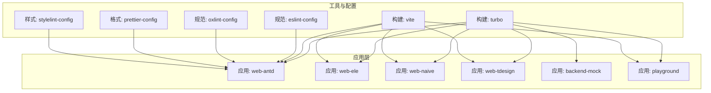
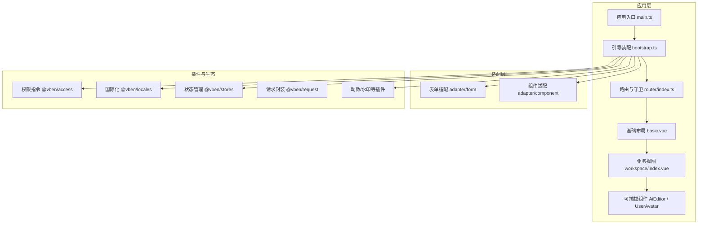
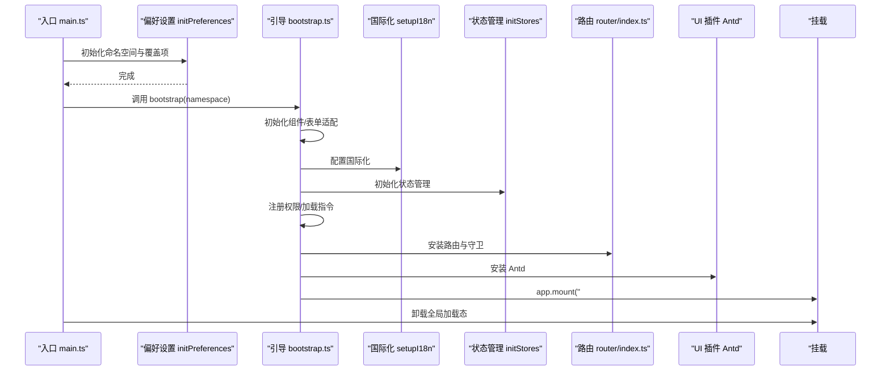
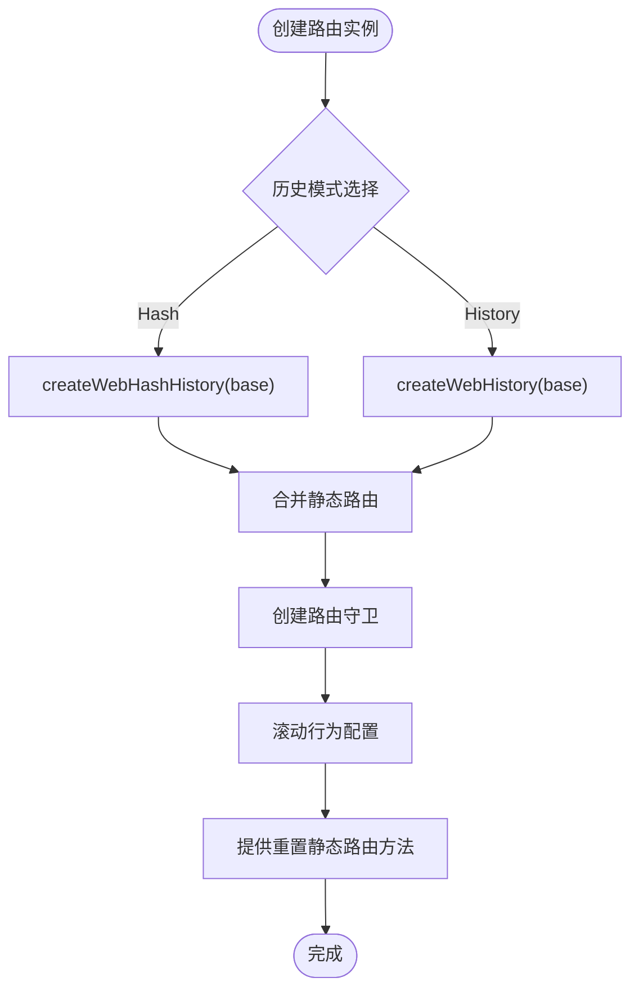
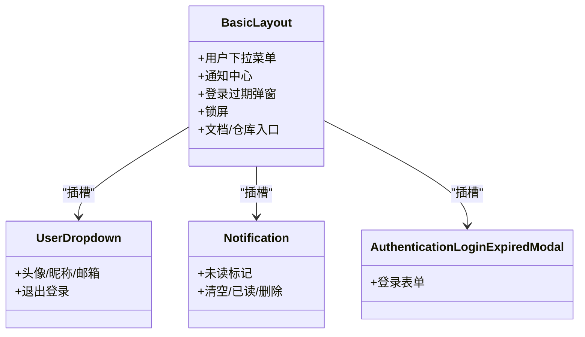
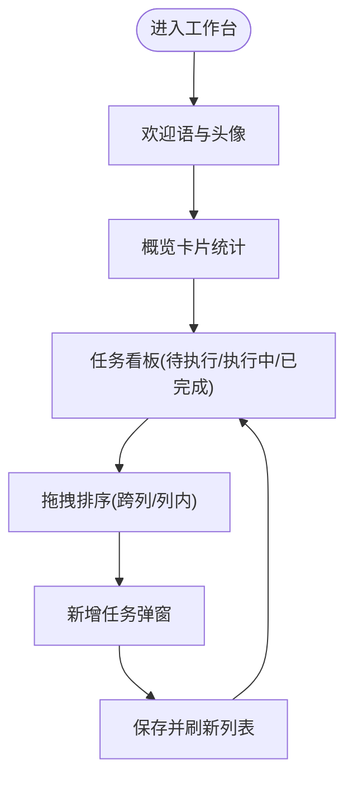
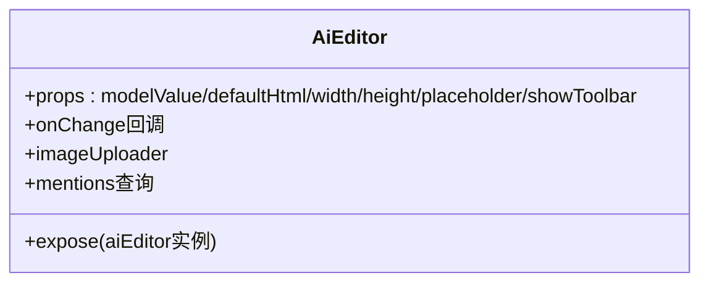
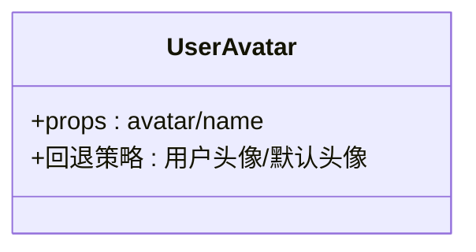
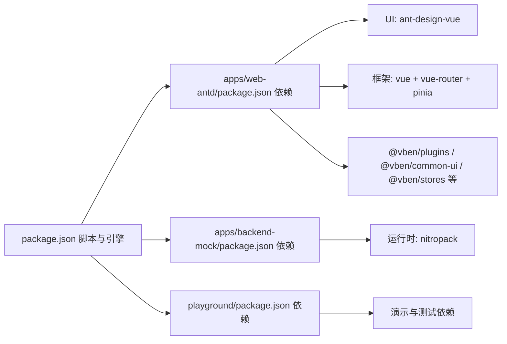

# 使用场景

<cite>
**本文引用的文件**
- [README.md](file://README.md)
- [package.json](file://package.json)
- [apps/web-antd/package.json](file://apps/web-antd/package.json)
- [apps/backend-mock/package.json](file://apps/backend-mock/package.json)
- [playground/package.json](file://playground/package.json)
- [apps/web-antd/src/main.ts](file://apps/web-antd/src/main.ts)
- [apps/web-antd/src/bootstrap.ts](file://apps/web-antd/src/bootstrap.ts)
- [apps/web-antd/src/router/index.ts](file://apps/web-antd/src/router/index.ts)
- [apps/web-antd/src/store/index.ts](file://apps/web-antd/src/store/index.ts)
- [apps/web-antd/src/layouts/basic.vue](file://apps/web-antd/src/layouts/basic.vue)
- [apps/web-antd/src/views/dashboard/workspace/index.vue](file://apps/web-antd/src/views/dashboard/workspace/index.vue)
- [apps/web-antd/src/components/AiEditor/index.vue](file://apps/web-antd/src/components/AiEditor/index.vue)
- [apps/web-antd/src/components/UserAvatar/index.vue](file://apps/web-antd/src/components/UserAvatar/index.vue)
- [scripts/deploy/Dockerfile](file://scripts/deploy/Dockerfile)
- [scripts/deploy/nginx.conf](file://scripts/deploy/nginx.conf)
</cite>

## 目录

1. [引言](#引言)
2. [项目结构](#项目结构)
3. [核心组件](#核心组件)
4. [架构总览](#架构总览)
5. [详细组件分析](#详细组件分析)
6. [依赖分析](#依赖分析)
7. [性能考虑](#性能考虑)
8. [故障排查指南](#故障排查指南)
9. [结论](#结论)
10. [附录](#附录)

## 引言

本文件面向企业级应用落地，系统性阐述 Vben Admin 在多种业务场景中的典型使用方式与实施建议。项目基于现代前端技术栈，提供开箱即用的中后台模板能力，适用于从初创公司到大型企业的多样化管理需求。通过统一的工程化脚手架、可插拔的 UI 框架适配层、完善的权限与国际化机制，以及可扩展的模块化视图与 API 层，Vben Admin 能够快速支撑中后台管理系统、内容管理平台、数据分析仪表板、项目管理工具等多类业务系统。

## 项目结构

Vben Admin 采用多包（monorepo）组织方式，结合 Turbo 工作流实现高效构建与开发体验。核心应用以“web-antd”为代表，提供基于 Ant Design Vue 的完整前端工程；同时包含“backend-mock”后端模拟服务、“playground”演示工程、“docs”文档站点等子项目。各应用通过统一的依赖与工具链管理，支持按需切换 UI 框架（如 Ele、Naive、TDesign），并提供 Docker 化与 Nginx 部署方案。

图表来源

- [package.json:27-66](file://package.json#L27-L66)
- [apps/web-antd/package.json:18-66](file://apps/web-antd/package.json#L18-L66)
- [apps/backend-mock/package.json:8-21](file://apps/backend-mock/package.json#L8-L21)
- [playground/package.json:18-61](file://playground/package.json#L18-L61)

章节来源

- [package.json:1-109](file://package.json#L1-L109)
- [apps/web-antd/package.json:1-67](file://apps/web-antd/package.json#L1-L67)
- [apps/backend-mock/package.json:1-22](file://apps/backend-mock/package.json#L1-L22)
- [playground/package.json:1-62](file://playground/package.json#L1-L62)

## 核心组件

- 应用引导与偏好设置：应用入口负责初始化偏好设置命名空间、合并覆盖项，并在完成后启动引导流程，随后卸载全局加载态。
- 引导装配：创建 Vue 应用实例，注册指令（权限、加载）、国际化、状态管理、路由、UI 组件库、动效插件等，最后挂载根节点。
- 路由与守卫：基于 Vue Router 创建路由实例，支持 Hash/History 模式，内置滚动行为与守卫初始化。
- 布局与用户交互：基础布局提供通知、用户下拉菜单、登录过期弹窗、锁屏等通用 UI 插槽，便于在不同业务场景复用。
- 视图与工作台：工作台首页聚合概览卡片、任务看板、拖拽排序、模态框等，体现项目对复杂业务视图的承载能力。
- 可插拔组件：AI 富文本编辑器、用户头像等组件以可配置参数与事件暴露的方式，便于在不同业务中复用与定制。

章节来源

- [apps/web-antd/src/main.ts:9-31](file://apps/web-antd/src/main.ts#L9-L31)
- [apps/web-antd/src/bootstrap.ts:20-85](file://apps/web-antd/src/bootstrap.ts#L20-L85)
- [apps/web-antd/src/router/index.ts:15-37](file://apps/web-antd/src/router/index.ts#L15-L37)
- [apps/web-antd/src/layouts/basic.vue:172-206](file://apps/web-antd/src/layouts/basic.vue#L172-L206)
- [apps/web-antd/src/views/dashboard/workspace/index.vue:1-304](file://apps/web-antd/src/views/dashboard/workspace/index.vue#L1-L304)
- [apps/web-antd/src/components/AiEditor/index.vue:1-153](file://apps/web-antd/src/components/AiEditor/index.vue#L1-L153)
- [apps/web-antd/src/components/UserAvatar/index.vue:1-33](file://apps/web-antd/src/components/UserAvatar/index.vue#L1-L33)

## 架构总览

Vben Admin 的前端架构围绕“应用层 + 适配层 + 插件生态 + 工具链”的分层设计展开。应用层提供具体业务视图与交互；适配层屏蔽 UI 框架差异；插件生态提供权限、国际化、动效、请求等横切能力；工具链保障开发与构建效率。

图表来源

- [apps/web-antd/src/main.ts:9-31](file://apps/web-antd/src/main.ts#L9-L31)
- [apps/web-antd/src/bootstrap.ts:15-69](file://apps/web-antd/src/bootstrap.ts#L15-L69)
- [apps/web-antd/src/router/index.ts:15-37](file://apps/web-antd/src/router/index.ts#L15-L37)
- [apps/web-antd/src/layouts/basic.vue:172-206](file://apps/web-antd/src/layouts/basic.vue#L172-L206)
- [apps/web-antd/src/views/dashboard/workspace/index.vue:1-304](file://apps/web-antd/src/views/dashboard/workspace/index.vue#L1-L304)
- [apps/web-antd/src/components/AiEditor/index.vue:1-153](file://apps/web-antd/src/components/AiEditor/index.vue#L1-L153)
- [apps/web-antd/src/components/UserAvatar/index.vue:1-33](file://apps/web-antd/src/components/UserAvatar/index.vue#L1-L33)

## 详细组件分析

### 应用启动与引导流程

应用启动流程强调“先偏好设置，后引导装配”，确保命名空间隔离与配置覆盖生效，再进行国际化、状态管理、路由、UI 插件等初始化，最后挂载根节点并移除全局加载态。

图表来源

- [apps/web-antd/src/main.ts:9-31](file://apps/web-antd/src/main.ts#L9-L31)
- [apps/web-antd/src/bootstrap.ts:20-85](file://apps/web-antd/src/bootstrap.ts#L20-L85)

章节来源

- [apps/web-antd/src/main.ts:9-31](file://apps/web-antd/src/main.ts#L9-L31)
- [apps/web-antd/src/bootstrap.ts:20-85](file://apps/web-antd/src/bootstrap.ts#L20-L85)

### 路由与导航守卫

路由支持 Hash 与 History 两种模式，具备滚动行为与守卫初始化，静态路由重置工具便于在运行时动态注入或清理路由。

图表来源

- [apps/web-antd/src/router/index.ts:15-37](file://apps/web-antd/src/router/index.ts#L15-L37)

章节来源

- [apps/web-antd/src/router/index.ts:1-38](file://apps/web-antd/src/router/index.ts#L1-L38)

### 基础布局与用户交互

基础布局提供用户下拉菜单、通知中心、登录过期弹窗、锁屏等通用能力，支持通过插槽扩展，满足不同业务系统的头部与侧边布局需求。

图表来源

- [apps/web-antd/src/layouts/basic.vue:172-206](file://apps/web-antd/src/layouts/basic.vue#L172-L206)

章节来源

- [apps/web-antd/src/layouts/basic.vue:1-207](file://apps/web-antd/src/layouts/basic.vue#L1-L207)

### 工作台视图与拖拽看板

工作台首页整合概览卡片、任务看板、拖拽排序、模态框等，体现复杂业务视图的组合与交互能力。

图表来源

- [apps/web-antd/src/views/dashboard/workspace/index.vue:92-191](file://apps/web-antd/src/views/dashboard/workspace/index.vue#L92-L191)

章节来源

- [apps/web-antd/src/views/dashboard/workspace/index.vue:1-304](file://apps/web-antd/src/views/dashboard/workspace/index.vue#L1-L304)

### 可插拔组件：AI 富文本编辑器

AI 富文本编辑器组件提供可配置的主题、占位符、工具栏、图片上传、提及用户等功能，通过事件暴露双向绑定与内容变更回调，便于在内容管理与协作场景复用。

图表来源

- [apps/web-antd/src/components/AiEditor/index.vue:28-112](file://apps/web-antd/src/components/AiEditor/index.vue#L28-L112)

章节来源

- [apps/web-antd/src/components/AiEditor/index.vue:1-153](file://apps/web-antd/src/components/AiEditor/index.vue#L1-L153)

### 可插拔组件：用户头像

用户头像组件支持传入头像与姓名，回退至用户信息与默认头像，配合水印与偏好设置实现个性化展示。

图表来源

- [apps/web-antd/src/components/UserAvatar/index.vue:5-24](file://apps/web-antd/src/components/UserAvatar/index.vue#L5-L24)

章节来源

- [apps/web-antd/src/components/UserAvatar/index.vue:1-33](file://apps/web-antd/src/components/UserAvatar/index.vue#L1-L33)

## 依赖分析

- 应用依赖：各应用通过统一的依赖版本矩阵与工作区引用，保证 UI 框架、状态管理、国际化、请求封装等核心能力的一致性。
- 工具链依赖：ESLint/Oxlint/Prettier/Stylelint 等规范与格式化工具，保障代码质量与一致性。
- 构建与运行：Vite 提供快速开发体验，Turbo 管理多包构建与缓存，Nitro 作为后端模拟服务运行时。

图表来源

- [package.json:27-66](file://package.json#L27-L66)
- [apps/web-antd/package.json:28-61](file://apps/web-antd/package.json#L28-L61)
- [apps/backend-mock/package.json:12-20](file://apps/backend-mock/package.json#L12-L20)
- [playground/package.json:31-57](file://playground/package.json#L31-L57)

章节来源

- [package.json:1-109](file://package.json#L1-L109)
- [apps/web-antd/package.json:1-67](file://apps/web-antd/package.json#L1-L67)
- [apps/backend-mock/package.json:1-22](file://apps/backend-mock/package.json#L1-L22)
- [playground/package.json:1-62](file://playground/package.json#L1-L62)

## 性能考虑

- 构建优化：利用 Turbo 的并行构建与缓存机制，减少重复编译时间；Vite 的按需加载与模块联邦特性提升开发体验。
- 运行时优化：按需引入 UI 组件与图标，避免全量打包；合理拆分路由与视图，结合懒加载与预取策略降低首屏压力。
- 数据与网络：统一的请求封装与缓存策略，结合分页与虚拟滚动，优化大数据表格与长列表的渲染性能。
- 主题与国际化：通过偏好设置与动态主题切换，减少不必要的重绘与样式回流。

## 故障排查指南

- 登录过期与权限校验：基础布局提供登录过期弹窗与守卫联动，可在认证失败或令牌失效时主动弹窗并引导重新登录。
- 路由异常：检查路由模式（Hash/History）与 base 配置，确认静态路由重置与守卫初始化是否正确执行。
- 国际化问题：确认语言包加载顺序与键名一致，避免翻译缺失导致的空白或异常。
- 组件异常：检查组件适配器初始化与插件注册顺序，确保指令与全局组件在应用挂载前完成注册。
- 部署问题：核对 Docker 构建与 Nginx 静态资源路径，确保静态文件与接口代理配置正确。

章节来源

- [apps/web-antd/src/layouts/basic.vue:195-201](file://apps/web-antd/src/layouts/basic.vue#L195-L201)
- [apps/web-antd/src/router/index.ts:15-37](file://apps/web-antd/src/router/index.ts#L15-L37)
- [apps/web-antd/src/bootstrap.ts:44-51](file://apps/web-antd/src/bootstrap.ts#L44-L51)

## 结论

Vben Admin 以现代化技术栈与工程化体系，为企业级中后台应用提供了高可用、可扩展、易维护的解决方案。通过统一的引导流程、路由与权限体系、可插拔的 UI 适配与组件库，项目能够快速落地中后台管理系统、内容管理平台、数据分析仪表板与项目管理工具等场景。结合多 UI 框架适配与 Docker/Nginx 部署方案，Vben Admin 能够覆盖从初创团队到大型企业的多样化需求。

## 附录

### 使用场景与实施建议

- 中后台管理系统
  - 场景要点：统一身份认证、菜单权限、字典与系统管理、操作审计。
  - 实施建议：基于基础布局与路由守卫快速搭建权限体系；使用系统管理模块完成角色与菜单配置；结合工作台首页展示关键指标。
  - 关键参考：基础布局、路由守卫、系统管理 API。

- 内容管理平台
  - 场景要点：富文本编辑、媒体资源上传、内容发布与审核。
  - 实施建议：复用 AI 富文本编辑器组件，配置图片上传与提及用户；建立内容分类与标签体系；接入工作流审批。
  - 关键参考：AI 富文本编辑器组件、上传 API。

- 数据分析仪表板
  - 场景要点：KPI 概览、趋势分析、钻取与筛选。
  - 实施建议：使用概览卡片与图表组件组合关键指标；结合虚拟列表与分页优化大数据展示；提供导出与分享能力。
  - 关键参考：概览卡片与图表组件、分页与筛选。

- 项目管理工具
  - 场景要点：需求/任务/缺陷管理、看板可视化、工时统计。
  - 实施建议：复用工作台看板与拖拽排序能力；建立任务状态流转与进度跟踪；集成用户头像与字典标签。
  - 关键参考：工作台看板、拖拽排序、用户头像组件。

### 技术栈选择与适用性

- UI 框架选择
  - Antd 版本：适合传统中后台，组件丰富、生态完善。
  - Ele 版本：Element Plus 生态，适合国内生态与设计规范。
  - Naive 版本：轻量与高扩展性兼顾，适合追求简洁的团队。
  - TDesign 版本：腾讯出品，适合对品牌一致性有要求的企业。
- 选择建议：根据团队对 UI 设计语言的熟悉度与企业品牌规范进行选择；通过应用层切换 UI 框架，不影响核心业务逻辑。

### 扩展性与可定制性

- 模块化视图：通过路由模块化与视图组件化，快速扩展新功能模块。
- 插件生态：权限、国际化、动效、请求等插件可按需启用与替换。
- 适配层：组件与表单适配器屏蔽 UI 框架差异，便于跨框架迁移。
- 配置中心：偏好设置命名空间隔离，支持多环境与多版本共存。

### 部署与上线

- 本地开发：使用 Vite 快速启动，支持热更新与调试。
- 多应用构建：通过 Turbo 并行构建各应用，支持按 UI 框架单独打包。
- Docker 化：提供 Dockerfile 与 Nginx 配置，便于容器化部署与 CI/CD 集成。
- 上线建议：统一构建产物目录、静态资源路径与接口代理；在生产环境开启压缩与缓存策略。

章节来源

- [README.md:17-118](file://README.md#L17-L118)
- [apps/web-antd/package.json:18-24](file://apps/web-antd/package.json#L18-L24)
- [scripts/deploy/Dockerfile](file://scripts/deploy/Dockerfile)
- [scripts/deploy/nginx.conf](file://scripts/deploy/nginx.conf)
