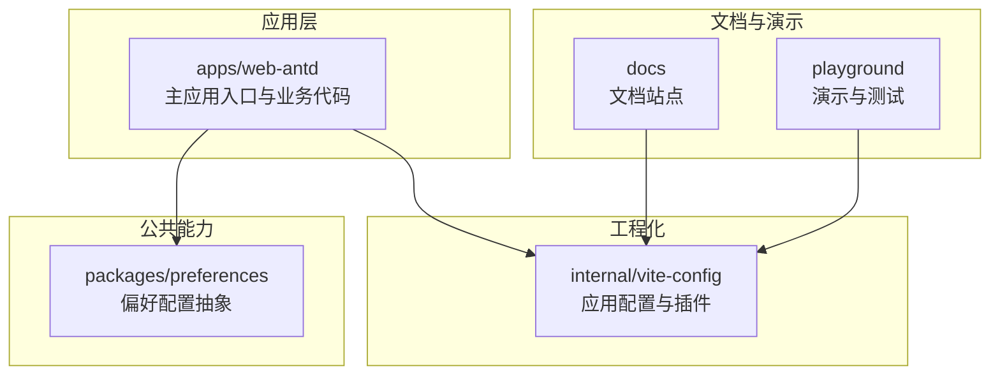
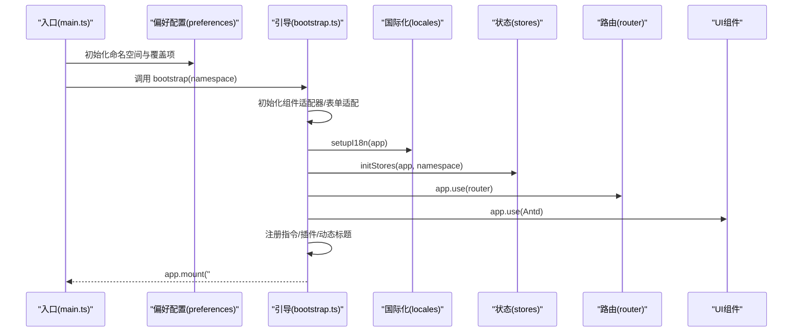
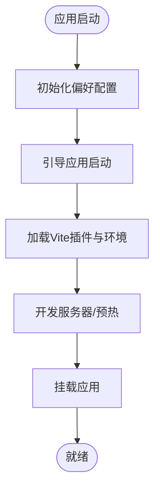
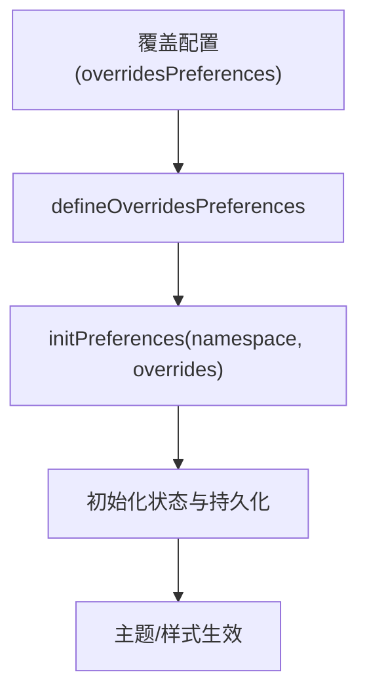
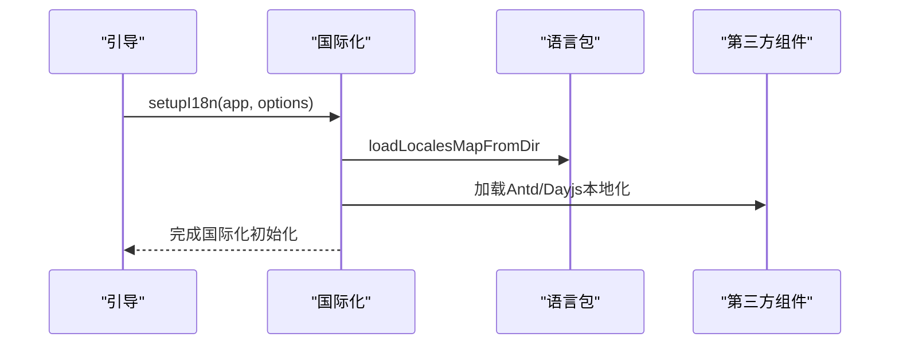
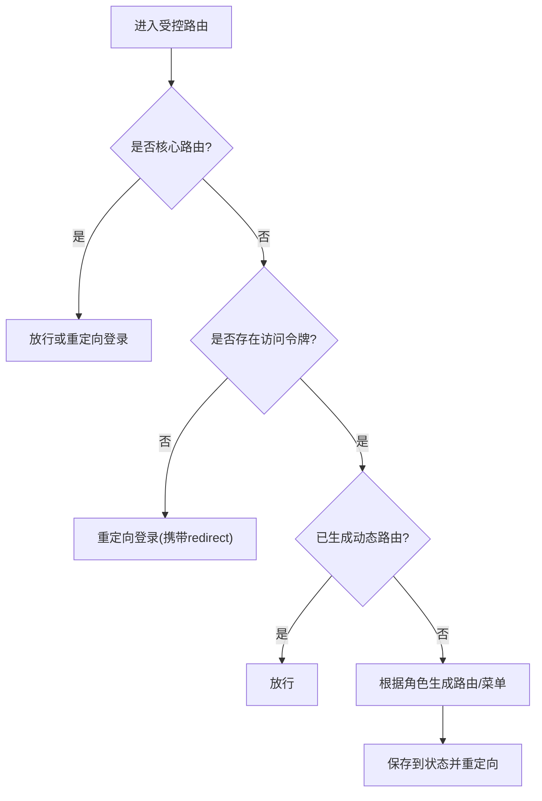
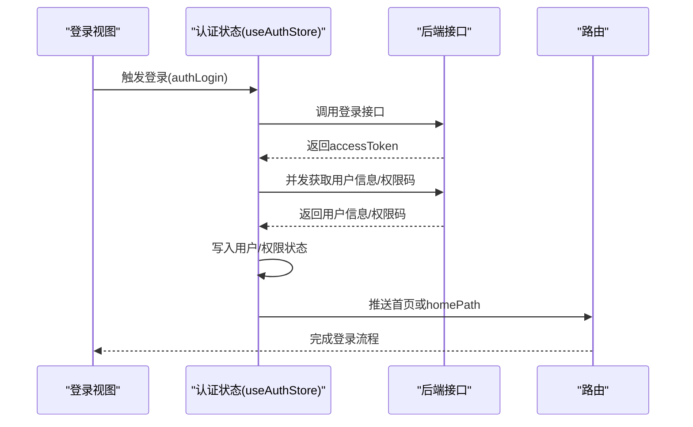
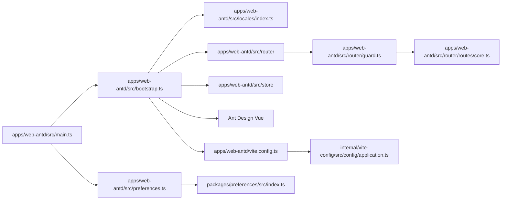

# 技术特色

<cite>
**本文引用的文件**
- [README.md](file://README.md)
- [package.json](file://package.json)
- [apps/web-antd/package.json](file://apps/web-antd/package.json)
- [apps/web-antd/src/main.ts](file://apps/web-antd/src/main.ts)
- [apps/web-antd/src/preferences.ts](file://apps/web-antd/src/preferences.ts)
- [apps/web-antd/src/bootstrap.ts](file://apps/web-antd/src/bootstrap.ts)
- [apps/web-antd/src/locales/index.ts](file://apps/web-antd/src/locales/index.ts)
- [apps/web-antd/src/router/guard.ts](file://apps/web-antd/src/router/guard.ts)
- [apps/web-antd/src/router/routes/core.ts](file://apps/web-antd/src/router/routes/core.ts)
- [apps/web-antd/src/store/auth.ts](file://apps/web-antd/src/store/auth.ts)
- [apps/web-antd/vite.config.ts](file://apps/web-antd/vite.config.ts)
- [internal/vite-config/src/config/application.ts](file://internal/vite-config/src/config/application.ts)
- [packages/preferences/src/index.ts](file://packages/preferences/src/index.ts)
</cite>

## 目录

1. [引言](#引言)
2. [项目结构](#项目结构)
3. [核心技术亮点](#核心技术亮点)
4. [架构总览](#架构总览)
5. [组件与功能深度解析](#组件与功能深度解析)
6. [依赖关系分析](#依赖关系分析)
7. [性能与开发体验](#性能与开发体验)
8. [故障排查指南](#故障排查指南)
9. [结论](#结论)
10. [附录](#附录)

## 引言

本项目基于前沿前端技术栈构建，采用 Vue 3、Vite 与 TypeScript，结合完善的主题系统、国际化、动态路由权限与现代化工程化能力，旨在提供高效、可维护、体验优良的中后台前端解决方案。本文聚焦于技术特色与实现方式，帮助开发者快速理解并高效利用这些特性。

章节来源

- [README.md:17-32](file://README.md#L17-L32)

## 项目结构

项目采用多包（monorepo）组织，核心应用位于 apps 下的不同主题变体（如 web-antd、web-ele 等），公共能力沉淀在 packages 内部，工程化配置集中在 internal，文档与演示位于 docs 与 playground。

- 应用层：apps/web-antd（以 Ant Design Vue 为例）
- 工程化：internal/vite-config 提供统一的 Vite 配置与插件体系
- 公共偏好与配置：packages/preferences
- 文档与演示：docs、playground

图表来源

- [apps/web-antd/package.json:1-67](file://apps/web-antd/package.json#L1-L67)
- [internal/vite-config/src/config/application.ts:17-98](file://internal/vite-config/src/config/application.ts#L17-L98)
- [packages/preferences/src/index.ts:1-18](file://packages/preferences/src/index.ts#L1-L18)

章节来源

- [package.json:1-109](file://package.json#L1-L109)
- [apps/web-antd/package.json:1-67](file://apps/web-antd/package.json#L1-L67)

## 核心技术亮点

- 最新技术栈：Vue 3 + Vite + TypeScript，提供更快的冷启动、热更新与更强的类型保障
- 多主题与可定制：通过偏好配置与样式注入，支持主题模式与颜色策略的灵活切换
- 国际化内建：按需加载语言包、第三方组件本地化与动态标题联动
- 动态路由与权限：基于用户角色生成可访问菜单与路由，支持混合/前端/后端等访问模式
- 工程化与可扩展：统一的 Vite 配置、插件体系与预设环境变量，便于二次开发

章节来源

- [README.md:25-31](file://README.md#L25-L31)
- [apps/web-antd/src/preferences.ts:8-30](file://apps/web-antd/src/preferences.ts#L8-L30)
- [apps/web-antd/src/locales/index.ts:93-103](file://apps/web-antd/src/locales/index.ts#L93-L103)
- [apps/web-antd/src/router/guard.ts:47-119](file://apps/web-antd/src/router/guard.ts#L47-L119)
- [internal/vite-config/src/config/application.ts:27-54](file://internal/vite-config/src/config/application.ts#L27-L54)

## 架构总览

下图展示从应用入口到运行时的关键路径：入口初始化偏好配置 → 启动引导 → 国际化与状态初始化 → 路由与守卫 → UI 组件与主题样式。

图表来源

- [apps/web-antd/src/main.ts:9-29](file://apps/web-antd/src/main.ts#L9-L29)
- [apps/web-antd/src/bootstrap.ts:20-82](file://apps/web-antd/src/bootstrap.ts#L20-L82)
- [apps/web-antd/src/locales/index.ts:93-103](file://apps/web-antd/src/locales/index.ts#L93-L103)

章节来源

- [apps/web-antd/src/main.ts:1-32](file://apps/web-antd/src/main.ts#L1-L32)
- [apps/web-antd/src/bootstrap.ts:1-85](file://apps/web-antd/src/bootstrap.ts#L1-L85)

## 组件与功能深度解析

### 1) Vue 3 + Vite + TypeScript 技术栈

- 应用入口通过异步初始化偏好与引导函数，确保在应用启动前完成命名空间与覆盖配置，并在引导完成后卸载全局 loading
- Vite 配置通过统一的应用配置工厂加载插件与环境变量，启用 PWA、i18n、Nitro Mock、预热等能力
- 工程脚本通过 Turbo 管理多包构建，支持按应用维度独立开发与构建

图表来源

- [apps/web-antd/src/main.ts:9-29](file://apps/web-antd/src/main.ts#L9-L29)
- [apps/web-antd/vite.config.ts:3-20](file://apps/web-antd/vite.config.ts#L3-L20)
- [internal/vite-config/src/config/application.ts:17-98](file://internal/vite-config/src/config/application.ts#L17-L98)

章节来源

- [apps/web-antd/src/main.ts:1-32](file://apps/web-antd/src/main.ts#L1-L32)
- [apps/web-antd/vite.config.ts:1-21](file://apps/web-antd/vite.config.ts#L1-L21)
- [package.json:27-66](file://package.json#L27-L66)

### 2) 多主题与可定制偏好

- 偏好配置通过覆盖函数定义，支持主题模式、应用名称、更新检查、默认首页、语言切换与时区等开关
- 偏好模块导出统一的定义方法，便于在各应用中复用与扩展
- 应用入口根据环境变量生成命名空间，隔离不同版本/环境的数据键

图表来源

- [apps/web-antd/src/preferences.ts:8-30](file://apps/web-antd/src/preferences.ts#L8-L30)
- [packages/preferences/src/index.ts:11-13](file://packages/preferences/src/index.ts#L11-L13)
- [apps/web-antd/src/main.ts:16-20](file://apps/web-antd/src/main.ts#L16-L20)

章节来源

- [apps/web-antd/src/preferences.ts:1-31](file://apps/web-antd/src/preferences.ts#L1-L31)
- [packages/preferences/src/index.ts:1-18](file://packages/preferences/src/index.ts#L1-L18)
- [apps/web-antd/src/main.ts:10-20](file://apps/web-antd/src/main.ts#L10-L20)

### 3) 国际化内置支持

- 语言包按目录自动扫描加载，支持应用与第三方组件（Ant Design Vue、Day.js）的本地化同步
- 国际化初始化时可设置默认语言、缺失警告与消息加载策略
- 动态标题与路由 meta 标题联动，实现页面标题国际化

图表来源

- [apps/web-antd/src/locales/index.ts:22-39](file://apps/web-antd/src/locales/index.ts#L22-L39)
- [apps/web-antd/src/locales/index.ts:45-91](file://apps/web-antd/src/locales/index.ts#L45-L91)
- [apps/web-antd/src/bootstrap.ts:44-45](file://apps/web-antd/src/bootstrap.ts#L44-L45)

章节来源

- [apps/web-antd/src/locales/index.ts:1-103](file://apps/web-antd/src/locales/index.ts#L1-L103)
- [apps/web-antd/src/bootstrap.ts:71-79](file://apps/web-antd/src/bootstrap.ts#L71-L79)

### 4) 动态路由与权限生成

- 路由守卫在 beforeEach 中判断访问令牌、核心路由与忽略权限标记
- 首次访问时根据用户角色生成可访问菜单与路由，写入状态并重定向至目标页面
- 支持多种访问模式（前端/混合/后端），默认采用混合模式

图表来源

- [apps/web-antd/src/router/guard.ts:47-119](file://apps/web-antd/src/router/guard.ts#L47-L119)
- [apps/web-antd/src/router/routes/core.ts:24-95](file://apps/web-antd/src/router/routes/core.ts#L24-L95)

章节来源

- [apps/web-antd/src/router/guard.ts:1-133](file://apps/web-antd/src/router/guard.ts#L1-L133)
- [apps/web-antd/src/router/routes/core.ts:1-98](file://apps/web-antd/src/router/routes/core.ts#L1-L98)
- [apps/web-antd/src/preferences.ts:20-24](file://apps/web-antd/src/preferences.ts#L20-L24)

### 5) 登录流程与用户态管理

- 登录接口返回访问令牌，随后并发拉取用户信息与权限码，写入状态并触发通知
- 登出时清理全部状态与令牌，回退到登录页并携带当前路由地址
- 用户信息变更或登录态失效时，可自动刷新或重定向

图表来源

- [apps/web-antd/src/store/auth.ts:28-78](file://apps/web-antd/src/store/auth.ts#L28-L78)
- [apps/web-antd/src/store/auth.ts:80-98](file://apps/web-antd/src/store/auth.ts#L80-L98)

章节来源

- [apps/web-antd/src/store/auth.ts:1-118](file://apps/web-antd/src/store/auth.ts#L1-L118)

## 依赖关系分析

- 应用层依赖工程化配置与公共偏好模块，通过统一的入口初始化与引导
- 路由守卫依赖状态模块与常量，实现访问控制与动态路由生成
- 国际化模块依赖第三方组件本地化资源，形成语言包与 UI 的联动

图表来源

- [apps/web-antd/src/main.ts:16-25](file://apps/web-antd/src/main.ts#L16-L25)
- [apps/web-antd/src/bootstrap.ts:36-69](file://apps/web-antd/src/bootstrap.ts#L36-L69)
- [apps/web-antd/src/locales/index.ts:93-103](file://apps/web-antd/src/locales/index.ts#L93-L103)
- [apps/web-antd/src/router/guard.ts:47-119](file://apps/web-antd/src/router/guard.ts#L47-L119)
- [apps/web-antd/src/router/routes/core.ts:24-95](file://apps/web-antd/src/router/routes/core.ts#L24-L95)
- [apps/web-antd/src/preferences.ts:8-30](file://apps/web-antd/src/preferences.ts#L8-L30)
- [packages/preferences/src/index.ts:11-13](file://packages/preferences/src/index.ts#L11-L13)
- [apps/web-antd/vite.config.ts:3-20](file://apps/web-antd/vite.config.ts#L3-L20)
- [internal/vite-config/src/config/application.ts:17-98](file://internal/vite-config/src/config/application.ts#L17-L98)

章节来源

- [apps/web-antd/src/main.ts:1-32](file://apps/web-antd/src/main.ts#L1-L32)
- [apps/web-antd/src/bootstrap.ts:1-85](file://apps/web-antd/src/bootstrap.ts#L1-L85)
- [apps/web-antd/src/preferences.ts:1-31](file://apps/web-antd/src/preferences.ts#L1-L31)
- [apps/web-antd/src/locales/index.ts:1-103](file://apps/web-antd/src/locales/index.ts#L1-L103)
- [apps/web-antd/src/router/guard.ts:1-133](file://apps/web-antd/src/router/guard.ts#L1-L133)
- [apps/web-antd/src/router/routes/core.ts:1-98](file://apps/web-antd/src/router/routes/core.ts#L1-L98)
- [apps/web-antd/vite.config.ts:1-21](file://apps/web-antd/vite.config.ts#L1-L21)
- [internal/vite-config/src/config/application.ts:1-124](file://internal/vite-config/src/config/application.ts#L1-L124)
- [packages/preferences/src/index.ts:1-18](file://packages/preferences/src/index.ts#L1-L18)

## 性能与开发体验

- 开发体验
  - Vite 预热关键文件，显著缩短首开时间
  - 插件体系集成 PWA、i18n、Nitro Mock、打印信息等，减少重复配置
  - 统一脚本与工作区管理，支持按应用维度独立开发与构建
- 性能优化
  - 构建输出分块与压缩策略，生产环境移除调试语句
  - 按需加载语言包与第三方本地化资源，降低初始体积
  - 路由懒加载与守卫前置校验，避免无效渲染

章节来源

- [internal/vite-config/src/config/application.ts:79-90](file://internal/vite-config/src/config/application.ts#L79-L90)
- [internal/vite-config/src/config/application.ts:60-76](file://internal/vite-config/src/config/application.ts#L60-L76)
- [apps/web-antd/src/locales/index.ts:33-39](file://apps/web-antd/src/locales/index.ts#L33-L39)

## 故障排查指南

- 登录后无法跳转或白屏
  - 检查访问令牌是否正确写入状态，确认用户信息与权限码拉取成功
  - 确认默认首页路径与用户 homePath 配置一致
- 路由守卫循环跳转
  - 核对核心路由与忽略权限标记，确认已生成动态路由
  - 检查 redirect 参数是否正确传递
- 国际化不生效
  - 确认语言包目录与文件命名符合约定，第三方本地化资源已加载
  - 检查默认语言与缺失警告配置
- 主题/样式异常
  - 清理浏览器缓存与本地存储，确认命名空间与覆盖配置未被意外覆盖
  - 检查全局 SCSS 注入与主题变量覆盖顺序

章节来源

- [apps/web-antd/src/store/auth.ts:34-78](file://apps/web-antd/src/store/auth.ts#L34-L78)
- [apps/web-antd/src/router/guard.ts:47-119](file://apps/web-antd/src/router/guard.ts#L47-L119)
- [apps/web-antd/src/locales/index.ts:93-103](file://apps/web-antd/src/locales/index.ts#L93-L103)
- [apps/web-antd/src/preferences.ts:6-30](file://apps/web-antd/src/preferences.ts#L6-L30)

## 结论

本项目通过 Vue 3/Vite/TypeScript 的现代技术栈，配合统一的工程化配置与公共偏好模块，实现了主题可定制、国际化内建、动态路由权限等关键特性。这些特性共同提升了开发效率、用户体验与系统的可维护性。建议在实际项目中遵循统一的入口初始化流程、按需加载与懒编译策略，以及规范化的权限与国际化接入方式，以获得更佳的开发与运维体验。

## 附录

- 快速开始
  - 安装依赖与启动开发：参考根目录安装与运行说明
  - 按应用维度启动：使用应用包内的开发脚本
- 最佳实践
  - 使用覆盖配置集中管理主题与行为开关
  - 将语言包与第三方本地化资源统一管理
  - 在路由守卫中明确核心路由与忽略权限场景
  - 利用统一的 Vite 配置与插件体系，减少重复配置

章节来源

- [README.md:55-82](file://README.md#L55-L82)
- [apps/web-antd/package.json:18-24](file://apps/web-antd/package.json#L18-L24)
