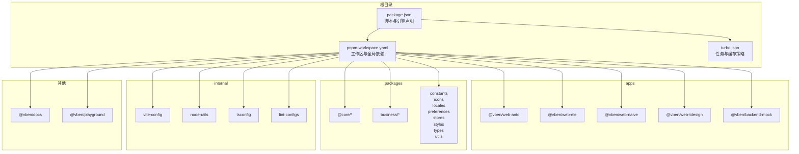
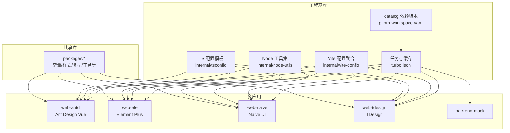
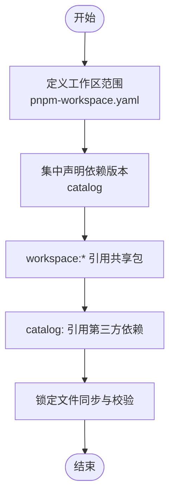
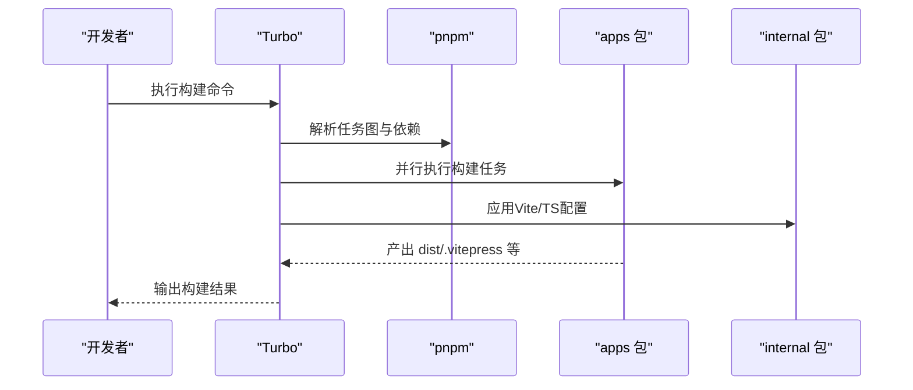
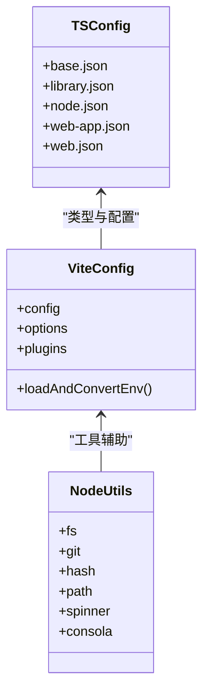
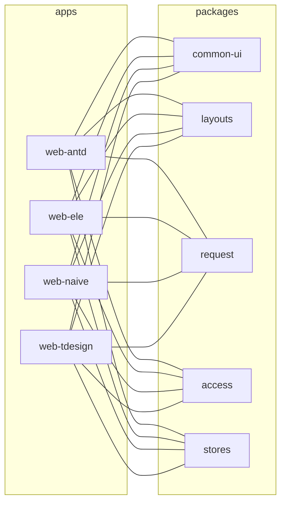
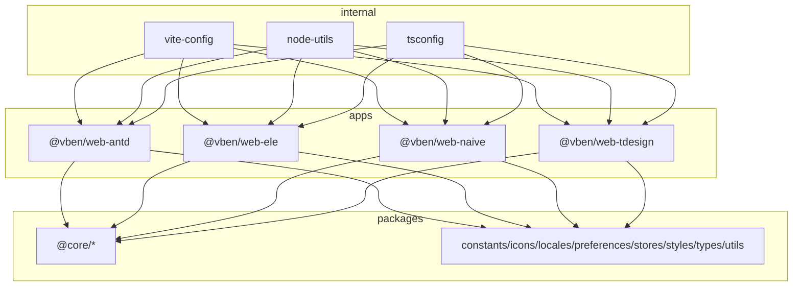

# 架构概览

<cite>
**本文引用的文件**
- [pnpm-workspace.yaml](file://pnpm-workspace.yaml)
- [turbo.json](file://turbo.json)
- [package.json](file://package.json)
- [README.md](file://README.md)
- [internal/vite-config/src/index.ts](file://internal/vite-config/src/index.ts)
- [internal/node-utils/src/index.ts](file://internal/node-utils/src/index.ts)
- [internal/tsconfig/package.json](file://internal/tsconfig/package.json)
- [apps/web-antd/package.json](file://apps/web-antd/package.json)
- [apps/web-ele/package.json](file://apps/web-ele/package.json)
- [apps/web-naive/package.json](file://apps/web-naive/package.json)
- [apps/web-tdesign/package.json](file://apps/web-tdesign/package.json)
</cite>

## 目录
1. [引言](#引言)
2. [项目结构](#项目结构)
3. [核心组件](#核心组件)
4. [架构总览](#架构总览)
5. [详细组件分析](#详细组件分析)
6. [依赖分析](#依赖分析)
7. [性能考虑](#性能考虑)
8. [故障排查指南](#故障排查指南)
9. [结论](#结论)
10. [附录](#附录)

## 引言
本文件面向Vben Admin项目的架构与工程化实践，系统性阐述其Monorepo设计理念、工作区与构建优化策略，以及多UI框架并存与统一管理的实现路径。通过对pnpm-workspace.yaml、turbo.json、内部工具包与各应用配置的深入解析，帮助开发者快速理解该架构在代码复用、依赖管理、构建效率与可维护性方面的技术考量与实际收益。

## 项目结构
Vben Admin采用标准的Monorepo组织方式，围绕“apps”“packages”“internal”“docs”“playground”等目录分层，职责清晰、边界明确：
- apps：多套Web应用与后端Mock服务，按UI框架拆分，共享核心业务能力
- packages：通用业务与基础库，如常量、样式、类型、工具、状态管理等
- internal：内部工具与配置聚合，包括Vite配置、Node工具、TS配置、Lint配置等
- docs：文档站点，使用VitePress构建
- playground：实验性应用，用于功能验证与演示

图表来源
- [pnpm-workspace.yaml:1-193](file://pnpm-workspace.yaml#L1-L193)
- [package.json:1-109](file://package.json#L1-L109)

章节来源
- [pnpm-workspace.yaml:1-193](file://pnpm-workspace.yaml#L1-L193)
- [package.json:1-109](file://package.json#L1-L109)
- [README.md:1-158](file://README.md#L1-L158)

## 核心组件
- 工作区与版本治理
  - pnpm-workspace.yaml定义了所有工作区包，统一管理版本与依赖解析范围，结合catalog集中声明第三方依赖版本，确保跨包一致性与升级效率
- 构建与缓存
  - turbo.json定义了构建任务、依赖关系、输出产物与缓存策略，显著提升增量构建与并行执行效率
- 内部工具与配置
  - internal/vite-config、internal/node-utils、internal/tsconfig等提供统一的开发体验与工程基座
- 多应用与UI框架
  - apps下四个Web应用分别适配Ant Design Vue、Element Plus、Naive UI、TDesign，共享packages中的通用模块，形成“多框架并存、统一管理”的模式

章节来源
- [pnpm-workspace.yaml:1-193](file://pnpm-workspace.yaml#L1-L193)
- [turbo.json:1-49](file://turbo.json#L1-L49)
- [internal/vite-config/src/index.ts:1-6](file://internal/vite-config/src/index.ts#L1-L6)
- [internal/node-utils/src/index.ts:1-20](file://internal/node-utils/src/index.ts#L1-L20)
- [internal/tsconfig/package.json:1-26](file://internal/tsconfig/package.json#L1-L26)

## 架构总览
Vben Admin的Monorepo架构以“工作区+构建缓存+内部工具链”为核心支柱，实现以下目标：
- 代码复用：通过packages与internal共享通用逻辑与配置，避免重复实现
- 依赖管理：借助workspace与catalog，统一版本、减少冗余安装与冲突
- 构建优化：基于turbo的任务编排与缓存，加速本地开发与CI构建
- 多框架并存：apps中按UI框架拆分应用，统一适配器与业务API，降低维护成本

图表来源
- [pnpm-workspace.yaml:1-193](file://pnpm-workspace.yaml#L1-L193)
- [turbo.json:1-49](file://turbo.json#L1-L49)
- [internal/vite-config/src/index.ts:1-6](file://internal/vite-config/src/index.ts#L1-L6)
- [internal/node-utils/src/index.ts:1-20](file://internal/node-utils/src/index.ts#L1-L20)
- [internal/tsconfig/package.json:1-26](file://internal/tsconfig/package.json#L1-L26)
- [apps/web-antd/package.json:1-67](file://apps/web-antd/package.json#L1-L67)
- [apps/web-ele/package.json:1-54](file://apps/web-ele/package.json#L1-L54)
- [apps/web-naive/package.json:1-50](file://apps/web-naive/package.json#L1-L50)
- [apps/web-tdesign/package.json:1-52](file://apps/web-tdesign/package.json#L1-L52)

## 详细组件分析

### Monorepo工作区与依赖治理
- 工作区范围
  - pnpm-workspace.yaml将internal、packages、apps、scripts、docs、playground纳入统一工作区，确保包间相互引用与版本一致
- 依赖版本集中管理
  - catalog集中声明第三方依赖版本，workspace内包通过“workspace:*”或“catalog:”引用，避免重复安装与版本漂移
- 版本与发布
  - package.json中包含版本化与变更集相关脚本，配合Changesets进行受控发布

图表来源
- [pnpm-workspace.yaml:1-193](file://pnpm-workspace.yaml#L1-L193)
- [package.json:1-109](file://package.json#L1-L109)

章节来源
- [pnpm-workspace.yaml:1-193](file://pnpm-workspace.yaml#L1-L193)
- [package.json:1-109](file://package.json#L1-L109)

### Turbo构建优化策略
- 全局依赖与环境
  - globalDependencies涵盖锁文件、tsconfig、内部配置与脚本，确保变更触发正确重建
- 任务定义
  - build/preview/build:analyze等任务定义了依赖顺序与产物输出，支持跨包增量构建
  - 特定包任务如@vben/backend-mock#build单独配置输出目录，隔离Nitro产物
- 缓存与持久化
  - dev任务禁用缓存并持久化，保证开发态实时性；其他任务利用缓存加速

图表来源
- [turbo.json:1-49](file://turbo.json#L1-L49)
- [package.json:27-66](file://package.json#L27-L66)

章节来源
- [turbo.json:1-49](file://turbo.json#L1-L49)
- [package.json:27-66](file://package.json#L27-L66)

### 内部工具与配置聚合
- vite-config
  - 暴露配置、选项、插件与类型，统一Vite开发与构建体验
- node-utils
  - 提供文件系统、Git、哈希、路径转换、日志等工具，支撑脚手架与工程化流程
- tsconfig
  - 提供基础、库、Node、Web应用等TS配置模板，确保类型检查一致性

图表来源
- [internal/vite-config/src/index.ts:1-6](file://internal/vite-config/src/index.ts#L1-L6)
- [internal/node-utils/src/index.ts:1-20](file://internal/node-utils/src/index.ts#L1-L20)
- [internal/tsconfig/package.json:1-26](file://internal/tsconfig/package.json#L1-L26)

章节来源
- [internal/vite-config/src/index.ts:1-6](file://internal/vite-config/src/index.ts#L1-L6)
- [internal/node-utils/src/index.ts:1-20](file://internal/node-utils/src/index.ts#L1-L20)
- [internal/tsconfig/package.json:1-26](file://internal/tsconfig/package.json#L1-L26)

### 多应用与UI框架并存
- 应用划分
  - apps/web-antd、apps/web-ele、apps/web-naive、apps/web-tdesign分别对应不同UI框架
- 依赖与导入映射
  - 各应用通过imports将“#/*”映射到src，统一模块解析；依赖通过workspace与catalog统一管理
- 统一适配器与业务API
  - 通过packages中的通用模块（如common-ui、layouts、request等）屏蔽UI差异，实现多框架共用同一套业务能力

图表来源
- [apps/web-antd/package.json:25-67](file://apps/web-antd/package.json#L25-L67)
- [apps/web-ele/package.json:25-54](file://apps/web-ele/package.json#L25-L54)
- [apps/web-naive/package.json:25-50](file://apps/web-naive/package.json#L25-L50)
- [apps/web-tdesign/package.json:25-52](file://apps/web-tdesign/package.json#L25-L52)

章节来源
- [apps/web-antd/package.json:1-67](file://apps/web-antd/package.json#L1-L67)
- [apps/web-ele/package.json:1-54](file://apps/web-ele/package.json#L1-L54)
- [apps/web-naive/package.json:1-50](file://apps/web-naive/package.json#L1-L50)
- [apps/web-tdesign/package.json:1-52](file://apps/web-tdesign/package.json#L1-L52)

## 依赖分析
- 耦合与内聚
  - apps对packages具有高内聚依赖，内部工具对apps提供低耦合支撑
- 直接与间接依赖
  - workspace:*用于内部包间直接依赖；catalog:用于第三方依赖统一版本
- 外部依赖集成点
  - Vite、Vue、Pinia、Element Plus、Naive UI、TDesign等通过catalog集中管理，避免版本漂移

图表来源
- [pnpm-workspace.yaml:1-193](file://pnpm-workspace.yaml#L1-L193)
- [apps/web-antd/package.json:28-67](file://apps/web-antd/package.json#L28-L67)
- [apps/web-ele/package.json:28-54](file://apps/web-ele/package.json#L28-L54)
- [apps/web-naive/package.json:28-50](file://apps/web-naive/package.json#L28-L50)
- [apps/web-tdesign/package.json:28-52](file://apps/web-tdesign/package.json#L28-L52)
- [internal/vite-config/src/index.ts:1-6](file://internal/vite-config/src/index.ts#L1-L6)
- [internal/node-utils/src/index.ts:1-20](file://internal/node-utils/src/index.ts#L1-L20)
- [internal/tsconfig/package.json:1-26](file://internal/tsconfig/package.json#L1-L26)

章节来源
- [pnpm-workspace.yaml:1-193](file://pnpm-workspace.yaml#L1-L193)
- [apps/web-antd/package.json:28-67](file://apps/web-antd/package.json#L28-L67)
- [apps/web-ele/package.json:28-54](file://apps/web-ele/package.json#L28-L54)
- [apps/web-naive/package.json:28-50](file://apps/web-naive/package.json#L28-L50)
- [apps/web-tdesign/package.json:28-52](file://apps/web-tdesign/package.json#L28-L52)

## 性能考虑
- 增量构建与并行执行
  - turbo根据任务依赖与产物缓存，仅重建受影响包，显著缩短本地与CI构建时间
- 开发态体验
  - dev任务禁用缓存并持久化，确保热更新与实时反馈
- 产物隔离
  - 不同应用与Mock服务的构建产物目录独立，避免互相污染
- 依赖去重与版本收敛
  - catalog集中版本，pnpm扁平化安装，减少磁盘占用与冷启动时间

## 故障排查指南
- 构建失败
  - 检查turbo.json中任务依赖与输出配置是否匹配当前包的实际产物
  - 确认pnpm-lock.yaml与globalDependencies是否最新
- 依赖冲突
  - 使用workspace:*引用内部包，使用catalog:统一第三方依赖版本
  - 运行依赖检查脚本，定位循环依赖与未使用依赖
- 类型检查问题
  - 确保各应用使用internal/tsconfig提供的配置模板，保持类型规则一致
- 开发服务器异常
  - 清理缓存与临时文件，重启开发服务器；确认Vite配置与插件加载正常

章节来源
- [turbo.json:1-49](file://turbo.json#L1-L49)
- [package.json:38-66](file://package.json#L38-L66)
- [internal/tsconfig/package.json:1-26](file://internal/tsconfig/package.json#L1-L26)

## 结论
Vben Admin通过Monorepo架构实现了“多框架并存、统一管理、高效构建”。pnpm-workspace.yaml与catalog确保依赖治理稳定，turbo.json提供强大的构建缓存与任务编排能力，internal工具链统一开发体验，apps与packages的清晰分层使代码复用与演进更加可控。该架构在大型前端工程中具备良好的可扩展性与可维护性，适合持续迭代与团队协作。

## 附录
- 快速入口
  - 安装与开发：参考根目录README与package.json脚本
  - 工作区与依赖：参考pnpm-workspace.yaml与package.json
  - 构建与缓存：参考turbo.json
  - 工程化工具：参考internal下的vite-config、node-utils、tsconfig

章节来源
- [README.md:55-82](file://README.md#L55-L82)
- [package.json:27-66](file://package.json#L27-L66)
- [pnpm-workspace.yaml:1-193](file://pnpm-workspace.yaml#L1-L193)
- [turbo.json:1-49](file://turbo.json#L1-L49)