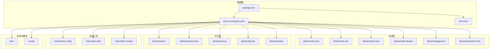
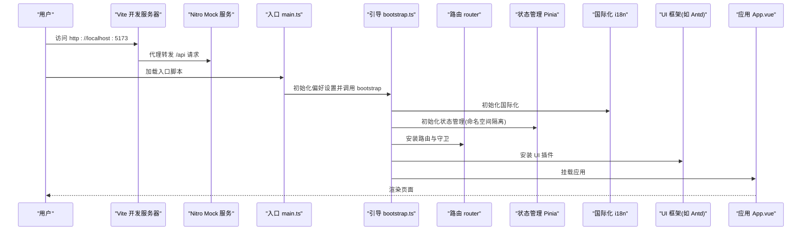
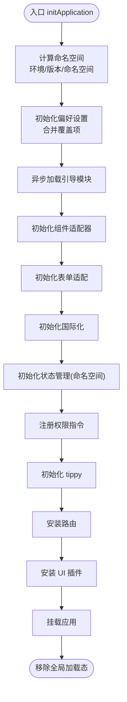
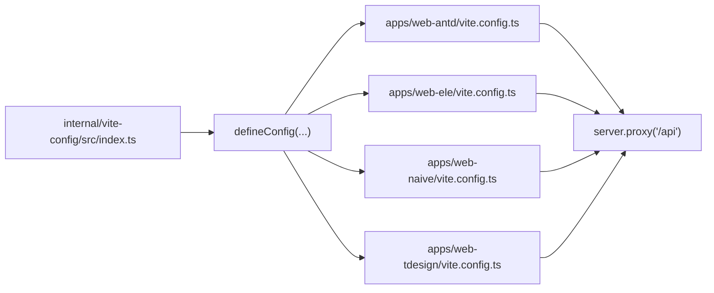
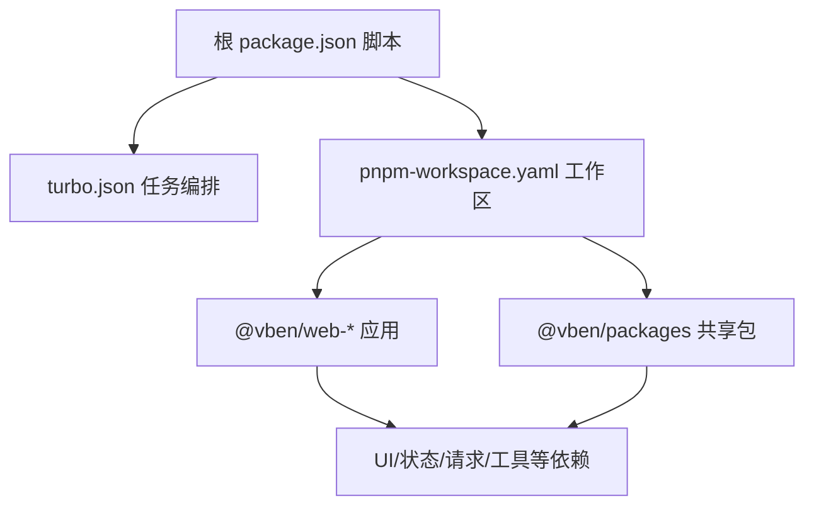

# 项目介绍

<cite>
**本文引用的文件**
- [README.md](file://README.md)
- [README.zh-CN.md](file://README.zh-CN.md)
- [LICENSE](file://LICENSE)
- [package.json](file://package.json)
- [pnpm-workspace.yaml](file://pnpm-workspace.yaml)
- [turbo.json](file://turbo.json)
- [apps/web-antd/package.json](file://apps/web-antd/package.json)
- [apps/web-antd/src/main.ts](file://apps/web-antd/src/main.ts)
- [apps/web-antd/src/bootstrap.ts](file://apps/web-antd/src/bootstrap.ts)
- [apps/web-antd/vite.config.ts](file://apps/web-antd/vite.config.ts)
- [internal/vite-config/src/index.ts](file://internal/vite-config/src/index.ts)
- [internal/tsconfig/web-app.json](file://internal/tsconfig/web-app.json)
- [internal/tsconfig/web.json](file://internal/tsconfig/web.json)
- [.browserslistrc](file://.browserslistrc)
</cite>

## 目录

1. [简介](#简介)
2. [项目结构](#项目结构)
3. [核心组件](#核心组件)
4. [架构总览](#架构总览)
5. [详细组件分析](#详细组件分析)
6. [依赖关系分析](#依赖关系分析)
7. [性能考量](#性能考量)
8. [故障排查指南](#故障排查指南)
9. [结论](#结论)
10. [附录](#附录)

## 简介

Vben Admin 是一款免费开源的中后台前端模板，面向“开箱即用”的中后台前端解决方案。项目采用业界主流技术栈：Vue 3、Vite、TypeScript，结合现代化工程化能力（Monorepo、Turbo、pnpm），提供主题、国际化、权限体系等企业级能力，既适合学习参考，也可直接用于实际项目开发。

- 核心定位与价值主张
  - 免费开源：MIT 许可证，便于二次开发与商用。
  - 技术先进：以 Vue 3、Vite、TypeScript 为核心，配合 Pinia、Vue Router 等生态，确保开发体验与运行性能。
  - 开箱即用：内置布局、路由、权限、国际化、主题等模块，减少重复造轮子成本。
  - 学习与实战并重：清晰的目录结构与文档，便于理解与迁移至真实业务场景。

- 版本与兼容性
  - 当前为 5.x 版本，与旧版本不兼容。新项目建议直接使用最新版本；如需查阅旧版，可参考 v2 分支。

- 社区与维护
  - 维护者：Vben。
  - 社区：提供文档站、Discord/GitHub Discussions 等渠道；贡献者活跃度高，Star 历史图表显示长期增长趋势。

- 许可证
  - 采用 MIT 许可证，详见 [LICENSE](file://LICENSE)。

**章节来源**

- [README.md:17-24](file://README.md#L17-L24)
- [README.zh-CN.md:17-24](file://README.zh-CN.md#L17-L24)
- [LICENSE:1-10](file://LICENSE#L1-L10)

## 项目结构

本项目采用 Monorepo 架构，使用 pnpm workspace 管理多包与多应用，结合 Turbo 实现任务编排与缓存加速。核心目录与职责概览如下：

- apps：多套 Web 应用（Ant Design Vue、Element Plus、Naive UI、TDesign 等主题变体），每套应用独立构建与运行
- packages：通用库与共享能力（store、hooks、styles、locales、access 等）
- internal：内部工具链与配置（vite-config、tsconfig、lint-configs 等）
- docs：文档站（VitePress）
- playground：示例与演示应用
- scripts：工程化脚本与部署工具
- 根级配置：package.json、pnpm-workspace.yaml、turbo.json 等

**图表来源**

- [package.json:1-109](file://package.json#L1-L109)
- [pnpm-workspace.yaml:1-193](file://pnpm-workspace.yaml#L1-L193)
- [turbo.json:1-49](file://turbo.json#L1-L49)

**章节来源**

- [package.json:1-109](file://package.json#L1-L109)
- [pnpm-workspace.yaml:1-193](file://pnpm-workspace.yaml#L1-L193)
- [turbo.json:1-49](file://turbo.json#L1-L49)

## 核心组件

- 应用入口与引导流程
  - 应用入口负责初始化偏好设置、加载引导模块并挂载应用，随后移除全局加载态。
  - 引导模块负责注册指令、国际化、状态管理、权限指令、UI 插件、路由与主题等。
- Vite 配置封装
  - 通过统一的 @vben/vite-config 封装 Vite 与常用插件，支持应用与库两种模式，简化多包复用。
- TypeScript 配置
  - 提供 web-app 与 web 两类 tsconfig，覆盖应用与库场景，确保类型安全与模块解析一致性。
- 浏览器支持策略
  - 基于 Browserslist 的现代浏览器策略，不支持 IE，推荐 Chrome 80+。

**章节来源**

- [apps/web-antd/src/main.ts:1-32](file://apps/web-antd/src/main.ts#L1-L32)
- [apps/web-antd/src/bootstrap.ts:1-85](file://apps/web-antd/src/bootstrap.ts#L1-L85)
- [apps/web-antd/vite.config.ts:1-21](file://apps/web-antd/vite.config.ts#L1-L21)
- [internal/vite-config/src/index.ts:1-6](file://internal/vite-config/src/index.ts#L1-L6)
- [internal/tsconfig/web-app.json:1-8](file://internal/tsconfig/web-app.json#L1-L8)
- [internal/tsconfig/web.json:1-14](file://internal/tsconfig/web.json#L1-L14)
- [.browserslistrc:1-4](file://.browserslistrc#L1-L4)

## 架构总览

下图展示了从用户访问到应用渲染的关键路径，以及与 Vite、Nitro Mock、UI 框架、状态管理与国际化模块的交互关系。

**图表来源**

- [apps/web-antd/src/main.ts:1-32](file://apps/web-antd/src/main.ts#L1-L32)
- [apps/web-antd/src/bootstrap.ts:1-85](file://apps/web-antd/src/bootstrap.ts#L1-L85)
- [apps/web-antd/vite.config.ts:1-21](file://apps/web-antd/vite.config.ts#L1-L21)

**章节来源**

- [apps/web-antd/src/main.ts:1-32](file://apps/web-antd/src/main.ts#L1-L32)
- [apps/web-antd/src/bootstrap.ts:1-85](file://apps/web-antd/src/bootstrap.ts#L1-L85)
- [apps/web-antd/vite.config.ts:1-21](file://apps/web-antd/vite.config.ts#L1-L21)

## 详细组件分析

### 应用入口与引导流程

- 入口职责
  - 计算命名空间、初始化偏好设置、按需覆盖偏好项、异步加载引导模块并执行挂载、最后移除全局加载态。
- 引导职责
  - 初始化组件适配器、表单适配、国际化、状态管理、权限指令、tippy、路由、UI 插件、动态标题等。
- 关键点
  - 命名空间隔离：通过环境、版本与命名空间组合，避免多项目间偏好与缓存冲突。
  - 指令注册：统一注册 v-loading 等指令，保证全局可用。
  - 动态标题：根据路由 meta.title 与偏好设置动态拼接页面标题。

**图表来源**

- [apps/web-antd/src/main.ts:1-32](file://apps/web-antd/src/main.ts#L1-L32)
- [apps/web-antd/src/bootstrap.ts:1-85](file://apps/web-antd/src/bootstrap.ts#L1-L85)

**章节来源**

- [apps/web-antd/src/main.ts:1-32](file://apps/web-antd/src/main.ts#L1-L32)
- [apps/web-antd/src/bootstrap.ts:1-85](file://apps/web-antd/src/bootstrap.ts#L1-L85)

### Vite 配置封装与多应用复用

- 统一入口
  - 通过 @vben/vite-config 导出 defineConfig，集中处理应用与库模式、插件与环境变量。
- 应用示例
  - 在各应用的 vite.config.ts 中调用 defineConfig，传入 server.proxy 等自定义配置，实现 API 代理与 WebSocket 支持。
- 多应用共享
  - 通过 internal/vite-config 提供统一配置，避免重复维护。

**图表来源**

- [internal/vite-config/src/index.ts:1-6](file://internal/vite-config/src/index.ts#L1-L6)
- [apps/web-antd/vite.config.ts:1-21](file://apps/web-antd/vite.config.ts#L1-L21)

**章节来源**

- [internal/vite-config/src/index.ts:1-6](file://internal/vite-config/src/index.ts#L1-L6)
- [apps/web-antd/vite.config.ts:1-21](file://apps/web-antd/vite.config.ts#L1-L21)

### TypeScript 配置与类型安全

- web-app.json
  - 面向 Web 应用的 tsconfig，扩展 web.json 并引入 Vite 与项目全局类型，确保 JSX、模块解析与 DOM 类型可用。
- web.json
  - 通用 Web 包配置，启用 bundler 模块解析、ESNext/DOM 库、jsxImportSource 等。
- 作用
  - 保障多应用与多包在类型层面的一致性，降低配置漂移带来的类型问题。

**章节来源**

- [internal/tsconfig/web-app.json:1-8](file://internal/tsconfig/web-app.json#L1-L8)
- [internal/tsconfig/web.json:1-14](file://internal/tsconfig/web.json#L1-L14)

### 浏览器支持与现代前端实践

- 浏览器策略
  - 基于 Browserslist 的现代浏览器策略，要求 Chrome/Firefox/Edge/Safari 最近两个版本，不支持 IE。
- 推荐开发环境
  - 本地开发推荐使用 Chrome 80+，以获得最佳的热更新与调试体验。

**章节来源**

- [.browserslistrc:1-4](file://.browserslistrc#L1-L4)
- [README.md:115-124](file://README.md#L115-L124)

## 依赖关系分析

- 工作区与包管理
  - pnpm-workspace.yaml 声明了 packages、apps、internal、scripts、docs、playground 等工作区范围，统一版本与依赖来源。
- 顶层脚本与任务编排
  - package.json 定义了 build、dev、test、lint 等脚本；turbo.json 配置了构建依赖、输出缓存与持久化任务，提升多包构建效率。
- 应用级依赖
  - 各应用（如 @vben/web-antd）声明对共享包（@vben/stores、@vben/preferences、@vben/access、@vben/layouts、@vben/locales 等）与 UI 框架（如 ant-design-vue）的依赖，形成清晰的分层。

**图表来源**

- [package.json:27-66](file://package.json#L27-L66)
- [turbo.json:15-47](file://turbo.json#L15-L47)
- [pnpm-workspace.yaml:1-14](file://pnpm-workspace.yaml#L1-L14)

**章节来源**

- [package.json:27-66](file://package.json#L27-L66)
- [turbo.json:15-47](file://turbo.json#L15-L47)
- [pnpm-workspace.yaml:1-14](file://pnpm-workspace.yaml#L1-L14)

## 性能考量

- 构建与缓存
  - 使用 Turbo 管理任务依赖与输出缓存，减少重复构建时间；pnpm 的硬链接与工作区机制降低磁盘占用与安装时间。
- 开发体验
  - Vite 提供快速冷启动与热更新；Nitro Mock 服务支持本地 API 模拟，减少前后端耦合。
- 类型检查与质量
  - 通过统一 tsconfig 与 lint 配置，结合类型检查任务，降低运行时风险。
- 浏览器兼容
  - 现代浏览器策略有助于减少 polyfill 体积与兼容性问题，提升首屏与交互性能。

[本节为通用指导，无需列出具体文件来源]

## 故障排查指南

- 启动失败
  - 检查 Node 与 pnpm 版本是否满足根工程引擎要求；确认工作区安装完成且无锁定文件冲突。
- 构建异常
  - 查看 Turbo 任务输出缓存与依赖链；优先执行类型检查与依赖检查任务，定位类型或循环依赖问题。
- 代理无效
  - 确认应用 vite.config.ts 中的 server.proxy 是否正确指向后端服务；检查路径重写规则与跨域配置。
- 国际化/主题不生效
  - 检查偏好设置命名空间与覆盖项；确认国际化初始化顺序与路由守卫未提前卸载。
- 浏览器兼容问题
  - 确认浏览器版本满足 Browserslist 策略；避免使用过时特性或依赖。

**章节来源**

- [package.json:103-107](file://package.json#L103-L107)
- [turbo.json:15-47](file://turbo.json#L15-L47)
- [apps/web-antd/vite.config.ts:6-18](file://apps/web-antd/vite.config.ts#L6-L18)
- [apps/web-antd/src/bootstrap.ts:44-59](file://apps/web-antd/src/bootstrap.ts#L44-L59)
- [.browserslistrc:1-4](file://.browserslistrc#L1-L4)

## 结论

Vben Admin 以“最新技术栈 + 企业级能力 + 开箱即用”为核心理念，通过 Monorepo 与 Turbo 的工程化手段，提供了高可维护性与高扩展性的中后台前端模板。5.x 版本带来全新架构与能力边界，建议新项目直接采用；对于已有项目，可按需迁移。依托 MIT 许可证与活跃的社区生态，Vben Admin 既是学习参考的范本，也是落地生产的可靠基座。

[本节为总结性内容，无需列出具体文件来源]

## 附录

- 版本与升级提示
  - 项目当前版本为 5.x，与旧版本不兼容；新项目建议使用最新版本；如需查看旧版，请参考 v2 分支。
- 许可证
  - 采用 MIT 许可证，详见 [LICENSE](file://LICENSE)。
- 维护者与社区
  - 维护者：Vben；社区讨论与贡献指南见项目根 README 与文档站。

**章节来源**

- [README.md:21-24](file://README.md#L21-L24)
- [LICENSE:1-10](file://LICENSE#L1-L10)
