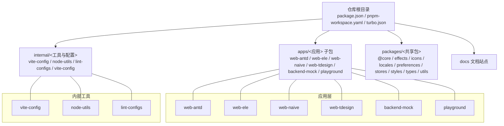
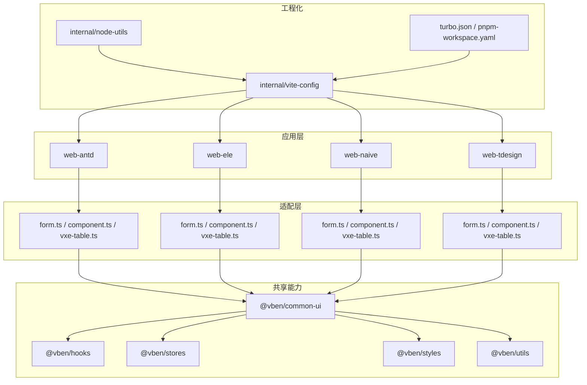
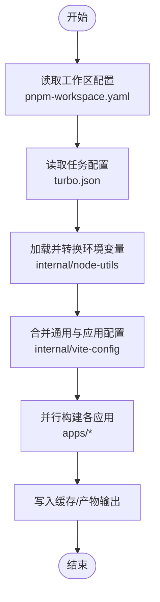
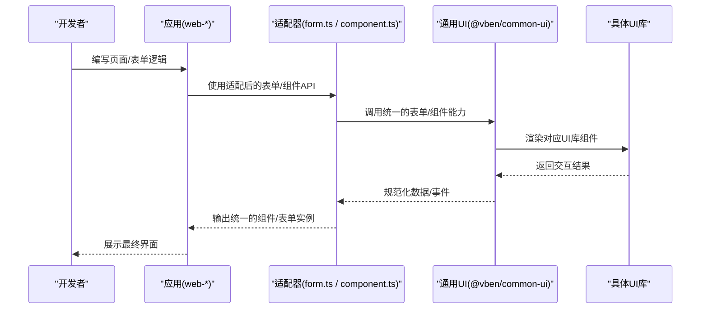
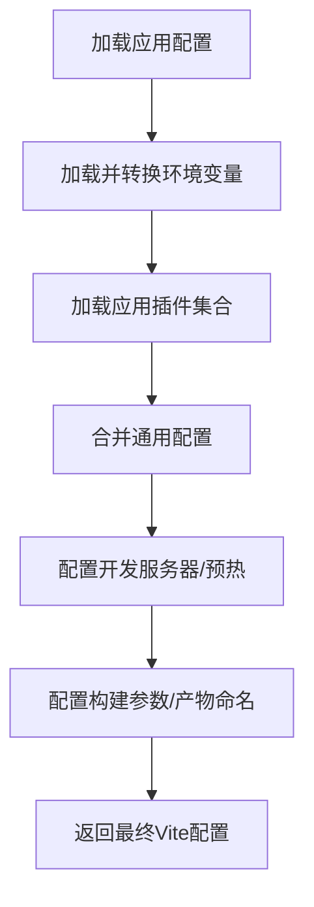
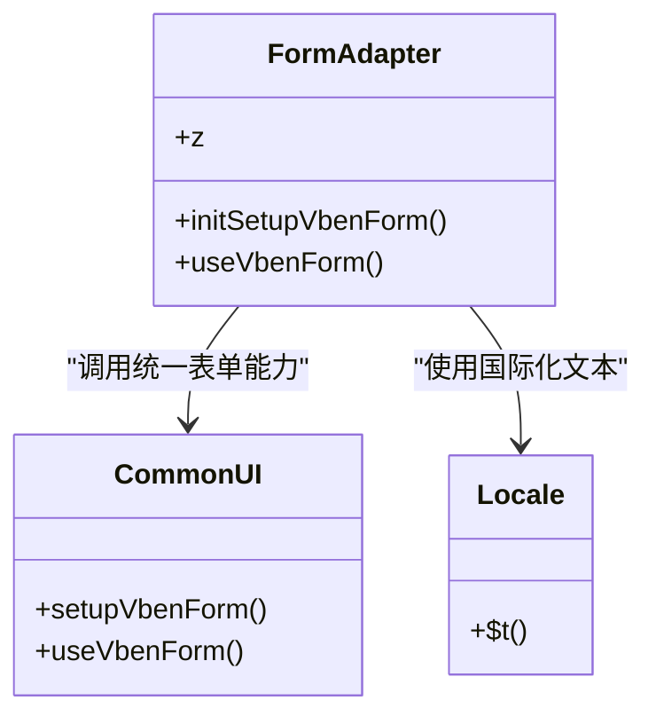
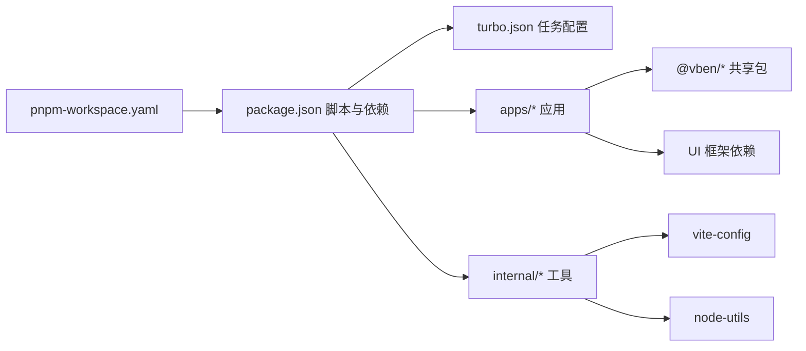

# 项目概述

<cite>
**本文引用的文件**
- [README.md](file://README.md)
- [package.json](file://package.json)
- [pnpm-workspace.yaml](file://pnpm-workspace.yaml)
- [turbo.json](file://turbo.json)
- [apps/web-antd/package.json](file://apps/web-antd/package.json)
- [apps/web-ele/package.json](file://apps/web-ele/package.json)
- [apps/web-naive/package.json](file://apps/web-naive/package.json)
- [apps/web-tdesign/package.json](file://apps/web-tdesign/package.json)
- [internal/vite-config/src/config/application.ts](file://internal/vite-config/src/config/application.ts)
- [internal/node-utils/src/monorepo.ts](file://internal/node-utils/src/monorepo.ts)
- [docs/src/guide/introduction/vben.md](file://docs/src/guide/introduction/vben.md)
</cite>

## 目录

1. [引言](#引言)
2. [项目结构](#项目结构)
3. [核心组件](#核心组件)
4. [架构总览](#架构总览)
5. [详细组件分析](#详细组件分析)
6. [依赖分析](#依赖分析)
7. [性能考虑](#性能考虑)
8. [故障排查指南](#故障排查指南)
9. [结论](#结论)
10. [附录](#附录)

## 引言

Vben Admin 是一个面向中后台管理系统的现代化前端解决方案，采用 Vue 3、Vite、TypeScript 等前沿技术栈构建，提供开箱即用的企业级能力，包括国际化、动态菜单、权限体系、多主题与 PWA 等。项目当前版本为 5.0，与历史版本不兼容，强调工程化与可扩展性，适合快速搭建中大型项目的原型或生产基座。

- 项目定位：中后台管理系统模板，兼顾学习参考与企业级落地。
- 技术特色：Vue 3、Vite、TypeScript、Pnpm Monorepo、Turborepo、多 UI 框架适配。
- 多 UI 支持：通过统一适配层对接 Ant Design Vue、Element Plus、Naive UI、TDesign 等主流 UI 框架，实现“一套逻辑、多套界面”。

章节来源

- [README.md:17-32](file://README.md#L17-L32)
- [docs/src/guide/introduction/vben.md:12-25](file://docs/src/guide/introduction/vben.md#L12-L25)

## 项目结构

项目采用 Pnpm Monorepo 架构，结合 Turborepo 实现任务编排与缓存加速。根目录通过工作区配置声明所有子包，内部工具与共享配置集中管理，应用侧按 UI 框架拆分为多个 Web 应用，彼此独立构建与运行。

图表来源

- [pnpm-workspace.yaml:1-15](file://pnpm-workspace.yaml#L1-L15)
- [package.json:27-66](file://package.json#L27-L66)
- [turbo.json:15-47](file://turbo.json#L15-L47)

章节来源

- [pnpm-workspace.yaml:1-15](file://pnpm-workspace.yaml#L1-L15)
- [package.json:27-66](file://package.json#L27-L66)
- [turbo.json:15-47](file://turbo.json#L15-L47)

## 核心组件

- 应用层（apps）：按 UI 框架划分的独立 Web 应用，共享核心能力并通过适配器解耦 UI 差异。
- 内部工具（internal）：统一的 Vite 配置、Node 工具集与代码规范配置，保障工程一致性。
- 共享包（packages）：通用类型、样式、Hooks、状态管理、常量与工具等，支撑上层应用复用。
- 文档（docs）：基于 VitePress 的文档站点，覆盖特性说明、使用指南与最佳实践。

章节来源

- [docs/src/guide/introduction/vben.md:12-25](file://docs/src/guide/introduction/vben.md#L12-L25)
- [pnpm-workspace.yaml:1-15](file://pnpm-workspace.yaml#L1-L15)

## 架构总览

Vben Admin 的整体架构围绕“统一能力 + 多 UI 适配”的设计理念展开。核心能力由共享包与内部工具提供，应用层通过适配器屏蔽 UI 框架差异，实现“一次开发、多端运行”。工程层面采用 Pnpm Monorepo + Turborepo，提升开发效率与构建性能。

图表来源

- [apps/web-antd/package.json:28-62](file://apps/web-antd/package.json#L28-L62)
- [apps/web-ele/package.json:28-49](file://apps/web-ele/package.json#L28-L49)
- [apps/web-naive/package.json:28-48](file://apps/web-naive/package.json#L28-L48)
- [apps/web-tdesign/package.json:28-50](file://apps/web-tdesign/package.json#L28-L50)
- [internal/vite-config/src/config/application.ts:17-99](file://internal/vite-config/src/config/application.ts#L17-L99)
- [internal/node-utils/src/monorepo.ts:13-36](file://internal/node-utils/src/monorepo.ts#L13-L36)
- [pnpm-workspace.yaml:1-15](file://pnpm-workspace.yaml#L1-L15)
- [turbo.json:15-47](file://turbo.json#L15-L47)

## 详细组件分析

### Monorepo 架构与工程化

- 工作区组织：通过 pnpm-workspace.yaml 统一声明内部工具、共享包与应用，确保依赖收敛与版本一致。
- 任务编排：turbo.json 定义构建、预览、类型检查等任务的依赖关系与输出缓存，提升增量构建效率。
- 环境加载：内部工具负责解析与转换环境变量，配合 Vite 应用配置，实现多应用统一的开发体验。

图表来源

- [pnpm-workspace.yaml:1-15](file://pnpm-workspace.yaml#L1-L15)
- [turbo.json:15-47](file://turbo.json#L15-L47)
- [internal/node-utils/src/monorepo.ts:13-36](file://internal/node-utils/src/monorepo.ts#L13-L36)
- [internal/vite-config/src/config/application.ts:17-99](file://internal/vite-config/src/config/application.ts#L17-L99)

章节来源

- [pnpm-workspace.yaml:1-15](file://pnpm-workspace.yaml#L1-L15)
- [turbo.json:15-47](file://turbo.json#L15-L47)
- [internal/node-utils/src/monorepo.ts:13-36](file://internal/node-utils/src/monorepo.ts#L13-L36)
- [internal/vite-config/src/config/application.ts:17-99](file://internal/vite-config/src/config/application.ts#L17-L99)

### 多 UI 框架支持机制

项目通过“适配器 + 统一 UI 能力”的方式实现对多种 UI 框架的支持。每个应用（web-antd、web-ele、web-naive、web-tdesign）均引入统一的通用 UI 能力包，并在各自目录下提供表单、组件与表格的适配实现，从而在不改变业务逻辑的前提下切换 UI 框架。

图表来源

- [apps/web-antd/package.json:28-62](file://apps/web-antd/package.json#L28-L62)
- [apps/web-ele/package.json:28-49](file://apps/web-ele/package.json#L28-L49)
- [apps/web-naive/package.json:28-48](file://apps/web-naive/package.json#L28-L48)
- [apps/web-tdesign/package.json:28-50](file://apps/web-tdesign/package.json#L28-L50)

章节来源

- [apps/web-antd/package.json:28-62](file://apps/web-antd/package.json#L28-L62)
- [apps/web-ele/package.json:28-49](file://apps/web-ele/package.json#L28-L49)
- [apps/web-naive/package.json:28-48](file://apps/web-naive/package.json#L28-L48)
- [apps/web-tdesign/package.json:28-50](file://apps/web-tdesign/package.json#L28-L50)

### Vite 应用配置与开发体验

Vite 应用配置通过统一入口加载插件、环境变量与通用配置，支持 PWA、i18n、HTML 注入、Nitro Mock、压缩与可视化等能力，并针对开发阶段提供服务端预热与打印信息注入，优化首屏与调试体验。

图表来源

- [internal/vite-config/src/config/application.ts:17-99](file://internal/vite-config/src/config/application.ts#L17-L99)

章节来源

- [internal/vite-config/src/config/application.ts:17-99](file://internal/vite-config/src/config/application.ts#L17-L99)

### 适配器设计（以 Element Plus 为例）

Element Plus 应用中的适配器展示了如何将通用 UI 能力与具体 UI 组件绑定，包括表单模型属性映射、规则定义与类型约束等，确保在不同 UI 框架下保持一致的开发体验。

图表来源

- [apps/web-ele/src/adapter/form.ts:11-38](file://apps/web-ele/src/adapter/form.ts#L11-L38)

章节来源

- [apps/web-ele/src/adapter/form.ts:11-38](file://apps/web-ele/src/adapter/form.ts#L11-L38)

## 依赖分析

- 包管理与工作区：Pnpm Monorepo 通过工作区统一管理依赖版本，减少重复安装与版本漂移。
- 任务编排：Turborepo 依据任务图与缓存策略，避免重复执行已完成的任务，显著缩短构建时间。
- 应用依赖：各应用依赖共享包与内部工具，同时引入对应 UI 框架的运行时依赖，形成清晰的分层依赖关系。

图表来源

- [pnpm-workspace.yaml:1-15](file://pnpm-workspace.yaml#L1-L15)
- [package.json:27-66](file://package.json#L27-L66)
- [turbo.json:15-47](file://turbo.json#L15-L47)

章节来源

- [pnpm-workspace.yaml:1-15](file://pnpm-workspace.yaml#L1-L15)
- [package.json:27-66](file://package.json#L27-L66)
- [turbo.json:15-47](file://turbo.json#L15-L47)

## 性能考虑

- 构建优化：Vite 默认启用 ES 模块目标与按需压缩，结合 Turborepo 缓存与增量构建，降低重复编译成本。
- 开发体验：开发服务器开启预热与打印信息注入，缩短首次启动等待时间，提升迭代效率。
- 体积控制：通过按需导入与产物命名策略，减少冗余资源；可选的压缩与可视化分析辅助识别体积热点。

章节来源

- [internal/vite-config/src/config/application.ts:60-91](file://internal/vite-config/src/config/application.ts#L60-L91)

## 故障排查指南

- 启动失败：确认 Node 与 pnpm 版本满足工程要求，检查工作区与脚本是否正确执行。
- 构建异常：优先查看各应用构建脚本与 Vite 配置合并过程，核对环境变量与插件加载顺序。
- 依赖冲突：通过工作区统一版本与 overrides 管理，避免多版本共存导致的运行时错误。
- 类型检查：利用统一的类型检查任务与配置，定位类型相关问题并逐项修复。

章节来源

- [package.json:103-107](file://package.json#L103-L107)
- [turbo.json:44-46](file://turbo.json#L44-L46)

## 结论

Vben Admin 以现代前端技术栈为基础，结合 Monorepo 与工程化工具链，构建了高内聚、低耦合且可扩展的中后台解决方案。通过统一适配层与共享能力，项目实现了对多种 UI 框架的无缝支持，既能满足快速原型开发，也能胜任企业级复杂场景。建议在新项目中优先采用该架构，以获得更佳的开发体验与长期维护性。

## 附录

- 快速开始与使用：参见根 README 的安装与运行说明。
- 版本与兼容性：当前版本为 5.0，与旧版本不兼容，请按文档指引迁移。
- 浏览器支持：本地开发推荐 Chrome 最新版，生产环境支持现代浏览器，不支持 IE。

章节来源

- [README.md:55-82](file://README.md#L55-L82)
- [README.md:21-24](file://README.md#L21-L24)
- [docs/src/guide/introduction/vben.md:27-36](file://docs/src/guide/introduction/vben.md#L27-L36)
